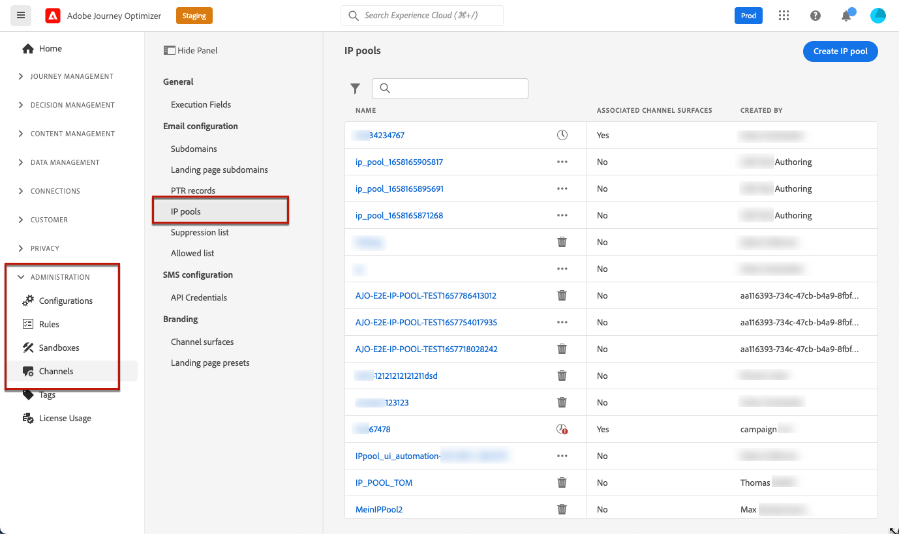
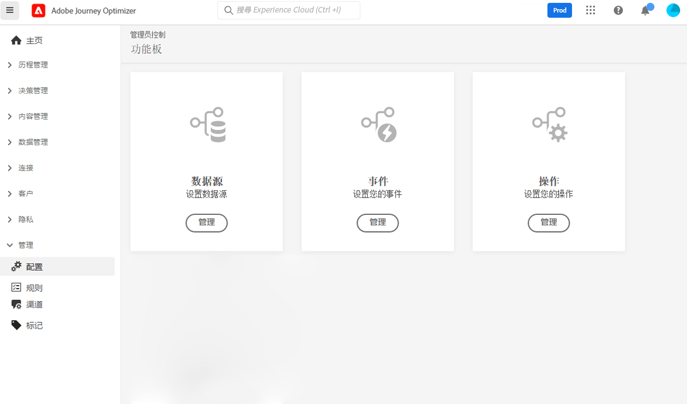

# 开始使用 [!DNL Journey Optimizer] 配置 {#start-optimizer-configuration}

访问 [!DNL Journey Optimizer] 首次配置了生产沙盒，并根据您的合同分配了特定数量的IP。

要创建历程和发送消息，您需要完成以下配置步骤：

1. **配置消息和渠道**:定义渠道表面，调整和自定义消息。

   * 创建渠道界面以配置传送消息所需的所有技术参数。 [了解详情](message-presets.md)

   * 当Adobe Experience Platform中有多个地址可用时，确定要优先为收件人使用的电子邮件地址。 [了解详情](primary-email-addresses.md)

   * 管理在向抑制列表发送电子邮件地址之前执行重试的天数。 [了解详情](manage-suppression-list.md)

   * 在 [!DNL Adobe Experience Platform] 和 [!DNL Adobe Experience Platform Launch]. [了解详情](../configuration/push-gs.md)

   <!--* Understand the push notification flow. [Learn more](../configuration/push-gs.md)-->

   * 配置您的实例以发送短信（当前仅适用于一组组织 — 有限可用性）。 [了解详情](sms-configuration.md)

1. **委派子域**:对于要在Journey Optimizer中使用的任何新子域，第一步是将其委派。 [了解详情](about-subdomain-delegation.md)

   

1. **创建IP池**:通过将与您的实例配置的IP地址分组到一起，可提高电子邮件的投放能力和声誉。 [了解详情](ip-pools.md)

   

1. **配置历程**:要构建历程，您需要配置 **[!UICONTROL Data Sources]**, **[!UICONTROL Events]** 和 **[!UICONTROL Actions]**. [了解详情](about-data-sources-events-actions.md)

   

   * 的 **数据源** 配置允许您定义与系统的连接，以检索将在您的历程中使用的其他信息。 [了解详情](../datasource/about-data-sources.md)

   * **事件** 允许您一直触发旅程，以实时向流入旅程的个人发送消息。 在事件配置中，您可以配置历程中预期的事件。 传入事件的数据按照Adobe体验数据模型(XDM)进行标准化。 事件来自已验证和未验证事件（如 Adobe Mobile SDK 事件）的流摄取 API。[了解详情](../event/about-events.md)

   * [!DNL Journey Optimizer] 附带内置消息功能，允许您设计和发送内容。 如果您使用第三方系统来发送消息，请创建 **自定义操作**. [了解详情](../action/action.md)