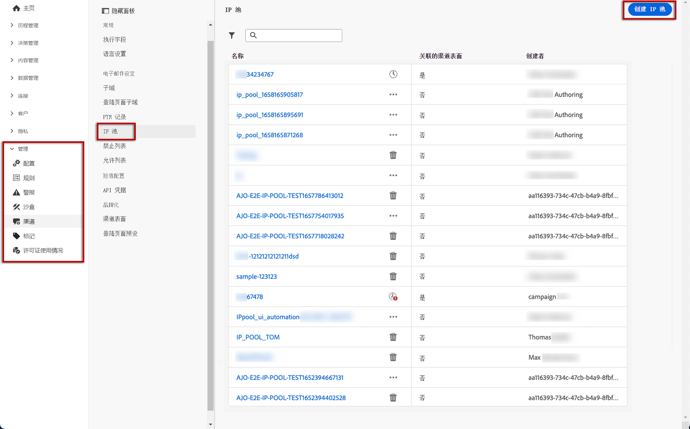

# 创建 IP 池 {#create-ip-pools}

## 关于IP池 {#about-ip-pools}

使用Journey Optimizer，您可以创建IP池以将子域的IP地址分组在一起。

强烈建议创建IP池，以便电子邮件可投放。 这样，您就可以防止子域的声誉影响您的其他子域。

例如，一个最佳实践是为营销消息提供一个IP池，为事务型消息设置一个IP池。 这样，如果您的其中一条营销消息性能不佳，且客户声明为垃圾邮件，则不会影响发送给该客户的事务型消息，该客户仍将接收事务型消息（购买确认、密码恢复消息等）。

## 创建IP池 {#create-ip-pool}

要创建IP池，请执行以下步骤：

1. 访问 **[!UICONTROL Channels]** / **[!UICONTROL IP pools]** 菜单，然后单击 **[!UICONTROL Create IP Pool]**.

   

1. 为IP池提供名称和描述（可选）。

   >[!NOTE]
   >
   >子域的名称必须以字母(A-Z)开头，并且只包含字母数字字符或特殊字符(_、 ., -)。

1. 从下拉列表中选择要包含在池中的IP地址，然后单击 **[!UICONTROL Submit]**.

   

   >[!NOTE]
   >
   >随您的实例配置的所有IP地址都可在列表中找到。

IP池现已创建并显示在列表中。 您可以选择它以访问其属性并显示关联的消息预设。 有关如何将消息预设与IP池关联的详细信息，请参阅 [此部分](message-presets.md))。

## 编辑IP池 {#edit-ip-pool}

要编辑IP池，请执行以下操作：

1. 在列表中，单击IP池名称以将其打开。

   

1. 根据需要编辑其属性。 您可以修改描述，并添加或删除IP地址。

   

   >[!CAUTION]
   >
   >考虑删除IP时请格外小心，因为这会给其他IP带来额外负载，并且可能会对您的投放能力造成严重影响。 如有疑问，请联系可投放性专家。

1. 保存更改。

>[!NOTE]
>
>IP池名称不可编辑。 如果要修改IP池，您需要删除该IP池，然后使用您选择的名称创建另一个IP池。

根据与关联的IP池，更新可立即或异步生效 [消息预设](message-presets.md) 或否：

* 如果IP池为 **not** 在消息预设中选择，则更新为即时(**[!UICONTROL Success]** 状态)。
* 如果IP池 **is** 在消息预设中选择，则更新最长可能需要7-10个工作日(**[!UICONTROL Processing]** 状态)。

要检查IP池更新状态，请单击 **[!UICONTROL More actions]** 按钮，选择 **[!UICONTROL Recent updates]**.

>[!NOTE]
>
>成功更新IP池后，您可能需要等待：
>* 在被单一报文使用前几分钟，
>* 直到IP池的下一个批处理消息生效。

您还可以使用 **[!UICONTROL Delete]** 按钮以删除IP池。 请注意，您无法删除已与消息预设关联的IP池。

