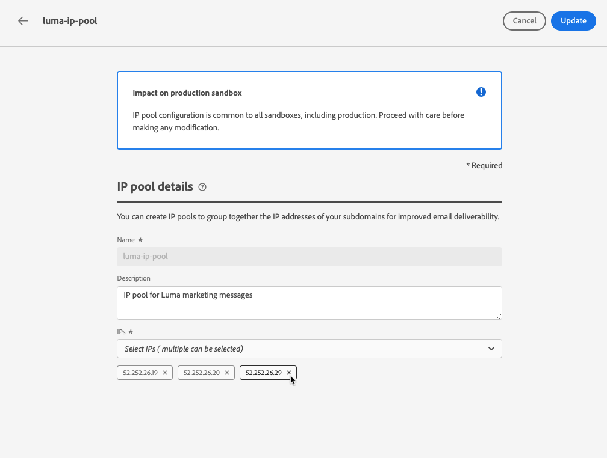

# 创建 IP 池 {#create-ip-pools}

>[!BEGINSHADEBOX]

**在此页面上：**&#x200B;了解如何创建、编辑和删除对子域IP地址进行分组的IP池，以改善电子邮件可投放性并保护发件人信誉。

>[!ENDSHADEBOX]

>[!CONTEXTUALHELP]
>id="ajo_admin_ip_pool_header"
>title="设置 IP 池"
>abstract="IP 池收集您子域的 IP 地址以提高电子邮件的供应能力。"

>[!CONTEXTUALHELP]
>id="ajo_admin_ip_pool"
>title="设置 IP 池"
>abstract="使用 Journey Optimizer，您可以创建 IP 池，将子域的 IP 地址分组在一起。 这可以显著提高您的电子邮件供应能力，因为这样做可以防止一个子域的声誉影响您的其他子域。"

## 关于IP池 {#about-ip-pools}

通过[!DNL Journey Optimizer]，您可以创建IP池以将子域的IP地址组合在一起。

强烈建议为电子邮件可投放性创建IP池。 这样，您可以防止子域的信誉影响您的其他子域。

例如，一个最佳实践是为营销消息设置一个IP池，为事务型消息设置另一个IP池。 这样一来，如果某条营销消息性能不佳并且被客户声明为垃圾邮件，则不会影响发送给该客户的事务型消息，这些客户仍会收到事务型消息（购买确认、密码恢复消息等）。

>[!CAUTION]
>
>IP池配置对所有环境都是通用的。 因此，任何IP池创建或编辑操作都将影响生产沙盒。

## 创建 IP 池 {#create-ip-pool}

要创建IP池，请执行以下步骤：

1. 访问&#x200B;**[!UICONTROL 管理]** > **[!UICONTROL 渠道]** > **[!UICONTROL 电子邮件设置]** > **[!UICONTROL IP池]**&#x200B;菜单，然后单击&#x200B;**[!UICONTROL 创建IP池]**。

   

1. 提供IP池的名称和描述（可选）。

   >[!NOTE]
   >
   >名称必须以字母(A - Z)开头，并且只包含字母数字字符或特殊字符( _， .， - )。

1. 从下拉列表中选择要包含在池中的IP地址，然后单击&#x200B;**[!UICONTROL 提交]**。 列表中提供了为您的实例配置的所有IP地址。

   

选择IP时，您可以从列表中看到与IP相关联的PTR记录。 这样，您可以在创建IP池时验证每个IP的品牌信息，例如，选择具有相同品牌信息的IP。 [了解有关 PTR 记录的更多信息](ptr-records.md)

>[!NOTE]
>
>如果没有为IP配置PTR记录，则无法选择该IP。 请联系您的Adobe代表以配置该IP的PTR记录。<!--Now this only happens when first subdomain delegated to Adobe is with CNAME method.-->

创建IP池后，将鼠标悬停在IP池下拉列表下方显示的IP地址上时，会显示PTR信息。

此时将创建IP池，并显示在列表中。 您可以选择它以访问其属性并显示关联的渠道配置（即消息预设）。 有关如何将通道配置与IP池关联的更多信息，请参阅[此部分](channel-surfaces.md)。

## 编辑IP池 {#edit-ip-pool}

要编辑IP池，请执行以下步骤。

1. 从列表中，单击IP池名称以将其打开。

1. 根据需要编辑其属性。 您可以修改说明并添加或删除IP地址。 请注意，IP池名称不可编辑 — 要重命名，请删除池并创建一个新池。

   

   >[!CAUTION]
   >
   >在考虑删除IP时，请格外谨慎，因为这将给其他IP带来额外负载，并且可能对您的可投放性产生严重影响。 如有任何疑问，请联系可投放性专家。

1. 保存更改。

更新会立即生效或异步生效，具体取决于与[通道配置](channel-surfaces.md)关联的IP池是否为：

* 如果IP池是&#x200B;**不是**&#x200B;与任何通道配置相关联，则更新是即时的（**[!UICONTROL 成功]**&#x200B;状态）。
* 如果IP池&#x200B;**与通道配置关联**，则更新最多可能需要3个小时（**[!UICONTROL 正在处理]**&#x200B;状态）。

>[!NOTE]
>
>* 在[创建通道配置](channel-surfaces.md#create-channel-surface)时，如果您选择处于&#x200B;**[!UICONTROL 处理]**&#x200B;状态且从未与所选子域关联的IP池，则无法继续创建配置。 [了解详情](channel-surfaces.md#create-channel-surface)
>* 成功更新IP池后，请等待几分钟，实时消息才生效，或等待批处理消息的下一次批处理作业。

要检查IP池更新状态，请单击&#x200B;**[!UICONTROL 更多操作]**&#x200B;按钮，然后选择&#x200B;**[!UICONTROL 最近更新]**。

您还可以使用&#x200B;**[!UICONTROL 删除]**&#x200B;按钮删除IP池。 请注意，您无法删除已与通道配置关联的IP池。

