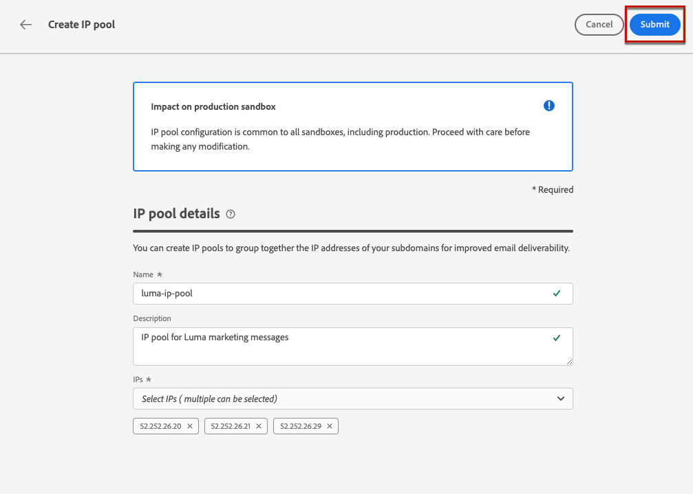

# 创建 IP 池 {#create-ip-pools}

>[!CONTEXTUALHELP]
>id="ajo_admin_ip_pool_header"
>title="设置 IP 池"
>abstract="IP 池收集您子域的 IP 地址以提高电子邮件的送达率。"

>[!CONTEXTUALHELP]
>id="ajo_admin_ip_pool"
>title="设置 IP 池"
>abstract="使用 Journey Optimizer，您可以创建 IP 池，将子域的 IP 地址分组在一起。这可以显著提高您的电子邮件送达率，因为这样做可以防止一个子域的声誉影响您的其他子域。"

## 关于IP池 {#about-ip-pools}

替换为 [!DNL Journey Optimizer]，您可以创建IP池以将子域的IP地址组合在一起。

强烈建议为电子邮件投放创建IP池。 这样，您可以防止子域的信誉影响您的其他子域。

例如，一个最佳实践是为营销消息设置一个IP池，为事务型消息设置另一个IP池。 这样，如果某条营销消息性能不佳并且被客户声明为垃圾邮件，则不会影响发送给该客户的事务型消息，该客户仍会收到事务型消息（购买确认、密码恢复消息等）。

>[!CAUTION]
>
>IP池配置对所有环境都是通用的。 因此，任何IP池创建或编辑操作都将影响生产沙盒。

## 创建IP池 {#create-ip-pool}

要创建IP池，请执行以下步骤：

1. 访问 **[!UICONTROL 管理]** > **[!UICONTROL 渠道]** > **[!UICONTROL IP池]** 菜单，然后单击 **[!UICONTROL 创建IP池]**.

   

1. 提供IP池的名称和描述（可选）。

   >[!NOTE]
   >
   >名称必须以字母(A - Z)开头，并且只包含字母数字字符或特殊字符( _， .， - )。

1. 从下拉列表中选择要包含在池中的IP地址，然后单击 **[!UICONTROL 提交]**.

   

   >[!NOTE]
   >
   >列表中提供了为您的实例配置的所有IP地址。

选择IP时，您可以从列表中看到与IP关联的PTR记录。 这允许您在创建IP池时验证每个IP的品牌信息，例如，选择具有相同品牌信息的IP。 [了解有关PTR记录的更多信息](ptr-records.md)

>[!NOTE]
>
>如果没有为IP配置PTR记录，则不能选择该IP。 请联系您的Adobe代表以配置该IP的PTR记录。

创建IP池后，将鼠标悬停在IP池下拉列表下方显示的IP地址上时，PTR信息可见。

IP池现已创建并显示在列表中。 您可以选择它以访问其属性并显示关联的渠道界面（即消息预设）。 有关如何将渠道表面与IP池关联的更多信息，请参阅 [本节](channel-surfaces.md).

## 编辑IP池 {#edit-ip-pool}

要编辑IP池，请执行以下步骤。

1. 从列表中，单击IP池名称以将其打开。

   

1. 根据需要编辑其属性。 您可以修改描述，并添加或删除IP地址。

   >[!NOTE]
   >
   >IP池名称不可编辑。 如果要修改它，您需要删除IP池，然后使用您选择的名称再创建一个池。

   

   >[!CAUTION]
   >
   >在考虑删除IP时，请格外谨慎，因为这将给其他IP带来额外负载，并且可能对您的可投放性产生严重影响。 如有任何疑问，请联系可投放性专家。

1. 保存更改。

根据与关联的IP池，更新会立即或异步生效 [渠道表面](channel-surfaces.md) 或者不是：

* 如果IP池为 **非** 与任何信道表面相关联，更新是瞬时的(**[!UICONTROL 成功]** 状态)。
* 如果IP池 **是** 更新与渠道表面关联，最长可能需要3小时(**[!UICONTROL 正在处理]** 状态)。

>[!NOTE]
>
>时间 [创建渠道表面](channel-surfaces.md#create-channel-surface)，如果您选择正在编辑的IP池(**[!UICONTROL 正在处理]** 状态)且从未与为该曲面选择的子域相关联，因此您无法继续创建曲面。 [了解详情](channel-surfaces.md#subdomains-and-ip-pools)

要检查IP池更新状态，请单击 **[!UICONTROL 更多操作]** 按钮并选择 **[!UICONTROL 最近更新]**.

>[!NOTE]
>
>成功更新IP池后，您可能必须等待：
>* 几分钟后才会被单一消息占用，
>* 直到下一次批处理时该IP池在批处理消息中生效。

您还可以使用 **[!UICONTROL 删除]** 按钮以删除IP池。 请注意，您无法删除已关联到渠道表面的IP池。

