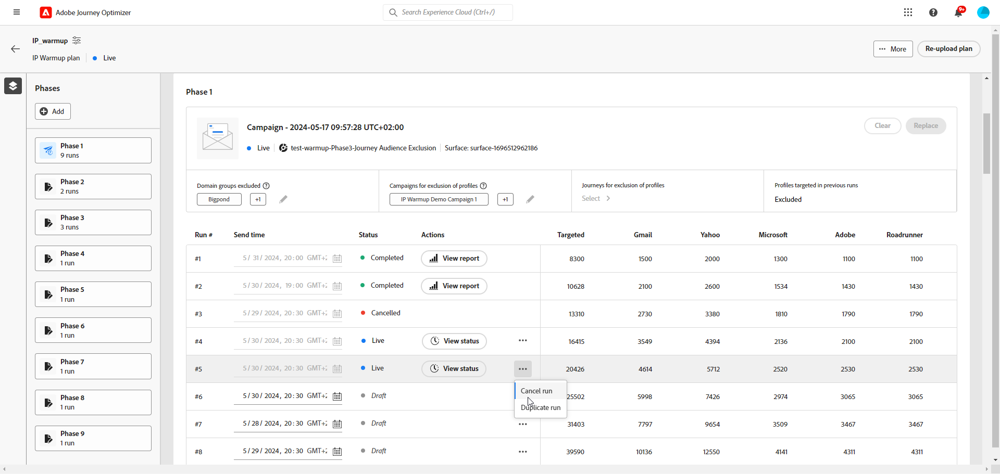

# 执行 IP 预热计划 {#ip-warmup-running}

>[!BEGINSHADEBOX]

本文档指南包括以下内容：

* [IP预热入门](ip-warmup-gs.md)
* [创建 IP 预热营销活动](ip-warmup-campaign.md)
* [创建 IP 预热计划](ip-warmup-plan.md)
* **[执行IP预热计划](ip-warmup-execution.md)**

>[!ENDSHADEBOX]

一旦您拥有 [创建了IP预热计划](ip-warmup-plan.md) 并上传与可投放性顾问一起准备的文件，您可以定义阶段并在计划中运行。

每个阶段都由若干您为其分配单个营销活动的运行组成。

## 定义阶段 {#define-phases}

>[!CONTEXTUALHELP]
>id="ajo_admin_ip_warmup_campaigns_excluded"
>title="排除营销活动受众"
>abstract="选择营销活动以从当前阶段排除其受众。这是为了防止以前在其他阶段或其他 IP 预热计划中联系过的配置文件再次成为目标。"

>[!CONTEXTUALHELP]
>id="ajo_admin_ip_warmup_domains_excluded"
>title="排除域组"
>abstract="选择要从当前阶段排除的域。域排除需要非执行阶段，因此，您可能必须拆分正在运行的阶段才能添加排除。"
>additional-url="https://experienceleague.adobe.com/docs/journey-optimizer/using/configuration/implement-ip-warmup-plan/ip-warmup-execution.html#split-phase" text="拆分阶段"

>[!CONTEXTUALHELP]
>id="ajo_admin_ip_warmup_phases"
>title="定义计划的阶段"
>abstract="每个阶段都由若干您为其分配单个营销活动的运行组成。"

<!--You need to associate the campaign and audience at phase level and turns on some settings as needed for all runs associated with a single creative/campaign

At phase level, system ensures that previously targeted + new profiles are picked up AND at iteration level, system ensures that each run is having unique profiles and the count matches what is stated in plan-->

<!---->

1. 对于每个阶段，选择要与IP预热计划的此阶段关联的活动。

   >[!NOTE]
   >
   >您不能选择已在另一个IP预热计划中使用的营销活动。 但是，同一IP预热计划的一个或多个阶段中可以使用相同的活动。

   

   >[!IMPORTANT]
   >
   >* 仅限具有的促销活动 **[!UICONTROL IP预热计划激活]** 启用的选项可供选择。 [了解详情](#create-ip-warmup-campaign)
   >
   >* 您必须选择与为当前IP预热计划选择的活动使用相同曲面的活动。

1. 为当前阶段选择营销策划后，将显示排除用户档案、营销策划受众和域组的部分。

   >[!NOTE]
   >
   >激活运行后，无法再修改排除项，除非您 [拆分运行](#split-phase) 进入新阶段。

   1. 在 **[!UICONTROL 配置文件排除]** 部分中，您可以看到始终排除该阶段先前运行的用户档案。 例如，如果在Run #1中，某个用户档案涵盖了被定位的前4800人，则系统将自动确保该用户档案不会在Run #2中收到电子邮件。

      >[!NOTE]
      >
      >此分区不可编辑。

   1. 从 **[!UICONTROL 排除的活动受众]** 部分，选择要从当前阶段中排除的受众的营销活动。

      

      例如，在执行阶段1时，必须 [拆分](#split-phase) 不管怎么说。 因此，您可以排除阶段1中使用的营销活动，以便之前在第1阶段联系的用户档案不包括在第2阶段中。 您还可以从其他IP预热计划中排除营销活动。

   1. 从 **[!UICONTROL 排除的域组]** 部分中，选择要从该阶段中排除的域。

      >[!NOTE]
      >
      >域排除需要一个非执行阶段，因此您可能必须 [拆分正在运行的阶段](#split-phase) 以添加排除项。

      

      例如，运行IP预热几天后，您意识到您在域(例如Adobe)的ISP信誉不佳，您希望在不停止IP预热计划的情况下解决该问题。 在这种情况下，您可以排除Adobe域组。

      >[!NOTE]
      >
      >您只能排除已添加到中的自定义域组 [IP预热计划模板](ip-warmup-plan.md#prepare-file). 如果不是这种情况，请使用要排除的自定义域组更新模板，然后 [重新上传计划](#re-upload-plan).

1. 如果需要，您可以使用替换促销活动 **[!UICONTROL 替换营销活动]** 按钮。

   

   >[!NOTE]
   >
   >只有在激活该阶段的第一次运行之前，才能执行此操作。 激活运行后，无法替换营销活动，除非您 [拆分运行](#split-phase) 进入新阶段。

1. 如果需要，可以添加阶段。 它将在当前最后一个阶段后添加。

   

1. 使用 **[!UICONTROL 删除阶段]** 按钮以删除任何不需要的阶段。 仅当某个阶段未执行任何运行时，此操作才可用。 <!--Once a run is executed, deletion is not allowed.-->

   >[!CAUTION]
   >
   >无法撤消 **[!UICONTROL 删除]** 操作。

   

   >[!NOTE]
   >
   >如果从IP预热计划中删除所有阶段，建议重新上传计划。 [了解详情](#re-upload-plan)

## 定义运行 {#define-runs}

>[!CONTEXTUALHELP]
>id="ajo_admin_ip_warmup_run"
>title="定义每次运行"
>abstract="为所有阶段定义并激活每次运行。"

>[!CONTEXTUALHELP]
>id="ajo_admin_ip_warmup_last_engagement"
>title="按参与过滤"
>abstract="此列是一个过滤器，它仅针对例如在过去 20 天内与您的品牌有过互动的用户。您还可以通过&#x200B;**编辑运行**&#x200B;选项更改此设置。"

>[!CONTEXTUALHELP]
>id="ajo_admin_ip_warmup_retry"
>title="设置时间范围"
>abstract="您可以定义一个时间范围，在此期间，如果分段作业有任何延迟，则可以执行 IP 预热营销活动。"

>[!CONTEXTUALHELP]
>id="ajo_admin_ip_warmup_pause"
>title="因受众错误取消运行"
>abstract="在为某次运行评估受众后，如果合格的配置文件比作为目标的配置文件少，则选择此选项可取消此次运行。"

>[!CONTEXTUALHELP]
>id="ajo_admin_ip_warmup_qualified"
>title="查看合格的配置文件"
>abstract="此列显示合格的配置文件数。为某次运行评估受众后，如果作为目标的配置文件比合格的配置文件多，则除非启用了&#x200B;**因错误导致暂停**&#x200B;选项，否则仍执行该运行。如果启用了该选项，则取消该运行。"

1. 为每次运行选择一个计划，以确保在指定的时间执行它。

   

1. 或者，您可以定义一个时间窗口，在IP预热活动出现任何延迟时，可以在该时间窗口执行 [受众评估](https://experienceleague.adobe.com/docs/experience-platform/segmentation/home.html#how-segmentation-works){target="_blank"}. 为此，请单击计划名称左上角的属性图标，然后使用 **[!UICONTROL 重试运行时间]** 下拉列表以选择持续时间 — 最多240分钟（4小时）。

   >[!NOTE]
   >
   >在定义的时间窗口结束前，每30分钟进行一次重试。

   

   例如，如果在指定日期的早上9点设置发送时间，并选择120分钟作为重试运行时间，则对于受众评估中的任何意外延迟，允许运行的时间窗口为2小时（上午9点到上午11点）。

   >[!NOTE]
   >
   >如果未指定时间窗口，则在发送时尝试运行，如果未完成受众评估，则运行将失败。

1. 如果需要，请选择 **[!UICONTROL 编辑运行]** 从更多操作图标。 您可以在此更新每列的地址数。 您还可以更新 **[!UICONTROL 上次参与]** 字段以仅定向过去20天内与您的品牌互动的用户。

   >[!NOTE]
   >
   >建议咨询您的可投放性专家，修改这些数字。

   

   >[!NOTE]
   >
   >如果不想对运行应用任何参与期，请在 **[!UICONTROL 上次参与]** 字段。

1. 选择 **[!UICONTROL 因错误而暂停]** 用于在评估了某个运行的受众后，如果符合条件的配置文件少于目标配置文件，则取消该运行的选项。 在这种情况下，逃跑将会 **[!UICONTROL 失败]** 状态。

   

1. **[!UICONTROL 激活]** 逃跑。 [了解详情](#activate-run)

1. 此运行的状态将更改为 **[!UICONTROL 实时]**，这意味着系统已接受计划运行的请求。

   >[!NOTE]
   >
   >中列出了不同的运行状态 [本节](#monitor-plan).

1. 如果活动执行尚未开始，您可以停止实时运行。 此操作将取消运行计划 — 它不会停止发送。

   

   >[!NOTE]
   >
   >活动开始执行后， **[!UICONTROL 停止]** 按钮将变为不可用。

1. 要添加运行，请选择 **[!UICONTROL 在下方添加运行]** 从更多操作图标。

   

## 激活运行 {#activate-run}

要激活运行，请选择 **[!UICONTROL 激活]** 按钮。 然后，您可以每天激活下一个运行。

确保您已计划足够的时间来允许 [受众评估](https://experienceleague.adobe.com/docs/experience-platform/segmentation/home.html#how-segmentation-works){target="_blank"} 将执行。

>[!CAUTION]
>
>每次运行必须在实际发送时间之前至少12小时激活。 否则，可能无法完成受众评估。

在激活运行时，会自动创建多个受众。

* 如果激活阶段的第一次运行：

   * An [受众](https://experienceleague.adobe.com/docs/experience-platform/segmentation/ui/segment-builder.html){target="_blank"} 为排除的营销活动受众（如果有）创建，且采用以下命名约定： `<warmupName>_Phase<phaseNo>-Audience Exclusion`.

   * 使用以下命名约定为排除的域组（如果有）创建另一个受众： `<warmupName>_Phase<phaseNo>-Domain Exclusion`.

  >[!NOTE]
  >
  >将预热计划标记为完成之后，将清理受众。
  >
  >如果排除的营销活动受众或后续阶段的域组没有变化，则系统不会创建新受众。

* 激活任何运行时：

   * 为最后一个参与过滤器创建另一个受众，其命名约定如下： `<warmupName>_Phase<phaseNo>_Run<runNo>-Engagement Filter`.

     >[!NOTE]
     >
     >将预热计划标记为完成之后，会清理受众。
     >
     >如果后续阶段的最后一个参与过滤器没有变化，则系统不会创建新受众。

   * An [受众构成](https://experienceleague.adobe.com/docs/experience-platform/segmentation/ui/audience-composition.html?lang=zh-Hans){target="_blank"} 创建时与活动将发送到的受众相对应，并具有以下命名约定： `<warmupName>-Phase<phaseNo>-Run<runNo>`.

     >[!NOTE]
     >
     >每次运行都会创建一个新的受众组合。
     >
     >在激活下一个迭代时，将清除受众合成（以及因此产生的输出受众）。

<!--How do you know when segmentation is complete? Is there a way to prevent user from scheduling less than 12 hours before the segmentation job?-->

<!--Sart to execute on every day basis by simply clicking the play button > for each run? do you have to come back every day to activate each run? or can you schedule them one after the other?)-->

<!--Upon activation, when the segment evaluation happens, more segments will be created by the IP warmup service and will be leveraged in an audience composition and a new audience will be created for each run splitted into the different selected domains.-->

## 监控计划 {#monitor-plan}

要成功执行IP预热计划，您需要每天监视报告、激活运行并检查其状态。

### 使用“高亮”部分 {#highlights}

一旦为某个阶段激活了第一次运行， **[!UICONTROL 高亮]** 部分会显示。

它提供了当前运行和即将运行的快速概述。 在此部分中，您还可以编辑和激活下次运行。

### 检查运行状态 {#run-statuses}

IP预热计划本身就是单个位置的整合报告。 您可以检查元素，例如 **[!UICONTROL 实时]** 或 **[!UICONTROL 已完成]** 会针对每个阶段运行，并查看IP预热计划的进展情况。

>[!NOTE]
>
>作为最佳实践，建议每天监控IP预热计划。

运行可以具有以下状态：

* **[!UICONTROL 草稿]** ：每当创建运行时，无论是何时 [创建新计划](ip-warmup-plan.md) 或 [添加运行](#define-runs) 在用户界面中，它采用 **[!UICONTROL 草稿]** 状态。
* **[!UICONTROL 实时]**：无论何时激活运行，都会使用 **[!UICONTROL 实时]** 状态。 这意味着系统已接受计划运行的请求，而不是发送已开始。
* **[!UICONTROL 已完成]**：此运行的营销活动执行已完成。 <!--i.e. campaign execution has started, no error happened and emails have reached users? to check with Sid-->
* **[!UICONTROL 已取消]**： a **[!UICONTROL 实时]** 已使用 **[!UICONTROL 停止]** 按钮，或者您已启用 **[!UICONTROL 因错误而暂停]** 选项并发生错误。 [了解详情](#define-runs)
* **[!UICONTROL 失败]**：系统遇到错误，或用于当前阶段的营销活动已停止。 如果某个运行失败，您可以计划第二天再次运行。

### 使用报告 {#reports}

更一般地说，要衡量计划的影响，您可以使用 [!DNL Journey Optimizer] 营销活动报表。 为此，对于每个已完成的运行，您可以单击 **[!UICONTROL 查看报表]** 按钮。 了解有关营销活动电子邮件的更多信息 [实时报告](../reports/campaign-live-report.md#email-live) 和 [全局报告](../reports/campaign-global-report.md#email-global).

您还可以从以下位置访问报告： [营销活动菜单](../campaigns/modify-stop-campaign.md#access) 因为您的计划可能会使用不同的营销活动。

## 管理您的计划 {#manage-plan}

在任何时候，如果IP预热计划未按预期执行，您可以执行以下操作。

### 拆分阶段 {#split-phase}

如果要添加从特定运行开始的新阶段，请选择 **[!UICONTROL 拆分为新阶段选项]** 从更多操作图标。

为当前阶段的剩余运行创建一个新阶段。

例如，如果为Run #4选择此选项，则Runs #4 to #8将移动到当前阶段之后的新阶段。

按照以下步骤操作 [以上](#define-phases) 以定义新阶段。

* 您可以使用 **[!UICONTROL 替换营销活动]** 新阶段的选项。

* 您还可以排除上一个营销活动或表现不佳的域。 了解如何在 [本节](#define-phases).

<!--
You don't have to decide the campaign upfront. You can do a split later. It's a work in progress plan: you activate one run at a time with a campaign and you always have the flexibility to modify it while working on it.

But need to explain in which case you want to modify campaigns, provide examples
-->

### 重新上传IP预热计划 {#re-upload-plan}

如果您的IP预热计划未按预期执行（例如，如果您发现某些ISP将您的邮件标记为垃圾邮件），则可以要求可投放性专家设置另一个IP预热计划文件，并使用相应的按钮重新上传它。

以前执行的所有运行都将为只读。 新计划显示在第一个计划下。

按照以下步骤操作 [以上](#define-phases) 以从新计划定义阶段。

>[!NOTE]
>
>IP预热计划的详细信息将根据新上传的文件而更改。 之前执行的运行(无论其是否包含 [状态](#monitor-plan))不会受到影响。

让我们举一个例子：

* 在最初的IP预热计划中，阶段2运行了9次。

* 已执行4次运行（无论失败、已完成还是已取消）<!--as long as a run has been attempted, it is an executed run-->)。

* 如果重新上传新计划，则运行前4次的阶段2将进入只读模式。

* 其余5次运行（处于草稿状态）将移至新阶段（第3阶段），该阶段会根据新上传的计划显示。

### 将计划标记为已完成 {#mark-as-completed}

如果您的计划执行得不够好，或者您要删除它以创建另一个计划，则可以将其标记为已完成。

要执行此操作，请单击 **[!UICONTROL 更多]** IP预热计划右上角的按钮并选择 **[!UICONTROL 标记为已完成]**.

仅当计划中的所有运行都位于以下位置时，此选项才可用 **[!UICONTROL 已完成]** 或 **[!UICONTROL 草稿]** 状态。 如果运行是 **[!UICONTROL 实时]**&#x200B;时，选项将灰显。

中列出了不同的运行状态 [本节](#monitor-plan).

