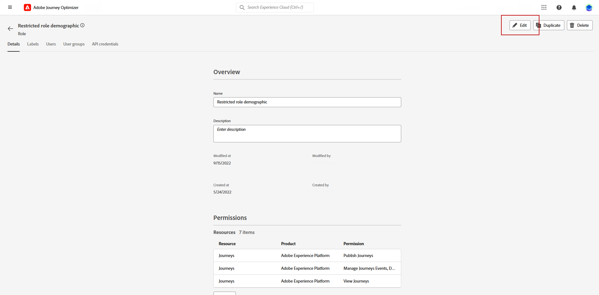

# 创建 IP 预热计划 {#ip-warmup}

创建了一个或多个[IP预热活动](ip-warmup-campaign.md)，并启用了专用表面和相应的选项后，即可开始创建IP预热计划。

要访问、创建、编辑和删除IP预热计划，您必须具有&#x200B;**[!UICONTROL 可投放性顾问]**&#x200B;角色或IP预热计划相关权限。

+++了解如何分配可投放性顾问角色或IP预热计划相关权限

对象级访问控制允许您保护数据，并授予查看和管理计划的特定访问权限。 如果没有为IP预热计划分配标签，则它会打开，以供所有用户查看和编辑。

授予&#x200B;**[!UICONTROL 查看IP预热计划]**&#x200B;权限将限制仅查看和发布的访问权限，而分配&#x200B;**[!UICONTROL 管理IP预热计划]**&#x200B;权限将允许用户查看和编辑计划。

要为特定&#x200B;**[!UICONTROL 角色]**&#x200B;分配相应的权限：

1. 从[!DNL Permissions]产品中，导航到&#x200B;**[!UICONTROL 角色]**&#x200B;菜单，然后选择要使用新的&#x200B;**[!UICONTROL IP预热配置]**&#x200B;权限更新的角色。

1. 在您的&#x200B;**[!UICONTROL 角色]**&#x200B;仪表板中，单击&#x200B;**[!UICONTROL 编辑]**。

   

1. 拖放&#x200B;**[!UICONTROL IP预热配置]**&#x200B;资源以分配权限。

1. 从&#x200B;**[!UICONTROL IP预热配置]**&#x200B;资源下拉列表中，选择用户需要的权限：**[!UICONTROL 查看IP预热计划]**、**[!UICONTROL 管理IP预热计划]**&#x200B;和/或&#x200B;**[!UICONTROL 查看IP预热报告]**。 如果需要，您可以一次选择所有这些变量。

   

1. 单击&#x200B;**[!UICONTROL 保存]**。

将相应的角色分配给&#x200B;**[!UICONTROL 用户]**：

1. 从[!DNL Permissions]产品中，导航到&#x200B;**[!UICONTROL 角色]**&#x200B;菜单，然后选择&#x200B;**[!UICONTROL 可投放性顾问]**&#x200B;内置角色。

1. 从您的&#x200B;**[!UICONTROL 角色]**&#x200B;信息板，访问&#x200B;**[!UICONTROL 用户]**&#x200B;选项卡。

   

1. 单击&#x200B;**[!UICONTROL 添加用户]**&#x200B;以分配&#x200B;**[!UICONTROL 可投放性顾问]**&#x200B;内置角色。

   

1. 选择您的&#x200B;**[!UICONTROL 用户]**&#x200B;并单击&#x200B;**[!UICONTROL 保存]**。

   

+++

## 准备 IP 预热计划文件 {#prepare-file}

IP预热是一项活动，包括逐渐增加从您的IP和域发送到主要Internet服务提供商(ISP)的电子邮件数量，以确立您作为合法发件人的声誉。

此活动通常在可投放性专家的帮助下执行，该专家将帮助根据行业领域、用例、地区、ISP和各种其他因素制定周全的计划。

<!--When working with the [!DNL Journey Optimizer] IP warmup feature, this plan takes the form of an Excel file that must contain a number of predefined columns.-->

在[!DNL Journey Optimizer]界面中创建IP预热计划之前，您需要在Excel模板中填写将提供计划的所有数据。

* 您可以从用户界面下载空白Excel [IP预热计划模板](assets/IPWarmupPlan-Template.xlsx)以填写。

* 您还可以下载已填入一些数据的[示例IP预热计划](assets/IPWarmupPlan-Sample.xlsx)，您可以将这些数据用作示例。

<!--
* From the user interface you can download the blank Excel IP warmup plan template to fill in.

* You can also download a sample IP warmup plan already filled in with some data you can use as an example.
-->

>[!CAUTION]
>
>请与您的可投放性顾问合作，确保您的IP预热计划文件设置正确。
>
>确保使用模板中提供的格式。

以下是包含IP预热计划的文件示例。

### “IP预热计划”选项卡 {#ip-warmup-plan-tab}

* 在此示例中，已准备了一个跨越17天（称为“**运行**”）的计划，以实现超过100万个配置文件的目标卷。

* 此计划通过六个&#x200B;**阶段**&#x200B;执行，每个阶段至少包含一个运行。

* 您最多可以有6列（4列用于域组，一个用于&#x200B;**其他**&#x200B;列，一个用于&#x200B;**参与天数**&#x200B;列）。 在此示例中，计划分为六个列：

   * 其中三个对应于要在您的计划中使用的&#x200B;**现成的域组**(Gmail、Microsoft和Orange)。
   * 一个与自定义域组（需要使用[自定义域组](#custom-domain-group-tab)选项卡添加）相对应。
   * 第五列&#x200B;**Others**&#x200B;包含计划中未明确涵盖的其他域的所有剩余地址。 此列是可选的：如果忽略，电子邮件将只发送到指定的域。
   * 最后一列&#x200B;**参与天数**&#x200B;允许您指定应跟踪或评估参与的天数。

其思想是逐步增加每次运行的目标地址数量，同时减少每个阶段的运行数量。

下面列出了可添加到计划中的现成主域组：

<!--
* Gmail
* Adobe
* WP
* Comcast
* Yahoo
* Bigpond
* Orange
* Softbank
* Docomo
* United Internet
* Microsoft
* KDDI
* Italia Online
* La Poste
* Apple
-->

+++ Gmail
gmail.com；google.com；googlemail.com；googlemail.co.uk
+++

+++WP
wp.pl；o2.pl
+++

+++Comcast
comcast.net
+++

+++Yahoo
aol.fi；games.com；cs.com；yahoo.com.in；y7mail.com；yahoo.co.uk；yahoo.hu；yahoo.co.hu；yahoo.cn；yahoogroups.com.sg；yahoogroups.com.au；aol.es；yahoo.com.au yahoo.com.vn aol.co.nz yahoo.com.br yahoo.ne.jp ymail.com netscape.com yahoo.com.pe yahoo.co.id citlink.net wmconnect.com yahoo.com.jp yahoo.com.hk aol.com.br yahoo.co.kr yahoo.com.ar ygm.com yahoo.co.nz aol.com goowy.com rocketmail.com frontiernet.net aim.com yahoogroups.co.in netscape.net luckymail.com yahoo.co.jp yahoo.com.kr yahoo.co.za verizon.net aol.com.ve aol.com.ar aol.com.co wild4music.com yahoogroups.com.cn yahoo.com.co wow.com yahoo.com yahooxtra.co.nz yahoo.com.mx yahoo.com.ph sky.com aol.com.mx aol.com.au aolchina.com yahoo.com.net yahoo.com.tw talk21.com compuserve.com yahoo.com.sg yahoogroups.com.tw frontier.com yahoo.co.in yahoo.co.il verizon.net.in yahoo.com.tr yahoogroups.com.hk yahoogroups.co.uk yahoo.com.biz yahoo.com.hr aol.co.uk ybb.ne.jp yahoogroups.co.kr yahoo.com.my rogers.com gte.net yahoogroups.com yahoo.co.th yahoo.com.cn love.com bellatlantic.net yahoo.com.ve yahoo.com.ua；yahoo.ca；aol.hk；；aolpoland.pl；aolnorge.no；；yahoo.fi；；aolcom.tr；yahoo.si；aol.it；aol；it；yahoo.es；yahoo.dk；yahoogroups.ca；；aol.kr；yahoo.ie；aol.jp；；yahoo.lt aol.nl； yahoo.bg；；aol.se；；yahoo.de；；；yahoo.nl；；；；Yahol.se； myaol.jp； myaol.jp yahoo.pt；；yahoogrupper.dk； yahoo.fr；；aol.pl；；aol.ch； yahoo.it；；aolpolcka.pl；；ahogruppi.it；；yahoo.cl；；；yahoo.be；；；aol.tw；；；；；；aol.ru；；；yahoo.lv；aolpolska.pl；aol.at；yahoo.pl
+++

+++大池塘
bigpond.com；bigpond.com.au；bigpond.net；telstra.com；bigpond.net.au
+++

+++橙色
voila.com；francetelecom.com；orange.com；orange.fr；wanadoo.fr；voila.fr
+++

+++软银
c.vodafone.ne.jp；jp-h.ne.jp；k.vodafone.ne.jp；jp-d.ne.jp；jp-c.ne.jp；t.vodafone.ne.jp；h.vodafone.ne.jp；r.vodafone.ne.jp；q.vodafone.ne.jp jp-t.ne.jp jp-q.ne.jp s.vodafone.ne.jp jp-s.ne.jp jp-r.ne.jp jp-k.ne.jp n.vodafone.ne.jp d.vodafone.ne.jp softbank.ne.jp jp-n.ne.jp；；；；；；；；；；
+++

+++多科莫
docomo.ne.jp
+++

+++联合互联网
gmx.de；1and1.com；gmx.fr；mail.com；1und1.de；gmx.com；gmx.net；gmx.at；web.de；gmx.ch
+++

+++Microsoft
hotmail.com.tr；live.de；live.ru；live.nl；windowslive.com；live.jp；mts.net；xbox.com；hotmail.fr；hotmail.cl；hotmail.jp；live.cl；live.at；live.com.au；hotmail.co.th；live.hk；hotmail.com.au；hotmail.com；live.com.my hotmail.co.kr outlook.com.br hotmail.co.il live.co.kr live.co.uk live.com.mx hotmail.co.uk live.com.sg msn.com hotmail.co.jp live.co.za live.com.pt outlook.com live.com live.com.ar hotmail.com.br hotmail.com.ar；live.ie；；hotmail.dk；live.no；live.dk；hotmail.it；live.se；live.be；；live.in；hotmail.se；；hotmail.ch；；hotmail.gmail r；live.it；；hotmail.ca；；live.ca；hotmail.de
+++

+++KDDI
au.com；ezweb.ne.jp；uqmobile.jp
+++

+++意大利在线
inwind.it；blu.it；virgilio.it；giallo.it；iol.it；libero.it
+++

+++拉波斯特
laposte.net
+++

+++Apple
mac.com；icloud.com；apple.com；me.com
+++

### “自定义域组”选项卡 {#custom-domain-group-tab}

您还可以通过包含自定义域组向计划添加更多列。

使用&#x200B;**[!UICONTROL 自定义域组]**&#x200B;选项卡定义新的域组。 对于每个域，您可以添加它覆盖的所有子域。<!--TBC-->

对于上述计划中使用的域组，请确保每个域对于其域组都是唯一的，并且不与其他域组重叠。 由于全局域组是自动定义的，因此用户在创建自定义域组时应考虑这一点。

例如，如果添加自定义域Luma，则需要包含以下子域：luma.com、luma.co.uk、luma.it、luma.fr、luma.de等。

### 示例 {#example}

假设您要有两个自定义域组：

* 一个仅用于Hotmail域。
* 一个用于域组Microsoft中的所有其他域（因此不包括所有Hotmail域）。

Hotmail之外的域和域组Microsoft中的域将被收集到&#x200B;**[!UICONTROL 其他]**&#x200B;列中。

1. 在&#x200B;**[!UICONTROL 自定义域组]**&#x200B;选项卡中，创建&#x200B;**Hotmail**&#x200B;域组。

1. 在同一行中添加所有Hotmail域。

   您可以[复制并粘贴[IP预热计划选项卡](#ip-warmup-plan-tab)部分中列出的所有Hotmail域](#copy-paste)。

1. 添加另一行。

1. 创建&#x200B;**Microsoft_X**&#x200B;域组。

1. 在同一行中添加所有非Hotmail的Microsoft域。 同样，您也可以从上述列表中复制并粘贴它们。 [了解详情](#copy-paste)

1. 返回&#x200B;**[!UICONTROL IP预热计划]**&#x200B;选项卡。

1. 创建三列：一个用于&#x200B;**Hotmail**，一个用于&#x200B;**Microsoft_X**，一个用于&#x200B;**Others**。

1. 根据您的需要填写各列。

<!--Only the domain groups listed in the **[!UICONTROL IP Warmup Plan]** tab will be taken into account.-->

### 复制粘贴默认域 {#copy-paste}

例如，如果您要创建包含所有Hotmail域的自定义域组，则可以从上面提供的[中的默认列表复制并粘贴域](#ip-warmup-plan-tab)。

然后使用Excel转换工具将文本转换为列：

1. 选择&#x200B;**[!UICONTROL 数据]** > **[!UICONTROL 分列……]**，选择&#x200B;**[!UICONTROL 分隔]**，然后选择&#x200B;**[!UICONTROL 下一步]**。

1. 选择&#x200B;**[!UICONTROL 分号]**，单击&#x200B;**[!UICONTROL 下一步]**&#x200B;和&#x200B;**[!UICONTROL 完成]**。

现在，每个域在同一行的不同列中显示。

## 访问和管理IP预热计划 {#manage-ip-warmup-plans}

1. 访问&#x200B;**[!UICONTROL 管理]** > **[!UICONTROL 渠道]** > **[!UICONTROL IP预热计划]**&#x200B;菜单。 此时将显示迄今为止创建的所有IP预热计划。

   

1. 您可以对状态进行过滤。 不同的状态包括：

   * **未启动**：尚未激活任何运行。 [了解详情](ip-warmup-execution.md#define-runs)
   * **实时**：一旦成功激活第一阶段中的第一次运行，计划就会更改为此状态。 [了解详情](ip-warmup-execution.md#define-runs)
   * **已完成**：计划已标记为已完成。<!--This option is only available if all the runs in the plan are in **[!UICONTROL Completed]** or **[!UICONTROL Draft]** status (no run can be **[!UICONTROL Live]**).--> [了解详情](ip-warmup-execution.md#mark-as-completed)
     <!--* **Paused**: to check (user action)-->

1. 要删除IP预热计划，请选择计划名称旁边的&#x200B;**[!UICONTROL 删除]**&#x200B;图标并确认删除。

   >[!NOTE]
   >
   >只能删除状态为&#x200B;**未启动**&#x200B;的计划。

   

   >[!CAUTION]
   >
   >选定的IP预热计划将被永久删除。

## 创建 IP 预热计划 {#create-ip-warmup-plan}

>[!CONTEXTUALHELP]
>id="ajo_admin_ip_warmup_upload"
>title="指定 IP 预热计划"
>abstract="为 Excel 模板填入将为您的计划提供的所有数据，例如 IP 预热阶段和目标配置文件数，然后在此处上传它。"
>additional-url="https://experienceleague.adobe.com/docs/journey-optimizer/using/configuration/implement-ip-warmup-plan/ip-warmup-plan.html?lang=zh-Hans#prepare-file" text="准备 IP 预热计划文件"

>[!CONTEXTUALHELP]
>id="ajo_admin_ip_warmup_surface"
>title="选择营销表面"
>abstract="您必须选择在要与您的 IP 预热计划关联的营销活动中选择的相同表面。"
>additional-url="https://experienceleague.adobe.com/docs/journey-optimizer/using/configuration/channel-surfaces.html" text="设置渠道表面"
>additional-url="https://experienceleague.adobe.com/docs/journey-optimizer/using/configuration/channel-surfaces.html" text="创建 IP 预热营销活动"

要创建IP预热计划，请执行以下步骤。

1. 访问&#x200B;**[!UICONTROL 管理]** > **[!UICONTROL 渠道]** > **[!UICONTROL IP预热计划]**&#x200B;菜单，然后单击&#x200B;**[!UICONTROL 创建IP预热计划]**。

   

1. 填写IP预热计划详细信息：提供名称和描述。

   

1. 选择要预热的[表面](channel-surfaces.md)。 仅营销表面可供选择。 [了解有关电子邮件类型的更多信息](../email/email-settings.md#email-type)

   >[!NOTE]
   >
   >要与IP预热计划关联的营销活动必须使用同一表面。 [了解如何创建IP预热活动](ip-warmup-campaign.md)

1. 上载包含IP预热计划的Excel文件。 [了解详情](#prepare-file)

   <!--
    You can also download the Excel template from the [!DNL Journey Optimizer] user interface and upload it after filling it with the IP warmup details.-->

   

   >[!NOTE]
   >
   >如果上传失败，请确保您使用的是正确的格式和文件格式(.xls或.xlsx)。 使用Adobe提供的[模板](assets/IPWarmupPlan-Template.xlsx)。

1. 单击&#x200B;**[!UICONTROL 创建]**。在您上传的文件中定义的所有阶段、运行、列及其内容会自动显示在[!DNL Journey Optimizer]界面中。

   

   >[!NOTE]
   >
   >**[!UICONTROL 目标]**&#x200B;列显示每次运行的所有目标配置文件的总和，这意味着来自您定义的每个域组的所有配置文件，包括&#x200B;**其他**&#x200B;列（如果有）。

您现在可以执行IP预热计划了。 [了解详情](ip-warmup-execution.md)
