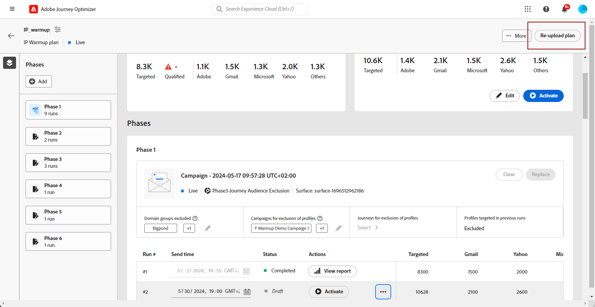

# 创建IP预热计划 {#ip-warmup}

>[!BEGINSHADEBOX]

本文档指南包括以下内容：

* [IP预热入门](ip-warmup-gs.md)
* [创建IP预热活动](ip-warmup-campaign.md)
* **[创建IP预热计划](ip-warmup-plan.md)**
* [运行IP预热计划](ip-warmup-running.md)

>[!ENDSHADEBOX]

一旦您 [已创建一个或多个营销活动](ip-warmup-campaign.md) 启用专用表面和IP预热选项后，您可以开始创建IP预热计划。

## 访问和管理IP预热计划 {#manage-ip-warmup-plans}

1. 访问 **[!UICONTROL 管理]** > **[!UICONTROL 渠道]** > **[!UICONTROL IP预热计划]** 菜单。 此时将显示迄今为止创建的所有IP预热计划。

   

1. 您可以对状态进行过滤。 不同的状态包括：

   * **未开始**：未发生运行
   * **进行中**：只要运行开始 <!--or is done?-->
   * **已暂停**
   * **已完成**：计划中的所有运行都已完成

1. 要删除IP预热计划，请选择 **[!UICONTROL 删除]** 图标并确认删除。

   

   >[!CAUTION]
   >
   >选定的IP预热计划将被永久删除。

## 创建IP预热计划 {#create-ip-warmup-plan}

>[!CONTEXTUALHELP]
>id="ajo_admin_ip_warmup_upload"
>title="指定IP预热计划"
>abstract="下载CSV模板，并使用IP预热阶段的数据和目标配置文件数填充该模板。"

>[!CONTEXTUALHELP]
>id="ajo_admin_ip_warmup_surface"
>title="选择营销表面"
>abstract="必须选择与要在营销策划中与IP预热计划关联的所选表面相同的表面。"
>additional-url="https://experienceleague.adobe.com/docs/journey-optimizer/using/configuration/channel-surfaces.html" text="设置渠道表面"
>additional-url="https://experienceleague.adobe.com/docs/journey-optimizer/using/configuration/channel-surfaces.html" text="创建IP预热活动"

>[!CAUTION]
>
>要创建、编辑和删除IP预热计划，您必须具有 **[!UICONTROL 可投放性顾问]** 许可。
<!--Learn more on managing [!DNL Journey Optimizer] users' access rights in [this section](../administration/permissions-overview.md).-->

当一个或多个实时营销活动具有 **[!UICONTROL IP预热计划激活]** 启用选项后，您可以将其与IP预热计划关联。

>[!CAUTION]
>
>与您的可投放性顾问合作，确保您的IP预热计划模板设置正确。 <!--TBC-->

1. 访问 **[!UICONTROL 管理]** > **[!UICONTROL 渠道]** > **[!UICONTROL IP预热计划]** 菜单，然后单击 **[!UICONTROL 创建IP预热计划]**.

   

1. 填写IP预热计划详细信息：提供名称和描述。

   

1. 选择 [曲面](channel-surfaces.md). 仅营销表面可供选择。 [了解有关电子邮件类型的更多信息](../email/email-settings.md#email-type)

   >[!CAUTION]
   >
   >必须选择与要在营销策划中与IP预热计划关联的所选表面相同的表面。 [了解如何创建IP预热活动](#create-ip-warmup-campaign)

1. 上载包含IP预热计划的Excel文件<!--which formats are allowed?-->. 您可以使用可交付性团队提供的模板。<!--TBC?--> [了解详情](#upload-plan)
   <!--
    You can also download the Excel template from the [!DNL Journey Optimizer] user interface and upload it after filling it with the IP warmup details.-->

   

1. 单击&#x200B;**[!UICONTROL 创建]**。上传的文件中定义的阶段数将自动显示，每个阶段的所有运行都将自动显示。 [了解详情](#upload-plan)

   

### 重新上传IP预热计划 {#re-upload-plan}

您可以使用相应的按钮重新上传另一个IP预热计划。

>[!NOTE]
>
>IP预热计划的详细信息将根据新上传的文件而更改。 完整运行和激活的运行不受影响。

### 上载包含计划的文件 {#upload-plan}

以下是包含IP预热计划的文件示例。

每个阶段对应于由多次运行组成的时段，您将为该时段分配一个营销活动。

对于每次运行，您都拥有一定数量的收件人，您将定义执行此运行的日期。

对于要交付到的域，您可以拥有任意数量的列。 在本例中，您有三个列：Gmail、Adobe和“其他”，这意味着

其思想是在第一阶段运行更多地址，并逐步增加目标地址的数量，同时减少运行次数。
