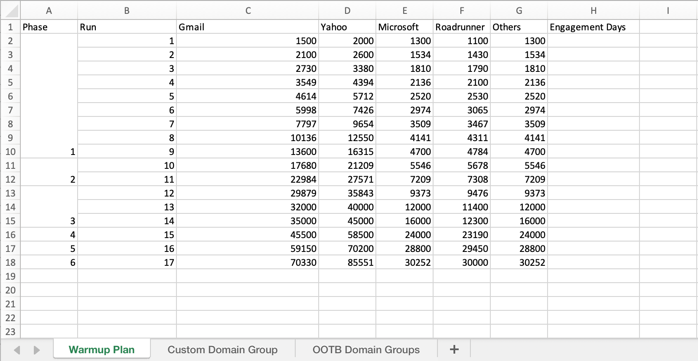

# 创建 IP 预热计划 {#ip-warmup}

>[!BEGINSHADEBOX]

本文档指南包括以下内容：

* [IP预热入门](ip-warmup-gs.md)
* [创建 IP 预热营销活动](ip-warmup-campaign.md)
* **[创建IP预热计划](ip-warmup-plan.md)**
* [执行 IP 预热计划](ip-warmup-execution.md)

>[!ENDSHADEBOX]

创建了一个或多个 [IP预热活动](ip-warmup-campaign.md) 启用专用接口和相应的选项后，即可开始创建IP预热计划。

要访问、创建、编辑和删除IP预热计划，您必须拥有 **[!UICONTROL 可投放性顾问]** 角色或IP预热计划相关权限。

+++了解如何分配可投放性顾问角色或IP预热计划相关权限

将相应的权限分配给特定的 **[!UICONTROL 角色]**：

1. 从 [!DNL Permissions] 产品，导航到 **[!UICONTROL 角色]** 菜单，然后选择要使用新的更新角色 **[!UICONTROL IP预热配置]** 权限。

1. 来自您的 **[!UICONTROL 角色]** 仪表板，单击 **[!UICONTROL 编辑]**.

   

1. 拖放 **[!UICONTROL IP预热配置]** 用于分配权限的资源。

1. 从 **[!UICONTROL IP预热配置]** 资源下拉列表，选择用户所需的权限。

   

1. 单击&#x200B;**[!UICONTROL 保存]**。

将相应的角色分配给 **[!UICONTROL 用户]**：

1. 从 [!DNL Permissions] 产品，导航到 **[!UICONTROL 角色]** 菜单并选择 **[!UICONTROL 可投放性顾问]** 内置角色。

1. 来自您的 **[!UICONTROL 角色]** 仪表板，访问 **[!UICONTROL 用户]** 选项卡。

   

1. 单击 **[!UICONTROL 添加用户]** 以分配 **[!UICONTROL 可投放性顾问]** 内置角色。

   

1. 选择您的 **[!UICONTROL 用户]** 并单击 **[!UICONTROL 保存]**.

   

+++

## 准备IP预热计划文件 {#prepare-file}

IP预热是一项活动，包括逐渐增加从您的IP和域发送到主要Internet服务提供商(ISP)的电子邮件数量，以确立您作为合法发件人的声誉。

此活动通常在可投放性专家的帮助下执行，该专家有助于根据行业域、用例、地区、ISP和各种其他因素制定周全的计划。

<!--When working with the [!DNL Journey Optimizer] IP warmup feature, this plan takes the form of an Excel file that must contain a number of predefined columns.-->

在中创建IP预热计划之前 [!DNL Journey Optimizer] 界面，您需要在Excel模板中填写将提供计划的所有数据。

* 您可以在此处下载空白 [Excel IP预热计划模板](assets/ip-warmup-csv.zip) 以填写。

* 您也可以下载 [示例IP预热计划模板](assets/sample-ip-warmup-plan.zip) 已填入了一些可用作示例的数据。

>[!CAUTION]
>
>请与您的可投放性顾问合作，确保您的IP预热计划文件设置正确。
>
>确保使用模板中提供的格式。

以下是包含IP预热计划的文件示例。

>[!NOTE]
>
>现在，您应该将 **属性** 和 **值** 未接触的单元格。

### “IP预热计划”选项卡 {#ip-warmup-plan-tab}

* 在此示例中，已准备了跨越17天的计划(称为&#39;**运行**‘)以实现超过100万用户档案的目标数量。

* 该计划在六年内执行 **阶段**，每个报表包至少包含一个运行。

* 对于要交付到的域，您可以拥有任意数量的列。 在此示例中，计划分为六个列：

   * 其中四个对应于 **现成的域组** 在您的计划(Gmail、Microsoft、Yahoo和Orange)中使用。
   * 一个与自定义域组(您需要使用 [自定义域组](#custom-domain-group-tab) 选项卡)。
   * 第六纵队， **其他**，包含计划中未明确涵盖的其他域的所有剩余地址。 此列是可选的：如果忽略，电子邮件将只发送到指定的域。
* 此 **参与天数** 列会显示仅定向在输入的最后一个期间与您的品牌互动的用户档案。

其思想是逐步增加每次运行的目标地址数量，同时减少每个阶段的运行数量。

下面列出了可添加到计划中的现成主域组：

<!--
* Gmail
* Adobe
* WP
* Comcast
* Yahoo
* Bigpond
* Orange
* Softbank
* Docomo
* United Internet
* Microsoft
* KDDI
* Italia Online
* La Poste
* Apple
-->

+++ Gmail gmail.com；google.com；googlemail.com；googlemail.co.uk
+++

+++ Adobeadobe.com
+++

+++WP wp.pl；o2.pl
+++

+++Comcast comcast.net
+++

+++Yahoo aol.fi；games.com；cs.com；yahoo.com.in；y7mail.com；yahoo.co.uk；yahoo.hu；yahoo.co.hu；yahoo.cn；yahoogroups.com.sg；yahoogroups.com.au；aol.es；yahoo.com.au yahoo.com.vn aol.co.nz yahoo.com.br yahoo.ne.jp ymail.com netscape.com yahoo.com.pe yahoo.co.id citlink.net wmconnect.com yahoo.com.jp yahoo.com.hk aol.com.br yahoo.co.kr yahoo.com.ar ygm.com yahoo.co.nz aol.com goowy.com rocketmail.com frontiernet.net aim.com yahoogroups.co.in netscape.net luckymail.com yahoo.co.jp yahoo.com.kr yahoo.co.za verizon.net aol.com.ve aol.com.ar aol.com.co wild4music.com yahoogroups.com.cn yahoo.com.co wow.com yahoo.com yahooxtra.co.nz yahoo.com.mx yahoo.com.ph sky.com aol.com.mx aol.com.au aolchina.com yahoo.com.net yahoo.com.tw talk21.com compuserve.com yahoo.com.sg yahoogroups.com.tw frontier.com yahoo.co.in yahoo.co.il verizon.net.in yahoo.com.tr yahoogroups.com.hk yahoogroups.co.uk yahoo.com.biz yahoo.com.hr aol.co.uk ybb.ne.jp yahoogroups.co.kr yahoo.com.my rogers.com gte.net yahoogroups.com yahoo.co.th yahoo.com.cn love.com bellatlantic.net yahoo.com.ve yahoo.com.ua；；yahoo.ca；aol.hk；；aolpoland.pl；aolnorge.no；yahoo.fi；；yahoo.hr；aol.cz；yahoo.ee；aol.be；aolcom.tr；yahoo.si；；aol.it；；yahoo.es；yahogroups.ca；；aol.kr；yahoo.ie；aol.jp；；aol.nl；yahoo.bg；；aol.se；yahoo.de；；；；aol.dk；；yahoo.nl；；；aol.dk；AOL.k；SK；yahogroups.de yahoo.gr；；yahoo.ro；；yahoo.gr；；aol.in；yahoo.rs；aol.de；aol；；；；yahoo.se；myaol yahoo.pt；；yahoo.pt；；yahogrupper.dk； yahoo.fr；；；aol.ch； yahoo.it；； AOLPOLCKA.pl；；；yahogruppi.it；；yahoo.cl；；；
+++

+++Bigpond bigpond.com；bigpond.com.au；bigpond.net；telstra.com；bigpond.net.au
+++

+++橙色voila.com；francetelecom.com；orange.com；orange.fr；wanadoo.fr；voila.fr
+++

+++Softbank c.vodafone.ne.jp；jp-h.ne.jp；k.vodafone.ne.jp；jp-d.ne.jp；jp-c.ne.jp；t.vodafone.ne.jp；h.vodafone.ne.jp r.vodafone.ne.jp；q.vodafone.ne.jp jp-t.ne.jp jp-q.ne.jp s.vodafone.ne.jp jp-s.ne.jp jp-r.ne.jp jp-k.ne.jp n.vodafone.ne.jp d.vodafone.ne.jp softbank.ne.jp jp-n.ne.jp；；；；；；；；；；
+++

+++Docomo docomo.ne.jp
+++

+++United Internet gmx.de；1and1.com；gmx.fr；mail.com；1und1.de；gmx.com；gmx.net；gmx.at；web.de；gmx.ch
+++

+++Microsoft hotmail.com.tr；live.de；live.ru；live.nl；windowslive.com；live.jp；mts.net；xbox.com；hotmail.fr；hotmail.cl；hotmail.co.kr outlook.com.br hotmail.co.il live.co.kr live.co.uk live.com.mx hotmail.co.uk live.com.sg msn.com hotmail.co.jp live.co.za live.com.pt outlook.com live.com live.com.ar hotmail.com.br hotmail.com.ar；hotmail.cl；live.com.au；hotmail.co.th；live.hk；hotmail.com.au；hotmail.com；live.com.my；live.ie；live.cn；；hotmail.dk；live.no；live.dk；hotmail.it；live.se；；live.be；live.in；hotmail.se；；hotmail.ch；hotmail.gr；live.it；；hotmail.ca；；live.ca；hotmail.de
+++

+++KDDI au.com；ezweb.ne.jp；uqmobile.jp
+++

+++意大利在线inwind.it；blu.it；virgilio.it；giallo.it；iol.it；libero.it
+++

+++拉波斯特laposte.net
+++

+++Apple mac.com；icloud.com；apple.com；me.com
+++

### “自定义域组”选项卡 {#custom-domain-group-tab}

您还可以通过包含自定义域组向计划添加更多列。

使用 **[!UICONTROL 自定义域组]** 选项卡来定义新域组。 对于每个域，您可以添加它涵盖的所有子域。<!--TBC-->

例如，如果添加自定义域Luma，则需要包含以下子域：luma.com、luma.co.uk、luma.it、luma.fr、luma.de等。

### 示例 {#example}

假设您要有两个自定义域组：

* 一个仅用于Hotmail域。
* 一个用于域组Microsoft中的所有其他域（因此不包括所有Hotmail域）。

请注意，所有其他域都将收集到 **[!UICONTROL 其他]** 列。

1. 在 **[!UICONTROL 自定义域组]** 选项卡，创建 **Hotmail** 域组。

1. 在同一行中添加所有Hotmail域。

   您可以 [复制并粘贴](#copy-paste) 中列出的所有Hotmail域 [“IP预热计划”选项卡](#ip-warmup-plan-tab) 部分。

1. 添加另一行。

1. 创建 **Microsoft_X** 域组。

1. 在同一行中添加所有非Hotmail的Microsoft域。 同样，您也可以从上述列表中复制并粘贴它们。 [了解详情](#copy-paste)

1. 返回 **[!UICONTROL IP预热计划]** 选项卡。

1. 创建三列：一列用于 **Hotmail**，一个用于 **Microsoft_X** 一个用于 **其他**.

1. 根据您的需要填写各列。

>[!NOTE]
>
>将IP预热计划上传到后 [!DNL Journey Optimizer]，您无需排除Microsoft域组。

<!--Only the domain groups listed in the **[!UICONTROL IP Warmup Plan]** tab will be taken into account.-->

### 复制粘贴默认域 {#copy-paste}

例如，如果您要创建包含所有Hotmail域的自定义域组，则可以从提供的默认列表中复制并粘贴域 [以上](#ip-warmup-plan-tab).

然后使用Excel转换工具将文本转换为列：

1. 选择 **[!UICONTROL 数据]** > **[!UICONTROL 文本到列……]**，选择 **[!UICONTROL 已分隔]** 并选择 **[!UICONTROL 下一个]**.

1. 选择 **[!UICONTROL 分号]**，单击 **[!UICONTROL 下一个]** 和 **[!UICONTROL 完成]**.

现在，每个域在同一行的不同列中显示。

## 访问和管理IP预热计划 {#manage-ip-warmup-plans}

1. 访问 **[!UICONTROL 管理]** > **[!UICONTROL 渠道]** > **[!UICONTROL IP预热计划]** 菜单。 此时将显示迄今为止创建的所有IP预热计划。

   

1. 您可以对状态进行过滤。 不同的状态包括：

   * **未开始**：尚未激活任何运行。 [了解详情](ip-warmup-execution.md#define-runs)
   * **实时**：一旦成功激活第一阶段的第一次运行，计划就会更改为此状态。 [了解详情](ip-warmup-execution.md#define-runs)
   * **已完成**：计划已标记为已完成。 <!--This option is only available if all the runs in the plan are in **[!UICONTROL Completed]** or **[!UICONTROL Draft]** status (no run can be **[!UICONTROL Live]**).--> [了解详情](ip-warmup-execution.md#mark-as-completed)
     <!--* **Paused**: to check (user action)-->

1. 要删除IP预热计划，请选择 **[!UICONTROL 删除]** 图标并确认删除。

   >[!NOTE]
   >
   >仅限具有以下属性的计划： **未开始** 状态可删除。

   

   >[!CAUTION]
   >
   >选定的IP预热计划将被永久删除。

## 创建 IP 预热计划 {#create-ip-warmup-plan}

>[!CONTEXTUALHELP]
>id="ajo_admin_ip_warmup_upload"
>title="指定 IP 预热计划"
>abstract="下载 CSV 模板并在其中填入 IP 预热阶段的数据和配置文件的目标数量。"

>[!CONTEXTUALHELP]
>id="ajo_admin_ip_warmup_surface"
>title="选择营销表面"
>abstract="您必须选择在要与您的 IP 预热计划关联的营销活动中选择的相同表面。"
>additional-url="https://experienceleague.adobe.com/docs/journey-optimizer/using/configuration/channel-surfaces.html" text="设置渠道表面"
>additional-url="https://experienceleague.adobe.com/docs/journey-optimizer/using/configuration/channel-surfaces.html" text="创建 IP 预热营销活动"

要创建IP预热计划，请执行以下步骤。

1. 访问 **[!UICONTROL 管理]** > **[!UICONTROL 渠道]** > **[!UICONTROL IP预热计划]** 菜单，然后单击 **[!UICONTROL 创建IP预热计划]**.

   

1. 填写IP预热计划详细信息：提供名称和描述。

   

1. 选择 [曲面](channel-surfaces.md) 想要热身。 仅营销表面可供选择。 [了解有关电子邮件类型的更多信息](../email/email-settings.md#email-type)

   >[!NOTE]
   >
   >要与IP预热计划关联的营销活动必须使用同一表面。 [了解如何创建IP预热活动](ip-warmup-campaign.md)

1. 上载包含IP预热计划的Excel文件。 [了解详情](#prepare-file)

   <!--
    You can also download the Excel template from the [!DNL Journey Optimizer] user interface and upload it after filling it with the IP warmup details.-->

   

   >[!NOTE]
   >
   >如果上传失败，请确保您使用的是正确的格式和文件格式(.xls或.xlsx)。 使用 [示例](assets/ip-warmup-csv.zip) 由Adobe提供。

1. 单击&#x200B;**[!UICONTROL 创建]**。在上传的文件中定义的所有阶段、运行、列及其内容会自动显示在 [!DNL Journey Optimizer] 界面。

   

   >[!NOTE]
   >
   >此 **[!UICONTROL 已定位]** 列显示每次运行的所有定向配置文件的总和，这意味着来自您定义的每个域组的所有配置文件，包括 **其他** 列（如果有）。

您现在可以执行IP预热计划了。 [了解详情](ip-warmup-execution.md)
