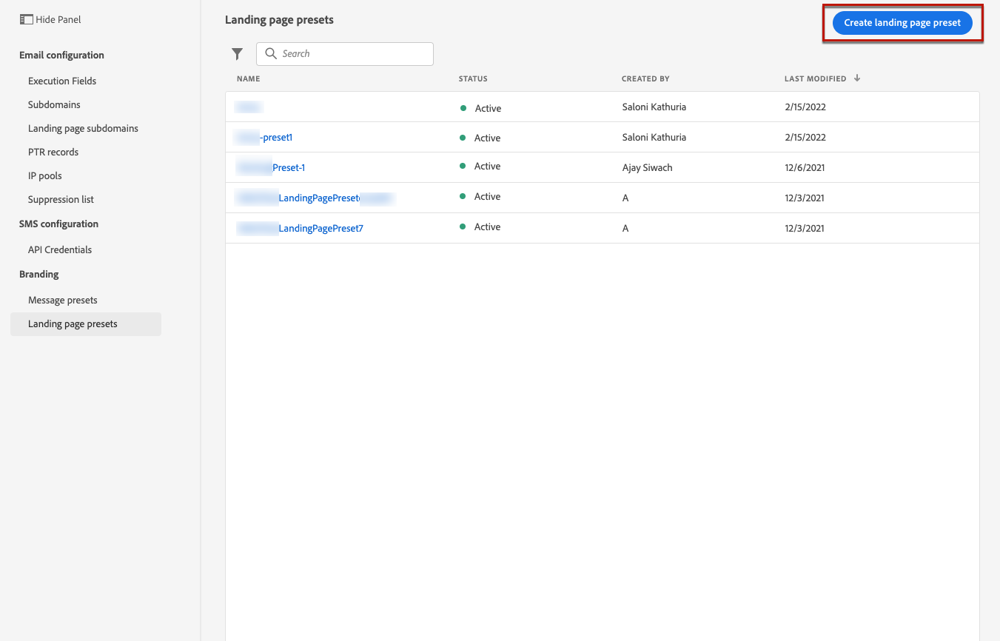

# 定义登陆页面预设 {#lp-presets}

When [创建登陆页面](../landing-pages/create-lp.md#create-a-lp)，则必须选择登陆页面预设才能构建登陆页面并通过该页面进行利用 **[!DNL Journey Optimizer]**.

## 访问登陆页面预设 {#access-lp-presets}

要访问登陆页面预设，请执行以下步骤。

1. 访问 **[!UICONTROL Administration]** > **[!UICONTROL Channels]** 菜单。

1. 选择 **[!UICONTROL Branding]** > **[!UICONTROL Landing page presets]**.

   

1. 单击任意预设标签以访问登陆页面预设详细信息。

   

## 创建登陆页面预设 {#lp-create-preset}

要创建登陆页面预设，请执行以下步骤。

>[!NOTE]
>
>要创建预设，请确保您之前至少配置了一个登陆页面子域。 [了解如何](lp-subdomains.md)

1. 访问 **[!UICONTROL Administration]** > **[!UICONTROL Channels]** 菜单，然后选择 **[!UICONTROL Branding]** > **[!UICONTROL Landing page presets]**.

1. 选择 **[!UICONTROL Create landing page preset]**。

   

1. 输入预设的名称和描述。

   >[!NOTE]
   >
   > 名称必须以字母(A-Z)开头。 它只能包含字母数字字符。 还可以使用下划线 `_`，点`.` 和连字符 `-` 字符。

1. 从下拉列表中选择登陆页面子域。

   

   >[!NOTE]
   >
   >要选择子域，请确保您之前至少配置了一个登陆页面子域。 [了解如何](#lp-subdomains)

   将显示与所选子域对应的设置。

1. 如果要选择登陆页面子域作为跟踪URL，请检查 **[!UICONTROL Same as landing page subdomain]** 选项。 [了解有关跟踪的更多信息](../design/message-tracking.md)

   

   例如，如果登陆页面URL为“pages.mail.luma.com”，而跟踪URL为“data.mail.luma.com”，则可以选择“pages.mail.luma.com”作为跟踪子域。

1. 单击 **[!UICONTROL Submit]** 以确认创建登陆页面预设。 您还可以将预设另存为草稿，稍后恢复其配置。

   

1. 创建登陆页面预设后，该预设会显示在列表中，并且 **[!UICONTROL Active]** 状态。 它已准备好用于您的登陆页面。

   

您现在已准备好 [创建登陆页面](../landing-pages/create-lp.md) in [!DNL Journey Optimizer].
<!--
>[!NOTE]
>
>Learn how to create channel surfaces for push notifications and emails in [this section](channel-surfaces.md).-->

**相关主题**：

* [登陆页面入门](../landing-pages/get-started-lp.md)
* [创建登陆页面](../landing-pages/create-lp.md#create-a-lp)
