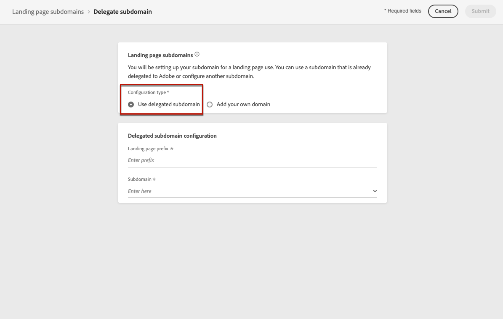

# 配置登陆页面子域 {#lp-subdomains}

>[!CONTEXTUALHELP]
>id="ajo_admin_config_lp_subdomain"
>title="创建登陆页面预设"
>abstract="要创建登陆页面预设，请确保您之前至少配置了一个要从子域名列表中选取的登陆页面子域。"
>additional-url="https://experienceleague.adobe.com/docs/journey-optimizer/using/configuration/lp-configuration.html#lp-create-preset" text="创建登陆页面预设"

>[!CONTEXTUALHELP]
>id="ajo_admin_subdomain_lp"
>title="委派登陆页面子域"
>abstract="您必须配置子域以用于登陆页面，因为您需要此子域才能创建登陆页面预设。 您可以使用已委派的子域来Adobe或配置新的子域。"
>additional-url="https://experienceleague.adobe.com/docs/journey-optimizer/using/configuration/lp-configuration.html#lp-create-preset" text="创建登陆页面预设"

能够 [创建登陆页面预设](lp-presets.md)，则必须设置要用于登陆页面的子域。

您可以使用已委派给Adobe的子域，也可以配置其他子域。 了解有关将子域委派到的更多信息，请Adobe [此部分](delegate-subdomain.md).

## 使用现有子域 {#lp-use-existing-subdomain}

要使用已委派给Adobe的子域，请执行以下步骤。

1. 访问 **[!UICONTROL Administration]** > **[!UICONTROL Channels]** 菜单，然后选择 **[!UICONTROL Email configuration]** > **[!UICONTROL Landing page subdomains]**.

   

1. 单击 **[!UICONTROL Set up subdomain]**。

   

1. 选择 **[!UICONTROL Use delegated domain]** 从 **[!UICONTROL Configuration type]** 中。

   

1. 输入将在登陆页面URL中显示的前缀。

   >[!NOTE]
   >
   >只允许使用字母数字字符和连字符。

1. 从列表中选择委派的子域。

   >[!NOTE]
   >
   >您无法选择已用作登陆页面子域的子域。

   

   >[!CAUTION]
   >
   >如果您选择的域是使用 [CNAME方法](delegate-subdomain.md#cname-subdomain-delegation)，则必须在托管平台上创建DNS记录。 要生成DNS记录，该过程与配置新登陆页面子域时的过程相同。 了解 [此部分](#lp-configure-new-subdomain).

1. 单击 **[!UICONTROL Submit]**。

1. 提交后，子域将显示在列表中，其中 **[!UICONTROL Processing]** 状态。 有关子域状态的更多信息，请参阅 [此部分](access-subdomains.md).<!--Same statuses?-->

   

   >[!NOTE]
   >
   >在能够使用该子域发送消息之前，您必须等到Adobe执行所需的检查，该检查最长可能需要4小时。<!--Learn more in [this section](delegate-subdomain.md#subdomain-validation).-->

1. 检查成功后，子域将获取 **[!UICONTROL Success]** 状态。 它已准备好用于创建登陆页面预设。

## 配置新子域 {#lp-configure-new-subdomain}

>[!CONTEXTUALHELP]
>id="ajo_admin_lp_subdomain_dns"
>title="生成匹配的DNS记录"
>abstract="要配置新的登陆页面子域，您需要复制Journey Optimizer界面中显示的Adobe名称服务器信息，并将其粘贴到您的域托管解决方案中，以生成匹配的DNS记录。 检查成功后，子域即可用于创建登陆页面预设。"

要配置新子域，请执行以下步骤。

1. 访问 **[!UICONTROL Administration]** > **[!UICONTROL Channels]** 菜单，然后选择 **[!UICONTROL Email configuration]** > **[!UICONTROL Landing page subdomains]**.

1. 单击 **[!UICONTROL Set up subdomain]**。

1. 选择 **[!UICONTROL Add your own domain]** 从 **[!UICONTROL Configuration type]** 中。

   

1. 指定要委派的子域。

   >[!CAUTION]
   >
   >您无法使用现有登陆页面子域。

   不允许将无效的子域委派到Adobe。 确保输入您的组织拥有的有效子域，如marketing.yourcompany.com。

   当前不支持多级子域，如“email.marketing.yourcompany.com”。

1. 将显示要置入DNS服务器的记录。 复制此记录或下载CSV文件，然后导航到您的域托管解决方案以生成匹配的DNS记录。

1. 确保已在您的域托管解决方案中生成DNS记录。 如果一切配置正确，请选中“I confirm...”框，然后单击 **[!UICONTROL Submit]**.

   

   >[!NOTE]
   >
   >当您配置新的登陆页面子域时，它将始终指向CNAME记录。

1. 提交子域委派后，子域将显示在列表中，其中 **[!UICONTROL Processing]** 状态。 有关子域状态的更多信息，请参阅 [此部分](access-subdomains.md).<!--Same statuses?-->

   >[!NOTE]
   >
   >在能够使用该子域发送消息之前，您必须等到Adobe执行所需的检查，该检查最长可能需要4小时。<!--Learn more in [this section](#subdomain-validation).-->

1. 检查成功后，子域将获取 **[!UICONTROL Success]** 状态。 它已准备好用于创建登陆页面预设。

   请注意，子域将标记为 **[!UICONTROL Failed]** 如果您未能在托管解决方案上创建验证记录。
