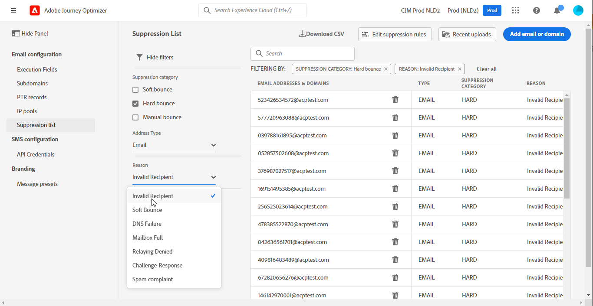
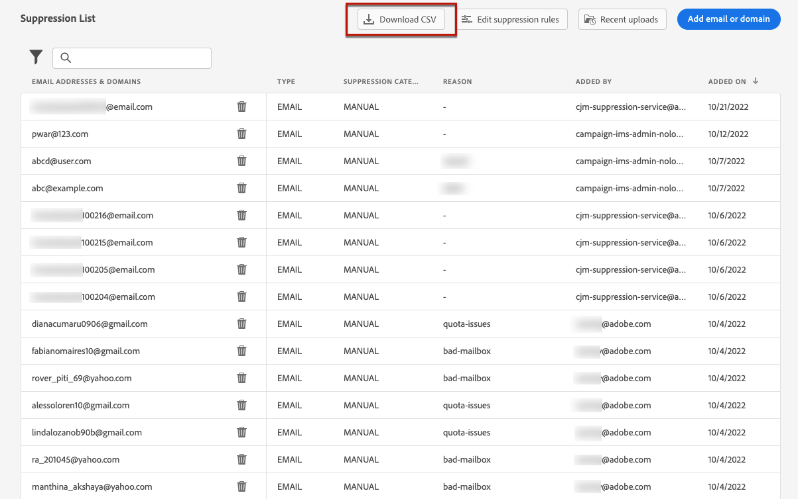
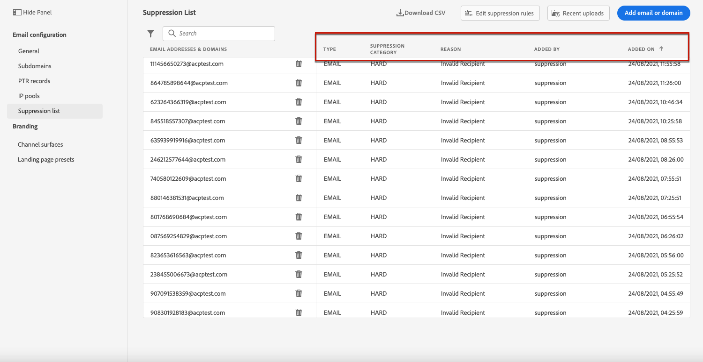

# 管理抑制列表 {#manage-suppression-list}

使用 [!DNL Journey Optimizer]，则您可以监控在历程中自动排除的所有电子邮件地址，例如：

* 无效的地址（硬退回）。
* 始终软退回的地址，如果您继续将这些地址包含在投放中，则这些地址可能会对您的电子邮件声誉造成不利影响。
* 针对您的某封电子邮件发出某种垃圾邮件投诉的收件人。

此类电子邮件地址会自动收集到Journey Optimizer中 **抑制列表**. 了解有关抑制列表概念和在 [此部分](../reports/suppression-list.md).

您还可以 [**手动** 添加地址或域](#add-addresses-and-domains) 到禁止列表。

>[!NOTE]
>
>要花0到60分钟 [!DNL Journey Optimizer] 考虑外发电子邮件中禁止使用的地址。

## 访问禁止列表 {#access-suppression-list}

要访问排除的电子邮件地址的详细列表，请转到 **[!UICONTROL 管理]** > **[!UICONTROL 渠道]** > **[!UICONTROL 电子邮件配置]**，然后选择 **[!UICONTROL 禁止列表]**.

>[!CAUTION]
>
>查看、导出和管理抑制列表的权限限制为 [历程管理员](../administration/ootb-product-profiles.md#journey-administrator). 了解有关管理的更多信息 [!DNL Journey Optimizer] 用户在 [此部分](../administration/permissions-overview.md).


过滤器可帮助您浏览列表。


您可以在 **[!UICONTROL 抑制类别]**, **[!UICONTROL 地址类型]**&#x200B;或 **[!UICONTROL 原因]**. 为每个标准选择您选择的选项。 选择后，您可以清除每个过滤器或列表顶部显示的所有过滤器。



如果您手动添加电子邮件地址或域名时出错，则 **[!UICONTROL 删除]** 按钮来删除该条目。

>[!CAUTION]
>
>请勿使用 **[!UICONTROL 删除]** 按钮以删除禁止的电子邮件地址或域。


从禁止列表中删除某个电子邮件地址或域意味着您将再次开始向该地址或域发送邮件。 因此，这可能会对您的投放能力和IP信誉造成严重影响，最终可能会导致您的IP地址或发送域被阻止。 进一步了解在 [此部分](../reports/suppression-list.md).

>[!NOTE]
>
>考虑删除任何电子邮件地址或域名时，请格外小心。 如有疑问，请联系可投放性专家。

从 **[!UICONTROL 禁止列表]** 视图，您还可以编辑隐藏规则。 [了解详情](retries.md)

要将隐藏列表导出为CSV文件，请选择 **[!UICONTROL 下载CSV]** 按钮。



## 抑制类别和原因 {#suppression-categories-and-reasons}

当邮件无法发送到电子邮件地址时， [!DNL Journey Optimizer] 确定投放失败的原因，并将其与 **[!UICONTROL 抑制类别]**.

抑制类别如下：

* **硬**:该电子邮件地址会立即发送到禁止列表。

   >[!NOTE]
   >
   >当错误是垃圾邮件投诉的结果时，也会出现 **硬** 类别。 发出投诉的收件人的电子邮件地址会立即发送到制止名单。

* **柔和**:当错误计数达到限制阈值时，软错误会向抑制列表发送地址。 [了解有关重试的更多信息](retries.md)

* **手动**:您还可以手动将电子邮件地址或域添加到禁止列表。 [了解详情](#add-addresses-and-domains)

>[!NOTE]
>
>了解有关 [投放失败类型](../reports/suppression-list.md#delivery-failures) 中。

对于列出的每个电子邮件地址，您还可以检查 **[!UICONTROL 类型]** （电子邮件或域）、 **[!UICONTROL 原因]** ，以及将其添加到禁止列表的日期/时间。



投放失败可能的原因有：

| 原因 | 描述 | 抑制类别 |
| --- | --- | --- |
| **[!UICONTROL 收件人无效]** | 收件人无效或不存在。 | 硬 |
| **[!UICONTROL 软退回]** | 消息软退件的原因不是此表中列出的软错误，例如，在通过ISP建议的允许速率发送时。 | 柔和 |
| **[!UICONTROL DNS失败]** | 由于DNS失败而退回消息。 | 柔和 |
| **[!UICONTROL 邮箱已满]** | 由于收件人的邮箱已满，无法接受更多邮件，邮件已退回。 | 柔和 |
| **[!UICONTROL 拒绝中继]** | 由于不允许中继，因此接收器阻止了该消息。 | 柔和 |
| **[!UICONTROL 挑战 — 响应]** | 这是一个挑战 — 响应调查。 | 柔和 |
| **[!UICONTROL 垃圾邮件投诉]** | 由于收件人标记为垃圾邮件，因此阻止了消息。 | 硬 |

>[!NOTE]
>
>未订阅用户不会接收来自 [!DNL Journey Optimizer]，因此其电子邮件地址无法发送到抑制列表。 他们的选择在Experience Platform级别处理。 [了解有关选择退出的更多信息](../messages/consent.md)

## 手动添加地址和域 {#add-addresses-and-domains}

>[!CONTEXTUALHELP]
>id="ajo_admin_suppression_list_header"
>title="向抑制列表添加电子邮件或域"
>abstract="您可以手动填充Journey Optimizer抑制列表，以便从发送中排除特定的电子邮件地址和/或域。"

>[!CONTEXTUALHELP]
>id="ajo_admin_suppression_list"
>title="向抑制列表添加电子邮件或域"
>abstract="您可以手动填充Journey Optimizer抑制列表，以从发送中排除特定的电子邮件地址和/或域。"

<!--New contextual help content for September release:
To populate the Journey Optimizer suppression list, you can manually add email addresses or domains - one at a time, or in bulk mode through a CSV file upload. These specific email addresses and/or domains will be excluded from your sending.-->

当消息无法发送到电子邮件地址时，此地址会根据定义的禁止规则或退回计数自动添加到禁止列表中。

但是，您也可以手动填充 [!DNL Journey Optimizer] 用于从发送中排除特定电子邮件地址和/或域的禁止列表。

您可以添加电子邮件地址或域 [一次一个](#add-one-address-or-domain)或 [在批量模式下](#upload-csv-file) 通过CSV文件上传。

为此，请选择 **[!UICONTROL 添加电子邮件或域]** 按钮，然后按照以下方法之一操作。


### 添加一个地址或域 {#add-one-address-or-domain}

>[!CONTEXTUALHELP]
>id="ajo_admin_suppression_list_address"
>title="向禁止列表添加一项"
>abstract="您可以通过逐个添加电子邮件地址和/或域来填充抑制列表。"

1. 选择 **[!UICONTROL 一个一个]** 选项。

   

1. 选择地址类型： **[!UICONTROL 电子邮件地址]** 或 **[!UICONTROL 域地址]**.

1. 输入要从发送中排除的电子邮件地址或域。

   >[!NOTE]
   >
   >请确保输入有效的电子邮件地址(如abc@company.com)或域名（如abc.company.com）。

1. 根据需要指定原因。

   >[!NOTE]
   >
   >在 **[!UICONTROL 原因]** 字段。 完整列表可在 [本页](https://en.wikipedia.org/wiki/Wikipedia:ASCII#ASCII_printable_characters)例如，{target=&quot;_blank&quot;}。

1. 单击&#x200B;**[!UICONTROL 提交]**。

### 上传CSV文件 {#upload-csv-file}

>[!CONTEXTUALHELP]
>id="ajo_admin_suppression_list_csv"
>title="上传CSV以向隐藏列表添加项目"
>abstract="您可以通过上传以您要排除的电子邮件地址/域填充的CSV文件来填充抑制列表。"

1. 选择 **[!UICONTROL 上传CSV]** 选项。

   

1. 下载要使用的CSV模板，该模板包括以下列和格式：

   ```
   TYPE,VALUE,COMMENT
   EMAIL,abc@somedomain.com,Comment
   DOMAIN,somedomain.com,Comment
   ```
   >[!NOTE]
   >
   >在 **注释** 列。 完整列表可在 [本页](https://en.wikipedia.org/wiki/Wikipedia:ASCII#ASCII_printable_characters)例如，{target=&quot;_blank&quot;}。

   您也可以从 **[!UICONTROL 禁止列表]** 主视图。

   >[!CAUTION]
   >
   >请勿更改CSV模板中列的名称。
   >
   >文件大小不应超过1 MB。

1. 在CSV模板中填写要添加到禁止列表的电子邮件地址和/或域。

1. 完成后，拖放CSV文件，然后单击 **[!UICONTROL 提交]**.

   

>[!NOTE]
>
>上传完成后，请通过界面检查其状态，确保上传成功。 [了解如何](#recent-uploads)

### 检查最近上载状态 {#recent-uploads}

您可以检查上传的最新CSV文件的列表。

为此，请从 **[!UICONTROL 禁止列表]** 视图，单击 **[!UICONTROL 最近上传]** 按钮。


将显示您提交的最新上传及其相应状态。

如果错误报告与文件关联，您可以下载它以检查遇到的错误。


下面是可在错误报表中找到的条目类型示例：

```
type,value,comments,failureReason
Email,examplemail.com,MANUAL,Invalid format for value: examplemail.com
Email,examplemail,MANUAL,Invalid format for value: examplemail
Email,example@mail,MANUAL,Invalid format for value: example@mail
Domain,example,MANUAL,Invalid format for value: example
Domain,example.!com,MANUAL,Invalid format for value: example.!com
Domain,!examplecom,MANUAL,Invalid format for value: !examplecom
```
