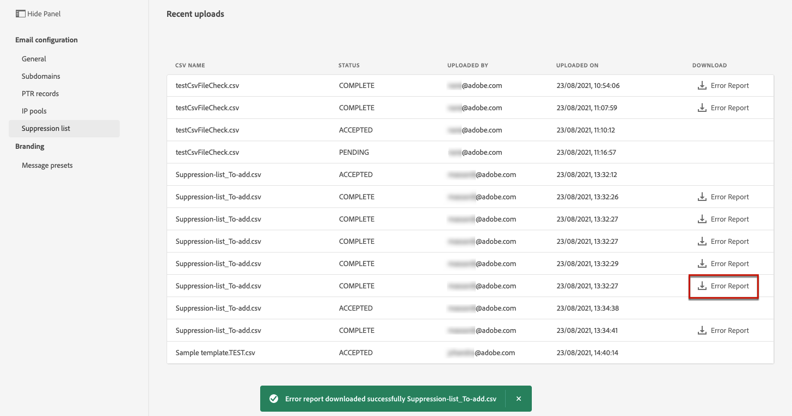

# 管理抑制列表 {#manage-suppression-list}

通过[!DNL Journey Optimizer]，您可以监控历程中自动排除的所有电子邮件地址，例如：

* 无效的地址（硬退回）。
* 始终软退回的地址，如果您继续将这些地址包含在投放中，则这些地址可能会对您的电子邮件声誉造成不利影响。
* 针对您的某封电子邮件发出某种垃圾邮件投诉的收件人。

此类电子邮件地址会自动收集到Journey Optimizer **抑制列表**&#x200B;中。 在[此部分](../suppression-list.md)中了解详情。

## 访问禁止列表 {#access-suppression-list}

要访问排除的电子邮件地址的详细列表，请打开&#x200B;**[!UICONTROL Channels]** > **[!UICONTROL Email configuration]** > **[!UICONTROL General]**&#x200B;菜单，然后单击&#x200B;**[!UICONTROL View suppression lists]**&#x200B;链接。


<!--To access the detailed list of excluded email addresses, go to **[!UICONTROL Administration]** > **[!UICONTROL Channels]** > **[!UICONTROL Email configuration]**, and select **[!UICONTROL Suppression list]**.
You can also display the suppression list content using the **[!UICONTROL View suppression list]** link through the **[!UICONTROL Channels]** > **[!UICONTROL Email configuration]** > **[!UICONTROL General]** menu, but this view does not allow you to edit the list.

-->

过滤器可帮助您浏览列表。


<!--

You can filter on the **[!UICONTROL Suppression category]**, **[!UICONTROL Address type]**, or **[!UICONTROL Reason]**. Select the option(s) of your choice for each criterion.


Once selected, you can clear each filter or all filters displayed on top of the list.-->

## 抑制类别和原因 {#suppression-categories-and-reasons}

当邮件无法发送到某个电子邮件地址时， [!DNL Journey Optimizer]会确定投放失败的原因，并将其与&#x200B;**[!UICONTROL Suppression category]**&#x200B;相关联。

抑制类别如下：

* **硬**:该电子邮件地址会立即发送到禁止列表。

   >[!NOTE]
   >
   >如果错误是垃圾邮件投诉的结果，它也属于&#x200B;**Hard**&#x200B;类别。 发出投诉的收件人的电子邮件地址会立即发送到制止名单。

* **软**:当错误计数达到限制阈值时，软错误会向抑制列表发送地址。[了解有关重试的更多信息](retries.md)

   <!--
    **Ignored**:
    * When the error occurred for a valid email address but is known to be temporary, such as a failed connection attempt or a temporary technical issue, the email address is added to the suppression list once the error counter reaches the limit threshold. [Learn more on retries](retries.md).
    * When the error is the result of a spam complaint, the email address of the recipient who issued the complaint is immediately sent to the suppression list.
    -->

* **手动**:您还可以手动将电子邮件地址或域添加到禁止列表。[了解详情](#add-addresses-and-domains)

>[!NOTE]
>
>在[投放失败类型](../suppression-list.md#delivery-failures)部分中了解有关软退回和硬退回的更多信息。

对于列出的每个电子邮件地址，您还可以检查&#x200B;**[!UICONTROL Type]**（电子邮件或域名）、**[!UICONTROL Reason]**&#x200B;以排除它、添加者以及添加到禁止列表的日期/时间。

<!---->

投放失败可能的原因有：

| 原因 | 描述 | 抑制类别 |
| --- | --- | --- |
| **[!UICONTROL Invalid Recipient]** | 收件人无效或不存在。 | 硬 |
| **[!UICONTROL Soft Bounce]** | 消息软退件的原因不是此表中列出的软错误，例如，在通过ISP建议的允许速率发送时。 | 柔和 |
| **[!UICONTROL DNS Failure]** | 由于DNS失败而退回消息。 | 柔和 |
| **[!UICONTROL Mailbox Full]** | 由于收件人的邮箱已满，无法接受更多邮件，邮件已退回。 | 柔和 |
| **[!UICONTROL Relaying Denied]** | 由于不允许中继，因此接收器阻止了该消息。 | 柔和 |
| **[!UICONTROL Challenge-Response]** | 这是一个挑战 — 响应调查。 | 柔和 |

>[!NOTE]
>
>未订阅用户未收到来自[!DNL Journey Optimizer]的电子邮件，因此其电子邮件地址无法发送到抑制列表。 他们的选择在Experience Platform级别处理。 了解有关[opting-out](../consent.md)的更多信息。

<!--
Removed from the table provided by SparkPost/Momentum:
| **[!UICONTROL Undetermined]** | The bounce reason received from the recipient domain Message Transfer Agent (MTA) could not be identified. | Ignored |
| **[!UICONTROL Too Large]** | The message bounced because it was too large for the recipient. [Retries](retries.md) will be performed: you can edit the message size and re-inject it for delivery. | Ignored |
| **[!UICONTROL Timeout]** | The message timed out, meaning it soft bounced and reached the message retry limit (3.5 days). | Ignored |
| **[!UICONTROL Admin Failure]** | The message was failed according to the policies configured by the sending system administrator. ///For example, if emails are blackholed at the global, domain or binding level using the "blackhole" directive, this bounce code is used. | Ignored |
| **[!UICONTROL Generic Bounce: No RCPT]** | No recipient could be determined for the message. | Ignored |
| **[!UICONTROL Generic Bounce]** | The message failed for unspecified reasons. | Ignored |
| **[!UICONTROL Mail Block]** | The message was blocked by the receiver (i.e. recipient MTA). | Ignored |
| **[!UICONTROL Spam Block]** | The message was blocked by the receiver as coming from a known spam source. It could be a sending IP block for example. | Ignored |
| **[!UICONTROL Spam Content]** | The message content was blocked by the receiver (recipient MTA) as spam. | Ignored |
| **[!UICONTROL Prohibited Attachment]** | The message was blocked by the receiver because it contained an attachment. | Ignored |
| **[!UICONTROL Auto-Reply]** | The message is an auto-reply/vacation mail. | Ignored |
| **[!UICONTROL Transient Failure]** | Message transmission has been temporarily delayed. | Ignored |
| **[!UICONTROL Subscribe]** | The message is a subscribe request. | Ignored |
| **[!UICONTROL Unsubscribe]** | The message is an unsubscribe request. | Hard |
-->

<!--Note to add eventually: If a user is subscribed and [!DNL Journey Optimizer] fails to send emails to their subscribed email address, they will get added to the suppression list. (not sure it's possible to subscribe through AJO or need to find reference to Experience Platform doc?)-->

<!--## Manually add addresses and domains {#add-addresses-and-domains}

When a message fails to be delivered to an email address, this address is automatically added to the suppression list based on the defined suppression rule or bounce count.

However, you can also manually populate the [!DNL Journey Optimizer] suppression list to exclude specific email addresses and/or domains from your sending.

You may add email addresses or domains [one at a time](#add-one-address-or-domain), or [in bulk mode](#upload-csv-file) through a CSV file upload.

To do this, select the **[!UICONTROL Add email or domain]** button, then follow one of the methods below.


### Add one address or domain {#add-one-address-or-domain}

1. Select the **[!UICONTROL One by one]** option.

    

1. Choose the address type: **[!UICONTROL Email address]** or **[!UICONTROL Domain address]**.

1. Enter the email address or domain you want to exclude from your sending.

    >[!NOTE]
    >
    >Make sure you enter a valid email address (such as abc@company) or domain (such as abc.company.com).

1. Specify a reason if needed.

1. Click **[!UICONTROL Submit]**.

### Upload a CSV file {#upload-csv-file}

1. Select the **[!UICONTROL Upload CSV]** option.

    

1. Download the CSV template to use, which includes the columns and format below:

    ```
    TYPE,VALUE,COMMENT
    EMAIL,abc@somedomain.com,Comment
    DOMAIN,somedomain.com,Comment
    ```
    You can also download this template from the **[!UICONTROL Suppression list]** main view.

    >[!CAUTION]
    >
    >Do not change the names of the columns in the CSV template.
    >
    >The file size should not exceed 50 MB.

1. Fill in the CSV template with the email addresses and/or domains you want to add to the suppression list.

1. Once completed, drag and drop your CSV file, then click **[!UICONTROL Upload file]**.

    

1. Click **[!UICONTROL Submit]**.

### Check recent uploads status {#recent-uploads}

You can check the list of the latest CSV files you uploaded.

To do this, from the **[!UICONTROL Suppression list]** view, click the **[!UICONTROL Recent uploads]** button.


The latest uploads you submitted and their corresponding statuses are displayed.

If an error report is associated with a file, you can download it to check the errors encountered.



Below is an example of the type of entries you can find in the error report:

```
type,value,comments,failureReason
Email,examplemail.com,MANUAL,Invalid format for value: examplemail.com
Email,examplemail,MANUAL,Invalid format for value: examplemail
Email,example@mail,MANUAL,Invalid format for value: example@mail
Domain,example,MANUAL,Invalid format for value: example
Domain,example.!com,MANUAL,Invalid format for value: example.!com
Domain,!examplecom,MANUAL,Invalid format for value: !examplecom
```

-->


