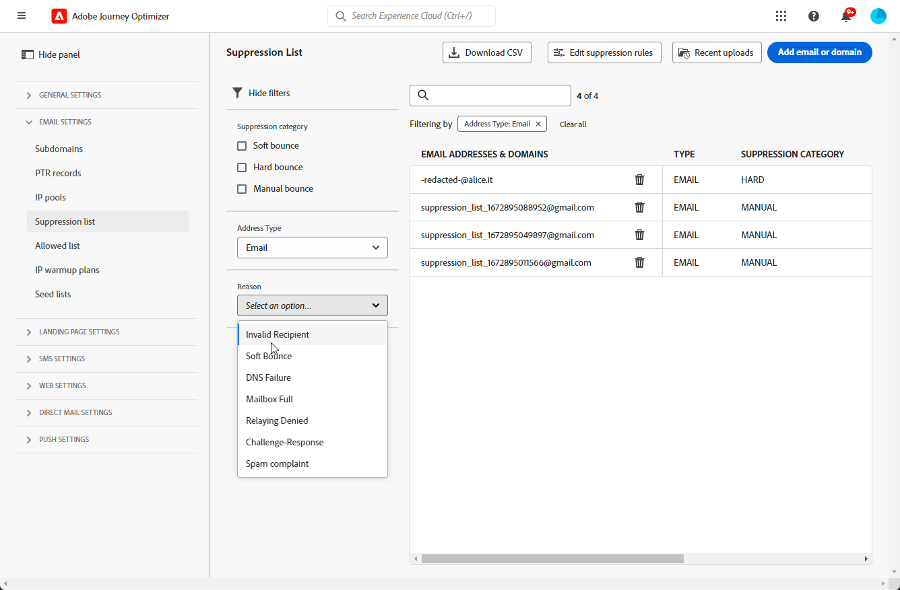

# 管理禁止列表 {#manage-suppression-list}

通过[!DNL Journey Optimizer]，您可以监控在历程或营销活动中自动排除的所有电子邮件地址，例如硬退回、软退回和垃圾邮件投诉。

此类电子邮件地址会自动收集到Journey Optimizer **禁止显示列表**&#x200B;中。 禁止显示列表包含要从受众中排除的地址和域。 它在一个客户端环境中收集所有邮件中禁止显示的电子邮件地址和域，这意味着特定于与沙盒ID关联的组织ID。

在[本节](../reports/suppression-list.md)中了解有关禁止列表概念和使用情况的更多信息。

>[!NOTE]
>
>Adobe会保留已证明对参与和邮件信誉有害的已知错误地址的更新列表，并确保不会向他们发送电子邮件。 在所有 Adobe 客户共有的一个全局禁止列表中管理此列表。全局禁止列表中包含的地址和域名被隐藏起来。在投递报告中仅指示被排除的收件人数量。

此外，您还可以利用Journey Optimizer **禁止显示REST API**，使用禁止显示和允许列表控制传出消息。 [了解如何使用禁止 REST API](https://developer.adobe.com/journey-optimizer-apis/references/suppression/){target="_blank"}

## 访问禁止显示列表 {#access-suppression-list}

要访问排除的电子邮件地址和域的详细列表，请浏览到&#x200B;**[!UICONTROL 管理]** > **[!UICONTROL 渠道]** > **[!UICONTROL 电子邮件设置]**，然后选择&#x200B;**[!UICONTROL 禁止显示列表]**。


>[!CAUTION]
>
>查看、导出和管理禁止列表的权限仅限于[历程管理员](../administration/ootb-product-profiles.md#journey-administrator)。 在[本节](../administration/permissions-overview.md)中了解有关管理[!DNL Journey Optimizer]用户访问权限的更多信息。


其中提供过滤器以帮助您浏览列表。


您可以筛选&#x200B;**[!UICONTROL 禁止显示类别]**、**[!UICONTROL 地址类型]**&#x200B;或&#x200B;**[!UICONTROL 原因]**。 为每个条件选择一个或多个选项。 选择后，您可以清除显示在列表顶部的每个过滤器或所有过滤器。




## 了解失败原因 {#suppression-categories-and-reasons}

当邮件无法传递到电子邮件地址时，[!DNL Journey Optimizer]将确定传递失败的原因，并将其与&#x200B;**[!UICONTROL 禁止显示类别]**&#x200B;相关联。

隐藏类别如下所示：

* **Hard**：硬退回表示电子邮件地址无效（即不存在电子邮件地址）。 这涉及到来自接收电子邮件服务器的退回消息，该消息明确指出地址无效。 该电子邮件地址会立即发送到禁止显示列表。

  如果错误是垃圾邮件投诉的结果，则它也属于&#x200B;**Hard**&#x200B;类别。 发出投诉的收件人的电子邮件地址将立即发送到禁止列表。

* **Soft**：软退回是有效电子邮件地址发生的临时电子邮件退回。 重试几次后，电子邮件地址会添加到禁止显示列表中。 一旦错误计数器达到限制阈值，软错误会向禁止列表发送地址。 [了解有关重试的详细信息](retries.md)

* **手动**：手动错误已手动添加到禁止显示列表。 [了解详情](#add-addresses-and-domains)

对于列出的每个电子邮件地址，您还可以检查&#x200B;**[!UICONTROL Type]**（电子邮件或域）、**[!UICONTROL Reason]**&#x200B;是否将其排除、添加者以及将其添加到禁止显示列表的日期/时间。

投放失败的可能原因包括：

| 原因 | 描述 | 类别 |
| --- | --- | --- |
| **[!UICONTROL 无效的收件人]** | 收件人无效或不存在。 | 硬 |
| **[!UICONTROL 软退回]** | 消息因本表中列出的软错误以外的其他原因软退回，例如当超出ISP建议的允许速率发送时。 | 软 |
| **[!UICONTROL DNS失败]** | 由于DNS故障，消息已退回。 | 软 |
| **[!UICONTROL 邮箱已满]** | 由于收件人的邮箱已满且无法接受更多邮件，邮件已退回。 | 软 |
| **[!UICONTROL 中继被拒绝]** | 由于不允许中继，消息被接收器阻止。 | 软 |
| **[!UICONTROL 挑战 — 回应]** | 消息是质询 — 响应探测器。 | 软 |
| **[!UICONTROL 垃圾邮件投诉]** | 邮件被阻止，因为收件人将其标记为垃圾邮件。 | 硬 |

>[!NOTE]
>
>取消订阅的用户没有收到来自[!DNL Journey Optimizer]的电子邮件，因此其电子邮件地址无法发送到禁止列表。 他们的选择在Experience Platform级别处理。 [了解有关选择退出的更多信息](../privacy/opt-out.md)


### 禁止显示规则  {#suppression-rules}

在&#x200B;**[!UICONTROL 禁止列表]**&#x200B;视图中，您还可以从&#x200B;**[!UICONTROL 编辑禁止显示规则]**&#x200B;按钮中编辑与禁止显示规则关联的重试参数。 使用此选项可更新当前沙盒的重试阈值。 [了解有关重试的详细信息](retries.md)。


## 将地址和域添加到禁止列表{#add-addresses-and-domains}

>[!CONTEXTUALHELP]
>id="ajo_admin_suppression_list_header"
>title="将电子邮件或域添加到禁止列表"
>abstract="您可以手动填充 Journey Optimizer 禁止列表，以便在发送时排除特定的电子邮件地址和/或域。"

>[!CONTEXTUALHELP]
>id="ajo_admin_suppression_list"
>title="将电子邮件或域添加到禁止列表"
>abstract="要填充禁止列表，您可以手动添加电子邮件地址或域：可以逐个添加，也可以通过 CSV 文件上传来批量添加。在您发送电子邮件时将排除这些特定的电子邮件地址和/或域。"

当消息无法发送到电子邮件地址时，该地址会根据定义的禁止显示规则或退回计数自动添加到禁止显示列表中。

但是，您也可以手动填充[!DNL Journey Optimizer]禁止显示列表，以从发送中排除特定的电子邮件地址和/或域。

>[!NOTE]
>
>[!DNL Journey Optimizer]最多可能需要60分钟才能考虑传出电子邮件中禁止显示的地址。

可[一次一个地](#add-one-address-or-domain)或通过上传 CSV 文件[以批量方式](#upload-csv-file)添加电子邮件地址或域。

### 添加一个地址或域 {#add-one-address-or-domain}

>[!CONTEXTUALHELP]
>id="ajo_admin_suppression_list_address"
>title="添加一项到禁止列表"
>abstract="您可以逐个添加电子邮件地址和/或域来填充禁止列表。"

要将电子邮件地址或域添加到禁止显示列表，请执行以下步骤：

1. 选择&#x200B;**[!UICONTROL 添加电子邮件或域]**&#x200B;按钮。

   

1. 选择&#x200B;**[!UICONTROL One x]**&#x200B;选项。

   

1. 选择地址类型： **[!UICONTROL 电子邮件]**&#x200B;或&#x200B;**[!UICONTROL 域]**。

1. 输入您要从发送中排除的电子邮件地址或域。

   >[!NOTE]
   >
   >确保输入有效的电子邮件地址（例如 abc@company.com）或域（例如 abc.company.com）。

1. （可选）输入原因。 此字段允许包含32到126之间的所有ASCII可打印字符。

1. 使用&#x200B;**[!UICONTROL 提交]**&#x200B;按钮确认。

### 上传 CSV 文件 {#upload-csv-file}

>[!CONTEXTUALHELP]
>id="ajo_admin_suppression_list_csv"
>title="上传 CSV 以添加多项到禁止列表"
>abstract="您可以通过上传已填写要排除的电子邮件地址/域的 CSV 文件来填充禁止列表。"

要向禁止显示列表添加一组电子邮件地址或域，请执行以下步骤：

1. 选择&#x200B;**[!UICONTROL 添加电子邮件或域]**&#x200B;按钮。
1. 选择&#x200B;**[!UICONTROL 上传CSV]**&#x200B;选项。

   

1. 下载要使用的 CSV 模板，该模板包括以下列和格式：

   ```
   TYPE,VALUE,COMMENT
   EMAIL,abc@somedomain.com,Comment
   DOMAIN,somedomain.com,Comment
   ```

1. 在CSV模板中填写要添加到禁止显示列表的电子邮件地址和/或域。 在&#x200B;**COMMENT**&#x200B;列中允许包含32到126之间的所有ASCII可打印字符。

   >[!CAUTION]
   >
   >请勿更改CSV模板中列的名称。
   >
   >文件大小不应超过 1 MB。
   >

1. 完成后，拖放您的CSV文件，并使用&#x200B;**[!UICONTROL 提交]**&#x200B;按钮进行确认。

   

上传完成后，您可以通过[最近上传](#recent-uploads)按钮检查其状态，如下所述。

### 检查上传状态 {#recent-uploads}

使用&#x200B;**[!UICONTROL 最近上传]**&#x200B;按钮检查最新上传CSV文件的状态。


可能的状态是：

* **[!UICONTROL 待处理]**：正在处理文件上传。
* **[!UICONTROL 错误]**：由于技术问题或文件格式错误，文件上传过程失败。
* **[!UICONTROL 完成]**：成功完成了文件上传过程。

在上传期间，如果某些地址的格式不正确，则不会将其添加到[!DNL Journey Optimizer]禁止显示列表中。

在这种情况下，当上传完毕后，它与某个报告关联。您可以下载它以检查遇到的错误<!-- and understand why they were not added to the suppression list-->。


下面是您可以在错误报表中找到的条目类型示例：

```
type,value,comments,failureReason
Email,examplemail.com,MANUAL,Invalid format for value: examplemail.com
Email,examplemail,MANUAL,Invalid format for value: examplemail
Email,example@mail,MANUAL,Invalid format for value: example@mail
Domain,example,MANUAL,Invalid format for value: example
Domain,example.!com,MANUAL,Invalid format for value: example.!com
Domain,!examplecom,MANUAL,Invalid format for value: !examplecom
```

## 从禁止显示列表中删除地址{#remove-from-suppression-list}

您可以手动更新禁止显示列表。 从隔离中删除电子邮件地址是一项敏感操作，可能会影响您的IP信誉和投放率。 请务必谨慎操作。

从禁止显示列表中删除电子邮件地址或域时，Adobe Journey Optimizer可以再次开始传送到此地址或域。  在[本节](../reports/deliverability.md)中了解有关可投放性的更多信息。

若要从禁止显示列表中删除地址，请使用&#x200B;**[!UICONTROL 删除]**&#x200B;按钮。


>[!NOTE]
>
>考虑删除任何电子邮件地址或域时，请格外小心。 如有任何疑问，请联系可投放性专家。

例如，在互联网服务提供商(ISP)中断的情况下，电子邮件被错误地标记为硬退回，因为它们无法成功传递给收件人。 必须从禁止显示列表中删除这些电子邮件地址。

要检索这些地址，请根据中断的上下文运行带有自定义参数的特定查询。 [在此示例中了解详情](../data/datasets-query-examples.md#isp-outage-query)。

确定受影响的电子邮件地址后，请筛选隐藏列表以显示它们。 例如，如果&#x200B;**test.com**&#x200B;域上的ISP中断发生在2022年11月11日至2022年11月13日，请过滤该时间范围内添加到禁止列表的地址，如下所示：

然后，可以使用&#x200B;**[!UICONTROL 删除]**&#x200B;按钮从禁止显示列表中删除隔离的电子邮件地址。

## 下载禁止列表 {#download-suppression-list}

<!--
>[!CONTEXTUALHELP]
>id="ajo_admin_suppression_list_download"
>title="Export the list as a CSV file"
>abstract="To download the suppression list, Qou can either export the current list by generating a new file, or download the file that was previously generated."
-->

要将禁止列表导出为CSV文件，请执行以下步骤：

1. 选择&#x200B;**[!UICONTROL 下载CSV]**&#x200B;按钮。

   

1. 等待文件生成。

   >[!NOTE]
   >
   >下载时间取决于文件大小，即禁止列表上的地址数。
   >
   >对于给定的沙盒，一次可处理一个下载请求。

1. 文件生成后，您将收到通知。 单击屏幕右上方的铃铛图标可显示铃铛图标。

1. 单击通知本身以下载文件。

   

   >[!NOTE]
   >
   >该链接的有效期限为24小时。

<!--When downloading the CSV file, you can choose to either:

* Download the file that was previously generated by another user or yourself.

* Generate a new file in order to export the current suppression list.-->