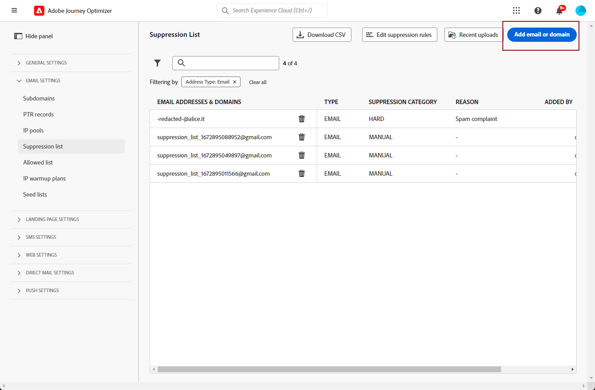
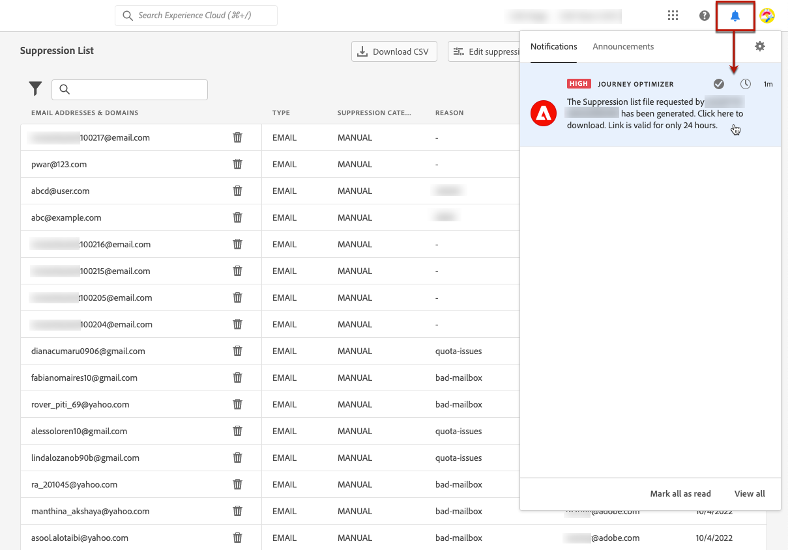

# 管理抑制列表 {#manage-suppression-list}

使用 [!DNL Journey Optimizer]，则可以监控在历程或营销策划中自动排除的所有电子邮件地址，例如硬退回、软退回和垃圾邮件投诉。

此类电子邮件地址会自动收集到Journey Optimizer中 **抑制列表**. 抑制列表包含要从受众中排除的地址和域。 它会收集在单个客户端环境中禁止所有邮件的电子邮件地址和域，即特定于与沙盒ID关联的组织ID。

了解有关抑制列表概念和在 [此部分](../reports/suppression-list.md).


## 访问禁止列表 {#access-suppression-list}

要访问排除的电子邮件地址和域的详细列表，请浏览 **[!UICONTROL 管理]** > **[!UICONTROL 渠道]** > **[!UICONTROL 电子邮件配置]**，然后选择 **[!UICONTROL 禁止列表]**.


>[!CAUTION]
>
>查看、导出和管理抑制列表的权限限制为 [历程管理员](../administration/ootb-product-profiles.md#journey-administrator). 了解有关管理的更多信息 [!DNL Journey Optimizer] 用户在 [此部分](../administration/permissions-overview.md).


其中提供过滤器以帮助您浏览列表。


您可以在 **[!UICONTROL 抑制类别]**, **[!UICONTROL 地址类型]**&#x200B;或 **[!UICONTROL 原因]**. 为每个条件选择一个或多个选项。 选择后，您可以清除每个过滤器或列表顶部显示的所有过滤器。


## 了解失败原因 {#suppression-categories-and-reasons}

当邮件无法发送到电子邮件地址时， [!DNL Journey Optimizer] 确定投放失败的原因，并将其与 **[!UICONTROL 抑制类别]**.

抑制类别如下：

* **硬**:硬退回表示电子邮件地址无效（即电子邮件地址不存在）。 这涉及从接收电子邮件服务器发出的退回消息，该消息明确声明地址无效。 该电子邮件地址会立即发送到禁止列表。

   当错误是垃圾邮件投诉的结果时，也会出现 **硬** 类别。 发出投诉的收件人的电子邮件地址会立即发送到制止名单。

* **柔和**:软退回是针对有效电子邮件地址发生的临时电子邮件退回。 多次重试后，电子邮件地址会添加到抑制列表。 当错误计数达到限制阈值时，软错误会向抑制列表发送地址。 [了解有关重试的更多信息](retries.md)

* **手动**:手动错误已被手动添加到禁止列表。 [了解详情](#add-addresses-and-domains)

对于列出的每个电子邮件地址，您还可以检查 **[!UICONTROL 类型]** （电子邮件或域）、 **[!UICONTROL 原因]** ，以及将其添加到禁止列表的日期/时间。


投放失败的可能原因包括：

| 原因 | 描述 | 类别 |
| --- | --- | --- |
| **[!UICONTROL 收件人无效]** | 收件人无效或不存在。 | 硬 |
| **[!UICONTROL 软退回]** | 消息软退件的原因不是此表中列出的软错误，例如，在通过ISP建议的允许速率发送时。 | 柔和 |
| **[!UICONTROL DNS失败]** | 由于DNS失败而退回消息。 | 柔和 |
| **[!UICONTROL 邮箱已满]** | 由于收件人的邮箱已满，无法接受更多邮件，邮件已退回。 | 柔和 |
| **[!UICONTROL 拒绝中继]** | 由于不允许中继，因此接收器阻止了该消息。 | 柔和 |
| **[!UICONTROL 挑战 — 响应]** | 这是一个挑战 — 响应调查。 | 柔和 |
| **[!UICONTROL 垃圾邮件投诉]** | 由于收件人标记为垃圾邮件，因此阻止了消息。 | 硬 |

>[!NOTE]
>
>未订阅用户不会接收来自 [!DNL Journey Optimizer]，因此其电子邮件地址无法发送到抑制列表。 他们的选择在Experience Platform级别处理。 [了解有关选择退出的更多信息](../privacy/opt-out.md)


### 抑制规则  {#suppression-rules}

从 **[!UICONTROL 禁止列表]** 视图中，您还可以在 **[!UICONTROL 编辑隐藏规则]** 按钮。 使用此选项可更新当前沙盒的重试阈值。 [了解有关重试的更多信息](retries.md).


## 将地址和域添加到禁止列表{#add-addresses-and-domains}

>[!CONTEXTUALHELP]
>id="ajo_admin_suppression_list_header"
>title="将电子邮件或域添加到禁止列表"
>abstract="您可以手动填充 Journey Optimizer 禁止列表，以便在发送时排除特定的电子邮件地址和/或域。"

>[!CONTEXTUALHELP]
>id="ajo_admin_suppression_list"
>title="将电子邮件或域添加到禁止列表"
>abstract="要填充禁止列表，您可以手动添加电子邮件地址或域：可以逐个添加，也可以通过 CSV 文件上传来批量添加。在您发送电子邮件时将排除这些特定的电子邮件地址和/或域。"

当消息无法发送到电子邮件地址时，此地址会根据定义的禁止规则或退回计数自动添加到禁止列表中。

但是，您也可以手动填充 [!DNL Journey Optimizer] 用于从发送中排除特定电子邮件地址和/或域的禁止列表。

>[!NOTE]
>
>最长可能需要60分钟 [!DNL Journey Optimizer] 考虑外发电子邮件中禁止使用的地址。

可[一次一个地](#add-one-address-or-domain)或通过上传 CSV 文件[以批量方式](#upload-csv-file)添加电子邮件地址或域。

### 添加一个地址或域 {#add-one-address-or-domain}

>[!CONTEXTUALHELP]
>id="ajo_admin_suppression_list_address"
>title="添加一项到禁止列表"
>abstract="您可以逐个添加电子邮件地址和/或域来填充禁止列表。"

要向抑制列表添加电子邮件地址或域，请执行以下步骤：

1. 选择 **[!UICONTROL 添加电子邮件或域]** 按钮。

   

1. 选择 **[!UICONTROL 一个一个]** 选项。

   

1. 选择地址类型： **[!UICONTROL 电子邮件]** 或 **[!UICONTROL 域]**.

1. 输入您要从发送中排除的电子邮件地址或域。

   >[!NOTE]
   >
   >确保输入有效的电子邮件地址（例如 abc@company.com）或域（例如 abc.company.com）。

1. （可选）输入原因。 在此字段中允许使用值为 32 至 126 的所有 ASCII 可打印字符。

1. 使用 **[!UICONTROL 提交]** 按钮进行确认。

### 上传 CSV 文件 {#upload-csv-file}

>[!CONTEXTUALHELP]
>id="ajo_admin_suppression_list_csv"
>title="上传 CSV 以添加多项到禁止列表"
>abstract="您可以通过上传已填写要排除的电子邮件地址/域的 CSV 文件来填充禁止列表。"

要向抑制列表添加一组电子邮件地址或域，请执行以下步骤：

1. 选择 **[!UICONTROL 添加电子邮件或域]** 按钮。
1. 选择 **[!UICONTROL 上传CSV]** 选项。

   

1. 下载要使用的 CSV 模板，该模板包括以下列和格式：

   ```
   TYPE,VALUE,COMMENT
   EMAIL,abc@somedomain.com,Comment
   DOMAIN,somedomain.com,Comment
   ```

1. 在CSV模板中填写要添加到禁止列表的电子邮件地址和/或域。 在 **注释** 列。

   >[!CAUTION]
   >
   >请勿更改CSV模板中列的名称。
   >
   >文件大小不应超过 1 MB。

1. 完成后，拖放CSV文件，然后使用 **[!UICONTROL 提交]** 按钮进行确认。

   

上传完成后，您可以从 [最近上传](#recent-uploads) 按钮来访问Advertising Cloud的帮助。

### 检查上传状态 {#recent-uploads}

使用 **[!UICONTROL 最近上传]** 按钮以检查最新上传的CSV文件的状态。


可能的状态是：

* **[!UICONTROL 待定]**：正在处理文件上传。
* **[!UICONTROL 错误]**：由于技术问题或文件格式错误，文件上传过程失败。
* **[!UICONTROL 完成]**：成功完成了文件上传过程。

在上传期间，如果某些地址的格式不正确，则它们不会添加到 [!DNL Journey Optimizer] 隐藏列表。

在这种情况下，当上传完毕后，它与某个报告关联。您可以下载它以检查遇到的错误<!-- and understand why they were not added to the suppression list-->.


下面是可在错误报表中找到的条目类型示例：

```
type,value,comments,failureReason
Email,examplemail.com,MANUAL,Invalid format for value: examplemail.com
Email,examplemail,MANUAL,Invalid format for value: examplemail
Email,example@mail,MANUAL,Invalid format for value: example@mail
Domain,example,MANUAL,Invalid format for value: example
Domain,example.!com,MANUAL,Invalid format for value: example.!com
Domain,!examplecom,MANUAL,Invalid format for value: !examplecom
```

## 从禁止列表中删除地址{#remove-from-suppression-list}

您可以手动更新隐藏列表。 从隔离中删除电子邮件地址是一项敏感操作，会影响IP信誉和投放能力率。 请务必谨慎继续。

从禁止列表中删除电子邮件地址或域时，Adobe Journey Optimizer可以再次开始投放到此地址或域。  在中了解有关投放能力的更多信息 [此部分](../reports/deliverability.md).

要从禁止列表中删除地址，请使用 **[!UICONTROL 删除]** 按钮。


>[!NOTE]
>
>考虑删除任何电子邮件地址或域名时，请格外小心。 如有疑问，请联系可投放性专家。

例如，在互联网服务提供商(ISP)中断的情况下，电子邮件错误地标记为硬退回，因为它们无法成功发送给收件人。 必须从禁止列表中删除这些电子邮件地址。

要检索这些地址，请根据中断的上下文，使用自定义参数运行特定查询。 [在此示例中了解更多信息](../data/datasets-query-examples.md#isp-outage-query).

识别受影响的电子邮件地址后，过滤抑制列表以显示它们。 例如，如果2022年11月11日至2022年11月13日发生ISP中断， **test.com** 域中，过滤在该时间范围内添加到抑制列表的地址，如下所示：


然后，您可以使用 **[!UICONTROL 删除]** 按钮。

## 下载抑制列表 {#download-suppression-list}

<!--
>[!CONTEXTUALHELP]
>id="ajo_admin_suppression_list_download"
>title="Export the list as a CSV file"
>abstract="To download the suppression list, Qou can either export the current list by generating a new file, or download the file that was previously generated."
-->

要将禁止列表导出为CSV文件，请执行以下步骤：

1. 选择 **[!UICONTROL 下载CSV]** 按钮。

   

1. 等待文件生成。

   

   >[!NOTE]
   >
   >下载时间取决于文件大小，即禁止列表上的地址数。
   >
   >一次可以针对给定的沙盒处理一个下载请求。

1. 生成文件后，您会收到通知。 单击屏幕右上方的铃铛图标以显示它。

1. 单击通知本身以下载文件。

   

   >[!NOTE]
   >
   >该链接的有效期为24小时。

<!--When downloading the CSV file, you can choose to either:

* Download the file that was previously generated by another user or yourself.

* Generate a new file in order to export the current suppression list.-->