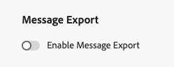

# 导出消息内容 {#message-export}

>[!CONTEXTUALHELP]
>id="ajo_admin_msg_export"
>title="保留和导出您发送的内容"
>abstract="选择此选项允许您使用此配置将已发送电子邮件或短信消息的内容写入[!DNL Experience Platform]数据集。 记录会自摄取后保留7天，在此期间您可以将它们导出到自己的存储中。"

>[!AVAILABILITY]
>
>此功能仅适用于电子邮件和短信渠道，以及购买了Message Export附加产品的组织。 有关更多信息，请与您的 Adobe 代表联系。

**消息导出**&#x200B;允许您通过[!DNL Journey Optimizer]目标将已发送的电子邮件和短信消息内容从[!DNL Adobe Experience Platform]传输到您自己的存储空间，这样您就可以将数据从[!DNL Experience Platform]传输到外部端点。 [了解详情](https://experienceleague.adobe.com/zh-hans/docs/experience-platform/destinations/home){target="_blank"}

使用此功能，通过[!DNL Journey Optimizer]发送的已标记为导出的电子邮件和短信消息的内容将写入[!DNL Experience Platform] **AJO消息导出数据集**。 [了解有关数据集的更多信息](../data/get-started-datasets.md)

然后，记录会在数据集中保留七个日历天（从摄取开始），在此期间，您可以将它们导出到您选择的外部系统。

## 护栏

* 此功能仅支持&#x200B;**电子邮件**&#x200B;和&#x200B;**短信**&#x200B;渠道。
* AJO消息导出数据集中的记录从引入&#x200B;**起保留**&#x200B;七个日历日。
* 在启用邮件导出之前发送的邮件不支持回填，如下所述。

## 启用消息导出 {#enable-message-export}

报文导出功能的载入流程包括两个步骤：

1. [在](#set-up-export-dataflow)中设置导出数据流[!DNL Experience Platform]；
1. 在[中的通道配置上](#config-message-export)启用消息导出[!DNL Journey Optimizer]。

>[!WARNING]
>
>只有启用导出和发送消息后才会显示新记录。 不支持在设置导出流程和启用导出消息选项之前回填内容。

### 设置导出数据流 {#set-up-export-dataflow}

在能够导出数据之前，您必须通过定义[!DNL Experience Platform]目标和将使用的数据集来设置导出过程。 请按照以下步骤操作。

>[!NOTE]
>
>必须为每个沙盒配置此设置。

1. 选择Experience Platform [目标类型](https://experienceleague.adobe.com/zh-hans/docs/experience-platform/destinations/destination-types){target="_blank"}。 [此页面](https://experienceleague.adobe.com/zh-hans/docs/experience-platform/destinations/catalog/overview){target="_blank"}上提供了准备好接收数据的可用目标平台列表。

1. 在[!DNL Experience Platform]中，通过定义凭据、存储桶/容器、路径前缀和安全选项来配置您的目标。 [了解如何操作](https://experienceleague.adobe.com/zh-hans/docs/experience-platform/destinations/ui/activate/export-datasets){target="_blank"}

1. 使用以下数据创建数据集导出流：

   * Source数据集：选择&#x200B;**AJO消息导出数据集**。
   * 文件格式：选择JSON或Parquet（根据下游工具选择一种格式）。
   * 计划：确保在7天保留期内运行。

### 在渠道配置中启用消息导出 {#config-message-export}

要将消息导出应用于营销活动和历程，必须在渠道配置级别启用专用选项。 请按照以下步骤操作。

1. 在[!DNL Journey Optimizer]中，编辑或创建所需的电子邮件或短信[渠道配置](channel-surfaces.md#create-channel-surface)。

1. 选择&#x200B;**[!UICONTROL 启用消息导出]**&#x200B;选项。

   

1. 保存更改并提交渠道配置。

使用此渠道配置通过营销活动或历程发送消息后，电子邮件和短信消息将写入&#x200B;**AJO消息导出数据集**。 然后，您可以[访问数据集中的记录](#access-exported-data)，并根据您定义的导出数据流将它们导出到您选定的存储目标。

>[!NOTE]
>
>禁用&#x200B;**[!UICONTROL 启用消息导出]**&#x200B;切换可阻止将此渠道配置的新记录引入数据集。 现有记录会一直保留，直到保留期到期。

## 访问导出的报文数据 {#access-exported-data}

使用启用了消息导出的渠道配置发送消息后，您可以在&#x200B;**AJO消息导出数据集**&#x200B;中访问和查看导出的数据。

要查看导出的消息数据，请执行以下操作：

1. 在[!DNL Journey Optimizer]中，在左侧导航中导航到&#x200B;**[!UICONTROL 数据管理]** > **[!UICONTROL 数据集]**。 [了解有关数据集的更多信息](../data/get-started-datasets.md)

1. 确保显示的是系统生成的数据集。

1. 从列表中选择&#x200B;**AJO消息导出数据集**。

   

1. 在数据集详细信息页面上，单击&#x200B;**[!UICONTROL 预览数据集]**&#x200B;以查看最新记录。

   

该数据集包含通过启用了消息导出功能的渠道配置发送的每封消息的全面信息，包括：主题行、消息正文、收件人电子邮件地址或电话号码、发件人地址或电话号码、发送日期和时间、个性化数据等。

数据集中的所有记录从引入&#x200B;**起保留**&#x200B;七个日历天。 在此保留期内，您可以访问数据以进行合规性审核、法律查询，或通过配置的Experience Platform目标将其导出到您自己的存储系统。

