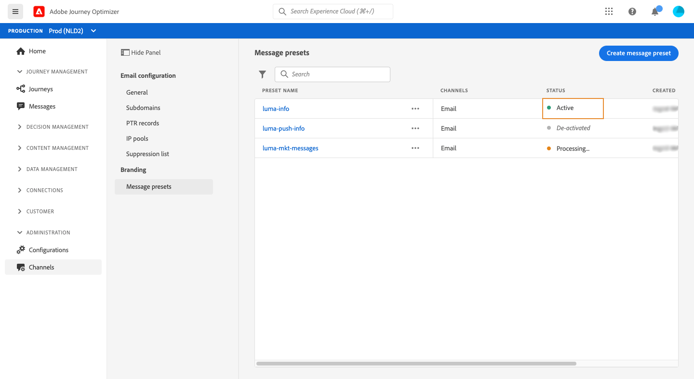

# 创建消息预设

借助[!DNL Journey Optimizer]，您可以设置消息预设，以定义电子邮件和推送通知消息（电子邮件类型、发件人电子邮件和名称、移动应用程序等）所需的所有技术参数。

您可以根据需要设置任意数量的消息预设，具体取决于您需要通信的不同品牌。

配置消息预设后，在从&#x200B;**[!UICONTROL Presets]**&#x200B;列表创建消息时，可以选择这些预设。

## 创建消息预设{#create-message-preset}

要创建消息预设，请执行以下步骤：

1. 访问&#x200B;**[!UICONTROL Channels]** / **[!UICONTROL Message presets]**&#x200B;菜单，然后单击&#x200B;**[!UICONTROL Create Message preset]**。

   

1. 为预设提供名称和描述（可选），然后指定要配置的渠道。

   

1. 配置电子邮件和推送通知设置：

   对于电子邮件渠道，指定：

   * 随预设（事务型或营销型消息）一起发送的通信类型，
   * 用于发送电子邮件的[子域](about-subdomain-delegation.md)
   * 要与预设关联的[IP池](ip-pools.md)
   * 用于使用预设发送的电子邮件的标题参数。

   

   对于推送通知渠道，指定要用于消息的IOS和/或Android移动应用程序。 有关如何配置环境以发送推送通知的更多信息，请参阅[此部分](../push-configuration.md)。

   

1. 配置完所有参数后，单击&#x200B;**[!UICONTROL Submit]**&#x200B;进行确认。 您还可以将消息预设另存为草稿，稍后恢复其配置。

   

1. 创建消息预设后，该消息预设将显示在列表中，并且状态为&#x200B;**[!UICONTROL Processing]**。

   在此步骤中，将执行多项检查，以验证是否已正确配置。 加工时间在48-72h左右，最长可达7-10天。

   这些检查包括由Adobe投放能力团队执行的投放能力测试：

   * SPF验证，
   * DKIM验证，
   * MX记录验证，
   * 检查IP阻止名单，
   * 主机检查，
   * IP池验证、
   * A/PTR记录， t/m/res子域验证。

1. 检查成功后，消息预设将获得&#x200B;**[!UICONTROL Active]**&#x200B;状态。 它已准备好用于投放消息。

   <!-- later on, users will be notified in Pulse -->

   

## 监视消息预设

所有消息预设都显示在&#x200B;**[!UICONTROL Channels]** / **[!UICONTROL Message presets]**&#x200B;菜单中。 过滤器可帮助您浏览列表（渠道类型、用户、状态）。

消息预设可以具有以下状态：

* **[!UICONTROL Draft]**:消息预设已另存为草稿，但尚未提交。打开它以恢复配置。
* **[!UICONTROL Processing]**:消息预设已提交，正在执行多个验证步骤。
* **[!UICONTROL Active]**:消息预设已验证，可选择该预设以创建消息。
* **[!UICONTROL Failed]**:在消息预设验证期间，一个或多个检查失败。
* **[!UICONTROL De-activated]**:消息预设已取消激活。它不能用于创建新消息。

## 编辑消息预设

要编辑消息预设，您首先需要取消激活该预设，以使其无法创建新消息（使用此预设发布的消息将不受影响并将继续工作）。 然后，您需要复制消息预设，以创建将用于创建新消息的新版本：

1. 访问消息预设列表，然后停用要编辑的消息预设。

   

1. 复制已取消激活的消息预设。 状态为&#x200B;**[!UICONTROL Draft]**&#x200B;的副本会自动添加到列表中。

   

1. 打开复制的消息预设，根据需要对其进行修改，然后提交更改。 消息预设将完成与创建步骤期间相同的验证周期。

1. 验证后，系统会获得&#x200B;**[!UICONTROL Active]**&#x200B;状态，并准备好用于创建新消息。

   >[!NOTE]
   >
   >无法删除已取消激活的消息预设，以避免在使用这些预设发送消息的历程中出现任何问题。