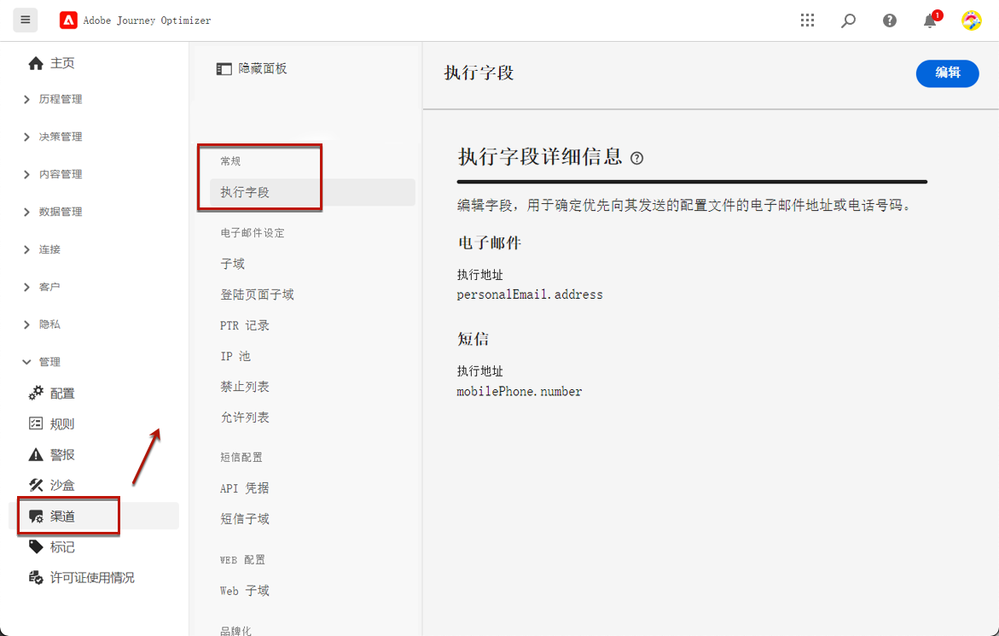

# 更改主电子邮件地址 {#change-primary-email}

>[!CONTEXTUALHELP]
>id="ajo_admin_execution_address"
>title="定义要使用的地址"
>abstract="当数据库中有多个地址（个人、专业等）可用时，您可以选择要优先发送的电子邮件地址。"

定位用户档案时，数据库中可能有多个电子邮件地址（个人、专业电子邮件地址等）。

使用 [!DNL Journey Optimizer]，您可以确定要从用户档案服务中使用的电子邮件地址，并在多个地址可用时排定优先级。 为此，请执行以下步骤：

1. 访问 **[!UICONTROL Channels]** > **[!UICONTROL General]** > **[!UICONTROL Executions fields]** 菜单。

   

1. 默认情况下，此屏幕上会显示当前用于确定用户档案电子邮件地址的字段。 单击 **[!UICONTROL Edit]** 来改变它。

   

1. 单击当前字段或编辑图标以选择新字段。

   

1. 此时会显示可用电子邮件类型XDM字段的列表。 选择要使用的字段。

   

1. 单击 **[!UICONTROL Save]** 以确认您的选择。

   

   执行字段已更新，现在将用作主地址。

<!--1. You can also select an additional field to use as secondary email address. This allows you to determine which field to use if the primary field is empty for a profile. -->
