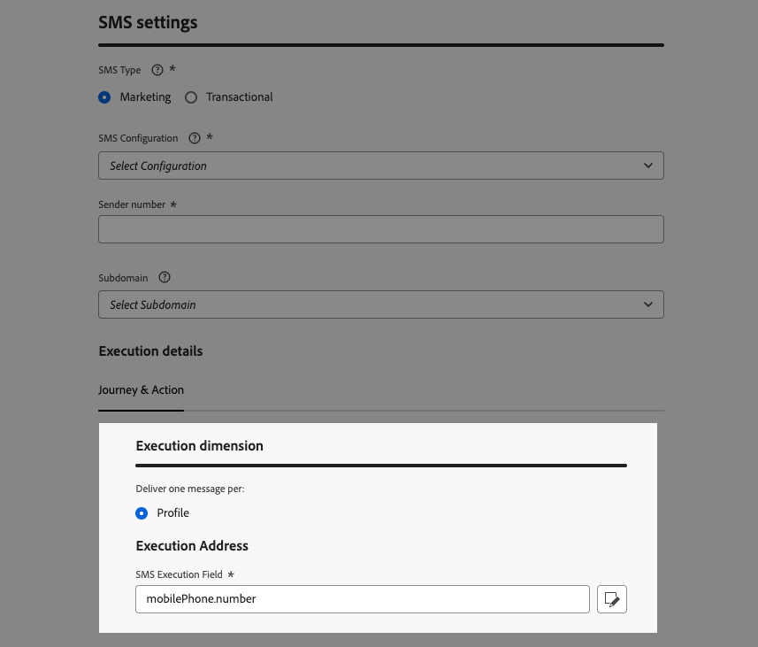

# 更改执行地址 {#change-primary-email}

>[!CONTEXTUALHELP]
>id="ajo_admin_execution_address"
>title="定义要使用的地址"
>abstract="当数据库中有多个电子邮件地址或电话号码（个人、职业等）时，您可以选择优先向哪个电子邮件地址或电话号码发送。"

>[!CONTEXTUALHELP]
>id="ajo_admin_execution_address_header"
>title="定义要使用的地址"
>abstract="编辑字段，该字段用于确定优先向其发送的轮廓的电子邮件地址或电话号码。"

定向用户档案时，数据库中可能会提供多个电子邮件地址或电话号码（专业电子邮件地址、个人电话号码等）。

在这种情况下，[!DNL Journey Optimizer]使用&#x200B;**[!UICONTROL 执行字段]**&#x200B;来确定要优先从配置文件服务中使用的电子邮件地址或电话号码。

要检查当前默认使用的字段，请访问&#x200B;**[!UICONTROL 管理]** > **[!UICONTROL 渠道]** > **[!UICONTROL 常规设置]** > **[!UICONTROL 执行字段]**&#x200B;菜单。

>[!NOTE]
>
>执行字段适用于电子邮件和短信渠道。

当前值用于沙盒级别的所有投放。 您可以根据需要更新这些字段。

在大多数情况下，您将全局更改执行字段，并定义一个应用于所有电子邮件或短信消息的值。<!--[Learn how](#admin-settings)-->

<!--In some specific use cases only, you can override the value set globally and define a different value at the journey level. [Learn more](#journey-parameters)-->

## 更新管理设置 {#admin-settings}

要在沙盒级别全局更改执行字段，请执行以下步骤。

1. 访问&#x200B;**[!UICONTROL 渠道]** > **[!UICONTROL 常规设置]** > **[!UICONTROL 执行字段]**&#x200B;菜单。

1. 单击&#x200B;**[!UICONTROL 编辑]**&#x200B;以更改默认值。

   

1. 单击您选择的当前字段或编辑图标以选择新字段。

   

1. 此时将显示可用电子邮件类型XDM字段的列表。 选择要使用的字段。

   

1. 单击&#x200B;**[!UICONTROL 保存]**&#x200B;确认您的选择。

执行字段已更新，现在将用作主地址。

<!--1. You can also select an additional field to use as secondary email address. This allows you to determine which field to use if the primary field is empty for a profile. -->

## 覆盖历程参数中的默认执行字段 {#override-execution-address-journey}

>[!CONTEXTUALHELP]
>id="ajo_journey_execution_address"
>title="定义一个自定义值"
>abstract="在某些特定情况下，您可以覆盖默认的执行地址。使用字段右侧的&#x200B;**启用参数覆盖**&#x200B;图标定义一个自定义主要地址。"
>additional-url="https://experienceleague.adobe.com/zh-hans/docs/journey-optimizer/using/configuration/primary-email-addresses#journey-parameters" text="关于执行地址"

对于特定用例，您可以全局覆盖执行字段设置并在历程级别定义不同的值。

覆盖此值可能很有用，例如：

* 测试电子邮件。您可以添加自己的电子邮件地址：发布历程后，会向您发送电子邮件。
* 向列表的订阅者发送电子邮件。 在[此用例](../building-journeys/message-to-subscribers-uc.md)中了解更多。

将&#x200B;**[!UICONTROL 电子邮件]**&#x200B;或&#x200B;**[!UICONTROL 短信]**&#x200B;操作添加到[历程](../email/create-email.md#create-email-journey-campaign)时，主要电子邮件地址显示在历程高级参数下。

使用字段右侧的&#x200B;**[!UICONTROL 启用参数覆盖]**&#x200B;图标覆盖此值。

>[!CAUTION]
>
>仅应针对特定用例使用电子邮件地址覆盖。大多数情况下，无需更改电子邮件地址，应使用&#x200B;**[!UICONTROL 执行字段]**&#x200B;中定义为主地址的值。

## 覆盖渠道配置中的默认执行字段 {#override-execution-address-channel-config}

>[!CONTEXTUALHELP]
>id="ajo_email_config_execution_address"
>title="覆盖要使用的默认执行地址"
>abstract="当有多个电子邮件地址或电话号码（个人、专业人员等）在数据库中可用时，您可以选择优先发送哪一个电子邮件地址或电话号码。 主地址在沙盒级别定义，但您可以在此处覆盖此特定渠道配置的默认设置。"

您可以更改特定电子邮件或短信[渠道配置](channel-surfaces.md)的默认执行地址。

为此，请转到&#x200B;**[!UICONTROL 执行维度]**&#x200B;部分，并编辑&#x200B;**[!UICONTROL 执行地址]**&#x200B;下的字段。

{width=85%}

然后，从可用电子邮件类型XDM字段列表中选择一个项目。

执行字段已更新，然后用作使用此渠道配置的营销活动或历程的主地址。 它覆盖在沙盒级别定义的[常规设置](#admin-settings)。

<!--[Learn more on the execution address in the email configuration ](../email/email-settings.md#execution-address)-->
