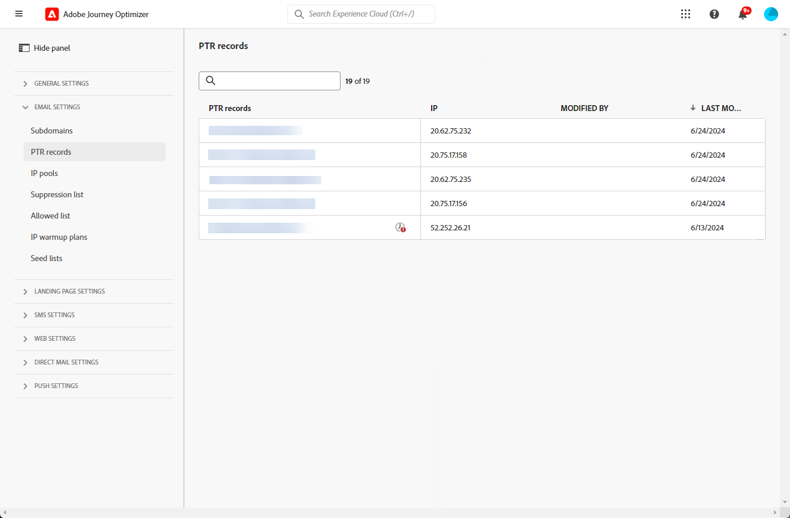

# 创建和编辑 PTR 记录 {#ptr-records}

>[!CONTEXTUALHELP]
>id="ajo_admin_ptr_record"
>title="子域的 PTR 记录"
>abstract="指针记录 (PTR) 是一种 DNS 记录，它提供链接到 IP 地址的域名，帮助接收邮件服务器验证发件人的 IP 地址。您只有在与送达率专家进行讨论并充分考虑后，才能编辑 PTR 记录。"

>[!CONTEXTUALHELP]
>id="ajo_admin_ptr_record_header"
>title="子域的 PTR 记录"
>abstract="在 Journey Optimizer 中将第一个子域委派给 Adobe 后，将自动创建 PTR 记录。"

## 关于 PTR 记录 {#about-ptr-records}

指针记录 (PTR) 是一种域名系统 (DNS) 记录，它提供链接到 IP 地址的域名。

使用 PTR 记录，接收邮件服务器可以通过识别其 IP 地址是否与服务器所连接的名称对应来检查发送邮件服务器的真实性。

## 访问子域的 PTR 记录 {#access-ptr-records}

在您[将](delegate-subdomain.md)的第一个子域委派给[!DNL Journey Optimizer]中的Adobe后，将自动为您的IP创建PTR记录。 您可以从&#x200B;**[!UICONTROL 管理]** > **[!UICONTROL 渠道]** > **[!UICONTROL 电子邮件设置]** > **[!UICONTROL PTR记录]**&#x200B;菜单访问它们。

该列表显示了使用以下语法生成的PTR记录：

* “r”代表记录，
* “xx”代表 IP 地址的最后两个数字，
* 子域名。

您可以从列表中打开 PTR 记录，以显示关联的子域名和 IP 地址。

## 编辑 PTR 记录 {#edit-ptr-record}

在[!DNL Journey Optimizer]中，您无法手动创建PTR记录。 相反，一旦您[将您的第一个子域委派](delegate-subdomain.md)到Adobe，就会自动为您的IP创建PTR记录。

您的每个IP都接收一个PTR记录。 所有PTR记录都具有以下格式：“rxx.subdomain”，其中“subdomain”是您在[!DNL Journey Optimizer]中委派的第一个子域。

创建其他子域时，需要修改一个或多个PTR记录，并将新子域分配给它们。 要实现此目的，请执行以下步骤。

>[!CAUTION]
>
>PTR 记录在所有环境中都是通用的。因此，对 PTR 记录的任何修改也将影响生产沙盒。
>
>编辑 PTR 记录时请格外小心。如有任何疑问，请联系可投放性专家。

### 完全委派的子域 {#fully-delegated-subdomains}

要编辑 PTR 记录（包含[已完全委派](delegate-subdomain.md#full-subdomain-delegation)给 Adobe 的子域），请执行以下步骤。

1. 从列表中，单击一个 PTR 记录名称以将其打开。

   

1. 从列表中选择一个[已完全委派](delegate-subdomain.md#full-subdomain-delegation)给 Adobe 的子域。

   

1. 单击&#x200B;**[!UICONTROL 保存]**&#x200B;以确认您的更改。

>[!NOTE]
>
>您无法修改 **[!UICONTROL IP]** 和 **[!UICONTROL PTR 记录]**&#x200B;字段。

### 使用 CNAME 方法委派的子域 {#edit-ptr-subdomains-cname}

要编辑 PTR 记录（包含使用 [CNAME 方法](delegate-subdomain.md#cname-subdomain-delegation)委派给 Adobe 的子域），请执行以下步骤：

1. 从列表中，单击一个 PTR 记录名称以将其打开。

   

1. 从列表中选择使用 [CNAME 方法](delegate-subdomain.md#cname-subdomain-delegation)委派给 Adobe 的子域。

   

1. 您需要在托管平台上创建新的转发 DNS 记录。为此，请复制 Adobe 生成的记录。完成后，选中“我确认…”框。

   

   >[!NOTE]
   >
   >如果您收到此消息：“请先创建转发 DNS，然后重试”，请执行以下步骤：
   >   * 如果成功创建了转发 DNS 记录，请检查 DNS 提供商。
   >   * DNS 中的记录可能不会立即同步。请等待几分钟，然后重试。

1. 单击&#x200B;**[!UICONTROL 保存]**&#x200B;以确认您的更改。

>[!NOTE]
>
>您无法修改 **[!UICONTROL IP]** 和 **[!UICONTROL PTR 记录]**&#x200B;字段。

## 检查 PTR 记录更新详细信息 {#check-ptr-record-update}

确认 PTR 记录编辑后，**[!UICONTROL 正在处理]**&#x200B;图标会显示在列表中 PTR 记录的名称旁边。

>[!NOTE]
>
>此[更新处理](#processing)最多可能需要 3 小时。

要检查 PTR 记录更新详细信息，请单击其旁边的图标。在[本节](#ptr-record-update-statuses)中了解与不同图标相关的状态的更多信息。

您可以查看更新状态和请求的更改等信息。

## PTR 记录更新状态 {#ptr-record-update-statuses}

PTR 记录更新具有以下状态：

*  **[!UICONTROL 正在处理]**：PTR 记录更新已提交，并正在进行验证过程。
*  **[!UICONTROL 成功]**：更新的 PTR 记录已通过验证，并且新子域现在已与 IP 地址关联。
*  **[!UICONTROL 失败]**：在 PTR 记录更新验证期间，一项或多项检查失败。

### 正在处理 {#processing}

将执行多次可投放性检查，以验证要与 IP 地址关联的新子域是否有效。这最多可能需要 3 个小时。

>[!NOTE]
>
>更新过程中无法修改 PTR 记录。您仍然可以单击其名称，但是&#x200B;**[!UICONTROL 子域]**&#x200B;字段显示为灰色。在更新成功之前，不会反映更改。

在验证过程中，旧子域仍与 IP 地址关联。

### 成功 {#success}

验证过程成功后，新子域将自动与 IP 地址关联。

### 失败 {#failes}

如果验证过程失败，则显示较早的 PTR 记录。先前与 IP 地址关联的有效子域保持不变。

可能的更新错误类型如下：
* 无法为 PTR 记录创建新的转发 DNS
* 无法更新记录
* 无法重新载入相关性

更新失败时，PTR 记录将再次变为可编辑状态。您可以单击其名称并再次更新子域。
