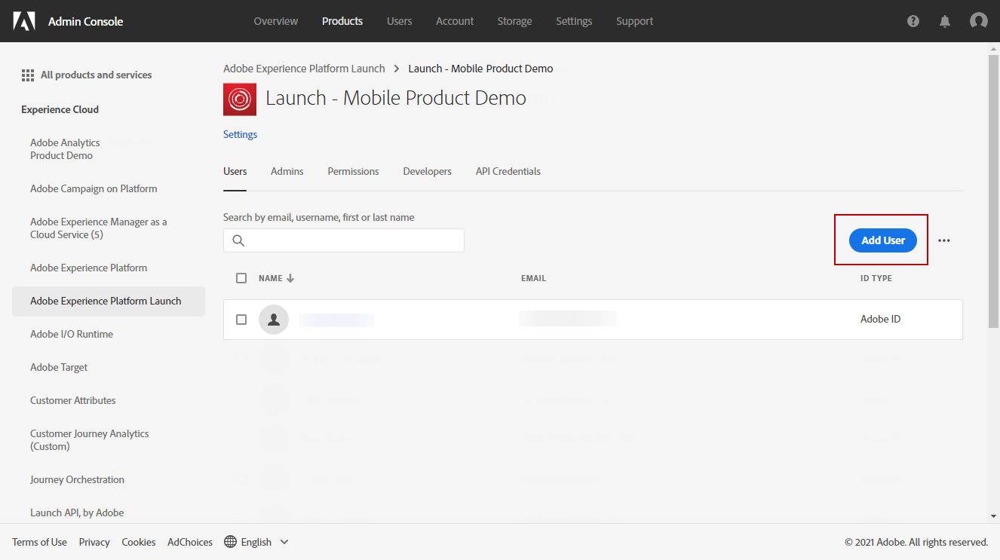

# 配置推送通知渠道 {#push-notification-configuration}

[!DNL Journey Optimizer] 允许您创建历程并向目标受众发送消息。 开始使用 [!DNL Journey Optimizer]，您需要确保移动设备应用程序上以及Adobe Experience Platform中标记上的配置和集成已就位。 要了解 [!DNL Adobe Journey Optimizer] 请参阅 [本页](push-gs.md).

## 开始前 {#before-starting}

<!--
### Check provisioning

Your Adobe Experience Platform account must be provisioned to contain following schemas and datasets for push notification data flow to function correctly:

| Schema <br>Dataset                                                                       | Group of fields                                                                                                                                                                         | Operation                                                |
| -------------------------------------------------------------------------------------- | --------------------------------------------------------------------------------------------------------------------------------------------------------------------------------------- | -------------------------------------------------------- |
| CJM Push Profile Schema <br>CJM Push Profile Dataset                                     | Push Notification Details<br>Adobe CJM ExperienceEvent - Message Profile Details<br>Adobe CJM ExperienceEvent - Message Execution Details<br>Application Details<br>Environment Details | Register Push Token                                      |
| CJM Push Tracking Experience Event Schema<br>CJM Push Tracking Experience Event Dataset | Push Notification Tracking                                                                                                                                                              | Track interactions and provide data for the reporting UI |
-->

### 设置权限 {#setup-permissions}

在创建移动应用程序之前，您首先需要确保在Adobe Experience Platform中拥有或分配正确的标记用户权限。 在 [标记文档](https://experienceleague.adobe.com/docs/experience-platform/tags/admin/user-permissions.html){target=&quot;_blank&quot;}。

>[!CAUTION]
>
>推送配置必须由专家用户执行。 根据您的实施模型和此实施中涉及的角色，您可能需要将整套权限分配给单个产品配置文件或在应用程序开发人员与 **Adobe Journey Optimizer** 管理员。 详细了解 **标记** 权限 [本文档](https://experienceleague.adobe.com/docs/experience-platform/tags/admin/user-permissions.html#platform-launch-permissions){target=&quot;_blank&quot;}。

<!--ou need to your have access to perform following roles :

* Manage Datastreams
* Manage Client-side Properties
* Manage App Configurations
-->

要分配 **属性** 和 **公司** 权限，请执行以下步骤：

1. 访问 **[!DNL Admin Console]**.

1. 从 **[!UICONTROL Products]** 选项卡，选择 **[!UICONTROL Adobe Experience Platform Launch]** 卡。

   

1. 选择现有 **[!UICONTROL Product Profile]** 或使用 **[!UICONTROL New profile]** 按钮。 了解如何创建新 **[!UICONTROL New profile]** 在 [管理控制台文档](https://experienceleague.adobe.com/docs/experience-platform/access-control/ui/create-profile.html#ui){target=&quot;_blank&quot;}。

1. 在 **[!UICONTROL Permissions]** 选项卡中，选择 **[!UICONTROL Property rights]**。

   

1. 单击 **[!UICONTROL Add all]**。这会将以下权限添加到您的产品用户档案：
   * **[!UICONTROL Approve]**
   * **[!UICONTROL Develop]**
   * **[!UICONTROL Manage Environments]**
   * **[!UICONTROL Manage Extensions]**
   * **[!UICONTROL Publish]**

   在Adobe Experience Platform Mobile SDK中安装和发布Adobe Journey Optimizer扩展以及发布应用程序资产时，需要这些权限。

1. 然后，选择 **[!UICONTROL Company rights]** 菜单中。

   

1. 添加以下权限：

   * **[!UICONTROL Manage App Configurations]**
   * **[!UICONTROL Manage Properties]**

   移动设备应用程序开发人员需要这些权限才能在中设置推送凭据 **Adobe Experience Launch** 和在中定义推送通知预设 **Adobe Journey Optimizer**.

   

1. 单击 **[!UICONTROL Save]**。

要分配此 **[!UICONTROL Product profile]** 对于用户，请执行以下步骤：

1. 访问 **[!DNL Admin Console]**.

1. 从 **[!UICONTROL Products]** 选项卡，选择 **[!UICONTROL Adobe Experience Platform Launch]** 卡。

1. 选择您之前配置的 **[!UICONTROL Product profile]**。

1. 在选项卡 **[!UICONTROL Users]** 中，单击 **[!UICONTROL Add user]**。

   

1. 键入您的用户名或电子邮件地址，然后选择用户。 然后，单击 **[!UICONTROL Save]**.

   >[!NOTE]
   >
   >如果用户之前未在Admin Console中创建，请参阅 [添加用户文档](https://helpx.adobe.com/enterprise/admin-guide.html/enterprise/using/manage-users-individually.ug.html#add-users).

   

### 配置您的应用程序 {#configure-app}

技术设置涉及应用程序开发人员与业务管理员之间的密切协作。 开始发送推送通知之前 [!DNL Journey Optimizer]，您需要在 [!DNL Adobe Experience Platform Data Collection] 并将您的移动设备应用程序与Adobe Experience Platform Mobile SDK集成。

按照以下链接中详细描述的实施步骤操作：

* 对于 **AppleiOS**:了解如何在 [Apple文档](https://developer.apple.com/documentation/usernotifications/registering_your_app_with_apns){target=&quot;_blank&quot;}
* 对于 **Google Android**:了解如何在Android中设置Firebase Cloud Messaging客户端应用程序 [Google文档](https://firebase.google.com/docs/cloud-messaging/android/client){target=&quot;_blank&quot;}

### 将您的移动设备应用程序与Adobe Experience Platform SDK集成 {#integrate-mobile-app}

Adobe Experience Platform Mobile SDK通过与Android和iOS兼容的SDK为您的手机提供客户端集成API。 关注 [Adobe Experience Platform Mobile SDK文档](https://aep-sdks.gitbook.io/docs/getting-started/overview){target=&quot;_blank&quot;}，以在您的应用程序中使用Adobe Experience Platform Mobile SDK进行设置。

在此步骤结束时，您还应该在 [!DNL Adobe Experience Platform Data Collection]. 通常，您会为要管理的每个移动应用程序创建一个移动资产。 了解如何在 [Adobe Experience Platform Mobile SDK文档](https://aep-sdks.gitbook.io/docs/getting-started/create-a-mobile-property){target=&quot;_blank&quot;}。


## 步骤1:在Adobe Experience Platform数据收集中添加您的应用程序推送凭据 {#push-credentials-launch}

授予正确的用户权限后，您现在需要在 [!DNL Adobe Experience Platform Data Collection].

要授权Adobe代表您发送推送通知，需要注册移动设备应用程序推送凭据。 请参阅下面详述的步骤：

1. 从 [!DNL Adobe Experience Platform Data Collection]，选择 **[!UICONTROL App Surfaces]** 选项卡。

1. 单击 **[!UICONTROL Create App Surfaces]** 创建新配置。

   

1. 输入 **[!UICONTROL Name]** ，以用于配置。

1. 从 **[!UICONTROL Mobile Application Configuration]**，选择操作系统：

   * **对于iOS**

      

      1. 输入移动设备应用程序 **包Id** 在 **[!UICONTROL App ID (iOS Bundle ID)]** 字段。 可以在 **常规** 选项卡 **XCode**.

      1. 已打开 **[!UICONTROL Push Credentials]** 按钮以添加您的凭据。

      1. 拖放.p8 Apple推送通知身份验证密钥文件。 此密钥可从 **证书**, **标识符** 和 **用户档案** 页面。

      1. 提供 **密钥ID**. 这是在创建p8身份验证密钥期间分配的10个字符串。 可在 **键** 选项卡 **证书**, **标识符** 和 **用户档案** 页面。

      1. 提供 **团队ID**. 这是一个字符串值，可在成员资格选项卡下找到。
   * **对于Android**

      

      1. 提供 **[!UICONTROL App ID (Android package name)]**:通常包名称是 `build.gradle` 文件。

      1. 已打开 **[!UICONTROL Push Credentials]** 按钮以添加您的凭据。

      1. 拖放FCM推送凭据。 有关如何获取推送凭据的更多详细信息，请参阅 [Google文档](https://firebase.google.com/docs/admin/setup#initialize-sdk){target=&quot;_blank&quot;}。


1. 单击 **[!UICONTROL Save]** 创建应用程序配置。

<!--
## Step 2: Set up a mobile property in Adobe Experience Platform Launch {#launch-property}

Setting up a mobile property allows the mobile app developer or marketer to configure the mobile SDKs attributes such as Session Timeouts, the [!DNL Adobe Experience Platform] sandbox to be targeted and the **[!UICONTROL Adobe Experience Platform Datasets]** to be used for mobile SDK to send data to.

For further details and procedures on how to set up a **[!UICONTROL Platform Launch property]**, refer to the steps detailed in [Adobe Experience Platform Mobile SDK documentation](https://aep-sdks.gitbook.io/docs/getting-started/create-a-mobile-property#create-a-mobile-property).


To get the SDKs needed for push notification to work you will need the following SDK extensions, for both Android and iOS:

* **[!UICONTROL Mobile Core]** (installed automatically)
* **[!UICONTROL Profile]** (installed automatically)
* **[!UICONTROL Adobe Experience Platform Edge]**
* **[!UICONTROL Adobe Experience Platform Assurance]**, optional but recommended to debug the mobile implementation.

Learn more about [!DNL Adobe Experience Platform Launch] extensions in [Adobe Experience Platform Launch documentation](https://experienceleague.adobe.com/docs/launch-learn/implementing-in-mobile-android-apps-with-launch/configure-launch/launch-add-extensions.html).
-->

## 步骤2:在移动资产中配置Adobe Journey Optimizer扩展 {#configure-journey-optimizer-extension}

的 **Adobe Journey Optimizer扩展** for Adobe Experience Platform Mobile SDK可为移动设备应用程序的推送通知提供支持，并帮助您收集用户推送令牌并管理与Adobe Experience Platform服务的交互测量。

了解如何在中设置Journey Optimizer扩展 [Adobe Experience Platform Mobile SDK文档](https://aep-sdks.gitbook.io/docs/using-mobile-extensions/adobe-journey-optimizer){target=&quot;_blank&quot;}。


<!-- 
**[!UICONTROL Edge configuration]** is used by **[!UICONTROL Edge]** extension to send custom data from mobile device to [!DNL Adobe Experience Platform]. 
To configure [!DNL Adobe Experience Platform], you must provide the **[!UICONTROL Sandbox]** name and **[!UICONTROL Event Dataset]**.

For further details and procedures on how to create **[!UICONTROL Edge configuration]**, refer to the steps detailed in [Adobe Experience Platform Mobile SDK documentation](https://aep-sdks.gitbook.io/docs/getting-started/configure-datastreams).

1. From [!DNL Adobe Experience Platform Launch], select the **[!UICONTROL Edge Configurations]** tab and click **[!UICONTROL Edge Configurations]**.
    
1. Select **[!UICONTROL New Edge Configuration]** to add a new **[!UICONTROL Edge Configuration]**.
1. Enter a **[!UICONTROL Name]** and click **[!UICONTROL Save]**

1. Click the **[!UICONTROL Adobe Experience Platform]** toggle to enable it.

1. Fill in the **[!UICONTROL Sandbox]**, **[!UICONTROL Event dataset]** and **[!UICONTROL Profile Dataset]** fields. Then, click **[!UICONTROL Save]**.
    
    


1. From [!DNL Adobe Experience Platform Launch], ensure that **[!UICONTROL Client Side]** is selected in the drop-down menu.

1. select the **[!UICONTROL Properties]** tab and click **[!UICONTROL New Property]**.

    

1. Enter a **[!UICONTROL Name]** for your new property.

1. Select **[!UICONTROL Mobile]** as **[!UICONTROL Platform]**.

    

1. Click **[!UICONTROL Save]** to create your new property.

To configure **[!UICONTROL Adobe Experience Platform Edge Extension]** to send custom data from mobile devices to [!DNL Adobe Experience Platform].

1. Select your previously created property and select the **[!UICONTROL Extensions]** tab to view the extensions for this property.

    

1. Click **[!UICONTROL Configure]** under the **[!UICONTROL Adobe Experience Platform Edge]** Network' extension.

1. From the **[!UICONTROL Edge Configuration]** drop-down list, select the **[!UICONTROL Edge Configuration]** created in the previous steps. For more information on **[!UICONTROL Edge Configuration]**, refer to this [section](#edge-configuration).

1. Click **[!UICONTROL Save]**.

To configure **[!UICONTROL Adobe Experience Platform Messaging]** extension to send push profile and push interactions to the correct datasets, follow the same steps as above. Use **[!UICONTROL Sandbox]**, **[!UICONTROL Event dataset]** and **[!UICONTROL Profile Dataset]** created in the [Adobe Experience Platform setup](#edge-configuration).
-->

<!--
## Step 4: Publish the Property {#publish-property}

You now need to publish the property to integrate your configuration and to use it in the mobile app. 

To publish your property, refer to the steps detailed in [Adobe Experience Platform Mobile SDK documentation](https://aep-sdks.gitbook.io/docs/getting-started/create-a-mobile-property#publish-the-configuration)

## Step 5: Configure the ProfileDataSource {#configure-profiledatasource}

To configure the `ProfileDataSource`, use the `ProfileDCInletURL` from [!DNL Adobe Experience Platform] setup and add the following in the mobile app:

```
    MobileCore.updateConfiguration(
    mutableMapOf("messaging.dccs" to <ProfileDCSInletURL>)
```

-->

## 步骤3:使用事件测试您的移动设备应用程序 {#mobile-app-test}

在Adobe Experience Platform和 [!DNL Adobe Experience Platform Data Collection]，您现在可以在向用户档案发送推送通知之前对其进行测试。 在此用例中，我们将创建一个历程来定位我们的移动设备应用程序，并设置一个触发推送通知的事件。

<!--
You can use a test mobile app for this use case. For more on this, refer to this [page](https://wiki.corp.adobe.com/pages/viewpage.action?spaceKey=CJM&title=Details+of+setting+the+mobile+test+app) (internal use only).
-->

要使此历程正常工作，您需要创建XDM模式。 有关更多信息，请参阅 [XDM文档](https://experienceleague.adobe.com/docs/experience-platform/xdm/schema/composition.html#schemas-and-data-ingestion){target=&quot;_blank&quot;}。

1. 在左侧菜单中，浏览 **[!UICONTROL Schemas]**.

1. 单击 **[!UICONTROL Create schema]** 然后选择 **[!UICONTROL XDM ExperienceEvent]**.

   

1. 选择 **[!UICONTROL Create a new field group]**。

1. 输入 **[!UICONTROL Display Name]** 和 **[!UICONTROL Description]**. 完成后单击 **[!UICONTROL Add field groups]**。有关如何创建字段组的更多信息，请参阅 [XDM系统文档](https://experienceleague.adobe.com/docs/experience-platform/xdm/tutorials/create-schema-ui.html?lang=zh-Hans){target=&quot;_blank&quot;}。


   

1. 在左侧，选择架构。 在右侧窗格中，输入架构的名称和说明。 为启用此架构 **[!UICONTROL Profile]**.

   


1. 在左侧，选择字段组，然后单击+图标以创建新字段。 在 **[!UICONTROL Field groups properties]**，在右侧键入 **[!UICONTROL Field name]**, **[!UICONTROL Display name]** 选择 **[!UICONTROL String]** as **[!UICONTROL Type]**.

   

1. 检查 **[!UICONTROL Required]** 单击 **[!UICONTROL Apply]**.

1. 单击 **[!UICONTROL Save]**。您的架构现已创建完成，可在事件中使用。

然后，您需要设置事件。

1. 从主页的左侧菜单的“管理”下，选择 **[!UICONTROL Configurations]**. 单击 **[!UICONTROL Manage]** 在 **[!UICONTROL Events]** 部分来创建新事件。

1. 单击 **[!UICONTROL Create Event]**，则屏幕右侧将打开事件配置窗格。

   

1. 输入事件的名称。 您还可以添加描述。

1. 在 **[!UICONTROL Event ID type]** 字段中，选择 **[!UICONTROL Rule Based]**。

1. 在 **[!UICONTROL Parameters]**，选择您之前创建的架构。

   

1. 在字段列表中，检查是否已选择在架构字段组中创建的字段。

   

1. 单击 **[!UICONTROL Edit]** 在 **[!UICONTROL Event ID condition]** 字段。 拖放您之前添加的字段以定义系统用于识别触发历程的事件的条件。

   

1. 在此示例中，键入在测试应用程序中触发推送通知时需要使用的语法 **订单确认**.

   

1. 选择 **[!UICONTROL ECID]** 作为 **[!UICONTROL Namespace]**.

1. 单击 **[!UICONTROL Ok]**，然后单击 **[!UICONTROL Save]**。

您的事件现已创建完成，现在可在历程中使用。

1. 在左侧菜单中，单击 **[!UICONTROL Journeys]**.

1. 单击 **[!UICONTROL Create Journey]** 以创建新历程。

1. 编辑右侧显示的配置窗格中的历程属性。在中了解详情 [部分](../building-journeys/journey-gs.md#change-properties).

1. 首先，拖放在上一步骤中创建的事件(从 **[!UICONTROL Events]** 下拉菜单。

   

1. 从 **[!UICONTROL Actions]** 下拉、拖放 **[!UICONTROL Message]** 活动。

1. 选择之前创建的消息。 有关如何创建推送通知的更多信息，请参阅此 [页面](../messages/get-started-content.md).

1. 单击 **[!UICONTROL Test]** 切换开始测试推送通知，然后单击 **[!UICONTROL Trigger an event]**.

   

1. 在 **[!UICONTROL Key]** 字段，然后键入 **订单确认** 中。

   

1. 单击 **[!UICONTROL Send]**。

您的事件将被触发，并且您将收到到移动设备应用程序的推送通知。

## 步骤4:为推送创建消息预设{#message-preset}

在 [!DNL Adobe Experience Platform Data Collection]，您需要创建消息预设，以便能够从发送推送通知 **[!DNL Journey Optimizer]**.

了解如何在 [此部分](../configuration/message-presets.md).

现在，您可以随时随地使用Journey Optimizer发送推送通知。

* 了解如何在 [本页](../messages/create-push.md).
* 了解如何在 [此部分](../building-journeys/journeys-message.md).
