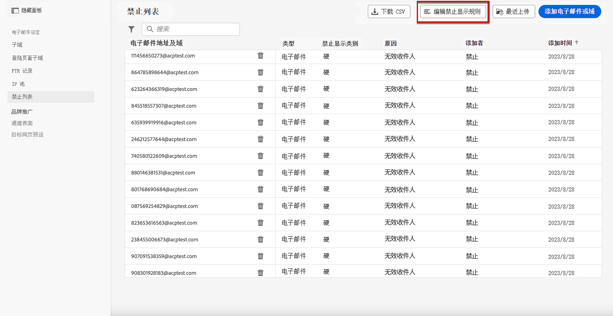

# 重试 {#retries}

当由于临时 **软退回** 错误，会执行多次重试。 每个错误都会增加一个错误计数。 当此计数器达到限制阈值时，地址将添加到禁止列表。

>[!NOTE]
>
>了解有关 [投放失败类型](../reports/suppression-list.md#delivery-failures) 中。

在默认配置中，阈值设置为5个错误。

* 对于同一投放，在第5次遇到 [重试时段](#retry-duration)，则禁止显示地址。

* 如果存在不同的投放且至少24小时间隔地发生两个错误，则每次错误时错误计数都递增，并且在第五次尝试时地址也被抑制。

如果重试投放成功，则地址的错误计数会重新初始化。

## 重试阈值版本 {#edit-retry-threshold}

>[!CONTEXTUALHELP]
>id="ajo_admin_suppression_list_bounces"
>title="更新重试阈值"
>abstract="如果默认值不适合您的需求，您可以修改允许的连续软退回数。 当重试计数器达到特定电子邮件地址的错误阈值时，此地址会添加到禁止列表。"
>additional-url="https://experienceleague.adobe.com/docs/journey-optimizer/using/reporting/deliverability/suppression-list.html" text="了解支持列表"

如果默认值5不适合您的需求，您可以按照以下步骤修改错误阈值。

1. 转到 **[!UICONTROL 渠道]** > **[!UICONTROL 电子邮件配置]** > **[!UICONTROL 禁止列表]**.

1. 选择 **[!UICONTROL 编辑隐藏规则]** 按钮。

   

1. 根据需要编辑允许的连续软退回数。

   

   您必须输入一个介于1和20之间的整数值，这表示重试的最小次数为1，最大数量为20。

   >[!CAUTION]
   >
   >超过10的任何值都可能导致投放能力声誉问题，以及ISP对IP的列入阻止列表限制或。 [了解有关投放能力的更多信息](../reports/deliverability.md)

## 重试时段 {#retry-duration}

的 **重试时段** 是重试投放遇到临时错误或软退件的任何电子邮件的时间范围。

默认情况下，将对 **3.5天** (或 **84小时**)。

但是，为确保不再需要重试尝试，您可以在创建或编辑 [通道表面](channel-surfaces.md) （即消息预设）。

例如，对于与密码重置相关并包含仅有效一天的链接的事务型电子邮件，您可以将重试期限设置为24小时。 同样，对于午夜销售，您可能需要定义6小时的重试期限。

>[!NOTE]
>
>重试周期不能超过84小时。 营销电子邮件的最短重试期限为6小时，事务电子邮件的最短重试期限为10分钟。

了解在中创建渠道表面时如何调整电子邮件重试参数 [此部分](channel-surfaces.md#create-channel-surface).

