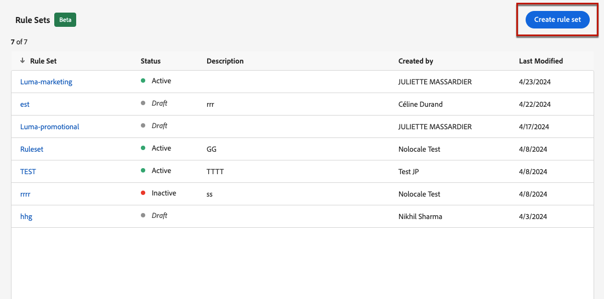
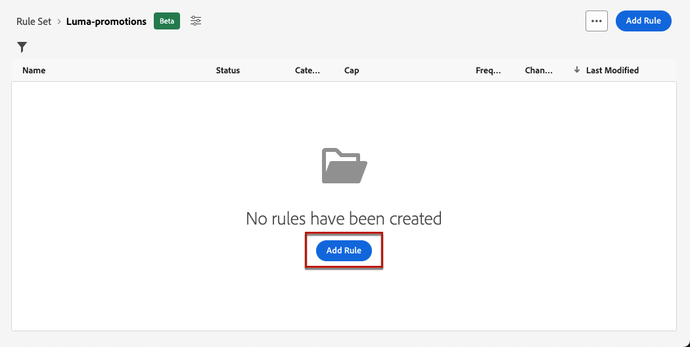

# 使用规则集 {#rule-sets}

>[!CONTEXTUALHELP]
>id="ajo_business_rules_rule_sets"
>title="规则集"
>abstract="使用规则集对不同类型的营销通信应用频率限制。例如，您可以创建一个规则集来限制发送给客户的&#x200B;**促销通信**&#x200B;数量，并创建另一个规则集来限制发送给客户的&#x200B;**新闻通讯**&#x200B;数量。"

>[!AVAILABILITY]
>
>规则集当前仅作为测试版提供给选定用户。 请联系您的Adobe代表以将其纳入Beta。

## 什么是规则集？ {#what}

除了限制用户跨一个或多个渠道接收消息的次数全局业务规则之外，规则集还允许您&#x200B;**将多个规则分组到规则集中**&#x200B;并将它们应用于您选择的营销活动。 这提高了粒度，以便根据通信类型控制用户接收消息的频率。

例如，您可以创建一个规则集以限制发送给客户的&#x200B;**促销通信**&#x200B;的数量，并创建另一个规则集以限制发送给客户的&#x200B;**新闻稿**&#x200B;的数量。 根据要创建的促销活动类型，您可以选择应用促销通信或新闻稿规则集。

## 全局和自定义规则集 {#global-custom}

首次从&#x200B;**[!UICONTROL 管理]** > **[!UICONTROL 业务规则(Beta)]**&#x200B;菜单访问规则集时，默认规则集已预创建并处于活动状态： **全局默认规则集**。

此规则集包含全局规则，您可以应用这些规则来控制用户通过一个或多个渠道接收消息的频率，类似于当前业务规则的操作方式。 此规则集中定义的所有规则都适用于所有选定的渠道，无论通信是从历程还是营销活动发送。 [了解如何使用业务规则](frequency-rules.md)

除了此“全局默认规则集”规则集之外，您还可以创建可应用于任何营销活动的&#x200B;**自定义规则**&#x200B;集，以限制在该营销活动中发送的消息数。 [了解如何创建自定义规则集](#create)

>[!IMPORTANT]
>
>目前，自定义规则集只能应用于&#x200B;**营销活动**。 仅“全局默认规则集”规则集中定义的规则适用于历程和营销活动通信。

## 创建您的第一个自定义规则集 {#create-rule-set}

### 创建规则集 {#create}

要创建规则集，请执行以下步骤。

>[!NOTE]
>
>您最多可以创建3个自定义规则集。

1. 访问&#x200B;**[!UICONTROL 规则集]**&#x200B;列表，然后单击&#x200B;**[!UICONTROL 创建规则集]**。

   

1. 定义规则集名称，根据需要添加说明，然后单击&#x200B;**[!UICONTROL 保存]**。

   

   >[!NOTE]
   >
   >规则集名称必须是唯一的。

1. 现在您可以[定义要添加到此规则集的规则](#create-new-rule)。

### 将规则添加到规则集。 {#create-new-rule}

>[!CONTEXTUALHELP]
>id="ajo_rule_sets_category"
>title="选择消息规则类别"
>abstract="在规则激活并应用到一条消息时，与所选类别匹配的所有频率规则将自动应用于该消息。目前只有营销类别可用。"

>[!CONTEXTUALHELP]
>id="ajo_rule_sets_capping"
>title="设置规则的频次封顶"
>abstract="指定在所选时间范围内发给某个客户配置文件的最大消息数。频率上限将基于所选的日历期间，并将在相应的时间范围开始时重置它。"

>[!CONTEXTUALHELP]
>id="ajo_rule_sets_channel"
>title="定义规则应用到的渠道"
>abstract="请至少选择一个渠道。对所有渠道的总计数应用频次封顶。"

>[!CONTEXTUALHELP]
>id="ajo_rule_sets_duration"
>title="选择消息规则类别"
>abstract="在规则激活并应用到一条消息时，与所选类别匹配的所有频率规则将自动应用于该消息。目前只有营销类别可用。"

要将规则添加到规则集，请执行以下步骤。

1. 在刚刚创建的规则集中，单击&#x200B;**[!UICONTROL 添加规则]**。

   

1. 定义唯一的&#x200B;**规则名称**。

1. **类别**&#x200B;字段指定规则适用的消息类别。 目前，此字段为只读，因为只有&#x200B;**[!UICONTROL Marketing]**&#x200B;类别可用。

1. 从&#x200B;**[!UICONTROL 持续时间]**&#x200B;下拉列表中，选择是每月、每周还是每日应用上限。 频率上限基于所选的日历期间。 它会在相应时间范围的开头重置。

   

   各期间计数器到期如下：

   * **[!UICONTROL 每月]**：频率上限在每月最后一天23:59:59 UTC之前有效。 例如，1月的每月到期时间为01-31 23:59:59 UTC。

   * **[!UICONTROL 每周]**：频率上限有效期到星期六23:59:59 UTC，因为日历周从星期日开始。 无论规则如何创建，都会过期。 例如，如果规则是在星期四创建的，则此规则的有效期到星期六23:59:59。

   * **[!UICONTROL 每日]**：每日频率上限在23:59:59 UTC之前的该天有效，并在第二天开始时重置为0。

     >[!CAUTION]
     >
     >为确保每日频率上限规则的准确性，必须使用[流式分段](https://experienceleague.adobe.com/docs/experience-platform/segmentation/ui/streaming-segmentation.html){target="_blank"}。 在[本节](../audience/about-audiences.md#evaluation-method-in-journey-optimizer)中了解有关受众评估方法的更多信息。

   请注意，一旦传递通信，配置文件计数器值将更新。 当您发送大量通信时，请注意这一点，因为吞吐量可能导致收件人收到电子邮件时间达到通信启动后的几分钟甚至几小时（如果您同时发送数百万条通信）。

   如果收件人收到两个彼此靠近的通信，则这一点很重要。 我们建议将通信间隔至少两小时，在可能的情况下，为收件人提供充足的时间来接收通信，并相应地更新计数器值。

1. 设置规则的上限，即根据您在上面的选择，每月、每周或每天可以向单个用户配置文件发送的最大消息数。

1. 选择要用于此规则的渠道： **[!UICONTROL 电子邮件]**、**[!UICONTROL 短信]**、**[!UICONTROL 推送通知]**&#x200B;或&#x200B;**[!UICONTROL 直邮]**。

   

   >[!NOTE]
   >
   >您必须至少选择一个渠道才能创建规则。

1. 如果要将上限应用到所有选定渠道的总数，请选择多个渠道。

   例如，将上限设置为5，然后选择电子邮件和短信渠道。 如果某个用户档案在选定时间段内已收到3封营销电子邮件和2封营销短信，则该用户档案将从任何营销电子邮件或短信的下一个投放中排除。

1. 单击&#x200B;**[!UICONTROL 保存]**&#x200B;以确认创建规则。 您的消息已添加到规则集，状态为&#x200B;**[!UICONTROL 草稿]**。

   

1. 重复上述步骤，根据需要向规则集添加任意数量的规则。

现在，您需要先激活每个规则，然后才能将其应用于任何消息。 [了解详情](#activate-rule)

### 激活规则和规则集 {#activate-rule}

创建规则后，规则处于&#x200B;**[!UICONTROL 草稿]**&#x200B;状态，尚未影响任何消息。 要启用它，请单击规则旁边的&#x200B;**[!UICONTROL 更多操作]**&#x200B;按钮，然后选择&#x200B;**[!UICONTROL 激活]**。

您还必须激活规则集才能在营销活动/历程中访问它，并将其应用于消息。

>[!NOTE]
>
>完全激活规则或规则集最多可能需要10分钟。 您无需修改消息或重新发布历程，规则即可生效。

<!--Currently, once a rule set is activated, no more rules can be added to that rule set.-->

要停用规则或规则集，请单击所需项目旁边的&#x200B;**[!UICONTROL 更多操作]**&#x200B;按钮，然后选择&#x200B;**[!UICONTROL 停用]**。

其状态将更改为&#x200B;**[!UICONTROL 不活动]**，并且该规则将不应用于未来的消息执行。 当前正在执行的任何消息都不会受到影响。

>[!NOTE]
>
>停用规则或规则集不会影响或重置单个配置文件上的任何计数。

## 访问和管理规则集 {#access-rule-sets}

所有创建的规则集都显示在&#x200B;**[!UICONTROL 管理]** > **[!UICONTROL 业务规则(Beta)]**&#x200B;菜单中。 它们按上次修改日期排序。

单击规则集名称可查看和编辑其内容。 将列出该规则集中包含的所有规则。 通过右上方的上下文菜单，您可以：

* 编辑规则集的名称和描述
* 激活规则集 — [了解更多](#activate-rule)
* 删除规则集

对于规则集中的每个规则，**[!UICONTROL 更多操作]**&#x200B;按钮允许您：

* 编辑规则
* 激活规则[了解详情](#activate-rule)
* 删除规则

<!--### Permissions{#permissions-frequency-rules}

To access, create, edit or delete message frequency rules, you must have the **[!UICONTROL Manage frequency rules]** permission. 

Users with the **[!UICONTROL View frequency rules]** permission are able to view rules, but not to modify or delete them.

Learn more about permissions in [this section](../administration/high-low-permissions.md).-->

## 将规则集应用到消息 {#apply-frequency-rule}

要将业务规则应用于消息，请执行以下步骤。

1. 创建[营销活动](../campaigns/create-campaign.md)时，请选择为规则集定义的渠道之一，并编辑消息的内容。

1. 在内容版本屏幕中，单击&#x200B;**[!UICONTROL 添加业务规则]**&#x200B;按钮。

1. 选择您创建的[规则集](#create-rule-set)。

   

   >[!NOTE]
   >
   >列表中只显示[激活的](#activate-rule)规则集。

   <!--Messages where the category selected is **[!UICONTROL Transactional]** will not be evaluated against business rules.-->

1. 在激活营销活动之前，请确保将其计划在将来的至少10分钟后执行。

   这样就有足够的时间在配置文件上为您选择的业务规则填充计数器值。 如果立即激活营销活动，规则集计数器值将不会填充在收件人的用户档案中，并且消息将不会计入其自定义规则集的频率上限规则中。

   

1. 您可以在[全局报告](../reports/global-report.md)和[实时报告](../reports/live-report.md)中查看从投放中排除的用户档案数，其中频率规则将列为用户被排除投放的可能原因。

>[!NOTE]
>
>同一渠道可以应用多个规则，但一旦到达下限，用户档案将从下次投放中排除。

<!--
## Example: combine several rules {#frequency-rule-example}

You can combine several message frequency rules, such as described in the example below.

1. [Create a rule](#create-new-rule) called *Overall Marketing Capping*:

   * Select all channels.
   * Set capping to 12 monthly.

   

1. To further restrict the number of marketing-based push notifications that a user is sent, create a second rule called *Push Marketing Cap*:

   * Select Push channel.
   * Set capping to 4 monthly.

   

1. Save and [activate](#activate-rule) the rule.

1. [Create a message](../building-journeys/journeys-message.md) for every channel you want to communicate through and select the **[!UICONTROL Marketing]** category for each message. [Learn how to apply a frequency rule](#apply-frequency-rule)

   

In this scenario, an individual profile:
* can receive up to 12 marketing messages per month;
* but will be excluded from marketing push notifications after they have received 4 push notifications.-->

在测试频率规则时，建议使用新创建的[测试配置文件](../audience/creating-test-profiles.md)，因为一旦达到配置文件的频率上限，就无法在下一时间段之前重置计数器。 停用规则将允许有上限的用户档案接收消息，但不会移除或删除任何计数器增量。
