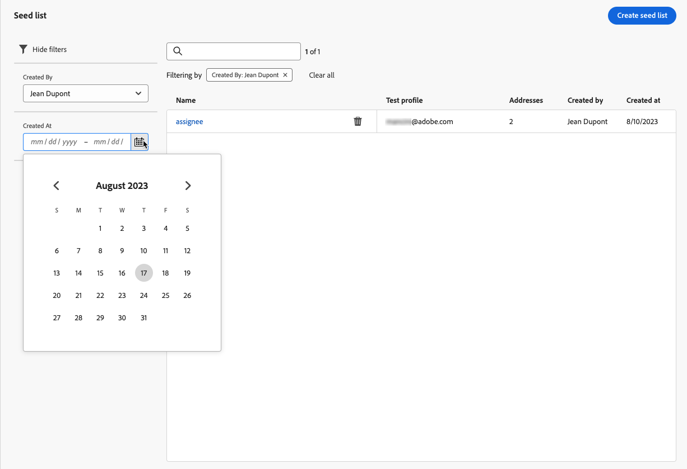

# 使用种子列表 {#seed-lists}

中的种子列表 [!DNL Journey Optimizer] 使您能够在投放中自动包含特定的种子地址。

>[!CAUTION]
>
>目前，此功能仅适用于电子邮件渠道。

种子地址用于定位不符合既定目标标准的收件人。这样，超出投放范围的收件人可以像任何其他目标收件人一样接收投放。

种子地址既不是真实的用户档案，也不是测试用户档案，因为它们不包含任何用户档案详细信息。 它们只是存储在系统中的属于内部利益相关者的收件人。 在特定营销活动或历程中选择它们后，它们将在投放执行时包含在内，这意味着出于保障目的，它们将收到投放的副本。

* 种子列表允许您按照与客户相同的条件和时间接收投放，从而监控发送的电子邮件副本，以确保所有显示格式、图像和链接均正确，并跟踪发送给收件人的实际消息。

  例如：

+++ 如果您是营销经理：

  您希望所有团队成员与客户同时接收已发送消息的副本。 这样，您的团队就可以确保发送消息时采用预期的布局、活动的URL、正确的文本和图像 — 在执行之前都按计划进行。

+++

+++ 如果您是产品所有者：

  您需要跟踪发送给客户的实际消息。 事实上，您的团队和领导层可能会对某些活动感兴趣，并且需要在发送时临时添加以接收消息副本。

+++

* 使用种子列表的另一个原因是您的邮件列表保护。 如果在邮寄列表中插入种子地址，并且第三方正在使用它，您会注意到这一点，因为种子地址包含的种子地址将收到发送到邮寄列表的投放。

>[!NOTE]
>
>支持变体。 种子地址接收同一消息的每个变体的单个副本(例如， [内容试验](../campaigns/get-started-experiment.md))。

## 访问种子列表 {#access-seed-lists}

要访问已创建的种子列表，请转到 **[!UICONTROL 管理]** > **[!UICONTROL 渠道]** > **[!UICONTROL 电子邮件配置]**，并选择 **[!UICONTROL 种子列表]**.

<!--
>[!CAUTION]
>
>Permissions to view, export and manage the seed lists are restricted to [Journey Administrators](../administration/ootb-product-profiles.md#journey-administrator). Learn more on managing [!DNL Journey Optimizer] users' access rights in [this section](../administration/permissions-overview.md).-->

>[!CAUTION]
>
>要查看、编辑和管理种子列表，您必须具有 **[!UICONTROL 管理种子列表]** 许可。

您可以按名称搜索种子列表，和/或筛选创建列表的用户或创建日期。 选择后，您可以清除显示在列表顶部的过滤器。

使用 **[!UICONTROL 删除]** 按钮以永久删除条目。

>[!CAUTION]
>
>无法删除在活动中使用的种子列表 [营销活动](../campaigns/review-activate-campaign.md) 或 [历程](../building-journeys/publishing-the-journey.md). 您需要取消激活营销活动/历程，或对其进行编辑以使用未选择种子列表的其他表面。 [了解有关使用种子列表的更多信息](#use-seed-list)

您可以单击种子列表名称对其进行编辑。 <!--Use the **[!UICONTROL Edit]** button to edit a seed list.-->

## 创建种子列表 {#create-seed-list}

>[!CONTEXTUALHELP]
>id="ajo_seed_list_details"
>title="定义种子列表"
>abstract="使用种子列表将特定的内部地址自动添加到您的投放受众中，以达到保证的目的。种子列表可让您监控发出的消息副本，以确保所有显示要素正确，并保护您的邮件列表。目前，此功能仅适用于电子邮件渠道。"
>additional-url="https://experienceleague.adobe.com/docs/journey-optimizer/using/configuration/seed-lists.html?lang=zh-Hans#use-seed-list" text="什么是种子列表？"

>[!CONTEXTUALHELP]
>id="ajo_seed_addresses"
>title="填写种子列表"
>abstract="选择将在投放执行时纳入并将收到与消息完全一致的副本的地址。可导入 CSV 文件或手动输入电子邮件地址。"

要创建种子列表，请执行以下步骤。

1. 访问 **[!UICONTROL 管理]** > **[!UICONTROL 渠道]** > **[!UICONTROL 电子邮件配置]** > **[!UICONTROL 种子列表]** 菜单。

1. 选择 **[!UICONTROL 创建种子列表]** 按钮。

   

1. 填写详细信息。 首先添加一个名称。

   

   >[!NOTE]
   >
   >名称必须以字母(A - Z)开头，并且只包含字母数字字符或特殊字符( _， .， -)。

1. 选择渠道。 当前仅电子邮件渠道可用。

1. 选择测试用户档案。 由于种子地址不包含用户档案详细信息，因此此测试用户档案将仅用于在发送到种子地址的邮件中显示个性化数据。

   >[!NOTE]
   >
   >一次只能选择一个测试配置文件。

1. 添加要将投放发送到的种子地址。 可导入 CSV 文件或手动输入电子邮件地址。

   

   >[!NOTE]
   >
   >您可以合并两个选项，但种子列表中的地址总数不能超过50个。

1. 单击 **[!UICONTROL 创建]** 以确认。 新创建的种子列表显示在 [种子列表屏幕](#access-seed-lists).

## 在营销活动或历程中使用种子列表 {#use-seed-list}

现在您的种子列表已创建，您可以在任何营销活动或历程中使用它来在投放中包含相应的种子地址。 要实现此目的，请执行以下步骤。

>[!CAUTION]
>
>发送到种子地址的消息不包含在历程或营销活动报告中。

1. 创建曲面并选取 **[!UICONTROL 电子邮件]** 渠道。 [了解详情](../email/email-settings.md)

1. 选择您选择的种子列表，在 [对应部分](../email/email-settings.md#seed-list).

   >[!NOTE]
   >
   >一次只能选择一个种子列表。

   

1. 提交表面。

1. 创建 [营销活动](../campaigns/create-campaign.md) 或 [历程](../building-journeys/journey-gs.md).

1. 选择 **[!UICONTROL 电子邮件]** 操作并选择 [曲面](channel-surfaces.md) 包括与您相关的种子列表。

   

1. 激活您的 [营销活动](../campaigns/review-activate-campaign.md) 或发布您的 [历程](../building-journeys/publishing-the-journey.md).

现在，每次通过该活动或历程向客户发送电子邮件时，所选种子列表上的电子邮件地址也将以与定向收件人相同的条件、时间和内容接收该邮件。

>[!NOTE]
>
>对于历程，电子邮件投放仅在历程首次执行时发送到种子地址。
