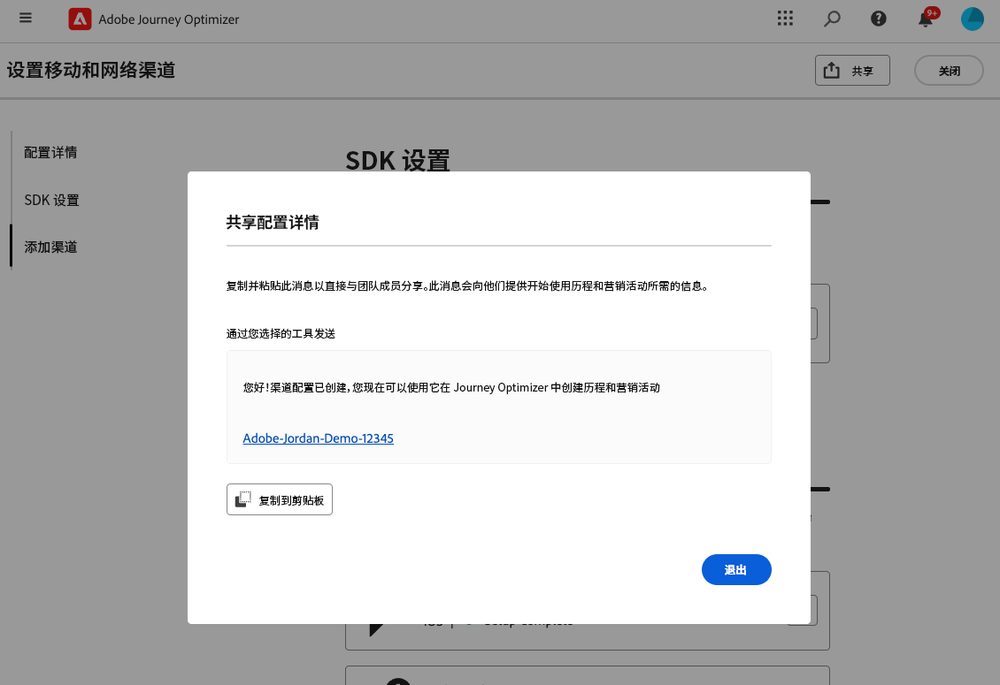

# 设置Android移动设备配置 {#set-mobile-android}

>[!IMPORTANT]
>
>为确保兼容性和最佳性能，请确保使用以下SDK版本：
>
> * Core 3.1.0或更高版本
> * Messaging 3.1.0或更高版本

此Android设置简化了营销渠道的快速配置，确保所有必要的资源都可在Experience Platform、Journey Optimizer和数据收集应用程序中轻松访问。 这使您的营销团队能够迅速开始创建活动和历程。

## 创建新的Android设置 {#new-setup-android}

>[!CONTEXTUALHELP]
>id="ajo_mobile_web_setup_android_initialization_code"
>title="添加初始化代码"
>abstract="将初始化代码集成到应用程序的&#x200B;**onCreate()**&#x200B;方法中。 此方法在首次创建应用程序时执行，以确保代码在初始设置阶段运行。 在此正确地放置代码对于确保在执行任何后续操作之前正确配置和初始化应用程序至关重要。"

>[!CONTEXTUALHELP]
>id="ajo_mobile_web_setup_android_dependencies_add"
>title="添加依赖项"
>abstract="您需要使用应用程序的Gradle文件将以下库添加到项目中：Core、Assurance、Edge、Edge Identity和Messaging。"

>[!CONTEXTUALHELP]
>id="ajo_mobile_web_setup_android_dependencies_import"
>title="导入依赖项"
>abstract="在应用程序的应用程序类中，导入以下包：Mobile Core、Assurance、Edge、Edge Identity和Messaging。"
>additional-url="https://experienceleague.adobe.com/en/docs/platform-learn/implement-mobile-sdk/app-implementation/install-sdks#import-extensions" text="请参阅数据收集文档"

<!--
>[!CONTEXTUALHELP]
>id="ajo_mobile_web_setup_push_token_android"
>title="Retrieve the device token"
>abstract="TBC"

>[!CONTEXTUALHELP]
>id="ajo_mobile_web_setup_push_android_studio"
>title="Launch the application from Android Studio"
>abstract="TBC"
-->

1. 在Journey Optimizer主页上，从&#x200B;**[!UICONTROL 设置移动和Web渠道]**&#x200B;信息卡中单击&#x200B;**[!UICONTROL 开始]**。

   

1. 创建&#x200B;**[!UICONTROL 新]**&#x200B;配置。

   如果已有配置，则可以选择选择一个配置，或创建新配置。

   

1. 输入新配置的&#x200B;**[!UICONTROL 名称]**，然后选择或创建您的&#x200B;**[!UICONTROL 数据流]**。 此&#x200B;**[!UICONTROL 名称]**&#x200B;将用于每个自动创建的资源。

1. 如果您的组织有多个数据流，请从现有选项中选择一个。 如果您没有数据流，则将自动为您创建一个数据流。

1. 选择要设置的Android平台，然后单击&#x200B;**[!UICONTROL 自动创建资源]**。

   

1. 为了简化设置过程，系统会自动创建必要的资源来帮助您入门。 这包括创建新的&#x200B;**[!UICONTROL 移动标记属性]**&#x200B;以及安装扩展。

   以下是自动生成的所有资源的完整列表：

+++ 已创建资源

   <table>
    <thead>
    <tr>
    <th><strong>解决方案</strong></th>
    <th><strong>自动创建的资源</strong></th>
    </tr>
    </thead>
    <tbody>
    <tr>
    <td>
    
Journey Optimizer

    </td>
    <td>
    <ul>
    <li>渠道配置</li>
    <li>推送凭据（仅限移动设备推送消息）</li>
    </ul>
    </td>
    </tr>
    <tr>
    <td>
    
标记

    </td>
    <td>
    <ul>
    <li>移动标记属性</li>
    <li>规则</li>
    <li>数据元素</li>
    <li>库</li>
    <li>环境（暂存、生产、开发）</li>
    </ul>
    </td>
    </tr>
    <tr>
    <td>
    
标记扩展

    </td>
    <td>
    <ul>
    <li>Adobe Experience PlatformEdge Network</li>
    <li>Adobe Journey Optimizer</li>
    <li>AEP保证</li>
    <li>同意（已启用默认同意策略）</li>
    <li>标识（使用默认ECID，使用默认拼接规则）</li>
    <li>移动核心</li>
    </ul>
    </td>
    </tr>
    <tr>
    <td>
    
Assurance

    </td>
    <td>
    
保证会话

    </td>
    </tr>
    <tr>
    <td>
    
数据流

    </td>
    <td>
    
使用服务的数据流

    </td>
    </tr>
    <tr>
    <td>
    
Experience Platform

    </td>
    <td>
    <ul>
    <li>数据集</li>
    <li>架构</li>
    </ul>
    </td>
    </tr>
    </tbody>
    </table>

+++

1. 资源生成完成后，单击&#x200B;**[!UICONTROL 设置]**&#x200B;以开始配置SDK。

   

1. 首先需要按照用户界面中的说明添加和导入依赖项。 [了解详情](https://experienceleague.adobe.com/en/docs/platform-learn/implement-mobile-sdk/app-implementation/install-sdks)。

1. 将以下代码复制并粘贴到应用程序的onCreate()方法中。

1. 要直接在移动应用程序上验证您的SDK，只需打开您的移动应用程序并允许访问[Adobe保证](https://experienceleague.adobe.com/en/docs/experience-platform/assurance/home)即可。 “保证”是一款功能强大的工具，可让您彻底测试和验证实施，确保一切正常运行。

   连接后，您的设备将被自动检测并列在&#x200B;**[!UICONTROL 可用设备]**&#x200B;下拉菜单中，从而允许您实时无缝地监视和排除设置故障。

   

1. 单击&#x200B;**[!UICONTROL 连接]**。

1. 您现在可以配置[应用程序内](#inapp-channel)和/或[推送](#push-channel)渠道。

1. 完成配置后，与负责创建历程和营销活动的团队成员共享自动生成的&#x200B;**[!UICONTROL 渠道配置]**。

   **[!UICONTROL 渠道配置]**&#x200B;应在“营销活动”或“历程”界面中引用，以便在您的设置与针对受众执行目标历程和营销活动之间实现无缝连接。

   

## 修改现有配置 {#reconnect}

创建配置后，您可以随时轻松重新访问它以添加其他渠道或进一步调整以符合您的需求

1. 在Journey Optimizer主页上，从&#x200B;**[!UICONTROL 设置移动和Web渠道]**&#x200B;信息卡中单击&#x200B;**[!UICONTROL 开始]**。

   

1. 选择&#x200B;**[!UICONTROL Existing]**，然后从下拉列表中选择现有的&#x200B;**[!UICONTROL Tag属性]**。

   

1. 访问现有配置时，您需要重新连接Adobe保证。 从SDK设置菜单中，单击&#x200B;**[!UICONTROL 重新连接]**。

1. 从&#x200B;**[!UICONTROL 可用设备]**&#x200B;下拉列表中选择您的设备，然后单击&#x200B;**[!UICONTROL 连接]**。

1. 您现在可以根据需要更新配置。

## 设置应用程序内渠道 {#inapp-channel}

<!--
>[!CONTEXTUALHELP]
>id="ajo_mobile_web_setup_inapp_tag_property"
>title="Choose your tag property"
>abstract="TBC"
-->

应用程序内渠道无需其他设置。 要验证您的配置是否正确，可以使用“保证”功能轻松发送测试消息。 这将即时反馈系统是否准备好有效投放应用程序内消息。

要执行此操作，只需单击&#x200B;**[!UICONTROL 显示应用程序内消息]**。

为了简化设置过程，系统会自动创建必要的资源来帮助您入门。 这包括创建渠道配置。

您现在可以使用之前配置的&#x200B;**[!UICONTROL 渠道配置]**&#x200B;发送应用程序内消息。 [了解如何创建应用程序内消息](../in-app/create-in-app.md)

## 设置推送渠道 {#push-channel}

>[!CONTEXTUALHELP]
>id="ajo_mobile_web_setup_push_token"
>title="检索设备令牌"
>abstract="要确保设备的推送令牌与Adobe Experience Platform配置文件正确同步，您需要将以下代码合并到应用程序中。 此集成对于保持最新的通信功能和确保无缝用户体验至关重要。"

>[!CONTEXTUALHELP]
>id="ajo_mobile_web_setup_push_xcode"
>title="通过 Xcode 启动应用程序"
>abstract="要获取推送令牌，请先使用Xcode启动应用程序。 应用程序启动后，请重新启动该应用程序，以确保验证过程完成。 然后，Adobe将提供您的推送令牌作为验证结果的一部分。 此令牌对于启用推送通知至关重要，一旦成功验证设置，将立即显示。"

>[!CONTEXTUALHELP]
>id="ajo_mobile_web_push_certificate_fcm"
>title="提供推送证书"
>abstract="拖放您的.json私钥文件。 此文件包含安全集成以及应用程序和服务器之间的通信所需的身份验证信息。"

1. 配置移动SDK后，单击推送通知卡中的&#x200B;**[!UICONTROL 添加]**。

1. 通过在用户界面的`FireBaseMessaging.getInstance.getToken ()`回调函数中插入提供的代码来检索设备令牌。

1. 通过将用户界面中提供的代码添加到`AndroidManifest.xml`文件中来注册消息服务。

1. 拖放您的.json私钥文件。

1. 要验证您的配置是否正确，可以使用“保证”功能轻松发送测试消息。 这将立即提供有关系统准备情况的反馈，以便有效地发送推送通知。

   要执行此操作，只需单击&#x200B;**[!UICONTROL 发送推送消息]**。

为了简化设置过程，系统会自动创建必要的资源来帮助您入门。 这包括创建&#x200B;**[!UICONTROL 渠道配置]**&#x200B;和&#x200B;**[!UICONTROL 推送凭据]**。

您现在可以使用之前配置的&#x200B;**[!UICONTROL 渠道配置]**&#x200B;发送推送通知。 [了解如何创建推送通知](../push/create-push.md)
