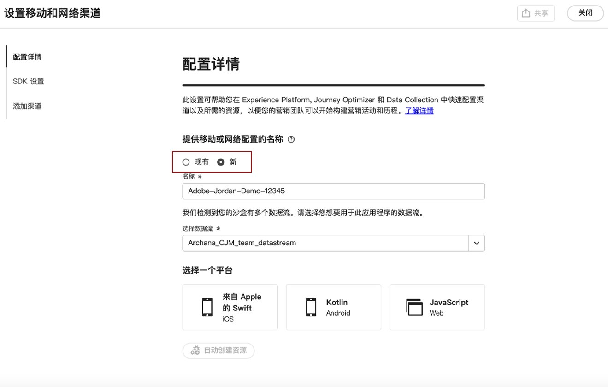

# 设置Web配置 {#set-mobile-web}

>[!CONTEXTUALHELP]
>id="ajo_mobile_web_setup_javascript_code"
>title="JavaScript 代码"
>abstract="head标记包含在网页主内容之前加载的基本元数据和资源。 将代码置于此部分可确保代码尽早正确初始化和执行，从而允许您的网页高效地加载和运行。 通过向标题部分添加代码，可帮助增强网站的结构、性能和整体用户体验。"

这种设置便于快速配置营销渠道，确保所有所需资源在 Experience Platform、Journey Optimizer 和数据收集中随时可用。这使您的营销团队能够立即开始创建营销活动和历程。

## 创建新的Web设置 {#new-setup}

1. 在Journey Optimizer主页上，从&#x200B;**[!UICONTROL 设置移动和Web渠道]**&#x200B;信息卡中单击&#x200B;**[!UICONTROL 开始]**。

   

1. 创建&#x200B;**[!UICONTROL 新]**&#x200B;配置。

   如果已有配置，则可以选择选择一个配置，或创建新配置。

   

1. 输入新配置的&#x200B;**[!UICONTROL 名称]**，然后选择或创建您的&#x200B;**[!UICONTROL 数据流]**。 此&#x200B;**[!UICONTROL 名称]**&#x200B;将用于每个自动创建的资源。

1. 如果您的组织有多个数据流，请从现有选项中选择一个。 如果您没有数据流，则将自动为您创建一个数据流。

1. 选择Web平台并单击&#x200B;**[!UICONTROL 自动创建资源]**。

   

1. 为了简化设置过程，系统会自动创建必要的资源来帮助您入门。

   以下是自动生成的所有资源的完整列表：

+++ 已创建资源

   <table>
    <thead>
    <tr>
    <th><strong>解决方案</strong></th>
    <th><strong>自动创建的资源</strong></th>
    </tr>
    </thead>
    <tbody>
    <tr>
    </tr>
    <tr>
    <td>
    
标记

    </td>
    <td>
    <ul>
    <li>移动标记属性</li>
    <li>规则</li>
    <li>数据元素</li>
    <li>库</li>
    <li>环境（暂存、生产、开发）</li>
    </ul>
    </td>
    </tr>
    <tr>
    <td>
    
标记扩展

    </td>
    <td>
    <ul>
    <li>Adobe Experience PlatformEdge Network</li>
    <li>Adobe Journey Optimizer</li>
    <li>AEP保证</li>
    <li>同意（已启用默认同意策略）</li>
    <li>标识（使用默认ECID，使用默认拼接规则）</li>
    <li>移动核心</li>
    </ul>
    </td>
    </tr>
    <tr>
    <td>
    
Assurance

    </td>
    <td>
    
保证会话

    </td>
    </tr>
    <tr>
    <td>
    
数据流

    </td>
    <td>
    
使用服务的数据流

    </td>
    </tr>
    <tr>
    <td>
    
Experience Platform

    </td>
    <td>
    <ul>
    <li>数据集</li>
    <li>架构</li>
    </ul>
    </td>
    </tr>
    </tbody>
    </table>

+++

1. 资源生成完成后，单击&#x200B;**[!UICONTROL 设置]**&#x200B;以开始配置SDK。

   

1. 将屏幕上显示的代码粘贴到文档的`<head>`标记中。

   {zoomable="yes"}

1. 要直接在移动应用程序上验证SDK，只需粘贴基本URL即可。

   {zoomable="yes"}

1. 选择&#x200B;**[!UICONTROL 启动站点并验证]**&#x200B;以连接您的站点。

   {zoomable="yes"}

1. 完成配置后，与负责创建历程和营销策划的团队成员共享自动生成的&#x200B;**[!UICONTROL 移动Web属性]**。

   **[!UICONTROL 移动Web属性]**&#x200B;应在“营销活动”或“历程”界面中引用，以便在您的设置以及为受众执行的目标历程和营销活动之间实现无缝连接。

   

您现在可以使用以前配置的&#x200B;**[!UICONTROL 移动Web属性]**&#x200B;创建网页。 [了解如何创建网页](../web/create-web.md)

## 修改现有配置 {#reconnect}

创建配置后，您可以随时轻松重新访问它以添加其他渠道或进一步调整以符合您的需求

1. 在Journey Optimizer主页上，从&#x200B;**[!UICONTROL 设置移动和Web渠道]**&#x200B;信息卡中单击&#x200B;**[!UICONTROL 开始]**。

   

1. 选择&#x200B;**[!UICONTROL Existing]**，然后从下拉列表中选择现有的&#x200B;**[!UICONTROL Tag属性]**。

   

1. 您现在可以根据需要更新配置。
