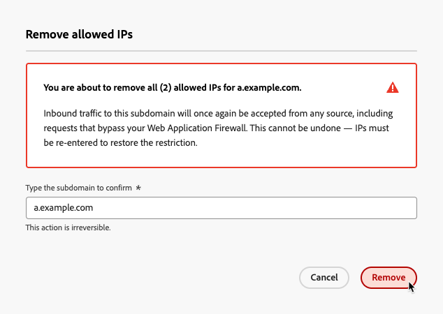

# 管理允许的IP {#waf-ip-allowlist}

>[!BEGINSHADEBOX]

**在此页面上：**&#x200B;直接在[!DNL Journey Optimizer]中添加和管理每个委派子域的Web应用程序防火墙(WAF)出口IP，以便只有通过防火墙路由的流量才能访问由[!DNL Journey Optimizer]托管的链接。

>[!ENDSHADEBOX]

具有严格网络安全要求的组织（如金融部门的组织）可以要求对[!DNL Adobe Journey Optimizer]托管的链接的所有请求都必须通过客户管理的&#x200B;**Web应用程序防火墙** (WAF)才能访问Adobe网络。 任何绕过防火墙的请求都必须被拒绝。

[!DNL Journey Optimizer]允许管理员为每个委派的子域配置其WAF的公共出口IP。 设置后，只有来自这些IP的流量才能到达相应的子域。 所有其他入站请求（包括绕过防火墙的直接请求）都会被拒绝。

## 工作原理 {#waf-ip-allowlist-how-it-works}

为子域启用仅WAF路由需要两个步骤，如下所述。

1. **DNS重定向**：必须更新子域的DNS记录，以将流量路由到组织的WAF，而不是直接路由到Adobe的网络边缘。
1. **WAF出口IP声明**：您的组织在[!DNL Journey Optimizer]中提供WAF的公共出口IP。 这些是防火墙用于向Adobe发送请求的IP。

一旦两者都准备就绪，通信流将按如下方式工作：

1. 收件人单击了[!DNL Adobe Journey Optimizer]通信中的链接。
1. 该请求将发送到您组织的WAF，并根据您的安全策略对其进行检查和过滤。
1. WAF从其声明的出口IP之一将请求转发到Adobe的网络边缘。
1. [!DNL Journey Optimizer]根据子域的允许列表检查传入请求的源IP。
   - 当请求通过→正常处理→，**IP匹配**。
   - **IP不匹配**，→请求绕过WAF→**被拒绝并出现403禁止错误**。 收件人看到断开的链接。

对于未配置允许的IP的子域的请求不会受到影响，并继续像之前一样工作。

## 护栏和约束 {#waf-ip-allowlist-guardrails}

| 控件 | 详细信息 |
| --- | --- |
| **IP格式** | 已接受IPv4、IPv6和CIDR范围。 在保存之前内联拒绝格式错误的值。 |
| **防止重复** | 同一子域中没有重复的IP。 可以在不同的子域中使用相同的IP。 |
| **保留范围警告** | 当输入专用/保留范围时，会显示非阻塞警告（WAF出口IP通常是公共的）。 |
| **仅委派子域** | 只能选择已委派和已验证的子域。 |
| **每个子域上限** | 每个子域最多&#x200B;**50个IP条目**。 |
| **锁定保护** | 完全删除时键入确认；每当操作将重新打开子域以向所有流量显示时，出现显式警告。 |

>[!CAUTION]
>
>配置错误会立即中断受影响子域上的所有链接。

如果保存了错误的WAF出口IP，[!DNL Journey Optimizer]将拒绝该子域的每个传入请求，包括来自单击通信中链接的真实收件人的合法请求，这些收件人将收到403错误页面。

保存之前，请始终与安全团队确认确切的出口IP，如果可能，请首先在非生产子域上测试。

## 访问和管理允许的IP {#waf-ip-allowlist-access}

>[!NOTE]
>
>要访问和管理IP允许列表，您必须具有&#x200B;**[!UICONTROL 查看允许的IP]**&#x200B;和&#x200B;**[!UICONTROL 管理允许的IP]**&#x200B;权限。 [了解详情](../administration/ootb-permissions.md)

要访问Web应用程序防火墙允许IP的子域列表，请转到&#x200B;**[!UICONTROL 管理]** > **[!UICONTROL 渠道]** > **[!UICONTROL 常规设置]**，然后选择&#x200B;**[!UICONTROL 允许列表- IP]**。

{width="90%"}

清单页面列出了所有渠道类型（电子邮件、登陆页、短信、Web）中至少允许一个WAF IP的所有子域。 在[本节](about-subdomain-delegation.md)中了解子域的更多信息。

该列表显示了每个子域允许的IP数以及上次修改的作者。

您可以按渠道类型筛选清单，并按子域名搜索。

## 将IP添加到允许列表 {#waf-ip-allowlist-add}

>[!CONTEXTUALHELP]
>id="ajo_waf_allowed_ips"
>title="输入选定子域的WAF允许的IP"
>abstract="选择一个委派的子域，然后输入Web应用程序防火墙的公共出口IP。 保存后，[!DNL Journey Optimizer]将拒绝来自已声明IP之一的非该子域的任何入站请求。 保存之前，请始终与您的安全团队确认确切的出口IP。"

要将Web应用程序防火墙IP添加到给定子域的允许列表中，请执行以下步骤。

1. 在&#x200B;**[!UICONTROL 允许列表- IP]**&#x200B;清单中，单击&#x200B;**[!UICONTROL 添加允许的IP]**&#x200B;按钮。

1. 从&#x200B;**[!UICONTROL 子域]**&#x200B;下拉列表中选择目标子域。 在所有受支持的渠道类型中，仅列出[已委派的子域](delegate-subdomain.md)：电子邮件、登陆页、短信和Web。

1. 在&#x200B;**[!UICONTROL IP地址]**&#x200B;字段中，输入WAF的公共出口IP。 支持IPv4、IPv6和CIDR范围（例如，`203.0.113.42`、`2001:db8::1`、`203.0.113.0/24`）。

   每个有效的非重复条目在添加之前都会内联验证。 每个子域&#x200B;**最多可添加** 50个IP条目。

   

   >[!IMPORTANT]
   >
   >当输入专用IP范围或保留的IP范围（RFC 1918、环回、链路本地）时，将显示警告。 WAF出口IP通常是公共地址。

1. 如果需要，您可以通过单击芯片上的&#x200B;**✕**&#x200B;图标，从列表中删除IP。

1. 单击&#x200B;**[!UICONTROL 保存]**。 允许列表将应用并传播到边缘。 子域显示在清单中，其IP将立即执行。

现在，来自任何非此列表的IP对此子域的任何请求都将被拒绝。

>[!CAUTION]
>
>请确保您向安全团队确认了这些IP — 不正确的值将破坏此子域上的所有链接。

## 编辑允许的IP {#waf-ip-allowlist-edit}

要更新现有子域允许的IP，请单击清单中的子域名。

**子域**&#x200B;字段为只读<!--as well as the Channel field--> — 创建后无法更改。

使用输入字段添加新IP，或通过单击每个芯片上的&#x200B;**✕**&#x200B;图标删除现有IP。

>[!IMPORTANT]
>
>从子域中删除最后一个IP会将其重新打开以接收所有入站流量。

## 删除允许的IP {#waf-ip-allowlist-remove}

要从子域的允许列表中删除所有IP，请使用清单中“操作”列的“删除”图标。 这将完全解除该子域的WAF限制。

允许IP列表的“操作”列中的

确认弹出窗口打开。 键入要确认的确切子域名，然后单击&#x200B;**[!UICONTROL 删除]**。

{width="80%"}

>[!WARNING]
>
>确认后，此操作将删除您输入的子域的所有允许列表IP。 将再次接受来自任何来源的入站流量，包括绕过Web应用程序防火墙的请求。 无法撤消此操作 — 必须重新输入IP才能恢复限制。

删除所有IP后，子域不再显示在清单中。 您可以随时通过为此子域再次添加IP来重新配置它。
