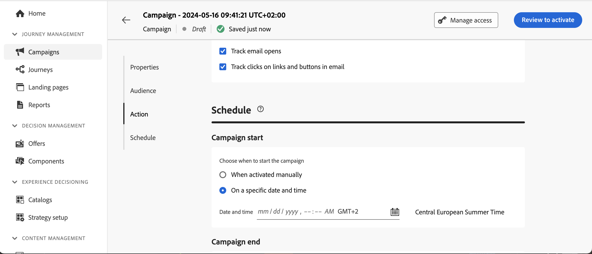

# 根据渠道和通信类型设置频率上限 {#rule-sets}

**渠道**&#x200B;规则集将上限规则应用于通信渠道。 例如，每天发送的电子邮件或短信通信不得超过1个。

利用渠道规则集，可设置按通信类型划分的频率封顶，以防止对具有类似消息的客户造成过载。 例如，您可以创建一个规则集以限制发送给客户的&#x200B;**促销通信**&#x200B;的数量，并创建另一个规则集以限制发送给客户的&#x200B;**新闻稿**&#x200B;的数量。 根据要创建的促销活动类型，您可以选择应用促销通信或新闻稿规则集。

## 创建渠道频率上限规则

>[!CONTEXTUALHELP]
>id="ajo_rule_sets_channel"
>title="定义规则应用到的渠道"
>abstract="请至少选择一个渠道。对所有渠道的总计数应用频次封顶。"

要创建渠道规则集，请执行以下步骤：

>[!NOTE]
>
>您最多可以为渠道域和历程域创建10个活动的本地规则集。

1. 访问&#x200B;**[!UICONTROL 规则集]**&#x200B;列表，然后单击&#x200B;**[!UICONTROL 创建规则集]**。

   

1. 选择要添加上限规则的规则集，或创建新规则集：

   * 要使用现有规则集，请从列表中选择该规则集。 只能将渠道上限规则添加到具有“渠道”域的规则集。 您可以在&#x200B;**[!UICONTROL 域]**&#x200B;列的规则集列表中检查此信息。

     

   * 要在新规则集中创建上限规则，请单击&#x200B;**[!UICONTROL 创建规则集]**，为规则集指定唯一名称并从&#x200B;**[!UICONTROL 规则集域]**&#x200B;下拉列表中选择“渠道”，然后单击&#x200B;**[!UICONTROL 保存]**。

     

1. 在规则集屏幕中，单击&#x200B;**[!UICONTROL 添加规则]**&#x200B;按钮并定义规则的唯一名称。

1. **类别**&#x200B;字段指定规则适用的消息类别。 目前，此字段为只读，因为只有&#x200B;**[!UICONTROL Marketing]**&#x200B;类别可用。

   

1. 从&#x200B;**[!UICONTROL 持续时间]**&#x200B;下拉列表中，选择是每月、每周还是每日应用上限。 频率上限基于所选的日历期间。 它会在相应时间范围的开头重置。

   各期间计数器到期如下：

   * **[!UICONTROL 每月]**：频率上限在每月最后一天23:59:59 UTC之前有效。 例如，1月的每月到期时间为01-31 23:59:59 UTC。

   * **[!UICONTROL 每周]**：频率上限有效期到星期六23:59:59 UTC，因为日历周从星期日开始。 无论规则是在何时创建的，有效期都适用。 例如，如果规则是在星期四创建的，则此规则的有效期到星期六23:59:59。

   * **[!UICONTROL 每日]**：每日频率上限在23:59:59 UTC之前的该天有效，并在第二天开始时重置为0。

     >[!CAUTION]
     > 
     >要保证每日频率上限规则的准确性，请确保在创作营销活动或历程时选择优先级最高的命名空间。在 [Platform 身份标识服务指南](https://experienceleague.adobe.com/zh-hans/docs/experience-platform/identity/features/identity-graph-linking-rules/namespace-priority){target="_blank"}中详细了解命名空间优先级

   请注意，一旦传递通信，配置文件计数器值将更新。 当您发送大量通信时，请注意这一点，因为吞吐量可能导致收件人收到电子邮件时间达到通信启动后的几分钟甚至几小时（如果您同时发送数百万条通信）。

   如果收件人收到两个彼此靠近的通信，则这一点很重要。 我们建议将通信间隔至少两小时，在可能的情况下，为收件人提供充足的时间来接收通信，并相应地更新计数器值。

1. 设置规则的上限，即根据您在上面的选择，每月、每周或每天可以向单个用户配置文件发送的最大消息数。

1. 选择要用于此规则的渠道： **[!UICONTROL 电子邮件]**、**[!UICONTROL 短信]**、**[!UICONTROL 推送通知]**&#x200B;或&#x200B;**[!UICONTROL 直邮]**。

1. 如果要将上限应用到所有选定渠道的总数，请选择多个渠道。

   例如，将上限设置为5，然后选择电子邮件和短信渠道。 如果某个用户档案在选定时间段内已收到3封营销电子邮件和2封营销短信，则该用户档案将从任何营销电子邮件或短信的下一个投放中排除。

1. 单击&#x200B;**[!UICONTROL 保存]**&#x200B;以确认创建规则。 您的消息已添加到规则集，状态为&#x200B;**[!UICONTROL 草稿]**。

   

1. 重复上述步骤，根据需要向规则集添加任意数量的规则。

1. 当上限规则准备好应用于消息时，激活规则集和已添加该规则的规则。 [了解如何激活规则集](../conflict-prioritization/rule-sets.md#create)

## 将规则集应用到消息 {#apply-frequency-rule}

要将规则集应用到消息，请执行以下步骤：

1. 创建历程或营销活动消息时，选择为规则集定义的渠道之一并编辑消息的内容

1. 在内容版本屏幕中，单击&#x200B;**[!UICONTROL 添加业务规则]**&#x200B;按钮。

1. 选择您创建的规则集。

   

   >[!NOTE]
   >
   >列表中只显示[激活的](#activate-rule)规则集。

   <!--Messages where the category selected is **[!UICONTROL Transactional]** will not be evaluated against business rules.-->

1. 在激活历程或营销活动之前，请确保将其计划在将来的至少20分钟后执行。

   这样就有足够的时间在配置文件上为您选择的业务规则填充计数器值。 如果立即激活营销活动，规则集计数器值将不会填充在收件人的用户档案中，并且消息将不会计入其自定义规则集的频率上限规则中。

   

1. 您可以在[Customer Journey Analytics报告](../reports/report-gs-cja.md)和[实时报告](../reports/live-report.md)中查看从投放中排除的用户档案数，其中频率规则将列为用户被排除投放的可能原因。

>[!NOTE]
>
>同一渠道可以应用多个规则，但一旦到达下限，用户档案将从下次投放中排除。

在测试频率规则时，建议使用新创建的[测试配置文件](../audience/creating-test-profiles.md)，因为一旦达到配置文件的频率上限，就无法在下一时间段之前重置计数器。 停用规则将允许有上限的用户档案接收消息，但不会移除或删除任何计数器增量。

<!--
## Example: combine several rules {#frequency-rule-example}

You can combine several message frequency rules, such as described in the example below.

1. [Create a rule](#create-new-rule) called *Overall Marketing Capping*:

   * Select all channels.
   * Set capping to 12 monthly.

   

1. To further restrict the number of marketing-based push notifications that a user is sent, create a second rule called *Push Marketing Cap*:

   * Select Push channel.
   * Set capping to 4 monthly.

   

1. Save and [activate](#activate-rule) the rule.

1. [Create a message](../building-journeys/journeys-message.md) for every channel you want to communicate through and select the **[!UICONTROL Marketing]** category for each message. [Learn how to apply a frequency rule](#apply-frequency-rule)

   

In this scenario, an individual profile:
* can receive up to 12 marketing messages per month;
* but will be excluded from marketing push notifications after they have received 4 push notifications.-->

## 操作说明视频 {#video}

>[!VIDEO](https://video.tv.adobe.com/v/3435531?quality=12)
