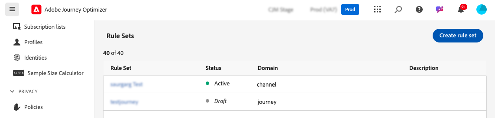
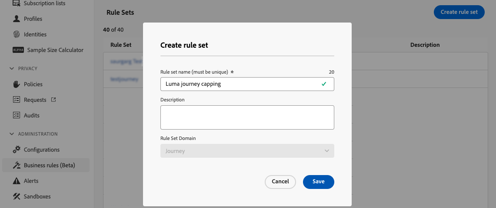
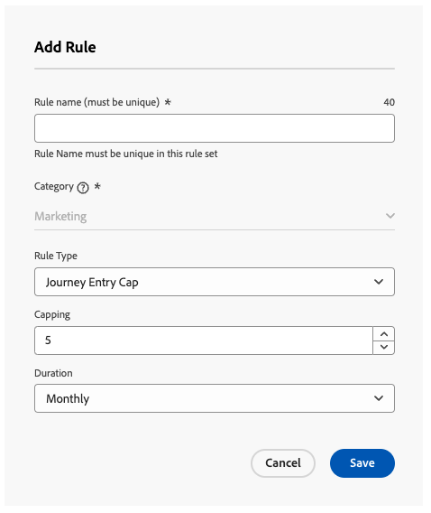
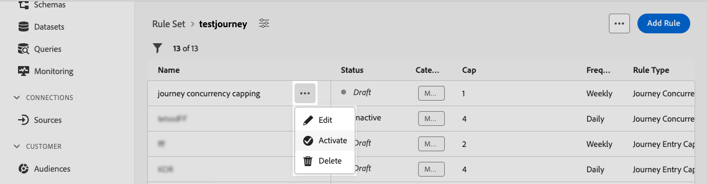

# 历程上限和仲裁 {#journey-capping}

>[!AVAILABILITY]
>
>冲突和优先级功能目前面向部分客户有限发布。请注意，未来将会逐步面向更多用户推出这些功能。如果有兴趣加入这些功能的试用候选名单，请联系您的客户团队。

历程上限可帮助您限制配置文件可注册的历程数，防止通信过载。 在Journey Optimizer中，您可以设置两种类型的上限规则：

* **条目上限**&#x200B;限制配置文件在给定时间段内的历程条目数。
* **并发上限**&#x200B;限制可同时注册用户档案的历程数。

这两种类型的历程上限都利用优先级得分来仲裁条目。

>[!AVAILABILITY]
>
>**历程**&#x200B;域规则集仅对有限的用户集可用（有限可用性）。 要获得访问权限，请与 Adobe 代表联系。

➡️ [通过观看视频了解此功能](#video)

## 创建历程频次封顶规则 {#create-rule}

>[!CONTEXTUALHELP]
>id="ajo_rule_set_concurrency_prioritization"
>title="优先级展望"
>abstract=" 如果在此指定的时段内安排了较高优先级的历程，则将禁止客户进入此历程。对于希望按先后顺序进入历程的情况，我们建议选择“每日”展望时段，并确保当天任何其他历程的优先级分数低于该历程的优先级分数。向历程提供 100 分的优先级也可确保进入该历程。"

>[!CONTEXTUALHELP]
>id="ajo_rule_set_rule_type"
>title="规则类型"
>abstract="指定规则的频次封顶类型。**[!UICONTROL 历程入口上限]**&#x200B;限制轮廓在给定时间段内进入历程的次数，同时&#x200B;**[!UICONTROL 历程并发上限]**&#x200B;限制了一个轮廓可以同时注册的行程数量。"

要创建历程上限规则，请执行以下步骤：

1. 导航到&#x200B;**[!UICONTROL 业务规则]**&#x200B;菜单以访问规则集清单。

1. 选择要添加上限规则的规则集，或创建新规则集：

   * 要使用现有规则集，请从列表中选择该规则集。 只能将历程上限规则添加到具有“journey”域的规则集。 您可以在&#x200B;**[!UICONTROL 域]**&#x200B;列的规则集列表中检查此信息。

     

   * 要在新规则集中创建上限规则，请单击&#x200B;**[!UICONTROL 创建规则集]**，为规则集指定唯一名称并从&#x200B;**[!UICONTROL 规则集域]**&#x200B;下拉列表中选择“历程”，然后单击&#x200B;**[!UICONTROL 保存]**。

     

1. 在规则集屏幕中，单击&#x200B;**[!UICONTROL 添加规则]**&#x200B;按钮，然后根据需要配置规则：

   

   * 为规则提供唯一的名称。

   * 在&#x200B;**[!UICONTROL 规则类型]**&#x200B;下拉列表中，指定规则的上限类型。

      * **[!UICONTROL 历程进入次数上限]**：限制配置文件在给定时间段内进入历程的条目数。
      * **[!UICONTROL 历程并发上限]**：限制可同时注册用户档案的历程数。

   * 展开以下部分以了解如何配置每种类型的上限：

     +++配置历程条目上限规则

      1. 在&#x200B;**[!UICONTROL 上限]**&#x200B;字段中，设置配置文件可以输入的最大历程数。
      1. 在&#x200B;**[!UICONTROL 持续时间]**&#x200B;字段中，定义要考虑的时间段。 请注意，持续时间基于UTC时区。 例如，每日上限将在UTC午夜重置。

     >[!AVAILABILITY]
     >
     >“每日”持续时间仅适用于一组组织（限量发布）。 要获得访问权限，请与 Adobe 代表联系。

     在本例中，我们希望限制用户档案在一个月内输入超过“5”个历程。

     

     >[!NOTE]
     >
     >系统将考虑应用了此规则的即将计划历程的优先级。
     >
     >在本例中，如果营销人员已输入4个历程，并且本月有另一个具有较高优先级的计划历程，则将禁止客户进入较低优先级的历程。

+++

     +++配置历程并发上限规则

      1. 在&#x200B;**[!UICONTROL 上限]**&#x200B;字段中，设置用户档案可以同时注册的最大历程数。

      1. 使用&#x200B;**[!UICONTROL 优先级预视]**&#x200B;字段根据所选时段（例如，1天、7天、30天）内的优先级分数仲裁历程条目。 如果配置文件符合多个历程的条件，这有助于优先考虑进入价值更高的历程。

     在本例中，我们希望限制已注册到包含相同规则集的另一个历程的用户档案进入历程。 如果未来7天内的另一个历程的优先级分数更高，则用户档案不会进入此历程。

     {width="50%" zommable="yes"}

+++

1. 当上限规则准备好应用于历程时，单击其名称旁边的省略号按钮以激活它。

   

1. 单击屏幕右上角“添加规则”按钮旁边的省略号按钮激活整个规则集。

   

## 将频次封顶规则应用于历程 {#apply-capping}

>[!CONTEXTUALHELP]
>id="ajo_journey_capping_rule"
>title="将规则集应用于历程"
>abstract="应用规则集，根据频率上限规则将此历程排除到部分受众。"

要将上限规则应用于历程，请访问历程并打开其属性。 在&#x200B;**[!UICONTROL 上限规则]**&#x200B;下拉列表中，选择相关的规则集。 一旦激活历程，规则集中定义的上限规则将生效。

>[!IMPORTANT]
>
>如果立即激活历程，则系统可能需要长达20分钟才能开始抑制客户。 为了防止这种可能性，您可以将历程安排在至少20分钟之后开始。

一旦旅程处于活动状态，如果规则集导致在&#x200B;**[!UICONTROL 历程排除项]**&#x200B;表中从旅程中排除任何内容，则可以签入旅程报告。 [了解如何使用历程报告](../reports/journey-global-report-cja.md)

## 操作说明视频 {#video}

>[!VIDEO](https://video.tv.adobe.com/v/3435530?quality=12)
