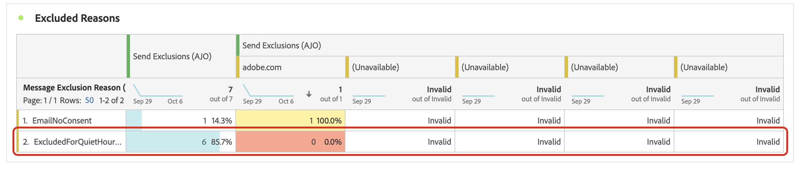

# 设置免打扰时间 {#quiet-hours}

## 什么是安静时间

**安静时间**&#x200B;允许您为&#x200B;**电子邮件**、**短信**、**推送**&#x200B;和&#x200B;**WhatsApp**&#x200B;渠道定义基于时间的排除项。 这可确保在特定时间段内不发送任何消息，从而帮助您尊重客户偏好并满足合规性要求。

您可以通过&#x200B;**规则集**&#x200B;应用免打扰时间并分配给营销活动或历程中的单个操作，以实现精确控制。

通过简化这些流程，您可以增强客户体验、节省时间并确保遵守通信规则：

* **不要唤醒您的客户** - *正确的客户、正确的渠道、正确的时间*&#x200B;是许多营销人员的箴言，因此时间是客户历程的关键部分是有意义的。 通过设置免打扰时间规则，品牌可以更好地控制联系人接收消息的时间，确保他们在更有可能对您的消息采取行动时收到消息。
* **便利** — 在需要阻止受众接收消息而无需停止整个历程或营销活动时，可以轻松拦截营销活动和历程之间的通信。
* **节省时间** — 通过创建基于&#x200B;**时间的规则**&#x200B;在一个位置管理排除项，而不是通过自定义表达式添加多个条件节点。\
  <!--* **Extra Safeguard** - Benefit from an extra safeguard in case audience criteria or time-window configurations were incorrectly set, ensuring individuals are still excluded when they should be.-->

➡️ [通过观看视频了解此功能](#video)

## 护栏和限制

* **支持的渠道** — 电子邮件、短信、推送和WhatsApp。
* **编排的营销活动** — 编排的营销活动不支持免打扰时间。
* **传播延迟** — 对静默小时规则的更新可能需要长达12小时才能应用于已使用该规则的渠道操作。
* **高容量延迟** — 在大容量通信的情况下，系统可能需要额外的时间才能开始成功实施静默小时抑制。

<!--* **Custom actions** – For custom actions, only quiet hours rules are enforced. If a rule set also includes other rules (e.g., frequency capping), those rules are ignored.-->
<!--* **Pre-suppression window** – The system begins suppressing communications 30 minutes before quiet hours start, ensuring that no messages are delivered once the quiet period begins.-->

## 创建无讯息小时数规则

要设置免打扰时间，请在自定义规则集中创建一个规则。 [了解如何创建规则集](../conflict-prioritization/rule-sets.md#Create)。 执行以下步骤：

1. 导航到&#x200B;**[!UICONTROL 业务规则]**&#x200B;以访问规则集清单。

1. 选择现有的自定义规则集或创建新自定义规则集：

   +++在现有规则集中创建无提示小时数规则

   从清单中选择规则集。 只能将免打扰时间规则添加到具有“渠道”域的规则集。 您可以在&#x200B;**[!UICONTROL 域]**&#x200B;列中检查此信息。

   

   +++

   +++在新的规则集中创建免打扰时间规则

   单击&#x200B;**[!UICONTROL 创建规则集]**，输入唯一名称，然后从&#x200B;**[!UICONTROL 规则集域]**&#x200B;下拉列表中选择“渠道”。

   

   +++

   >[!NOTE]
   >
   >安静时间只能在&#x200B;**自定义规则集**&#x200B;中定义。 全局规则集不支持quiet hours配置。

1. 在规则集屏幕中，单击&#x200B;**[!UICONTROL 添加规则]**&#x200B;并为该规则提供一个唯一的名称。

1. **类别**&#x200B;字段指定规则适用的消息类别。 目前，此字段为只读字段，默认为&#x200B;**[!UICONTROL Marketing]**。

1. 在&#x200B;**[!UICONTROL 规则类型]**&#x200B;下拉列表中，选择&#x200B;**[!UICONTROL 无讯息小时数]**。

   

1. 在&#x200B;**[!UICONTROL 日期和时间]**&#x200B;部分中，定义何时应用无提示小时数：

   1. 在&#x200B;**[!UICONTROL 时区]**&#x200B;下拉列表中，将标准时区应用于受众中的所有收件人，而不考虑其各个时区。

      要使用每个配置文件中的时区字段，请选择&#x200B;**[!UICONTROL 使用收件人本地时区]** 。 [了解有关历程中时区管理的更多信息](../building-journeys/timezone-management.md#timezone-from-profiles)

      >[!IMPORTANT]
      >
      >如果配置文件没有时区值，则不会对该配置文件强制实施无提示小时数。

   1. 指定应应用免打扰时间的时间段。

      * **[!UICONTROL 每周]** — 选择一周中的特定日期和时间段。 您还可以强制实施规则&#x200B;**[!UICONTROL 全天]**。

        

      * **[!UICONTROL 自定义日期]** — 在日历和时隙中选择特定日期。 您还可以强制实施规则&#x200B;**[!UICONTROL 全天]**。

        

   1. 单击&#x200B;**[!UICONTROL 添加更多日期]**&#x200B;按钮最多可添加5个单独的句点。

      

1. 在&#x200B;**[!UICONTROL 在免打扰时间处理操作]**&#x200B;部分中，选择在选定时间段内如何处理消息：

   

   * **[!UICONTROL 将消息排入队列]** — 消息在静默时段结束时发送，除非处于暂停状态。

     >[!NOTE]
     >
     >如果消息在配置文件的排队状态中保留超过7天，则将丢弃该消息。

   * **[!UICONTROL 放弃邮件]** — 从不发送邮件。

     >[!NOTE]
     >
     >如果选择&#x200B;**[!UICONTROL 放弃]**&#x200B;并将此规则应用于历程操作，则会从消息投放中删除该用户档案并将其从历程中退出。

规则现在显示在规则集中。 您可以选择它以在属性窗格中显示其详细信息。

如果您的规则已就绪，请激活它并完成规则集的配置。 [了解如何创建和激活规则集](../conflict-prioritization/rule-sets.md#Create)

## 对历程和营销活动应用免打扰时间 {#apply}

保存规则并激活规则集后，您可以将其应用于历程和营销活动中的操作。 支持的渠道： **电子邮件、短信、推送、WhatsApp**。 浏览以下选项卡以了解更多详细信息。

>[!BEGINTABS]

>[!TAB 在历程中应用免打扰时间渠道操作]

1. 打开您的历程，选择[渠道操作](../building-journeys/journey-action.md)，然后编辑消息的内容。
1. 单击&#x200B;**[!UICONTROL 添加业务规则]**&#x200B;按钮，然后选择包含“免打扰时间”规则的规则集。

   

   >[!NOTE]
   >
   >列表中只显示[激活的](#activate-rule)规则集。

1. 激活您的历程。

>[!TAB 对营销活动操作应用免打扰时间]

1. 编辑您的营销活动并访问&#x200B;**[!UICONTROL 操作]**&#x200B;选项卡。
1. 在&#x200B;**[!UICONTROL 业务规则]**&#x200B;部分中，选择包含Quiet hours规则的规则集。

   

   >[!NOTE]
   >
   >列表中只显示[激活的](#activate-rule)规则集。

1. 激活您的营销活动。

>[!ENDTABS]

## 后续步骤

激活并执行您的历程或营销活动后，您可以在[Customer Journey Analytics报告](../reports/report-gs-cja.md)和[实时报告](../reports/live-report.md)中查看从通信中排除的用户档案数，在这些报告中，免打扰时间规则将被列为从投放中排除的用户的可能原因。

<!--

>[!TAB Apply Quiet hours to custom actions]

1. Open your journey and add or select a custom action in the canvas.

1. In the **[!UICONTROL Business rules]** section, select the rule set containing the Quiet hours rule.

   

   >[!NOTE]
   >
   >Only [activated](#activate-rule) rule sets display in the list.

1. Activate your journey.

-->

## 操作方法视频 {#video}

了解如何使用Adobe Journey Optimizer中的“安静时间”功能。

>[!VIDEO](https://video.tv.adobe.com/v/3475862?captions=chi_hans&quality=12)
