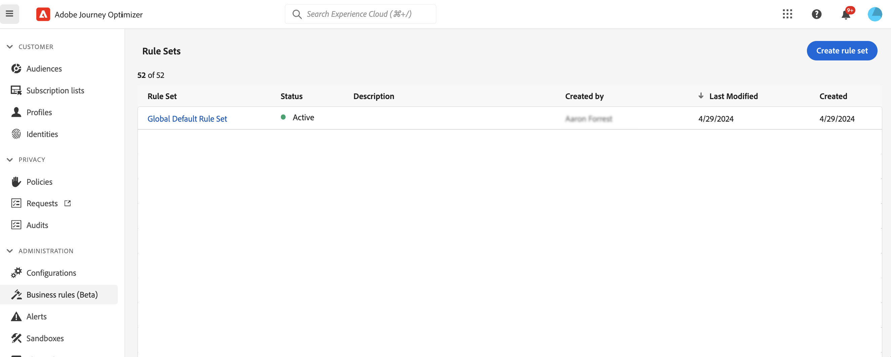
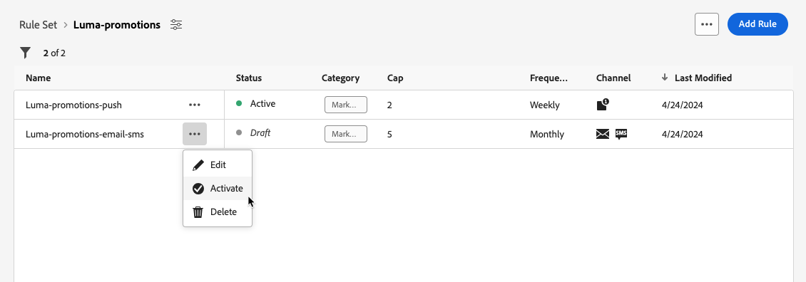
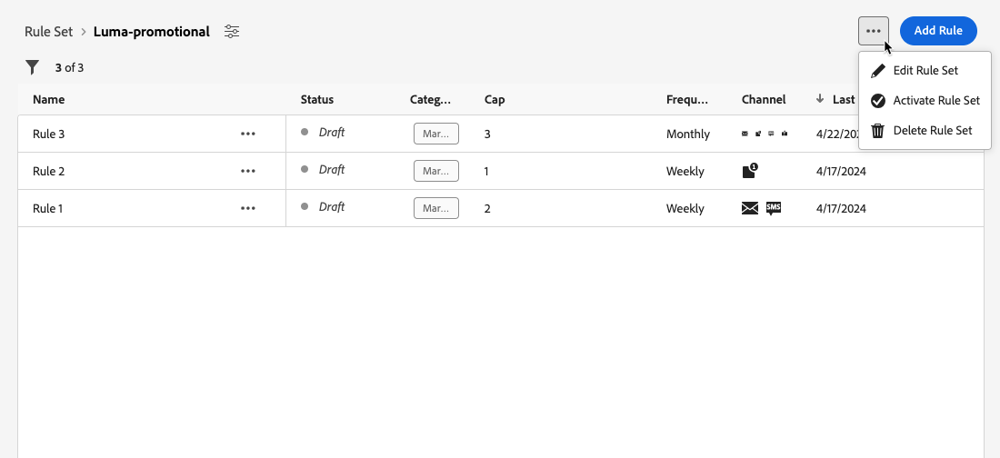

# 使用规则集 {#rule-sets}

>[!CONTEXTUALHELP]
>id="ajo_business_rules_rule_sets"
>title="规则集"
>abstract="使用规则集对不同类型的营销通信应用频次封顶。您还可以根据频次封顶规则创建规则集，以将历程排除在部分受众之外。"

## 规则集入门 {#gs}

### 什么是规则集？ {#what}

规则集允许您&#x200B;**将多个规则分组到规则集**&#x200B;中，并将它们应用于您选择的历程和营销活动。 这提供了改进的粒度，以限制客户在特定时间范围内可以进入的历程次数和频率，或根据通信类型控制用户接收消息的频率。

您可以创建两种类型的规则集：

* **渠道**&#x200B;规则集将上限规则应用于通信渠道。 例如，每天发送的电子邮件或短信通信不得超过1个。
* **历程**&#x200B;规则集将条目和并发上限规则应用于历程。 例如，请勿将用户档案同时输入多个历程。

➡️ [通过观看视频了解此功能](#video)

### 权限 {#permissions-frequency-rules}

要使用业务规则，您需要以下权限：

* **[!UICONTROL 查看频率规则]**：访问和查看业务规则。
* **[!UICONTROL 管理频率规则]**：创建、编辑或删除业务规则。

可在[此部分](../administration/high-low-permissions.md)中详细了解权限。

### 全局和自定义规则集 {#global-custom}

首次从&#x200B;**[!UICONTROL 管理]** > **[!UICONTROL 业务规则]**&#x200B;菜单访问规则集时，默认规则集已预先创建并处于活动状态： **全局默认规则集**。

此规则集包含全局规则，您可以应用这些规则来控制用户跨一个或多个渠道接收消息的频率。 此规则集中定义的所有规则都适用于所有选定的渠道，无论通信是从历程还是营销活动发送。

除了此“全局默认规则集”规则集之外，您还可以创建可应用于任何历程或营销策划以应用特定上限规则的&#x200B;**规则集**。 [了解如何创建自定义规则集](#create)

## 创建和激活规则集 {#Create}

>[!CONTEXTUALHELP]
>id="ajo_rule_set_domain"
>title="规则集域"
>abstract="创建规则集时，您需要指定规则集中的规则是否会强制执行特定于通信渠道或历程的频次封顶规则。"

>[!CONTEXTUALHELP]
>id="ajo_rule_sets_category"
>title="选择消息规则类别"
>abstract="在规则激活并应用到一条消息时，与所选类别匹配的所有频率规则将自动应用于该消息。目前只有营销类别可用。"

<!--NOT USED?
[!CONTEXTUALHELP]
>id="ajo_rule_sets_capping"
>title="Set the capping for your rule"
>abstract="Specify the maximum number of messages sent to a customer profile within the chosen time frame. The frequency cap will be based on the selected calendar period and will be reset at the beginning of the corresponding time frame."-->

>[!CONTEXTUALHELP]
>id="ajo_rule_sets_duration"
>title="选择消息规则类别"
>abstract="在规则激活并应用到一条消息时，与所选类别匹配的所有频率规则将自动应用于该消息。目前只有营销类别可用。"

>[!CONTEXTUALHELP]
>id="ajo_rule_set_rule_capping"
>title="规则上限"
>abstract="设置规则的频次封顶。根据规则集域和规则类型字段中的选择，此字段可以定义发送到用户档案的最大消息数，或者用户档案可以输入或同时注册的最大历程数。"

要创建规则集，请执行以下步骤。

>[!NOTE]
>
>您最多可以创建3个渠道域的本地规则集和5个历程域的本地规则集。

1. 访问&#x200B;**[!UICONTROL 规则集]**&#x200B;列表，然后单击&#x200B;**[!UICONTROL 创建规则集]**。

   

1. 为规则集定义唯一名称并添加说明。

1. 选择规则集的域，然后单击&#x200B;**[!UICONTROL 保存]**。

   * **渠道**&#x200B;域：对通信渠道应用上限规则。
   * **历程**&#x200B;域：将条目和并发上限规则应用于旅程。

   

1. 定义要添加到此规则集的规则。 为此，请访问规则集并单击&#x200B;**[!UICONTROL 添加规则]**。

1. 根据需要配置规则参数。 可用于规则的参数取决于创建规则集时选择的规则集域。

   有关如何配置历程和渠道上限规则的详细信息，请参阅以下部分：

   * [历程上限](../conflict-prioritization/journey-capping.md)
   * [通过信道和通信类型实现频率封顶](../conflict-prioritization/channel-capping.md)

1. 单击&#x200B;**[!UICONTROL 保存]**&#x200B;以确认创建规则。 您的消息已添加到规则集，状态为&#x200B;**[!UICONTROL 草稿]**。

   

1. 重复上述步骤，根据需要向规则集添加任意数量的规则。

1. 创建规则后，规则处于&#x200B;**[!UICONTROL 草稿]**&#x200B;状态，尚未影响任何消息。 要启用它，请单击规则旁边的&#x200B;**[!UICONTROL 更多操作]**&#x200B;按钮，然后选择&#x200B;**[!UICONTROL 激活]**。

   

1. 激活规则集，以便能够将其应用于您的历程和消息。

   

   >[!NOTE]
   >
   >完全激活规则或规则集最多可能需要20分钟。 您无需修改消息或重新发布历程，规则即可生效。

<!--Currently, once a rule set is activated, no more rules can be added to that rule set.-->

1. 您可以将规则集应用到消息或历程，具体取决于创建规则集时选择的域。

   有关如何应用规则集的详细信息，请参阅以下部分：

   * [将规则集应用到历程](../conflict-prioritization/journey-capping.md#apply-capping)
   * [将上限规则应用于消息](../conflict-prioritization/channel-capping.md#apply)

## 访问和管理规则集 {#access-rule-sets}

所有创建的规则集都显示在&#x200B;**[!UICONTROL 管理]** > **[!UICONTROL 业务规则]**&#x200B;菜单中。 它们按上次修改日期排序。

单击规则集名称可查看和编辑其内容。 将列出该规则集中包含的所有规则。 通过右上方的上下文菜单，您可以编辑规则集的名称和描述，激活并删除规则集。

对于规则集中的每个规则，**[!UICONTROL 更多操作]**&#x200B;按钮允许您编辑规则、激活规则并删除规则。

要停用规则或规则集，请单击所需项目旁边的&#x200B;**[!UICONTROL 更多操作]**&#x200B;按钮，然后选择&#x200B;**[!UICONTROL 停用]**。

其状态将更改为&#x200B;**[!UICONTROL 不活动]**，并且该规则将不应用于未来的消息执行。 当前正在执行的任何消息都不会受到影响。

>[!NOTE]
>
>停用规则或规则集不会影响或重置单个配置文件上的任何计数。

## 操作说明视频 {#video}

>[!VIDEO](https://video.tv.adobe.com/v/3444736?quality=12&captions=chi_hans)
