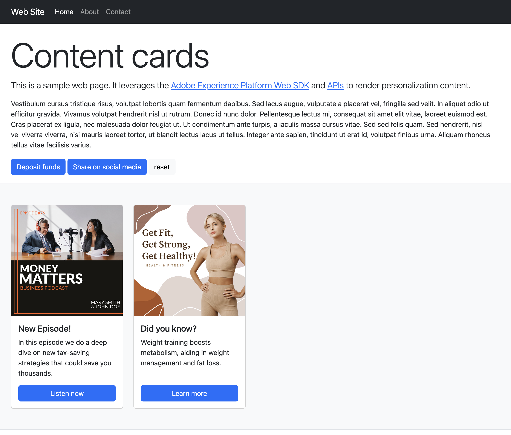
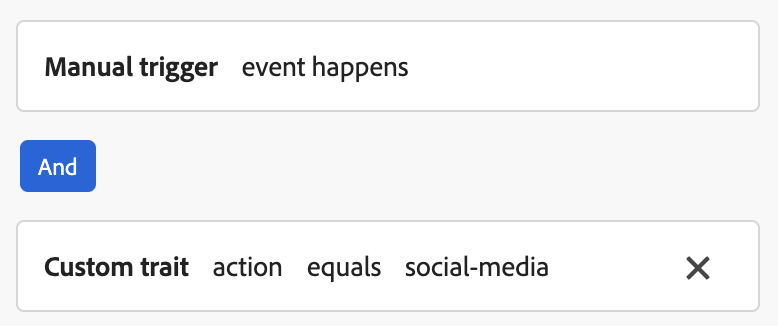

# 在 Web SDK 中配置内容卡支持 {#content-card-configuration-sdk}

此示例展示了如何使用Adobe Experience Platform从Adobe Journey Optimizer (AJO)中检索内容卡片。 通过使用[Adobe Experience Platform Web SDK](https://experienceleague.adobe.com/en/docs/experience-platform/web-sdk/home)，可以在客户端完全获取和呈现个性化内容。

在初始页面加载时，页面显示其默认状态。 但是，如果您与&#x200B;**存款资金**&#x200B;或&#x200B;**在社交媒体上共享**&#x200B;按钮交互，则将显示其他内容卡片。 这些信息卡由客户端条件触发，确保仅在执行特定操作时显示。



## 运行示例 {#run-sample}

>[!PREREQUISITES]
>
>您需要安装node和npm。 [请参阅此文档](https://docs.npmjs.com/downloading-and-installing-node-js-and-npm)


1. 为HTTPS设置本地SSL证书。 这些示例需要本地签名的SSL证书来通过HTTPS提供内容：

   1. 在计算机上安装`mkcert`。

   1. 安装后，运行`mkcert -install`以安装`mkcert root`证书。

1. 将存储库克隆到本地计算机。

1. 打开终端并导航到示例的文件夹。

1. 通过运行`npm install`安装所需的依赖项。

1. 运行`npm start`启动应用程序。

1. 打开Web浏览器并转到`https://localhost`。

## 工作原理 {#setup}

1. 使用示例文件夹中的`.env`文件中的设置包含并配置页面上的[Web SDK](https://experienceleague.adobe.com/en/docs/experience-platform/web-sdk/home)。

   ```
   <script src="https://cdn1.adoberesources.net/alloy/2.18.0/alloy.min.js" async></script>
   alloy("configure", {
       defaultConsent: "in",
       edgeDomain: "{{edgeDomain}}",
       edgeConfigId: "{{edgeConfigId}}",
       orgId:"{{orgId}}",
       debugEnabled: false,
       personalizationStorageEnabled: true,
       thirdPartyCookiesEnabled: false
   });
   ```

1. 使用`sendEvent`命令获取个性化内容。

   ```
   alloy("sendEvent", {
       renderDecisions: true,
       personalization: {
           surfaces: ["web://alloy-samples.adobe.com/#content-cards-sample"],
       },
   });
   ```

1. 使用`subscribeRulesetItems`命令订阅特定界面的内容卡。 每次评估规则集时，处理回调中的结果对象，该回调将包含`propositions`和内容卡数据。

   ```
   const contentCardManager = createContentCardManager("content-cards");
   
   alloy("subscribeRulesetItems", {
       surfaces: ["web://alloy-samples.adobe.com/#content-cards-sample"],
       schemas: ["https://ns.adobe.com/personalization/message/content-card"],
       callback: (result, collectEvent) => {
           const { propositions = [] } = result;
           contentCardManager.refresh(propositions, collectEvent);
       },
   });
   ```

1. 管理内容卡片的呈现，并使用`script.js`中找到的`contentCardsManager`对象发送`interact`和`display`事件。 从收到的建议中提取、排序和处理内容卡片。

   ```
   const createContentCard = (proposition, item) => {
       const { data = {}, id } = item;
       const {
           content = {},
           meta = {},
           publishedDate,
           qualifiedDate,
           displayedDate,
       } = data;
   
       return {
           id,
           ...content,
           meta,
           qualifiedDate,
           displayedDate,
           publishedDate,
           getProposition: () => proposition,
       };
   };
   
   const extractContentCards = (propositions) =>
       propositions
           .reduce((allItems, proposition) => {
           const { items = [] } = proposition;
   
           return [
               ...allItems,
               ...items.map((item) => createContentCard(proposition, item)),
           ];
       }, [])
       .sort(
           (a, b) =>
               b.qualifiedDate - a.qualifiedDate || b.publishedDate - a.publishedDate
       );
   
   const contentCards = extractContentCards(propositions);
   ```

1. 根据为每个营销活动定义的详细信息呈现内容卡片。 每个卡片都包含一个`title`、`body`、`imageUrl`和其他自定义数据值。

   ```
   const renderContentCards = () => {
       const contentCardsContainer = document.getElementById(containerElementId);
       contentCardsContainer.addEventListener("click", handleContentCardClick);
   
       let contents = "";
   
       contentCards.forEach((card) => {
           const { id, title, body, imageUrl, meta = {} } = card;
           const { buttonLabel = "" } = meta;
   
           contents += `
               <div class="col">
                   <div data-id="${id}" class="card h-100">
                       
                       <div class="card-body d-flex flex-column">
                           <h5 class="card-title">${title}</h5>
                           <p class="card-text">${body}</p>
                           <a href="#" class="mt-auto btn btn-primary">${buttonLabel}</a>
                       </div>
                   </div>
                </div>
            `;
       });
   
       contentCardsContainer.innerHTML = contents;
       collectEvent(
           "display",
           contentCards.map((card) => card.getProposition())
        );
   };
   ```

1. 在调用`subscribeRulesetItems`回调时，还会提供一个名为`collectEvent`的方便函数。 此函数用于发送Experience Edge事件，以跟踪交互、显示和其他用户操作。 在此示例中，collectEvent在单击内容卡片时进行跟踪。 此外，如果单击内容卡上的按钮，则浏览器将被定向到营销活动指定的`actionUrl`。

   ```
   const handleContentCardClick = (evt) => {
       const cardEl = evt.target.closest(".card");
   
       if (!cardEl) {
           return;
       }
   
       const isAnchor = evt.target.nodeName === "A";
       const card = contentCards.find((card) => card.id === cardEl.dataset.id);
   
       if (!card) {
           return;
       }
   
       collectEvent("interact", [card.getProposition()]);
   
       if (isAnchor) {
           evt.preventDefault();
           evt.stopImmediatePropagation();
           const { actionUrl } = card;
           if (actionUrl && actionUrl.length > 0) {
               window.location.href = actionUrl;
           }
       }
   };
   ```

## 主要意见 {#key-observations}

### personalizationStorageEnabled

`configure`命令中的`personalizationStorageEnabled`选项设置为`true`。 这可确保存储以前限定的内容卡片，并在用户会话间继续显示这些卡片。

### 触发因素

内容卡支持在客户端评估的自定义触发器。 满足触发器规则时，将显示其他内容卡片。 此示例使用四个不同的营销活动，每个内容卡一个活动，所有活动共享同一表面： `web://alloy-samples.adobe.com/#content-cards-sample`。 下表概述了每个活动的触发器规则以及如何满足这些规则。

<table>
    <tr>
        <th>触发器规则</th>
        <th>卡片</th>
        <th>如何满足触发器规则</th>
    </tr>
    <tr>
        <td>None</td>
        <td></td>
        <td>sendEvent命令。 没有要满足的客户端规则。</td>
    </tr>
    <tr>
        <td>None</td>
        <td></td>
        <td>sendEvent命令。 没有要满足的客户端规则。</td>
    </tr>
    <tr>
        <td></td>
        <td></td>
        <td></td>
    </tr>
    <tr>
        <td></td>
        <td></td>
        <td></td>
    </tr>
</table>

在单击“存款资金”和“在社交媒体上分享”按钮时，会触发`evaluateRulesets`命令。 每个按钮都指定了相关的`decisionContext`以履行为各个营销活动定义的规则。

```
document.getElementById("action-button-1").addEventListener("click", () => {
    alloy("evaluateRulesets", {
        renderDecisions: true,
        personalization: {
            decisionContext: {
                action: "deposit-funds",
            },
        },
    });
});

document.getElementById("action-button-2").addEventListener("click", () => {
    alloy("evaluateRulesets", {
        renderDecisions: true,
        personalization: {
            decisionContext: {
                action: "social-media",
            },
        },
    });
});
```
