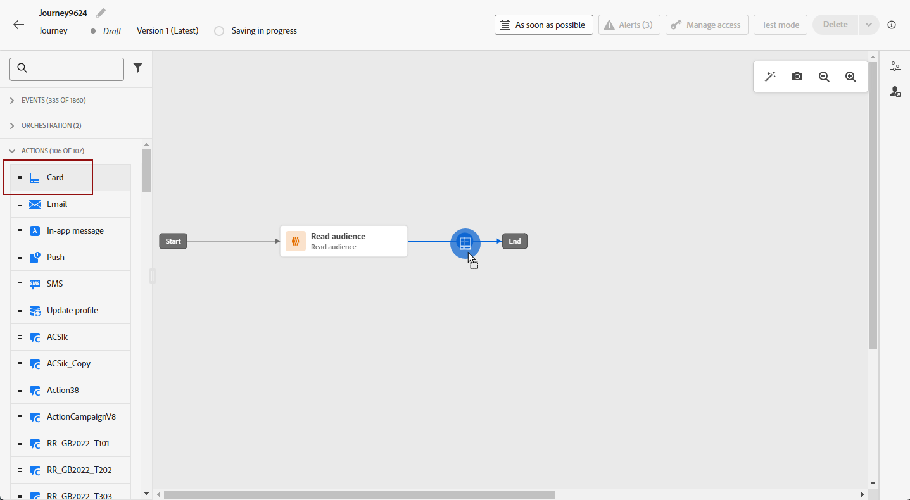
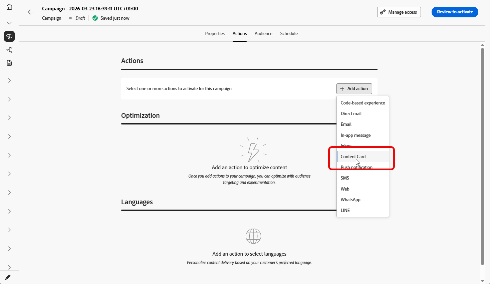
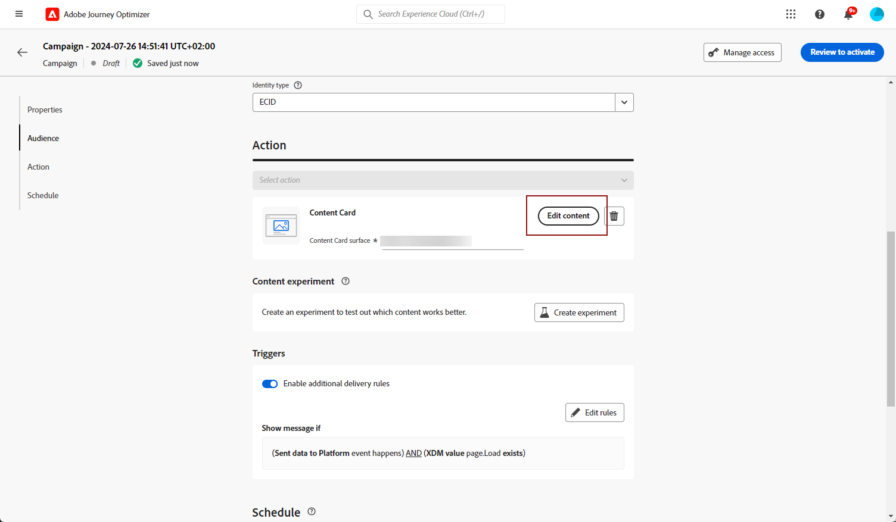

# 创建内容卡片 {#create-content-card}

>[!BEGINSHADEBOX]

**在此页面上：**&#x200B;创作内容卡并在历程或营销活动中定义其内容，以便您可以使用选择的投放规则提供个性化的应用程序内体验。

>[!ENDSHADEBOX]

>[!CONTEXTUALHELP]
>id="ajo_journey_action_content_card"
>title="内容卡操作"
>abstract="内容卡入站操作在用户到达历程的此步骤时，向用户档案显示内容卡。 标签在历程画布中标识活动，并且操作引用定义所显示内容的内容卡配置。 **优化**&#x200B;部分可以包括内容实验或定位规则。 在此活动后自动插入&#x200B;**等待**&#x200B;节点（默认为3天），从而为用户档案提供查看内容卡的时间。"
>additional-url="https://experienceleague.adobe.com/zh-hans/docs/journey-optimizer/using/orchestrate-journeys/about-journey-building/journey-action#add-action" text="渠道操作入门"

内容卡是应用程序内入站体验，可直接在移动应用程序的专用界面中显示个性化内容，如促销活动、公告或推荐。 与中断消息不同，此类消息在应用程序中保持可用，直到用户解除此类消息或您的投放规则隐藏它们。

此页面介绍如何在[历程](../building-journeys/journey-gs.md)或[营销活动](../campaigns/create-campaign.md)中创作内容卡并定义其内容。 添加后，您可以设计信息卡，设置其他投放规则来控制信息卡的显示、取消或永久隐藏时间，并运行内容实验以优化其性能。

>[!IMPORTANT]
>
>默认情况下，“关闭”按钮会隐藏卡片。 要添加更多功能，您可以手动定义解除或取消资格规则。

>[!BEGINTABS]

>[!TAB 将内容卡片添加到历程]

要将内容卡添加到历程，请执行以下步骤：

1. 打开您的[历程](../building-journeys/journey-gs.md)，然后从面板的&#x200B;**[!UICONTROL 操作]**&#x200B;部分拖放&#x200B;**[!UICONTROL 操作]**&#x200B;活动。 了解有关[操作活动](../building-journeys/journey-action.md)的详细信息。

   >[!IMPORTANT]
   >
   >自2026年3月发行版起，弃用旧版本机渠道活动（电子邮件、推送、短信、应用程序内、Web、基于代码的体验和内容卡）。 使用这些活动的现有历程可以继续工作，且不会发生任何更改 — 无需迁移。

1. 选择&#x200B;**[!UICONTROL 卡片]**&#x200B;作为操作类型。

   

   >[!NOTE]
   >
   >由于&#x200B;**卡片**&#x200B;是入站体验活动，因此它附带3天&#x200B;**等待**&#x200B;活动。 [了解详情](../building-journeys/wait-activity.md#auto-wait-node)

1. 输入&#x200B;**[!UICONTROL 标签]**&#x200B;以在历程画布中标识您的操作。

1. 单击&#x200B;**[!UICONTROL 配置操作]**&#x200B;按钮。

1. 您被定向到&#x200B;**[!UICONTROL 操作]**&#x200B;选项卡。 从该位置，选择或创建要使用的内容卡配置。 [了解详情](content-card-configuration.md)

   

1. 您现在可以使用&#x200B;**[!UICONTROL 编辑内容]**&#x200B;按钮开始设计内容。 [了解详情](design-content-card.md)

1. 启用&#x200B;**[!UICONTROL 启用其他传递规则]**&#x200B;选项，然后选择&#x200B;**[!UICONTROL 编辑规则]**&#x200B;以定义何时应显示、取消或永久隐藏您的消息。

   

   1. 单击&#x200B;**[!UICONTROL 添加条件]**&#x200B;以选择您的事件。

      +++ 查看可用事件

      | 包 | 触发器 | 定义 |
      |---|---|---|
      | 将数据发送到Platform | 将数据发送到Platform | 在移动设备应用程序发出边缘体验事件以将数据发送到Adobe Experience Platform时触发。 API通常会从AEP Edge扩展调用[sendEvent](https://developer.adobe.com/client-sdks/documentation/edge-network/api-reference/#sendevent)。 |
      | 核心跟踪 | 跟踪操作 | 在调用移动设备代码API [trackAction](https://developer.adobe.com/client-sdks/documentation/mobile-core/api-reference/#trackaction)中提供的旧版功能时触发。 |
      | 核心跟踪 | 跟踪状态 | 在调用移动设备代码API [trackState](https://developer.adobe.com/client-sdks/documentation/mobile-core/api-reference/#trackstate)中提供的旧版功能时触发。 |
      | 核心跟踪 | 收集PII | 在调用移动设备代码API [collectPII](https://developer.adobe.com/client-sdks/documentation/mobile-core/api-reference/#collectpii)中提供的旧版功能时触发。 |
      | 应用程序生命周期 | 应用程序启动 | 在每次运行时触发，包括崩溃次数和安装次数。 在超出生命周期会话超时后，当从背景恢复应用程序时也会触发。 |
      | 应用程序生命周期 | 应用程序安装 | 安装或重新安装后，在首次运行时触发。 |
      | 应用程序生命周期 | 应用程序更新 | 升级后或版本号变更后，在首次运行时触发。 |
      | 应用程序生命周期 | 应用程序关闭 | 在应用程序关闭时触发。 |
      | 应用程序生命周期 | 应用程序崩溃 | 当应用程序在关闭前未转入背景时触发。 当应用程序在崩溃后启动时会发送该事件。 Adobe Mobile 崩溃报告不实施全局未捕获异常处理程序。 |

      +++

   1. 如果要添加更多&#x200B;**[!UICONTROL 触发器]**，请选择&#x200B;**[!UICONTROL 或]**&#x200B;条件以进一步扩展规则。

   1. 如果要添加&#x200B;**[!UICONTROL 特征]**&#x200B;并更好地优化规则，请选择&#x200B;**[!UICONTROL 和]**&#x200B;条件。

      +++ 查看可用的特征

      | 包 | 特征 | 定义 |
      |---|---|---|
      | 设备信息 | 运营商名称 | 当满足列表中的运营商名称之一时触发。 |
      | 设备信息 | 设备名称 | 当满足设备名称之一时触发。 |
      | 设备信息 | 区域设置 | 当满足列表中的一种语言时触发。 |
      | 设备信息 | 操作系统版本 | 当满足指定的操作系统版本之一时触发。 |
      | 设备信息 | 以前的操作系统版本 | 当满足指定的先前操作系统版本之一时触发。 |
      | 设备信息 | 运行模式 | 如果运行模式为应用程序或扩展，则会触发。 |
      | 应用程序生命周期 | 应用程序 ID | 当满足指定的应用程序ID时触发。 |
      | 应用程序生命周期 | 每周时间 | 当满足一周中的指定日期时触发。 |
      | 应用程序生命周期 | 首次使用后间隔天数 | 当满足自首次使用以来的指定天数时触发。 |
      | 应用程序生命周期 | 上次使用后间隔天数 | 当满足自上次使用后指定的天数时触发。 |
      | 应用程序生命周期 | 升级后间隔天数 | 当满足自上次升级以来的指定天数时触发。 |
      | 应用程序生命周期 | 安装日期 | 当满足指定的安装日期时触发。 |
      | 应用程序生命周期 | 启动次数 | 当满足指定的启动次数时触发。 |
      | 应用程序生命周期 | 时间 | 当满足指定的时间时触发。 |

      +++

   1. 单击“**[!UICONTROL 创建组]**”将触发器组合在一起。

1. 您可以通过单击&#x200B;**[!UICONTROL 添加操作]**&#x200B;按钮，向内容卡添加一个或多个入站操作。 [了解详情](../building-journeys/journey-action.md#multi-action)

1. 返回历程画布。 如有必要，请通过拖放其他操作或事件来完成旅程流程。 [了解详情](../building-journeys/about-journey-activities.md)

有关如何创建、配置和发布历程的详细信息，请参阅[此页面](../building-journeys/journey-gs.md)。

>[!TAB 向营销活动添加内容卡片]

要通过营销活动开始构建内容卡片，请执行以下步骤。

1. 创建营销策划。 [了解详情](../campaigns/create-campaign.md)

1. 选择要执行的营销活动类型

   * **[!UICONTROL 已计划 — 营销]**：立即或在指定日期执行营销活动。 计划的营销活动旨在发送&#x200B;**营销**&#x200B;消息。 它们从用户界面配置和执行。

   * **[!UICONTROL API触发 — 营销/事务性]**：使用API调用执行营销活动。 API触发的营销活动旨在发送&#x200B;**营销活动**&#x200B;或&#x200B;**事务性**&#x200B;消息，即在个人执行操作后发送的消息：密码重置、购物车购买等。[了解如何使用API触发营销活动](../campaigns/api-triggered-campaigns.md)

   

1. 在&#x200B;**[!UICONTROL 属性]**&#x200B;部分中，指定营销活动的名称和描述。

1. 在&#x200B;**受众**&#x200B;部分中，单击&#x200B;**[!UICONTROL 选择受众]**&#x200B;按钮以显示可用Adobe Experience Platform受众列表。 [了解有关受众](../audience/about-audiences.md)的更多信息

1. 在&#x200B;**[!UICONTROL 身份命名空间]**&#x200B;字段中，选择要使用的命名空间，以便识别所选区段中的个人。 [了解有关命名空间的更多信息](../event/about-creating.md#select-the-namespace)

1. 选择&#x200B;**[!UICONTROL 内容卡]**&#x200B;操作。

   

1. 选择或创建新的[内容卡配置](content-card-configuration.md)。

1. 选择定义此&#x200B;**内容卡**&#x200B;的收件箱表面的[收件箱配置](../inbox/inbox-configuration.md)。

   

1. 要测试消息的内容，请单击&#x200B;**[!UICONTROL 创建试验]**。 这样，您就可以在样本群体上测试投放的多个变量，以确定哪种处理方式对目标受众的影响最大。 [了解有关内容试验的更多信息](../content-management/content-experiment.md)。

1. 启用&#x200B;**[!UICONTROL 启用其他传递规则]**&#x200B;选项，然后选择&#x200B;**[!UICONTROL 编辑规则]**&#x200B;以定义何时应显示、取消或永久隐藏您的消息。

   使用规则生成器设置触发这些操作的特定条件。

   1. 单击&#x200B;**[!UICONTROL 添加条件]**&#x200B;以选择您的事件。

      +++ 查看可用事件

      | 包 | 触发器 | 定义 |
      |---|---|---|
      | 将数据发送到Platform | 将数据发送到Platform | 在移动设备应用程序发出边缘体验事件以将数据发送到Adobe Experience Platform时触发。 API通常会从AEP Edge扩展调用[sendEvent](https://developer.adobe.com/client-sdks/documentation/edge-network/api-reference/#sendevent)。 |
      | 核心跟踪 | 跟踪操作 | 在调用移动设备代码API [trackAction](https://developer.adobe.com/client-sdks/documentation/mobile-core/api-reference/#trackaction)中提供的旧版功能时触发。 |
      | 核心跟踪 | 跟踪状态 | 在调用移动设备代码API [trackState](https://developer.adobe.com/client-sdks/documentation/mobile-core/api-reference/#trackstate)中提供的旧版功能时触发。 |
      | 核心跟踪 | 收集PII | 在调用移动设备代码API [collectPII](https://developer.adobe.com/client-sdks/documentation/mobile-core/api-reference/#collectpii)中提供的旧版功能时触发。 |
      | 应用程序生命周期 | 应用程序启动 | 在每次运行时触发，包括崩溃次数和安装次数。 在超出生命周期会话超时后，当从背景恢复应用程序时也会触发。 |
      | 应用程序生命周期 | 应用程序安装 | 安装或重新安装后，在首次运行时触发。 |
      | 应用程序生命周期 | 应用程序更新 | 升级后或版本号变更后，在首次运行时触发。 |
      | 应用程序生命周期 | 应用程序关闭 | 在应用程序关闭时触发。 |
      | 应用程序生命周期 | 应用程序崩溃 | 当应用程序在关闭前未转入背景时触发。 当应用程序在崩溃后启动时会发送该事件。 Adobe Mobile 崩溃报告不实施全局未捕获异常处理程序。 |

      +++

   1. 如果要添加更多&#x200B;**[!UICONTROL 触发器]**，请选择&#x200B;**[!UICONTROL 或]**&#x200B;条件以进一步扩展规则。

   1. 如果要添加&#x200B;**[!UICONTROL 特征]**&#x200B;并更好地优化规则，请选择&#x200B;**[!UICONTROL 和]**&#x200B;条件。

      +++ 查看可用的特征

      | 包 | 特征 | 定义 |
      |---|---|---|
      | 设备信息 | 运营商名称 | 当满足列表中的运营商名称之一时触发。 |
      | 设备信息 | 设备名称 | 当满足设备名称之一时触发。 |
      | 设备信息 | 区域设置 | 当满足列表中的一种语言时触发。 |
      | 设备信息 | 操作系统版本 | 当满足指定的操作系统版本之一时触发。 |
      | 设备信息 | 以前的操作系统版本 | 当满足指定的先前操作系统版本之一时触发。 |
      | 设备信息 | 运行模式 | 如果运行模式为应用程序或扩展，则会触发。 |
      | 应用程序生命周期 | 应用程序 ID | 当满足指定的应用程序ID时触发。 |
      | 应用程序生命周期 | 每周时间 | 当满足一周中的指定日期时触发。 |
      | 应用程序生命周期 | 首次使用后间隔天数 | 当满足自首次使用以来的指定天数时触发。 |
      | 应用程序生命周期 | 上次使用后间隔天数 | 当满足自上次使用后指定的天数时触发。 |
      | 应用程序生命周期 | 升级后间隔天数 | 当满足自上次升级以来的指定天数时触发。 |
      | 应用程序生命周期 | 安装日期 | 当满足指定的安装日期时触发。 |
      | 应用程序生命周期 | 启动次数 | 当满足指定的启动次数时触发。 |
      | 应用程序生命周期 | 时间 | 当满足指定的时间时触发。 |

      +++

   1. 单击“**[!UICONTROL 创建组]**”将触发器组合在一起。

   

1. 您可以将促销活动计划到特定日期，或设置为定期重复。 [了解详情](../campaigns/create-campaign.md#schedule)

1. 您现在可以使用&#x200B;**[!UICONTROL 编辑内容]**&#x200B;开始设计内容。 [了解详情](design-content-card.md)

   

>[!ENDTABS]
