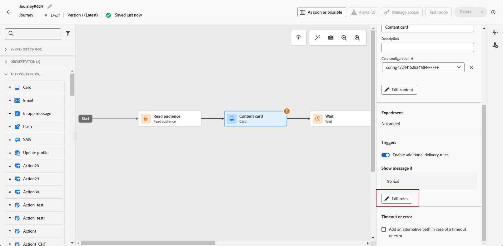

# 创建内容卡 {#create-content-card}

>[!BEGINTABS]

>[!TAB 将内容卡片添加到历程]

要向历程添加内容卡片，请执行以下步骤：

1. 打开您的历程，然后从调色板的&#x200B;**[!UICONTROL 操作]**&#x200B;部分拖放&#x200B;**[!UICONTROL 卡片]**&#x200B;活动。

   

1. 为您的消息输入&#x200B;**[!UICONTROL 标签]**&#x200B;和&#x200B;**[!UICONTROL 描述]**。

1. 选择要使用的[内容卡配置](content-card-configuration.md)。

   

1. 您现在可以使用&#x200B;**[!UICONTROL 编辑内容]**&#x200B;按钮开始设计内容。 [了解详情](design-content-card.md)

1. 启用&#x200B;**[!UICONTROL 启用其他传递规则]**&#x200B;选项。 然后，**[!UICONTROL 编辑规则]**&#x200B;以选择将触发消息的事件和条件。 规则生成器使用户可以指定标准和值，这些标准和值在满足这些标准和值时会触发一组操作。

   

   1. 单击&#x200B;**[!UICONTROL 添加条件]**&#x200B;以选择您的事件。

      +++请参阅可用的事件。

      | 包 | 触发器 | 定义 |
      |---|---|---|
      | 将数据发送到Platform | 将数据发送到Platform | 在移动设备应用程序发出边缘体验事件以将数据发送到Adobe Experience Platform时触发。 API通常会从AEP Edge扩展调用[sendEvent](https://developer.adobe.com/client-sdks/documentation/edge-network/api-reference/#sendevent)。 |
      | 核心跟踪 | 跟踪操作 | 在调用移动设备代码API [trackAction](https://developer.adobe.com/client-sdks/documentation/mobile-core/api-reference/#trackaction)中提供的旧版功能时触发。 |
      | 核心跟踪 | 跟踪状态 | 在调用移动设备代码API [trackState](https://developer.adobe.com/client-sdks/documentation/mobile-core/api-reference/#trackstate)中提供的旧版功能时触发。 |
      | 核心跟踪 | 收集PII | 在调用移动设备代码API [collectPII](https://developer.adobe.com/client-sdks/documentation/mobile-core/api-reference/#collectpii)中提供的旧版功能时触发。 |
      | 应用程序生命周期 | 应用程序启动 | 在每次运行时触发，包括崩溃次数和安装次数。在超出生命周期会话超时后，当从背景恢复应用程序时也会触发。 |
      | 应用程序生命周期 | 应用程序安装 | 安装或重新安装后，在首次运行时触发。 |
      | 应用程序生命周期 | 应用程序更新 | 升级后或版本号变更后，在首次运行时触发。 |
      | 应用程序生命周期 | 应用程序关闭 | 在应用程序关闭时触发。 |
      | 应用程序生命周期 | 应用程序崩溃 | 当应用程序在关闭前未转入背景时触发。当应用程序在崩溃后启动时会发送该事件。 Adobe Mobile 崩溃报告不实施全局未捕获异常处理程序。 |

      +++

   1. 如果要添加更多&#x200B;**[!UICONTROL 触发器]**，请选择&#x200B;**[!UICONTROL 或]**&#x200B;条件以进一步扩展规则。

   1. 如果要添加&#x200B;**[!UICONTROL 特征]**&#x200B;并更好地优化规则，请选择&#x200B;**[!UICONTROL 和]**&#x200B;条件。

      +++查看可用的特征。

      | 包 | 特征 | 定义 |
      |---|---|---|
      | 设备信息 | 运营商名称 | 当满足列表中的运营商名称之一时触发。 |
      | 设备信息 | 设备名称 | 当满足设备名称之一时触发。 |
      | 设备信息 | 区域设置 | 当满足列表中的一种语言时触发。 |
      | 设备信息 | 操作系统版本 | 当满足指定的操作系统版本之一时触发。 |
      | 设备信息 | 以前的操作系统版本 | 当满足指定的先前操作系统版本之一时触发。 |
      | 设备信息 | 运行模式 | 如果运行模式为应用程序或扩展，则会触发。 |
      | 应用程序生命周期 | 应用程序 ID | 当满足指定的应用程序ID时触发。 |
      | 应用程序生命周期 | Day of week | 当满足一周中的指定日期时触发。 |
      | 应用程序生命周期 | 首次使用后间隔天数 | 当满足自首次使用以来的指定天数时触发。 |
      | 应用程序生命周期 | 上次使用后间隔天数 | 当满足自上次使用后指定的天数时触发。 |
      | 应用程序生命周期 | 升级后间隔天数 | 当满足自上次升级以来的指定天数时触发。 |
      | 应用程序生命周期 | 安装日期 | 当满足指定的安装日期时触发。 |
      | 应用程序生命周期 | 启动次数 | 当满足指定的启动次数时触发。 |
      | 应用程序生命周期 | 时间 | 当满足指定的时间时触发。 |

      +++

   1. 单击“**[!UICONTROL 创建组]**”将触发器组合在一起。

1. 如有必要，请通过拖放其他操作或事件来完成旅程流程。 [了解详情](../building-journeys/about-journey-activities.md)

1. 内容卡准备就绪后，完成配置并发布历程以激活它。

有关如何配置历程的详细信息，请参阅[此页面](../building-journeys/journey-gs.md)。

>[!TAB 向营销活动添加内容卡片]

要通过营销活动开始构建内容卡片，请执行以下步骤。

1. 创建营销策划。 [了解详情](../campaigns/create-campaign.md)

1. 选择要执行的营销活动类型

   * **[!UICONTROL 已计划 — 营销]**：立即或在指定日期执行营销活动。 计划的营销活动旨在发送&#x200B;**营销**&#x200B;消息。 它们从用户界面配置和执行。

   * **[!UICONTROL API触发 — 营销/事务性]**：使用API调用执行营销活动。 API触发的营销活动旨在发送&#x200B;**营销**&#x200B;或&#x200B;**事务性**&#x200B;消息，即，在个人执行的操作（密码重置、购物车购买等）之后发送的消息。 [了解如何使用API触发营销活动](../campaigns/api-triggered-campaigns.md)

   

1. 在&#x200B;**[!UICONTROL 属性]**&#x200B;部分中，指定营销活动的名称和描述。

1. 在&#x200B;**受众**&#x200B;部分中，单击&#x200B;**[!UICONTROL 选择受众]**&#x200B;按钮以显示可用Adobe Experience Platform受众列表。 [了解有关受众的详细信息](../audience/about-audiences.md)

1. 在&#x200B;**[!UICONTROL 身份命名空间]**&#x200B;字段中，选择要使用的命名空间，以便识别所选区段中的个人。 [了解有关命名空间的更多信息](../event/about-creating.md#select-the-namespace)

1. 选择&#x200B;**[!UICONTROL 内容卡]**&#x200B;操作。

   

1. 选择或创建新的[内容卡配置](content-card-configuration.md)。

1. 要测试消息的内容，请单击&#x200B;**[!UICONTROL 创建试验]**。 这样，您就可以在样本群体上测试投放的多个变量，以确定哪种处理方式对目标受众的影响最大。 [了解有关内容试验的更多信息](../content-management/content-experiment.md)。

1. 如果需要其他触发器，请使用&#x200B;**[!UICONTROL 启用其他投放规则]**&#x200B;切换开关。 不需要其他投放规则。

   单击&#x200B;**[!UICONTROL 编辑触发器]**&#x200B;以选择消息传递的事件和条件。 规则生成器可让您指定条件和值，以便在满足这些条件和值时触发操作。

   

1. 您可以将促销活动计划到特定日期，或设置为定期重复。 [了解详情](../campaigns/create-campaign.md#schedule)

1. 您现在可以使用&#x200B;**[!UICONTROL 编辑内容]**&#x200B;开始设计内容。 [了解详情](design-content-card.md)

   

>[!ENDTABS]
