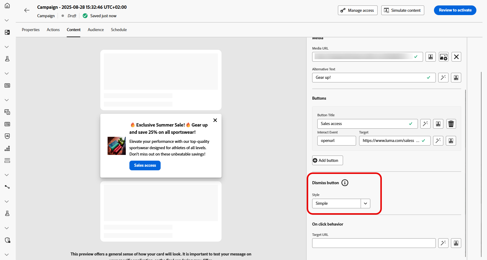

# 设计内容卡内容 {#design-content-card}

信息卡的创作结构提供了基于表单的创作体验，为营销人员提供了可用于由开发人员呈现的基本输入。

定义内容并对其进行个性化后，即可对其进行查看和激活。 将根据设定的计划发送您的营销活动。 [请参阅此页面](../campaigns/review-activate-campaign.md)以了解详情。

## “内容”选项卡 {#content-tab}

在&#x200B;**[!UICONTROL 内容]**&#x200B;选项卡中，您可以通过定义内容卡的内容和&#x200B;**[!UICONTROL 关闭]**&#x200B;按钮的设计来自定义内容卡片。 此外，您还可以通过媒体增强内容，并直接从此选项卡添加操作按钮。

### “关闭”按钮 {#close-button}

为&#x200B;**[!UICONTROL 关闭按钮]**&#x200B;选择&#x200B;**[!UICONTROL 样式]**&#x200B;以自定义其外观。

您可以从以下样式中进行选择：

* **[!UICONTROL 无]**
* **[!UICONTROL 简单]**
* **[!UICONTROL 圆]**

### 内容 {#title-body}

若要撰写邮件，请在&#x200B;**[!UICONTROL 标题]**&#x200B;和&#x200B;**[!UICONTROL 正文]**&#x200B;字段中输入文本。

+++更多高级格式选项

如果&#x200B;**[!UICONTROL 高级格式模式]**&#x200B;已打开，则可以选择&#x200B;**[!UICONTROL 标题]**&#x200B;和&#x200B;**[!UICONTROL 正文]**：

* **[!UICONTROL 字体]**
* **[!UICONTROL Pt大小]**
* **[!UICONTROL 字体颜色]**
* **[!UICONTROL 对齐方式]**
+++

如果要进一步定制消息，请使用&#x200B;**[!UICONTROL Personalization]**&#x200B;图标添加个性化元素。 有关如何使用个性化功能的详细说明，请参阅[此章节](../personalization/personalize.md)。

### 媒体 {#add-media}

**[!UICONTROL 媒体]**&#x200B;字段允许您通过添加媒体来增强内容卡片，这会使您的演示文稿对最终用户更有吸引力。

要包含媒体，请键入要使用的媒体的URL，或单击&#x200B;**[!UICONTROL 选择Assets]**&#x200B;图标以从Assets库中存储的资源中进行选择。 [了解有关资产管理的更多信息](../content-management/assets.md)。

+++更多高级格式选项

如果&#x200B;**[!UICONTROL 高级格式模式]**&#x200B;已打开，您可以在&#x200B;**[!UICONTROL 深色模式媒体URL]**&#x200B;字段中添加用于屏幕阅读应用程序的&#x200B;**[!UICONTROL 替换文本]**&#x200B;和另一个资产。

+++

### 按钮 {#add-buttons}

添加按钮以方便用户与内容卡片进行交互。

1. 单击&#x200B;**[!UICONTROL 添加按钮]**&#x200B;以创建新的操作按钮。

1. 编辑按钮&#x200B;**[!UICONTROL 标题]**&#x200B;字段以指定将在按钮上显示的标签。

1. 选择&#x200B;**[!UICONTROL 交互事件]**&#x200B;以定义用户单击按钮或与按钮交互时将触发的操作。

1. 在&#x200B;**[!UICONTROL Target]**&#x200B;字段中，输入用户在与按钮交互后将定向到的Web URL或深层链接。

+++更多高级格式选项

如果&#x200B;**[!UICONTROL 高级格式模式]**&#x200B;已打开，则可以选择&#x200B;**[!UICONTROL 按钮]**：

* **[!UICONTROL 字体]**
* **[!UICONTROL Pt大小]**
* **[!UICONTROL 字体颜色]**
* **[!UICONTROL 对齐方式]**

+++

### 单击行为

在&#x200B;**[!UICONTROL 目标URL]**&#x200B;字段中，输入Web URL或深层链接，在用户与内容卡交互后将用户定向到所需的目标。 这可以是外部网站、应用程序中的特定页面，或者您希望用户根据其交互情况被带往的任何其他位置。

## “数据”选项卡

## 自定义数据 {#custom-data}

在&#x200B;**[!UICONTROL 自定义数据]**&#x200B;部分中，单击&#x200B;**[!UICONTROL 添加键/值对]**&#x200B;以在有效负载中包含自定义变量。 这些键/值对允许您根据特定配置传递其他数据。 这允许您添加个性化或动态内容、跟踪信息或与设置相关的任何其他数据。
