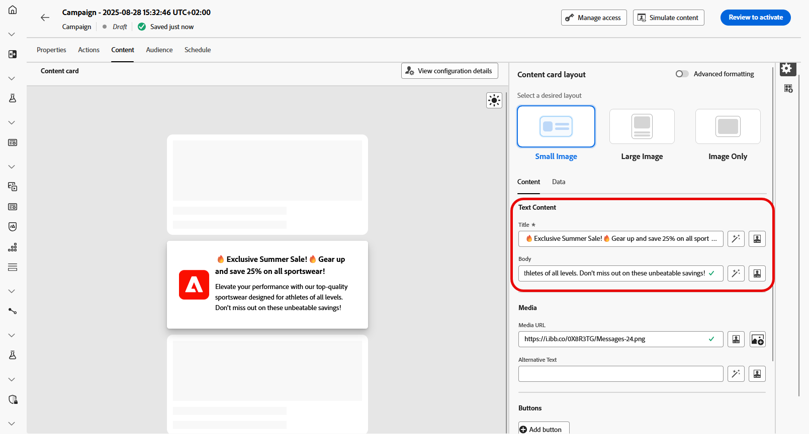
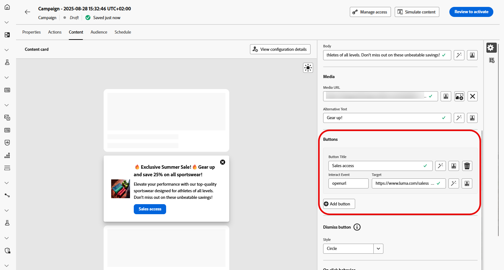

# 设计内容卡内容 {#design-content-card}

信息卡的创作结构提供了基于表单的创作体验，为营销人员提供了可由开发人员呈现的基本输入。

定义内容并对其进行个性化后，即可对其进行查看和激活。 将根据设定的计划发送您的营销活动。 [在此页面中了解详情](../campaigns/review-activate-campaign.md)。

## 内容卡布局

从&#x200B;**[!UICONTROL 内容卡布局]**&#x200B;部分，根据您的消息传送要求选择三个图像布局选项之一。

* **[!UICONTROL 小图像]**：在文本旁显示精简图像，非常适合内容优先于视觉效果的消息。

  有关详细信息，请参阅iOS的Adobe Developer文档和Android](https://developer.adobe.com/client-sdks/edge/adobe-journey-optimizer/content-card-ui/Android/public-classes/state/smallimagecarduistate)的[。

* **[!UICONTROL 大图像]**：在文本上方或旁边显示一个突出图像，使视觉成为您消息的主要焦点。

  有关详细信息，请参阅iOS的Adobe Developer文档和Android](https://developer.adobe.com/client-sdks/edge/adobe-journey-optimizer/content-card-ui/Android/public-classes/state/largeimagecarduistate)的[。

* **[!UICONTROL 仅限图像]**：显示不含随附文本的图像，非常适合视觉驱动消息或独立图像。

  有关详细信息，请参阅iOS的Adobe Developer文档和Android](https://developer.adobe.com/client-sdks/edge/adobe-journey-optimizer/content-card-ui/Android/public-classes/state/imageonlycarduistate)的[。

## “内容”选项卡 {#content-tab}

从&#x200B;**[!UICONTROL 内容]**&#x200B;选项卡，您可以通过定义内容并直接从该选项卡添加媒体和操作按钮来自定义内容卡。

### 文本内容 {#title-body}

若要撰写邮件，请在&#x200B;**[!UICONTROL 标题]**&#x200B;和&#x200B;**[!UICONTROL 正文]**&#x200B;字段中输入文本。

如果要进一步定制消息，请使用&#x200B;**[!UICONTROL Personalization]**&#x200B;图标添加个性化元素。 For detailed instructions on how to use the personalization features, refer to [this section](../personalization/personalize.md).

### 媒体 {#add-media}

The **[!UICONTROL Media]** field lets you enhance your content cards by adding media, which can make your presentation more engaging for end users.

To include media, either type in the URL of the media you want to use or click the **[!UICONTROL Select Assets]** icon to choose from assets stored in your Assets library. [了解有关资产管理的更多信息](../integrations/assets.md)。

+++更多高级格式选项

If the **[!UICONTROL Advanced formatting mode]** is switched on, you can add an **[!UICONTROL Alternative text]** for screen reading applications and another asset in the **[!UICONTROL Dark Mode Media URL]** field.

+++

### 按钮 {#add-buttons}

Add buttons for users to interact with your content cards.

1. Click **[!UICONTROL Add button]** to create a new action button.

1. Edit the button **[!UICONTROL Title]** field to specify the label that will be displayed on the button.

1. Select an **[!UICONTROL Interact event]** to define what action will be triggered when users click or interact with the button.

1. In the **[!UICONTROL Target]** field, enter the web URL or deeplink where users will be directed after interacting with the button.

<!--
+++More options with advanced formatting

If the **[!UICONTROL Advanced formatting mode]** is switched on, you can choose for your **[!UICONTROL Buttons]**:

* the **[!UICONTROL Font]**
* the **[!UICONTROL Pt size]**
* the **[!UICONTROL Font Color]**
* the **[!UICONTROL Alignment]**

+++
-->

### Dismiss button {#close-button}

Choose the **[!UICONTROL Style]** for your **[!UICONTROL Dismiss button]** to customize its appearance.

You can select from the following styles:

* **[!UICONTROL 无]**
* **[!UICONTROL 简单]**
* **[!UICONTROL 圆]**

<!--
+++More options with advanced formatting

If the **[!UICONTROL Advanced formatting mode]** is switched on, you can choose for your **[!UICONTROL Header]** and **[!UICONTROL Body]**:

* the **[!UICONTROL Font]**
* the **[!UICONTROL Pt size]**
* the **[!UICONTROL Font Color]**
* the **[!UICONTROL Alignment]**
+++
-->

### On Click behavior

In the **[!UICONTROL Target URL]** field, enter the web URL or deeplink that will direct users to the desired destination after they interact with your content card. This could be an external website, a specific page within your app, or any other location you want users to be taken to based on their interaction.

## “数据”选项卡

## 自定义数据 {#custom-data}

In the **[!UICONTROL Custom data]** section, click **[!UICONTROL Add Key/Value pair]** to include custom variables in the payload. 这些键/值对允许您根据特定配置传递其他数据。 This allows you to add personalized or dynamic content, tracking information, or any other data relevant to your setup.
