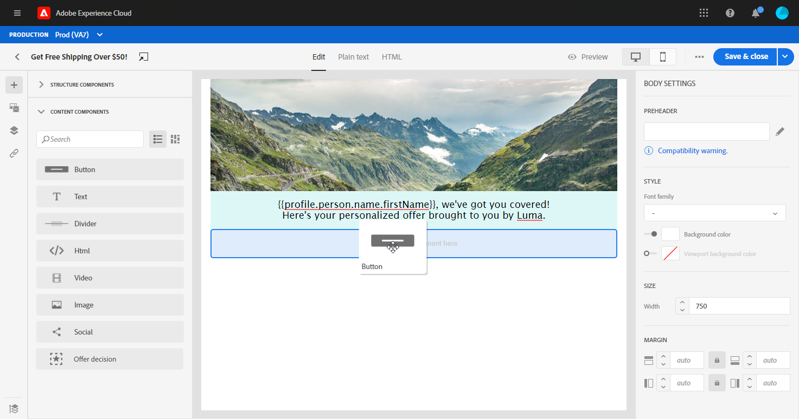

# 使用Email Designer内容组件{#content-components}

>[!CONTEXTUALHELP]
>id="ac_content_components"
>title="关于内容组件"
>abstract="内容组件是空内容占位符，您可以使用这些占位符创建电子邮件的布局。"

从头开始创建电子邮件内容时，**[!UICONTROL Content components]**允许您使用在电子邮件中放置后即可使用的原始空组件进一步个性化电子邮件。
您可以在定义电子邮件布局的**[!UICONTROL Structure component]**&#x200B;中添加所需数量的&#x200B;**[!UICONTROL Content components]**。

## 按钮 {#buttons}

使用&#x200B;**[!UICONTROL Button]**&#x200B;组件在电子邮件中插入多个按钮，并将电子邮件受众重定向到其他页面。

1. 从&#x200B;**[!UICONTROL Content components]**&#x200B;中，将&#x200B;**[!UICONTROL Button]**&#x200B;拖放到&#x200B;**[!UICONTROL Structure component]**&#x200B;中。

   

1. 单击您新添加的按钮以个性化文本，并有权访问电子邮件设计器右侧窗格中的&#x200B;**[!UICONTROL Components Settings]**。

   

1. 在&#x200B;**[!UICONTROL Components Settings]**&#x200B;的&#x200B;**[!UICONTROL Link]**&#x200B;字段中，添加您希望在单击按钮时将受众重定向到的URL。

1. 从&#x200B;**[!UICONTROL Target]**&#x200B;下拉列表中选择受众的重定向方式：

   * **[!UICONTROL None]**:在点击链接的同一帧中打开该链接（默认）。
   * **[!UICONTROL Blank]**:在新窗口或选项卡中打开链接。
   * **[!UICONTROL Self]**:在点击链接的同一帧中打开该链接。
   * **[!UICONTROL Parent]**:在父框架中打开链接。
   * **[!UICONTROL Top]**:在窗口的完整正文中打开链接。

   

1. 现在，您可以通过更改&#x200B;**[!UICONTROL Style]**、**[!UICONTROL Margin]**&#x200B;和&#x200B;**[!UICONTROL Border]**&#x200B;等方式，进一步个性化您的按钮。

## 文本 {#text}

使用&#x200B;**[!UICONTROL Text]**&#x200B;组件在电子邮件中插入文本。 您可以在&#x200B;**[!UICONTROL Component Settings]**&#x200B;中调整文本的颜色、样式和大小。

1. 在&#x200B;**[!UICONTROL Content Components]**&#x200B;中，将&#x200B;**[!UICONTROL Text]**&#x200B;拖放到&#x200B;**[!UICONTROL Structure component]**&#x200B;中。

   

1. 单击您新添加的组件以个性化文本，并有权访问电子邮件设计器右侧窗格中的&#x200B;**[!UICONTROL Components Settings]**。

1. 使用以下工具栏中的选项更改文本：

   

   * **[!UICONTROL Change text style]**:在文本中应用粗体、斜体、下划线或者直线。
   * **更改对齐方式**:在文本的左对齐、右对齐、居中对齐或两端对齐之间进行选择。
   * **[!UICONTROL Create list]**:在文本中添加项目符号或编号列表。
   * **[!UICONTROL Set heading]**:在文本中最多添加6个标题级别。
   * **字体大小**:以像素为单位选择文本的字体大小。
   * **[!UICONTROL Edit image]**:向文本组件中添加图像或资产。[了解有关资产管理的更多信息](assets-essentials.md)。
   * **[!UICONTROL Show the source code]**:显示文本的源代码。无法修改。
   * **[!UICONTROL Duplicate]**:添加文本组件的副本。
   * **[!UICONTROL Delete]**:从电子邮件中删除选定的文本组件。
   * **[!UICONTROL Add personalization]**:添加个性化字段以自定义用户档案数据的内容。[了解有关内容个性化的更多信息](personalization/personalize.md)。

1. 为了获得更好的用户体验，您可以添加个性化字段以定位受众。 有关更多信息，请参阅此](personalization/personalize.md)章节[。

1. 调整&#x200B;**[!UICONTROL Components Settings]**&#x200B;中的&#x200B;**[!UICONTROL Text color]**、**[!UICONTROL Font family]**&#x200B;和&#x200B;**[!UICONTROL Size]**。

   

## 除法器 {#divider}

使用&#x200B;**[!UICONTROL Divider]**组件插入一个分界线，以组织电子邮件的布局和内容。
您可以在**[!UICONTROL Component Settings]**&#x200B;中选择断线的颜色、样式和大小。

## HTML {#HTML}

使用&#x200B;**[!UICONTROL HTML]**&#x200B;复制粘贴现有HTML的不同部分。 这样，您就可以创建免费的模块化HTML组件。

为了使外部内容与Email Designer兼容，Adobe建议从头开始创建消息，并将现有电子邮件中的内容复制到组件中。

1. 在&#x200B;**[!UICONTROL Content Components]**&#x200B;中，将&#x200B;**[!UICONTROL HTML]**&#x200B;拖放到&#x200B;**[!UICONTROL Structure component]**&#x200B;中。

   

1. 单击新添加的组件，然后单击&#x200B;**[!UICONTROL Show the source code]**&#x200B;以添加HTML。

   

1. 复制并粘贴要添加到电子邮件中的HTML代码，然后单击&#x200B;**[!UICONTROL Save]**。

   

1. 现在，您可以通过更改&#x200B;**[!UICONTROL Style]**、**[!UICONTROL Margin]**&#x200B;和&#x200B;**[!UICONTROL Border]**&#x200B;等，或添加链接以将受众重定向到其他内容，从而进一步个性化您的HTML。

## 图像 {#image}

使用&#x200B;**[!UICONTROL Image]**&#x200B;组件在电子邮件中插入计算机的图像文件。

1. 在&#x200B;**[!UICONTROL Content Components]**&#x200B;中，将&#x200B;**[!UICONTROL Image]**&#x200B;拖放到&#x200B;**[!UICONTROL Structure component]**&#x200B;中。

   

1. 单击&#x200B;**[!UICONTROL Browse]**&#x200B;从计算机中选择图像文件。

   您还可以单击&#x200B;**[!UICONTROL Asset Picker]**&#x200B;将资产添加到电子邮件中。 有关资产的更多信息，请参阅此[部分](assets-essentials.md)。

1. 单击新添加的组件以开始配置&#x200B;**[!UICONTROL Content Components]**，并有权访问电子邮件设计器右窗格中的&#x200B;**[!UICONTROL Components Settings]**。

1. 设置图像属性：

   * **[!UICONTROL Image Title]** 用于为图像定义标题。
   * **[!UICONTROL Alt text]** 用于定义链接到图像的标题。此属性对应于替代HTML属性。

   

1. 现在，您可以通过更改&#x200B;**[!UICONTROL Style]**、**[!UICONTROL Margin]**&#x200B;和&#x200B;**[!UICONTROL Border]**&#x200B;等操作，或添加链接以将受众重定向到其他内容，从而进一步个性化您的图像。

## 视频 {#Video}

>[!CONTEXTUALHELP]
>id="ac_edition_video"
>title="视频设置"
>abstract="使用此组件可在电子邮件中插入视频。 请注意，视频并非适用于所有电子邮件客户端。 我们建议设置备用图像。"
>additional-url="https://www.emailonacid.com/blog/article/email-development/a_how_to_guide_to_embedding_html5_video_in_email/" text="其他信息"

使用&#x200B;**[!UICONTROL Video]**&#x200B;组件通过URL链接在电子邮件中插入视频。

1. 在&#x200B;**[!UICONTROL Content Components]**&#x200B;中，将&#x200B;**[!UICONTROL Video]**&#x200B;拖放到&#x200B;**[!UICONTROL Structure component]**&#x200B;中。

   

1. 单击新添加的组件以开始配置&#x200B;**[!UICONTROL Content Components]**，并有权访问电子邮件设计器右窗格中的&#x200B;**[!UICONTROL Components Settings]**。

1. 在&#x200B;**[!UICONTROL Components Settings]**&#x200B;的&#x200B;**[!UICONTROL Video link]**&#x200B;字段中，添加您的视频URL。

   

1. 您可以向视频中添加&#x200B;**[!UICONTROL Poster image]**&#x200B;以指定要显示的图像，直到受众单击播放按钮为止。

1. 现在，您可以通过更改&#x200B;**[!UICONTROL Style]**、**[!UICONTROL Margin]**&#x200B;和&#x200B;**[!UICONTROL Border]**&#x200B;等操作，进一步个性化您的图像。

## 社交 {#social}

使用&#x200B;**[!UICONTROL Social]**&#x200B;组件在电子邮件中插入指向社交媒体页面的链接。

1. 在&#x200B;**[!UICONTROL Content Components]**&#x200B;中，将&#x200B;**[!UICONTROL Social]**&#x200B;拖放到&#x200B;**[!UICONTROL Structure component]**&#x200B;中。

   

1. 单击新添加的组件以开始配置&#x200B;**[!UICONTROL Content Components]**，并有权访问电子邮件设计器右窗格中的&#x200B;**[!UICONTROL Components Settings]**。

1. 在&#x200B;**[!UICONTROL Components Settings]**&#x200B;的&#x200B;**[!UICONTROL Social]**&#x200B;字段中，选择要添加或删除的社交媒体。

   

1. 在&#x200B;**[!UICONTROL Size of images]**&#x200B;字段中选择图标的大小。

1. 单击每个社交媒体图标可配置受众将被重定向到的&#x200B;**[!UICONTROL URL]**。

   

1. 您还可以在&#x200B;**[!UICONTROL Image]**&#x200B;字段中根据需要更改每个社交媒体的图标。

1. 现在，您可以通过更改&#x200B;**[!UICONTROL Style]**、**[!UICONTROL Margin]**&#x200B;和&#x200B;**[!UICONTROL Border]**&#x200B;来进一步个性化社交媒体图标。

## 选件决策{#offer-decision}

使用&#x200B;**[!UICONTROL Offer decision]**&#x200B;组件将决策（以前称为选件活动）插入消息中。 决策将利用决策管理来选择最佳选件，以提供给您的客户。

相关主题：

* [决策管理入门](offers/get-started/starting-offer-decisioning.md).
* [在消息中添加个性化优惠](deliver-personalized-offers.md)。

