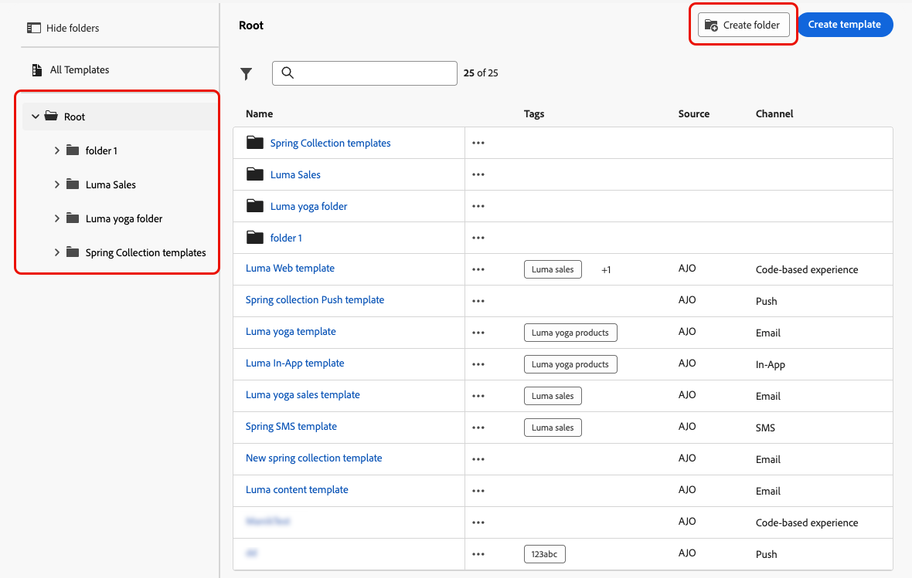

# 访问和管理内容模板 {#access-manage-templates}

## 访问内容模板 {#access}

要访问内容模板列表，请从左侧菜单中选择&#x200B;**[!UICONTROL 内容管理]** > **[!UICONTROL 内容模板]**。

显示在当前沙盒上创建的所有模板 — 无论是来自历程还是使用&#x200B;**[!UICONTROL 另存为模板]**&#x200B;选项（从&#x200B;**[!UICONTROL 内容模板]**&#x200B;菜单）的营销活动。 [了解如何创建模板](#create-content-templates)

利用左侧的窗格，可将内容模板整理到文件夹中。 默认情况下，将显示所有模板。 选择文件夹时，仅显示选定文件夹中包含的模板和文件夹。 [了解详情](#folders)

要查找特定项目，请在搜索字段中开始键入名称。 选择[文件夹](#folders)时，搜索将应用于该文件夹<!--(not nested items)-->层次结构第一级中的所有内容模板或文件夹。

您可以按以下方式排序内容模板：
* 类型
* 渠道
* 创建或修改日期
* 标记 — [了解有关标记的更多信息](../start/search-filter-categorize.md#tags)

您还可以选择仅显示您自己创建或修改的项目。

>[!NOTE]
>
>从2025年3月开始，弃用HTML类型内容模板。 您仍然可以访问之前在[!DNL Journey Optimizer]中创建的现有HTML内容模板。

## 使用文件夹管理内容模板 {#folders}

要轻松导航您的内容模板，您可以使用文件夹来更有效地将其组织到结构化层次结构中。 这使您能够根据组织需求对项目进行分类和管理。

1. 单击“**[!UICONTROL 所有内容模板]**”按钮可显示之前创建的所有项目，而不进行文件夹分组。

1. 单击&#x200B;**[!UICONTROL 根]**&#x200B;文件夹以显示创建的所有文件夹。

   >[!NOTE]
   >
   >如果尚未创建文件夹，则会显示所有内容模板。

1. 单击&#x200B;**[!UICONTROL 根]**&#x200B;文件夹中的任意文件夹以显示其内容。

1. 单击&#x200B;**[!UICONTROL 根]**&#x200B;文件夹或任何其他文件夹后，将显示&#x200B;**[!DNL Create folder]**&#x200B;按钮。 选择它。

   

1. 键入新文件夹的名称，然后单击&#x200B;**[!UICONTROL 保存]**。 新文件夹显示在&#x200B;**[!UICONTROL 根]**&#x200B;文件夹的内容模板列表顶部，或显示在当前选定的文件夹内。

1. 您可以单击&#x200B;**[!UICONTROL 更多操作]**&#x200B;按钮以重命名或删除文件夹。

   

1. 使用&#x200B;**[!UICONTROL 更多操作]**&#x200B;按钮，您还可以将内容模板移动到其他现有文件夹。

   

1. 现在，您可以导航到之前创建的文件夹。 您[从此处](create-content-templates.md)创建的每个新内容模板都将保存到当前文件夹中。

   

## 编辑和删除内容模板 {#edit}

* 要编辑模板内容，请在列表中单击所需项目并进行所需更改。 您还可以通过单击模板名称旁边的编辑按钮来编辑内容模板属性。

  

* 要删除模板，请选择所需模板旁边的&#x200B;**[!UICONTROL 更多操作]**&#x200B;按钮，然后选择&#x200B;**[!UICONTROL 删除]**。

  

>[!NOTE]
>
>编辑或删除模板时，使用此模板创建的活动或历程（包括内容）不会受到影响。

## [!BADGE 有限可用性]{type=Informative}将模板显示为缩略图 {#template-thumbnails}

选择&#x200B;**[!UICONTROL 网格视图]**&#x200B;模式以将每个模板显示为缩略图。

>[!AVAILABILITY]
>
>此功能面向一小部分客户限量发布 (LA)。

>[!NOTE]
>
>当前只能为HTML类型的电子邮件内容模板生成正确的缩略图。

更新内容时，您可能需要等待几秒钟，更改才会反映在缩略图中。

## 将内容模板导出到另一个沙盒 {#export}

利用Journey Optimizer，可将内容模板从一个沙盒复制到另一个沙盒。 例如，您可以将模板从暂存沙盒环境复制到生产沙盒。

复制过程通过源沙盒和目标沙盒之间的&#x200B;**包导出和导入**&#x200B;进行。 有关如何导出对象并将其导入目标沙盒的详细信息，请参阅此部分： [将对象复制到另一个沙盒](../configuration/copy-objects-to-sandbox.md)
