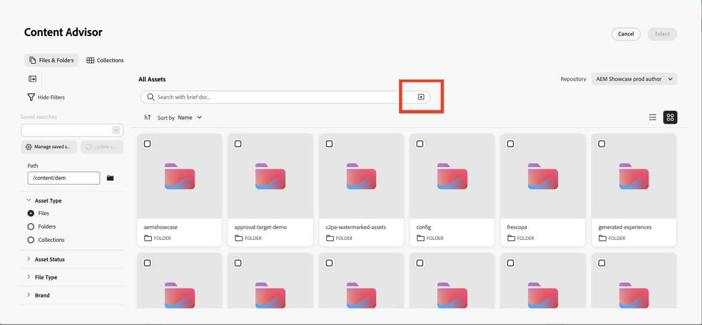

# 使用Adobe Experience Manager Content Advisor {#aem-content-advisor}

>[!AVAILABILITY]
>
>Adobe Experience Manager Content Advisor仅在渠道创作工作流中可用。

Adobe Experience Manager Content Advisor用标准化意图驱动的从统一界面进行发现来取代确定性发现。 它支持直接在Journey Optimizer创作工作流中进行AI支持的统一Assets和内容片段发现，从而提高营销人员的工作效率和活动效率。

## 可用功能

### 适用于Assets的 {#asset-features}

Adobe Experience Manager内容审查程序提供了以下资源功能：

* 
  +++ AI语义搜索

  使用自然语言而不是精确的关键字或文件名搜索资源。 用纯语言描述您需要的内容，例如“山中的咖啡”，然后AI会根据含义和内容查找与上下文相关的资源，而不仅仅是文本匹配。

  {zoomable="yes"}

  +++

* 
  +++ 最近的搜索历史记录

  访问最近的搜索以快速重复使用关键字和上下文。 在处理类似的营销活动或需要优化以前的搜索时，这可以节省时间。

  {zoomable="yes"}

  +++ 

* 
  +++ 上传摘要

  上传营销摘要文档，以自动显示与活动上下文一致的资产。 AI会分析您的摘要，并根据文档中描述的内容和要求提出相关资产建议。

  {zoomable="yes"}

  +++

* 
  +++ 资源信息面板

  使用&#x200B;**信息**&#x200B;图标查看任何资源的详细元数据和属性。 这包括资源维度、文件大小、创建日期、标记以及其他相关信息，以帮助您做出明智的决策。

  {zoomable="yes"}

  +++

* 
  +++ Dynamic Media面板

  根据存储库配置访问动态演绎版、智能裁剪和即时修改。

  {zoomable="yes"}

  通过Dynamic Media面板，可访问动态演绎版、智能裁剪和动态修改。 您可以直接在面板中输入修饰符以创建自定义演绎版。

  **可用性**

  Dynamic Media可用性取决于您的存储库配置：

   * **Scene7**：可用于已发布的资源(视频和PDF除外)。 [了解有关Dynamic Media Scene7修饰符的更多信息](https://experienceleague.adobe.com/docs/dynamic-media-developer-resources/image-serving-api/image-serving-api/http-protocol-reference/command-reference/r-is-http-modifiers.html){target="_blank"}

   * **OpenAPI**：可用于批准的资产（视频除外）。 [了解关于带有OpenAPI修饰符的Dynamic Media的更多信息](https://experienceleague.adobe.com/docs/experience-manager-cloud-service/content/assets/dynamicmedia/image-profiles.html){target="_blank"}

   * **Scene7和OpenAPI**：在同时存在配置且资产符合条件时可用。

  **栈栈选择**

  您看到的按钮取决于您的存储库配置：

   * 仅&#x200B;**Scene7按钮**：存储库具有Scene7配置并且资产已发布到Dynamic Media。
   * 仅&#x200B;**OpenAPI按钮**：存储库具有OpenAPI配置且资产已批准。
   * **两个按钮**：存储库同时具有配置，并且资源已发布和批准。
  +++

### 用于内容片段 {#content-fragment-features}

Adobe Experience Manager内容审查程序提供以下内容片段功能：

* 
  +++ 模板视图列表 

  在缩略图和表格视图之间切换以采用最适合您的工作流的格式浏览内容片段。 缩略图视图提供可视上下文，而表格视图以结构化格式显示详细信息。

  {zoomable="yes"}

  +++

* 
  +++ 信息面板 

  单击&#x200B;**[!UICONTROL 信息]**&#x200B;图标可打开右侧面板，其中显示片段变体、属性和&#x200B;**[!UICONTROL 引用者]**&#x200B;的详细信息。 **[!UICONTROL 引用者]**&#x200B;部分显示使用了片段的所有Adobe Experience Manager实体，其中包含直接在Adobe Experience Manager中查看这些引用的链接。

  {zoomable="yes"}

  +++

* 
  +++ 在Adobe Experience Manager中打开

  直接在Adobe Experience Manager中快速打开任何内容片段，以使用标题旁边的图标进行编辑。 这种无缝集成让您能够在Journey Optimizer和Adobe Experience Manager之间切换，而不会丢失上下文。

  {zoomable="yes"}

  +++

* 
  +++ JSON预览

  以简洁有序的表格格式预览内容片段的JSON结构。 这有助于您了解片段的数据结构，并在将其用于营销活动之前验证内容。

  {zoomable="yes"}

  +++

## 访问Adobe Experience Manager Content Advisor {#access}

要在Journey Optimizer中访问Adobe Experience Manager内容顾问，请执行以下步骤：

1. 在Adobe Journey Optimizer中创建营销活动并添加渠道操作，例如电子邮件。

1. 单击&#x200B;**[!UICONTROL 编辑内容]**，然后单击&#x200B;**[!UICONTROL 编辑电子邮件正文]**&#x200B;以打开内容编辑器。

1. 将HTML或文本组件拖放到电子邮件内容中。

1. 将鼠标悬停在该组件上，然后单击&#x200B;**[!UICONTROL 显示源代码]**(对于HTML组件)或&#x200B;**[!UICONTROL 添加Personalization]**（对于文本组件）。

1. 在Personalization编辑器中，选择您的内容入口点：

   * 要添加资源，请单击&#x200B;**[!UICONTROL Assets]**，然后单击&#x200B;**[!UICONTROL 打开资源选择器]**。

     {zoomable="yes"}

   * 要添加Adobe Experience Manager内容片段，请单击&#x200B;**[!UICONTROL AEM内容片段]**，然后单击&#x200B;**[!UICONTROL 打开AEM CF选择器]**。

     {zoomable="yes"}

1. 选择您的Adobe Experience Manager存储库。

   {zoomable="yes"}

1. 浏览并选择要使用的资源或内容片段，然后将其插入到您的内容中。

