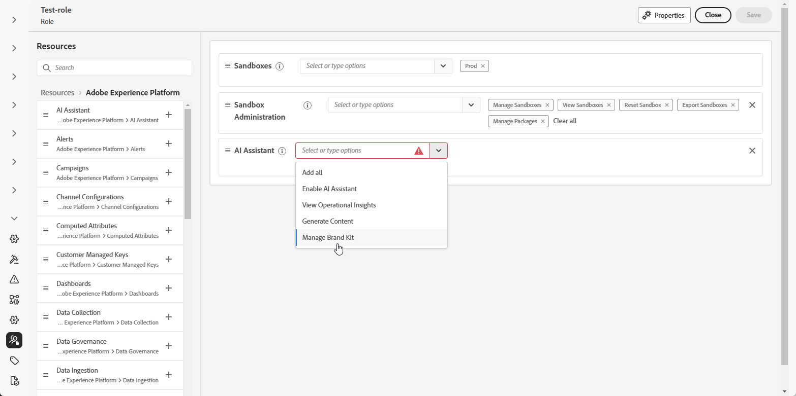

# 创建和管理您的品牌 {#brands}

>[!AVAILABILITY]
>
>此功能作为专用测试版发布。 它将在未来版本中逐步向所有客户提供。

品牌指南是一组详细的规则和标准，用于建立品牌的视觉和语言标识。 它们用作参考，以在所有营销和通信平台上保持一致的品牌代表性。

<!--Upload feature currently behind feature flag--

In [!DNL Journey Optimizer], you now have the option to manually input and organize your brand details or upload brand guideline documents for automatic information extraction.-->

## 访问品牌 {#generative-access}

要访问[!DNL Adobe Journey Optimizer]中的&#x200B;**[!UICONTROL 品牌]**&#x200B;菜单，需要向用户授予&#x200B;**[!UICONTROL 托管品牌套件]**&#x200B;或&#x200B;**[!UICONTROL 启用AI助手]**&#x200B;权限。 [了解详情](../administration/permissions.md)

+++  了解如何分配品牌相关权限

1. 在&#x200B;**权限**&#x200B;产品中，转到&#x200B;**角色**&#x200B;选项卡并选择所需的&#x200B;**角色**。

1. 单击&#x200B;**编辑**，修改权限。

1. 添加&#x200B;**AI助手**&#x200B;资源，然后从下拉菜单中选择&#x200B;**托管品牌套件**&#x200B;或&#x200B;**[!UICONTROL 启用Ai助手]**。

   请注意，**[!UICONTROL 启用Ai助手]**&#x200B;权限仅提供对&#x200B;**[!UICONTROL 品牌]**&#x200B;菜单的只读访问权限。

   {zoomable="yes"}

1. 单击&#x200B;**保存**&#x200B;以应用更改。

   任何已分配此角色的用户的权限都将自动更新。

1. 要将此角色分配给新用户，请导航到&#x200B;**角色**&#x200B;仪表板中的&#x200B;**用户**&#x200B;选项卡，然后单击&#x200B;**添加用户**。

1. 输入用户名、电子邮件地址或从列表中选择，然后单击&#x200B;**保存**。

1. 如果之前没有创建用户，请参阅[此文档](https://experienceleague.adobe.com/zh-hans/docs/experience-platform/access-control/abac/permissions-ui/users)。

+++

## 创建您的品牌 {#create-brand-kit}

要创建和管理您的品牌指南，请执行以下步骤。

<!--Upload feature currently behind feature flag--

To create and manage your Brand guideline, you can either enter the details yourself, or upload your brand guidelines document to have the information extracted automatically:-->

1. 在&#x200B;**[!UICONTROL 品牌]**&#x200B;菜单中，单击&#x200B;**[!UICONTROL 创建品牌]**。

   

1. 为您的品牌<!--and a **[!UICONTROL Description]** to your brand guideline-->输入&#x200B;**[!UICONTROL 名称]**。

   

<!--Upload feature currently behind feature flag so hidden from doc - should be available again by EOM (Feb)--

1. Drag and drop or select your file to upload your brand guidelines and extract automatically relevant brand information. Click **[!UICONTROL Create brand]**.

    The information extraction process now begins. Note that it may take several minutes to complete.

    

1. Your Content and visual creation standards are now automatically populated. Browse through the different tabs to adapt the information as needed.

-->

1. 在&#x200B;**[!UICONTROL 写入样式]**&#x200B;选项卡中，单击以添加准则或排除项，包括示例。

   

1. 在&#x200B;**[!UICONTROL 可视内容]**&#x200B;选项卡中，单击以添加其他准则或排除项。

1. 要添加显示正确用法的图像，请选择&#x200B;**[!UICONTROL 示例]**&#x200B;并单击&#x200B;**[!UICONTROL 选择图像]**。 您还可以添加显示不正确用法的图像作为排除示例。

   

1. 配置完毕后，单击&#x200B;**[!UICONTROL 保存]**，然后单击&#x200B;**[!UICONTROL 发布]**，以便在AI助手中提供您的品牌指南。

1. 要对已发布的品牌进行修改，请单击&#x200B;**[!UICONTROL 编辑品牌]**。

   >[!NOTE]
   >
   >这会在编辑模式下创建一个临时副本，并在发布后替换实时版本。

   

1. 在&#x200B;**[!UICONTROL Brands]**&#x200B;仪表板中，单击图标打开高级菜单，以执行以下操作：

   * 查看品牌
   * Edit
   * 复制
   * 发布
   * 取消发布
   * Delete

   

现在，可从AI助手菜单中的&#x200B;**[!UICONTROL 品牌]**&#x200B;下拉菜单访问您的品牌指南，使其生成符合您规范的内容和资产。 [了解有关AI助手的详细信息](gs-generative.md)

