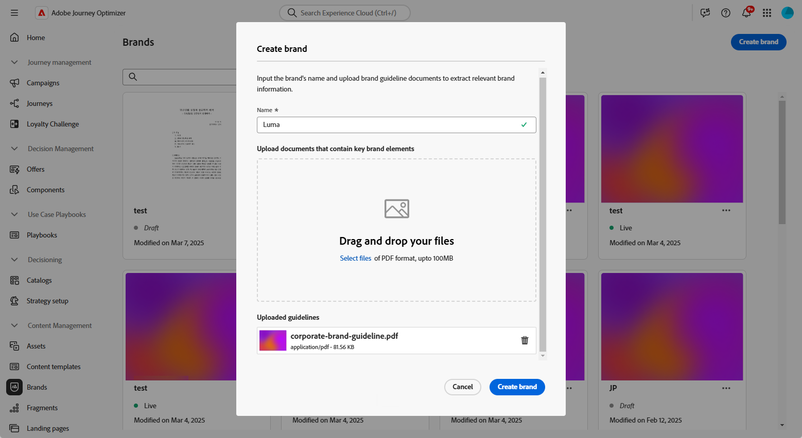
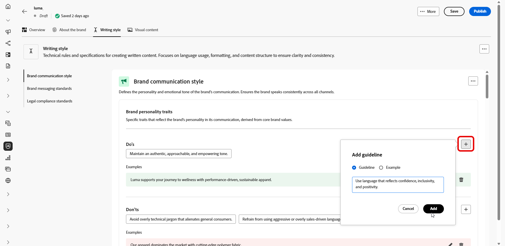

# 创建和管理品牌 {#brands}

>[!CONTEXTUALHELP]
>id="ajo_brand_overview"
>title="开始使用品牌"
>abstract="创建并定制您自己的品牌，以塑造您独特的视觉和语言形象，同时更轻松地创作出符合您品牌风格和声音的内容。"

>[!CONTEXTUALHELP]
>id="ajo_brand_ai_menu"
>title="选择您的品牌"
>abstract="选择您的品牌，以确保所有 AI 生成的内容都符合您品牌的规范和指导方针。"

>[!CONTEXTUALHELP]
>id="ajo_brand_score_overview"
>title="品牌选择"
>abstract="选择您的品牌，以确保您的内容制作符合其特定的指导方针、标准和身份，从而保持一致性和品牌完整性。"

>[!AVAILABILITY]
>
>此功能作为专用测试版发布。 在未来版本中，将逐步向所有客户提供。
>您必须同意[用户协议](https://www.adobe.com/legal/licenses-terms/adobe-dx-gen-ai-user-guidelines.html){target="_blank"}，然后才能在Adobe Journey Optimizer中使用AI助手。 有关更多信息，请与您的 Adobe 代表联系。

品牌指南是一组详细的规则和标准，用于建立品牌的视觉和语言标识。 它们用作参考，以在所有营销和通信平台上保持一致的品牌代表性。

在[!DNL Journey Optimizer]中，您现在可以选择手动输入和组织品牌详细信息或上传品牌准则文档以进行自动信息提取。

## 访问品牌 {#generative-access}

要访问[!DNL Adobe Journey Optimizer]中的&#x200B;**[!UICONTROL 品牌]**&#x200B;菜单，需要向用户授予&#x200B;**[!UICONTROL 管理品牌套件]**&#x200B;或&#x200B;**[!UICONTROL 启用AI助手]**&#x200B;权限。 [了解详情](../administration/permissions.md)

+++  了解如何分配品牌相关权限

1. 在&#x200B;**权限**&#x200B;产品中，转到&#x200B;**角色**&#x200B;选项卡并选择所需的&#x200B;**角色**。

1. 单击&#x200B;**编辑**，修改权限。

1. 添加&#x200B;**AI助手**&#x200B;资源，然后从下拉菜单中选择&#x200B;**管理品牌套件**&#x200B;或&#x200B;**[!UICONTROL 启用Ai助手]**。

   请注意，**[!UICONTROL 启用Ai助手]**&#x200B;权限仅提供对&#x200B;**[!UICONTROL 品牌]**&#x200B;菜单的只读访问权限。

   {zoomable="yes"}

1. 单击&#x200B;**保存**&#x200B;以应用更改。

   任何已分配此角色的用户的权限都将自动更新。

1. 要将此角色分配给新用户，请导航到&#x200B;**角色**&#x200B;仪表板中的&#x200B;**用户**&#x200B;选项卡，然后单击&#x200B;**添加用户**。

1. 输入用户名、电子邮件地址或从列表中选择，然后单击&#x200B;**保存**。

1. 如果之前没有创建用户，请参阅[此文档](https://experienceleague.adobe.com/zh-hans/docs/experience-platform/access-control/abac/permissions-ui/users)。

+++

## 创建和管理您的品牌 {#create-brand-kit}

>[!CONTEXTUALHELP]
>id="ajo_brands_create"
>title="创建您的品牌"
>abstract="输入您的品牌名称并上传您的品牌指导方针文件。该工具会自动提取关键细节，使维护品牌身份更加容易。"

要创建和管理品牌指南，您可以自己输入详细信息，也可以上传品牌指南文档以自动提取信息：

1. 在&#x200B;**[!UICONTROL 品牌]**&#x200B;菜单中，单击&#x200B;**[!UICONTROL 创建品牌]**。

   

1. 为您的品牌输入&#x200B;**[!UICONTROL 名称]**。

1. 拖放或选择您的文件以上传品牌指南并自动提取相关的品牌信息。 单击&#x200B;**[!UICONTROL 创建品牌]**。

   信息提取过程现在开始。 请注意，它可能需要几分钟才能完成。

   

1. 您的内容和可视化创建标准现在将自动填充。 浏览不同的选项卡以根据需要调整信息。 [了解详情](#personalize)

1. 从每个部分或类别的高级菜单中，您可以添加引用以自动提取相关品牌信息。

   要删除现有内容，请使用&#x200B;**[!UICONTROL 清除部分]**&#x200B;或&#x200B;**[!UICONTROL 清除类别]**&#x200B;选项。

   

1. 配置完毕后，单击&#x200B;**[!UICONTROL 保存]**，然后单击&#x200B;**[!UICONTROL 发布]**，以便在AI助手中提供您的品牌指南。

1. 要对已发布的品牌进行修改，请单击&#x200B;**[!UICONTROL 编辑品牌]**。

   >[!NOTE]
   >
   >这会在编辑模式下创建一个临时副本，并在发布后替换实时版本。

   

1. 在&#x200B;**[!UICONTROL Brands]**&#x200B;仪表板中，单击图标打开高级菜单，以执行以下操作：

   * 查看品牌
   * Edit
   * 复制
   * 发布
   * 取消发布
   * Delete

   

现在可从AI助手菜单的&#x200B;**[!UICONTROL 品牌]**&#x200B;下拉菜单访问您的品牌指南，使其生成符合您规范的内容和资产。 [了解有关AI助手的详细信息](gs-generative.md)

### 设置默认品牌 {#default-brand}

您可以在创建促销活动期间指定在生成内容并计算一致性分数时自动应用的默认品牌。

要设置默认品牌，请转到您的&#x200B;**[!UICONTROL 品牌]**&#x200B;仪表板。 通过单击图标打开高级菜单，然后选择&#x200B;**[!UICONTROL 标记为默认品牌]**。

## 个性化您的品牌 {#personalize}

### 关于此品牌 {#about-brand}

使用&#x200B;**[!UICONTROL 关于品牌]**&#x200B;选项卡建立品牌的核心标识 — 概述其用途、个性、标语和其他定义属性。

1. 首先在&#x200B;**[!UICONTROL 关键详细信息]**&#x200B;类别中填写品牌的基本信息：

   * **[!UICONTROL 品牌套件名称]**：输入您的品牌套件名称。

   * **[!UICONTROL 何时使用]**：指定应应用此品牌套件的方案或上下文。

   * **[!UICONTROL 品牌名称]**：输入品牌的正式名称。

   * **[!UICONTROL 品牌描述]**：提供此品牌代表的概述。

   * **[!UICONTROL 默认标语]**：添加与品牌关联的主要标语。

     

1. 在&#x200B;**[!UICONTROL 指导原则]**&#x200B;类别中，阐明品牌的核心方向和理念：

   * **[!UICONTROL 任务]**：详细描述您的品牌目的。

   * **[!UICONTROL 愿景]**：描述您的长期目标或期望的未来状态。

   * **[!UICONTROL 市场定位]**：说明您的品牌在市场中的定位。

     

1. 在&#x200B;**[!UICONTROL 核心品牌值]**&#x200B;类别中，单击以添加品牌的核心值并填写详细信息：

   * **[!UICONTROL 值]**：命名核心品牌值。

   * **[!UICONTROL 描述]**：说明该值对于您的品牌意味着什么。

   * **[!UICONTROL 行为]**：概述在实践中反映此值的操作或态度。

   * **[!UICONTROL 表现形式]**：举例说明如何以真实世界的品牌形式表示此值。

     

1. 如果需要，请单击图标以更新或删除您的核心品牌价值之一。

   

您现在可以进一步个性化您的品牌或[发布您的品牌](#create-brand-kit)。

### 写作风格 {#writing-style}

>[!CONTEXTUALHELP]
>id="ajo_brand_writing_style"
>title="写入样式对齐分数"
>abstract="写作样式部分定义了语言、格式和结构的标准，以确保内容清晰、一致。 一致性分数（从高到低）显示您的内容遵循这些准则的程度，并突出显示需要改进的方面。"

**[!UICONTROL 书写样式]**&#x200B;部分概述了书写内容的标准，详细说明了如何使用语言、格式和结构来保持所有材料的清晰度、一致性和一致性。

+++ 可用类别和示例

<table>
  <thead>
    <tr>
      <th>类别</th>
      <th>子类别</th>
      <th>准则示例</th>
      <th>排除项示例</th>
    </tr>
  </thead>
  <tbody>
    <tr>
      <td rowspan="4">内容创建标准</td>
      <td>品牌报文传送标准</td>
      <td>强调创新和客户至上的报文传送。</td>
      <td>不要过度承诺产品功能。</td>
    </tr>
    <tr>
      <td>标语用法</td>
      <td>在所有数字营销资源上的徽标下放置标语。</td>
      <td>请勿修改或翻译标语。</td>
    </tr>
    <tr>
      <td>核心消息</td>
      <td>强调关键优势陈述 — 如提高生产效率。</td>
      <td>请勿使用不相关的值建议。</td>
    </tr>
    <tr>
      <td>命名标准</td>
      <td>使用简单的描述性名称，如“ProScheduler”。</td>
      <td>请勿使用复杂术语或特殊字符。</td>
    </tr>
    <tr>
      <td rowspan="5">品牌沟通风格</td>
      <td>品牌人格特征</td>
      <td>友好平易近人。</td>
      <td>别失败了。</td>
    </tr>
    <tr>
      <td>书写力学</td>
      <td>保持句子简短并有影响力。</td>
      <td>不要用过多的行话。</td>
    </tr>
    <tr>
      <td>情景色调</td>
      <td>在危机沟通中保持专业语调。</td>
      <td>在支持性通信中不要轻视。</td>
    </tr>
    <tr>
      <td>Word选择准则</td>
      <td>用“创新”和“聪明”等词语。</td>
      <td>避免使用“廉价”或“黑客”之类的词语。</td>
    </tr>
    <tr>
      <td>语言标准</td>
      <td>遵循美式英语惯例。</td>
      <td>不要混用英美两种语言。</td>
    </tr>
    <tr>
      <td rowspan="3">法律合规性标准</td>
      <td>商标标准</td>
      <td>始终使用™或®符号。</td>
      <td>必要时，请勿忽略法律符号。</td>
    </tr>
    <tr>
      <td>版权标准</td>
      <td>在营销材料中包含版权声明。</td>
      <td>未经许可，请勿使用第三方内容。</td>
    </tr>
    <tr>
      <td>免责声明标准</td>
      <td>在数字资产上清楚地显示免责声明。</td>
      <td>请勿隐藏非可见区域中的免责声明。</td>
    </tr>
</table>

+++

 

个性化您的&#x200B;**[!UICONTROL 书写样式]**：

1. 在&#x200B;**[!UICONTROL 写入样式]**&#x200B;选项卡中，单击以添加准则、异常或排除项。

1. 输入指南、例外或排除项，然后单击&#x200B;**[!UICONTROL 添加]**。

   

1. 选择一个要更新或删除的准则或排除项。

1. 单击以编辑您的示例，或单击图标以删除它。

   

您现在可以进一步个性化您的品牌或[发布您的品牌](#create-brand-kit)。

### 视觉内容 {#visual-content}

>[!CONTEXTUALHELP]
>id="ajo_brand_imagery"
>title="视觉内容对齐方式分数"
>abstract="可视内容对齐度分数表示您的内容与配置的品牌指南的匹配程度。 得分从高到低，它有助于您一目了然地评估一致性。 探索不同的类别，找出需要改进的方面，并查明可能脱离品牌的要素。"

**[!UICONTROL 可视化内容]**&#x200B;部分定义了图像和设计的标准，详细说明了保持统一和一致的品牌外观所需的规范。

+++ 可用类别和示例

<table>
  <thead>
    <tr>
      <th>类别</th>
      <th>准则示例</th>
      <th>排除项示例</th>
    </tr>
  </thead>
  <tbody>
    <tr>
      <td>摄影标准</td>
      <td>户外拍摄时使用自然光线。</td>
      <td>避免过度编辑或像素化的图像。</td>
    </tr>
    <tr>
      <td>插图标准</td>
      <td>使用简洁、极简的风格。</td>
      <td>避免过于复杂。</td>
    </tr>
    <tr>
      <td>图标标准</td>
      <td>使用一致的24像素网格系统。</td>
      <td>请勿混合图标尺寸、使用不一致的描边粗细或偏离网格规则。</td>
    </tr>
    <tr>
      <td>使用指南</td>
      <td>选择反映真实客户在专业环境中使用该产品的生活方式形象。</td>
      <td>请勿使用与品牌风格相抵触或看起来与上下文不相干的图像。</td>
    </tr>
</table>

+++

 

要个性化您的&#x200B;**[!UICONTROL 可视化内容]**，请执行以下操作：

1. 在&#x200B;**[!UICONTROL 可视内容]**&#x200B;选项卡中，单击以添加指南、排除项或示例。

1. 输入指南、排除项或示例，然后单击&#x200B;**[!UICONTROL 添加]**。

   

1. 要添加显示正确用法的图像，请选择&#x200B;**[!UICONTROL 示例]**&#x200B;并单击&#x200B;**[!UICONTROL 选择图像]**。 您还可以添加显示不正确用法的图像作为排除示例。

   

1. 选择一个要更新或删除的准则或排除项。

1. 选择一个指南或排除项以更新它。 单击图标以将其删除。

   

您现在可以进一步个性化您的品牌或[发布您的品牌](#create-brand-kit)。
