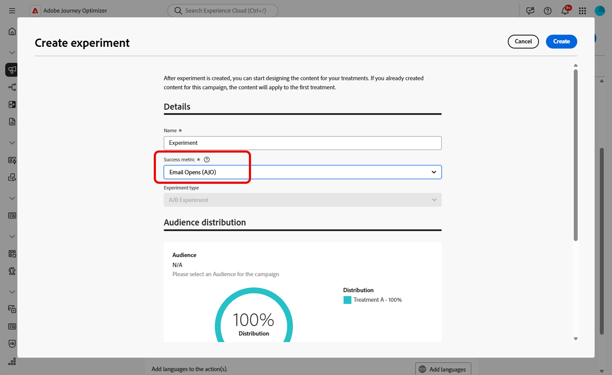
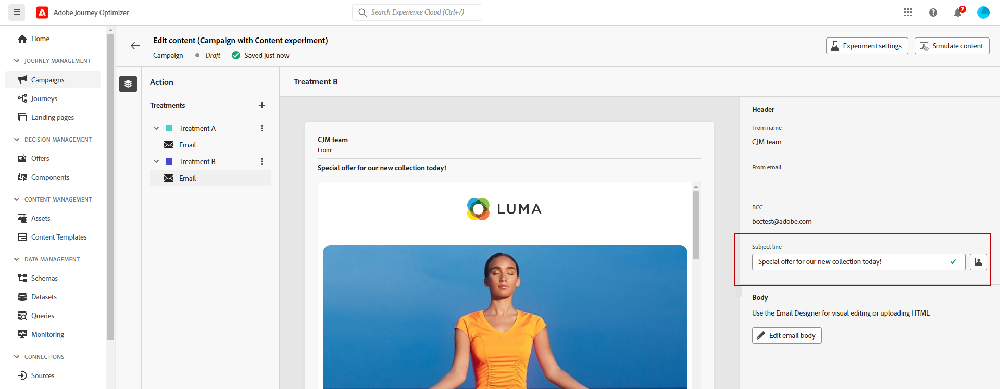

# 创建内容试验 {#content-experiment}

>[!CONTEXTUALHELP]
>id="ajo_campaigns_content_experiment"
>title="内容试验"
>abstract="您可以选择改变消息内容、主题或发件人，以便定义多种处理方法并确定最适合您受众的组合。"

>[!NOTE]
>
>在开始内容试验之前，请确保为自定义数据集设置了报表配置。 有关详细信息，请参阅[此部分](../reports/reporting-configuration.md)。

Journey Optimizer内容实验允许您定义多种投放处理，以衡量哪种投放处理对目标受众的效果最佳。 您可以选择更改投放内容、主题或发件人。 感兴趣的受众被随机分配给每个处理，以确定哪个处理在指定的量度方面效果最佳。

在下面的示例中，投放目标被分为两个组，每个组代表目标人口的45%，而维持组10%则不会收到投放。

目标受众中的每个人都会收到一个版本的电子邮件，其主题行是以下两个版本之一：

* 其中一个直接推广新系列和图像的10%选件。
* 另一家公司只发布了特别优惠广告，没有提供任何图片，也未指定10%的折扣。

此处的目标是查看收件人是否会根据收到的试验与电子邮件交互。 因此，我们将选择&#x200B;**[!UICONTROL 电子邮件打开次数]**&#x200B;作为此内容试验的主要目标量度。

## 创建您的内容 {#campaign-experiment}

1. 首先根据您的要求创建和配置电子邮件、短信或推送通知[营销活动](../campaigns/create-campaign.md)或[历程](../building-journeys/journeys-message.md)。

1. 从&#x200B;**[!UICONTROL 编辑内容]**&#x200B;窗口，开始个性化处理A。

   对于此处理，我们将直接在主题行中指定特殊选件并添加个性化。

   

1. 创建或导入原始内容，并根据需要对其进行个性化。

## 配置内容试验 {#configure-experiment}

>[!CONTEXTUALHELP]
>id="ajo_campaigns_content_experiment_dimension"
>title="维度"
>abstract="选择要跟踪试验的特定维度，例如特定点击次数或特定页面的浏览次数。"

>[!CONTEXTUALHELP]
>id="ajo_campaigns_content_experiment_success_metric"
>title="成功量度"
>abstract="成功量度用于跟踪和评估试验中表现最佳的处理方法。在使用数据集之前，请务必针对某些量度设置数据集。"

1. 当消息个性化后，在营销活动摘要页面中，单击&#x200B;**[!UICONTROL 创建试验]**&#x200B;以开始配置内容试验。

   

1. 选择要为试验设置的&#x200B;**[!UICONTROL 成功量度]**。

   对于此示例，选择&#x200B;**[!UICONTROL 电子邮件打开]**&#x200B;以测试用户档案是否打开其电子邮件（如果促销代码在主题行中）。

   

1. 使用应用程序内或Web渠道设置试验，并选择&#x200B;**[!UICONTROL 入站点击数]**、**[!UICONTROL 独特入站点击数]**、**[!UICONTROL 页面查看次数]**&#x200B;或&#x200B;**[!UICONTROL 独特页面查看次数指标]**&#x200B;时，**[!UICONTROL 点击操作]**&#x200B;下拉列表可让您准确地跟踪和监控特定页面上的点击数和查看次数。

   

1. 单击&#x200B;**[!UICONTROL 添加处理]**&#x200B;可根据需要创建任意数量的新处理。

   

1. 更改治疗的&#x200B;**[!UICONTROL Title]**&#x200B;以更好地区分它们。

1. 选择向您的投放添加&#x200B;**[!UICONTROL 维持]**&#x200B;组。 此群组将不会收到来自此营销活动的任何内容。

   打开切换栏将自动获取您群体的10%，您可以根据需要调整此百分比。

   >[!IMPORTANT]
   >
   >当在操作中使用保留组进行内容试验时，保留分配仅适用于该特定操作。 操作完成后，维持组中的用户档案将继续沿历程路径移动，并可以接收来自其他操作的消息。 因此，请确保任何后续消息均不依赖于可能属于保留组的用户档案对消息的接收。 如果是，您可能需要移除保留分配。

   

1. 然后，您可以选择为每个&#x200B;**[!UICONTROL 待遇]**&#x200B;分配精确百分比，或者只需打开&#x200B;**[!UICONTROL 平均分配]**&#x200B;切换栏。

   

1. 设置配置后，单击&#x200B;**[!UICONTROL 创建]**。

## 设计您的待遇 {#treatment-experiment}

1. 从&#x200B;**[!UICONTROL 编辑内容]**&#x200B;窗口中，选择您的处理B以更改内容。

   在此，我们选择不在&#x200B;**[!UICONTROL 主题行]**&#x200B;中指定选件。

   

1. 单击&#x200B;**[!UICONTROL 编辑电子邮件正文]**&#x200B;以进一步个性化您的待遇B。

   

1. 设计处理之后，单击&#x200B;**[!UICONTROL 更多操作]**&#x200B;以访问与处理相关的选项： **[!UICONTROL 重命名]**、**[!UICONTROL 复制]**&#x200B;和&#x200B;**[!UICONTROL 删除]**。

   

1. 如果需要，访问&#x200B;**[!UICONTROL 试验设置]**&#x200B;菜单以更改处理配置。

   

1. 定义消息内容后，单击&#x200B;**[!UICONTROL 模拟内容]**&#x200B;按钮以控制投放的呈现，并使用测试用户档案检查个性化设置。 [了解详情](../content-management/preview-test.md)

配置试验后，您可以在报表中跟踪投放的成功情况。 [了解详情](../reports/campaign-global-report-cja-experimentation.md)
