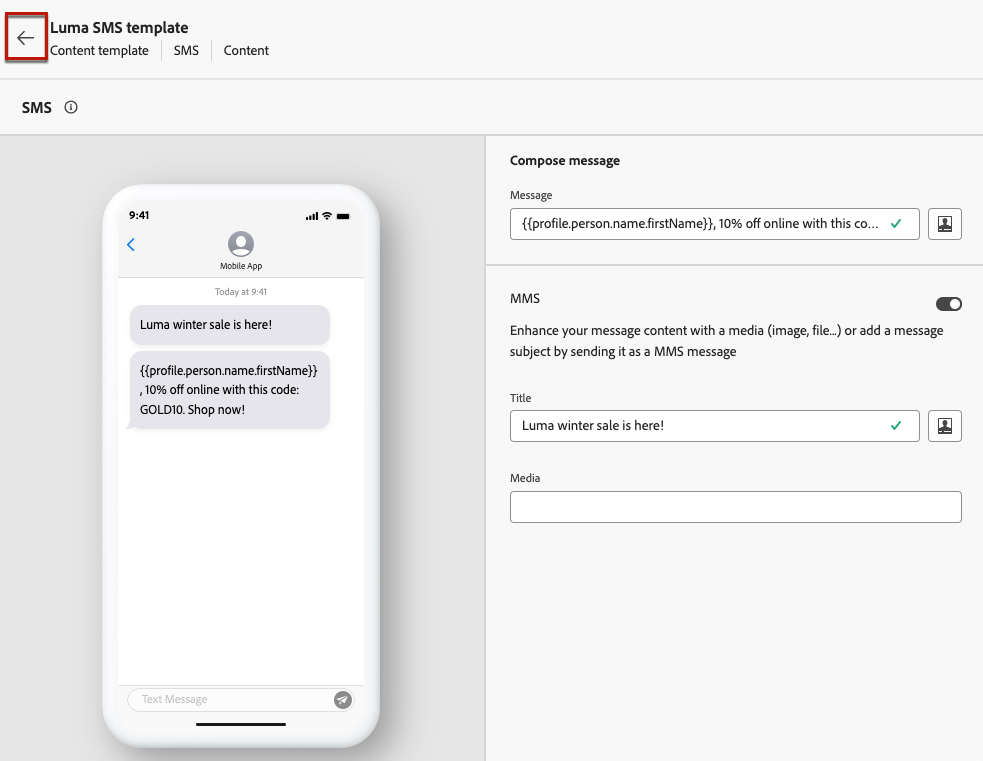

# 使用电子邮件模板 {#content-templates}

为了加快并改进设计过程，您可以创建独立的模板，以轻松地在上下文中重复使用自定义内容 [!DNL Journey Optimizer] 营销活动和历程。

此功能使面向内容的用户能够处理营销活动或历程之外的模板。 然后，营销用户可以在自己的历程或营销策划中重用和调整这些独立内容模板。

<!---->

>[!NOTE]
>
>当前内容模板不适用于Web渠道。

例如，公司内的用户仅负责内容，因此无法访问营销活动或历程。 但是，此用户可创建一个电子邮件模板，贵组织的营销人员可以将该模板作为起点选择用于所有电子邮件。

您还可以使用API创建和管理内容模板。 有关详细信息，请参见 [Journey Optimizer API文档](https://developer.adobe.com/journey-optimizer-apis/references/content/){target="_blank"}.

➡️ [在本视频中了解如何创建和使用模板](#video-templates)

>[!CAUTION]
>
>要创建、编辑和删除内容模板，您必须具有 **[!DNL Manage library items]** 权限包含在 **[!DNL Content Library Manager]** 产品配置文件。 [了解详情](../administration/ootb-product-profiles.md#content-library-manager)

## 访问和管理模板 {#access-manage-templates}

要访问内容模板列表，请选择 **[!UICONTROL 内容管理]** > **[!UICONTROL 内容模板]** 从左侧菜单。

在当前沙盒中创建的所有模板 — 来自使用进行的历程或营销活动 **[!UICONTROL 另存为模板]** 选项，来自 **[!UICONTROL 内容模板]** 菜单 — 显示。 [了解如何创建模板](#create-content-templates)

您可以按以下方式排序内容模板：
* 类型
* 渠道
* 创建或修改日期
* 标记 —  [了解有关标记的更多信息](../start/search-filter-categorize.md#tags)

您还可以选择仅显示您自己创建或修改的项目。

* 要编辑模板内容，请在列表中单击所需项目并选择 **[!UICONTROL 编辑内容]**.

  

* 要删除模板，请选择 **[!UICONTROL 更多操作]** 按钮，然后选择 **[!UICONTROL 删除]**.

  

>[!NOTE]
>
>编辑或删除模板时，使用此模板创建的活动或历程（包括内容）不会受到影响。

### 将模板显示为缩略图 {#template-thumbnails}

选择 **[!UICONTROL 网格视图]** 模式，将每个模板显示为缩略图。

>[!AVAILABILITY]
>
>此功能面向一小部分客户限量发布 (LA)。

>[!NOTE]
>
>当前只能为HTML类型的电子邮件内容模板生成正确的缩略图。

更新内容时，您可能需要等待几秒钟，更改才会反映在缩略图中。

## 创建内容模板 {#create-content-templates}

>[!CONTEXTUALHELP]
>id="ajo_create_template"
>title="定义您自己的内容模板"
>abstract="从头开始创建独立的自定义模板，这样您的内容便可在多个历程和营销活动中重复使用。"

创建内容模板的方法有两种：

* 使用左边栏从头开始创建内容模板 **[!UICONTROL 内容模板]** 菜单。 [了解如何操作](#create-template-from-scratch)

* 在营销活动或历程中设计内容时，请将其另存为模板。 [了解如何操作](#save-as-template)

保存后，您的内容模板即可用于营销活动或历程。 现在，无论是从头开始还是从上一个内容创建，您都可以在中构建任何内容时使用此模板 [!DNL Journey Optimizer]. [了解如何操作](#use-content-templates)

>[!NOTE]
>
>* 无论对内容模板所做的更改是实时的还是草稿的，都不会传播到营销活动或历程。
>
>* 同样，在营销策划或历程中使用模板时，您对营销策划和历程内容进行的任何编辑都不会影响以前使用的内容模板。

### 从头开始制定模板 {#create-template-from-scratch}

要从头开始创建内容模板，请执行以下步骤。

1. 通过以下方式访问内容模板列表 **[!UICONTROL 内容管理]** > **[!UICONTROL 内容模板]** 左侧菜单。

1. 选择 **[!UICONTROL 创建模板]**.

1. 填写模板详细信息并选择所需的渠道。

   

   >[!NOTE]
   >
   >目前，除Web渠道外，所有渠道均可用。

1. 选择 **[!UICONTROL 类型]** 所选渠道的。

   

   * 对象 **[!UICONTROL 电子邮件]**，如果您选择 **[!UICONTROL 内容]**，您可以定义 [主题行](../email/create-email.md#define-email-content) 作为模板的一部分。 如果您选择 **[!UICONTROL HTML]**&#x200B;时，您只能定义电子邮件正文的内容。

   * 对象 **[!UICONTROL 短信]**， **[!UICONTROL 推送]**， **[!UICONTROL 应用程序内]** 和 **[!UICONTROL 直邮]**，则只有默认类型对当前渠道可用。 您仍需要选择它。

1. 从中选择或创建Adobe Experience Platform标记 **[!UICONTROL 标记]** 用于对模板进行分类以改进搜索的字段。 [了解详情](../start/search-filter-categorize.md#tags)

1. 要向模板分配自定义或核心数据使用标签，您可以选择 **[!UICONTROL 管理访问权限]**. [了解有关对象级访问控制(OLAC)的更多信息](../administration/object-based-access.md).

1. 单击 **[!UICONTROL 创建]** 并根据需要设计内容，就像您对历程或营销活动中的任何内容所做的那样 — 根据您选择的渠道。

   

   请在以下部分中了解如何为不同渠道创建内容：
   * [定义电子邮件内容](../email/get-started-email-design.md)
   * [定义推送内容](../push/design-push.md)
   * [定义短信内容](../sms/create-sms.md#sms-content)
   * [定义直邮内容](../direct-mail/create-direct-mail.md)
   * [定义应用程序内内容](../in-app/design-in-app.md)

1. 如果您要创建 **[!UICONTROL 电子邮件]** 模板和 **[!UICONTROL HTML]** 键入，您可以测试您的内容。 [了解如何操作](#test-template)

1. 模板准备就绪后，单击 **[!UICONTROL 保存]**.

1. 单击模板名称旁边的箭头可返回 **[!UICONTROL 详细信息]** 屏幕。

   

现在，在中构建任何内容时，可使用此模板 [!DNL Journey Optimizer]. [了解如何操作](#use-content-templates)

### 另存为模板 {#save-as-template}

>[!CONTEXTUALHELP]
>id="ajo_messages_depecrated_inventory"
>title="了解如何迁移您的消息"
>abstract="从 2022 年 7 月 25 日开始，消息菜单取消，现在直接在历程中创作消息。如果您重用历程中的旧消息，则需要将它们另存为模板。"

在营销活动或历程中设计任何内容时，您可以保存它以供将来重复使用。 为此，请执行以下步骤。

1. 从消息 **[!UICONTROL 编辑内容]** 屏幕上，单击 **[!UICONTROL 内容模板]** 按钮。

1. 选择 **[!UICONTROL 另存为内容模板]** 从下拉菜单中。

   

   如果您在 [电子邮件设计工具](../email/get-started-email-design.md)，您还可以从 **[!UICONTROL 更多]** 屏幕右上方的下拉列表。

   

1. 添加此模板的名称和描述。

   

   >[!NOTE]
   >
   >当前渠道和类型会自动填充，且无法编辑。 对于从创建的电子邮件模板 [电子邮件设计工具](../email/get-started-email-design.md)， **[!UICONTROL HTML]** 类型被自动选中。

1. 从中选择或创建Adobe Experience Platform标记 **标记** 用于对模板进行分类的字段。 [了解详情](../start/search-filter-categorize.md#tags)

1. 要向模板分配自定义或核心数据使用标签，您可以选择 **[!UICONTROL 管理访问权限]**. [了解详情](../administration/object-based-access.md)。

1. 单击&#x200B;**[!UICONTROL 保存]**。

1. 模板将保存到 **[!UICONTROL 内容模板]** 列表，可从访问 [!DNL Journey Optimizer] 专用菜单。 它会变成一个独立的内容模板，可以像该列表中的任何其他项目一样访问、编辑和删除该模板。 [了解详情](#access-manage-templates)

现在，在中构建任何内容时，都可以使用此模板 [!DNL Journey Optimizer]. [了解如何操作](#use-content-templates)

>[!NOTE]
>
>对该新模板所做的任何更改都不会传播到该模板所来自的内容。 同样，在该内容中编辑原始内容时，不会修改新模板。

## 测试电子邮件内容模板 {#test-template}

您可以测试某些电子邮件模板的呈现，无论是从草稿还是从现有内容创建。 要实现此目的，请执行以下步骤。

1. 通过以下方式访问内容模板列表 **[!UICONTROL 内容管理]** > **[!UICONTROL 内容模板]** 菜单，然后选择任意电子邮件模板。

1. 单击 **[!UICONTROL 编辑内容]** 从 **[!UICONTROL 模板属性]**.

1. 单击 **[!UICONTROL 模拟内容]** 并选择测试配置文件以检查您的渲染。 [了解详情](../content-management/preview-test.md)

   

1. 您可以发送校样以测试您的内容，并在将其用于历程或营销策划之前，先获得一些内部用户的批准。

   * 要执行此操作，请单击 **[!UICONTROL 发送验证]** 按钮并按照中所述的步骤操作。 [本节](../content-management/proofs.md).

   * 在发送校样之前，您必须选择 [电子邮件表面](../configuration/channel-surfaces.md) 将用于测试您的内容。

     

>[!CAUTION]
>
>当前在测试电子邮件内容模板时不支持跟踪，这意味着跟踪事件、UTM参数和登陆页面链接将在从模板发送的验证中无效。 要测试跟踪， [使用内容模板](../email/use-email-templates.md) 在电子邮件和 [发送验证](../content-management/preview-test.md#send-proofs).

## 使用内容模板 {#use-content-templates}

在中为任何渠道（Web除外）创建内容时 [!DNL Journey Optimizer]，您可以使用自定义模板，执行以下操作之一：

* 使用从头开始创建 **[!UICONTROL 内容模板]** 菜单。 [了解详情](#create-template-from-scratch)

* 使用从历程或营销活动中的现有内容保存 **[!UICONTROL 另存为内容模板]** 选项。 [了解详情](#save-as-template)

要开始使用这些模板之一构建内容，请执行以下步骤。

1. 无论是在营销活动或历程中，选择后 **[!UICONTROL 编辑内容]**，单击 **[!UICONTROL 内容模板]** 按钮。

1. 选择 **[!UICONTROL 应用内容模板]**.

   

1. 从列表中选择您选择的模板。 仅显示与所选渠道和/或类型兼容的模板。

   

   >[!NOTE]
   >
   >在此屏幕中，您还可以使用专用按钮创建新模板，该按钮将打开一个新选项卡。

1. 单击 **[!UICONTROL 确认]**. 模板将应用于您的内容。

1. 根据需要继续编辑您的内容。

>[!NOTE]
>
>要使用，从内容模板开始设计电子邮件，请使用 [电子邮件设计工具](../email/get-started-email-design.md)，请按照中所述的步骤操作 [本节](../email/use-email-templates.md).

## 操作方法视频 {#video-templates}

了解如何在中创建、编辑和使用内容模板 [!DNL Journey Optimizer].

>[!VIDEO](https://video.tv.adobe.com/v/3413743/?quality=12)
