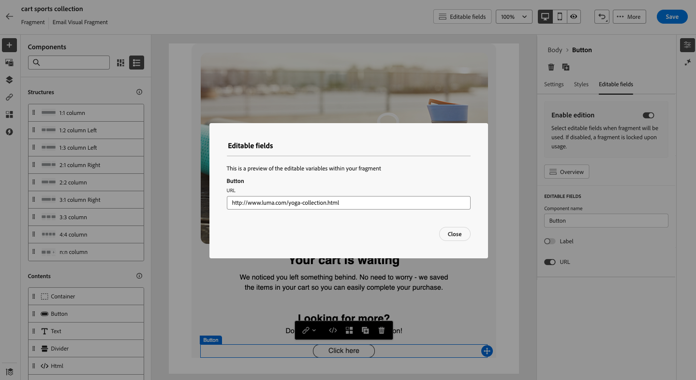
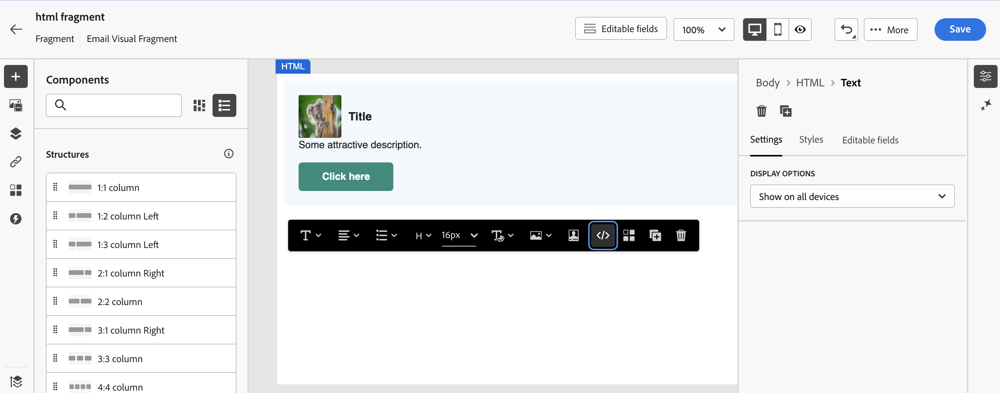
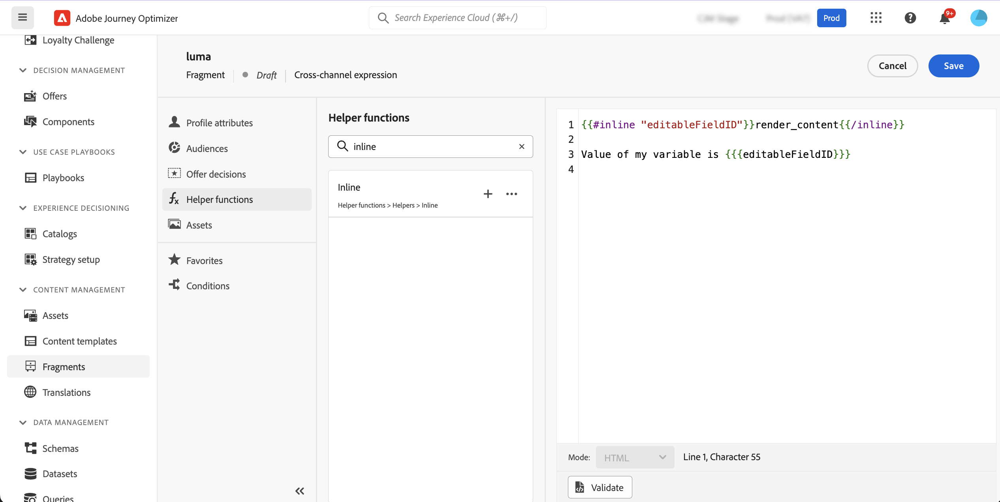

# 可自定义的片段 {#customizable-fragments}

>[!BEGINSHADEBOX]

**在此页面上：**&#x200B;了解如何使可视和表达式片段中的特定字段可编辑，以便用户在将片段添加到营销活动或历程时可以自定义它们，而不会中断原始片段的继承。

>[!ENDSHADEBOX]

在营销活动或历程操作中使用片段时，它们会因继承而默认被锁定。 这意味着对片段所做的任何更改都会自动传播到使用该片段的所有营销活动和历程。

使用&#x200B;**可自定义的片段**，在将片段添加到营销活动或历程操作时，可以将片段中的特定字段定义为可编辑。 例如，假设您有一个带有横幅、一些文本和按钮的片段。 您可以将某些字段（如图像或按钮目标URL）指定为可编辑的。 这允许用户在将片段整合到其活动或历程中时修改这些元素，提供定制的体验而不影响原始片段。

可自定义的片段无需中断片段继承，这以前阻止将片段级别的集中更改传播到活动和历程。 这种方法允许在使用时调整内容部分，从而灵活地用特定于上下文的详细信息覆盖默认值。

利用可自定义的片段，您可以有效地管理和个性化内容，而无需创建全新的内容块或中断原始片段的继承。 这样可以确保在片段级别所做的更改仍会传播，同时允许在营销活动或历程级别进行必要的自定义。

可视片段和表达式片段均可以标记为可自定义。 有关如何继续处理每种类型片段的详细说明，请参阅以下部分。

## 向可视片段添加可编辑字段 {#visual}

要使可视片段的某些部分可编辑，请执行以下步骤：

>[!NOTE]
>
>可编辑的字段可添加到&#x200B;**图像**、**文本**&#x200B;和&#x200B;**按钮**&#x200B;组件中。 对于&#x200B;**HTML**&#x200B;组件，使用个性化编辑器添加可编辑的字段，类似于表达式片段。 [了解如何在HTML组件和表达式片段中添加可编辑字段](#expression)

1. 打开片段内容版本屏幕。

1. 选择片段中要配置可编辑字段的组件。

1. 组件属性窗格将在右侧打开。 选择&#x200B;**可编辑字段**&#x200B;选项卡，然后切换&#x200B;**启用版本**&#x200B;选项。

1. 窗格中列出了可为选定组件编辑的所有字段。 可供编辑的字段取决于所选的组件类型。

   在以下示例中，我们允许编辑“单击此处”按钮URL。

   

1. 单击&#x200B;**概述**&#x200B;以检查所有可编辑的字段及其默认值。

   在此示例中，按钮URL字段显示在组件中定义的默认值中。 在将片段添加到用户的内容后，用户可以自定义此值。

   

1. 准备就绪后，保存更改以更新片段。

1. 将片段添加到电子邮件后，用户将能够自定义片段中配置的所有可编辑字段。 [了解如何自定义可视化片段中的可编辑字段](../email/use-visual-fragments.md#customize-fields)

>[!CAUTION]
>
>当在片段中同时编辑按钮组件的&#x200B;**标签**&#x200B;和&#x200B;**URL**&#x200B;时，跟踪报表将显示URL而不是按钮标签。 [了解有关跟踪的更多信息](../email/message-tracking.md)

## 在可自定义的可视化片段中启用富文本编辑 {#rich-text-visual}

>[!CONTEXTUALHELP]
>id="ajo_editable_fragment_compatibility"
>title="旧版片段"
>abstract="此片段中的可编辑字段当前为纯文本模式。 这意味着，在电子邮件中编辑此片段时只能输入纯文本，不支持完整的格式选项，例如粗体、斜体、超链接和换行符。 在电子邮件中使用片段时，单击<b>启用</b>可允许可编辑字段中的富文本。"

>[!CONTEXTUALHELP]
>id="ajo_editable_field_compatibility"
>title="旧版片段"
>abstract="这个可编辑字段为纯文本模式。 完整的格式选项（粗体、斜体、超链接、换行符等） 在片段升级到富文本模式之前不可用。 转到片段正文设置并单击<b>启用</b>以解锁可编辑字段中的RTF文本。"
>additional-url="https://experienceleague.adobe.com/zh-hans/docs/journey-optimizer/using/channels/email/design-email/add-content/use-visual-fragments#customize-fields" text="自定义片段中的可编辑字段"

>[!CONTEXTUALHELP]
>id="ac_editable_fragment_compatibility"
>title="旧版片段"
>abstract="此片段中的可编辑字段当前为纯文本模式。 完整的格式选项（粗体、斜体、超链接、换行符等） 在片段升级到富文本模式之前不可用。 若要解锁此模式，请打开片段编辑器并单击<b>启用</b>。"
>additional-url="https://experienceleague.adobe.com/zh-hans/docs/journey-optimizer/using/channels/email/design-email/add-content/use-visual-fragments#customize-fields" text="自定义片段中的可编辑字段"

可自定义的可视化片段现在本机支持富文本<!--— including bold, italic, line breaks, and hyperlinks —-->。

当在电子邮件中使用可自定义的可视化片段时，您可以直接在片段的&#x200B;**[!UICONTROL 文本]**、**[!UICONTROL 按钮]**&#x200B;和&#x200B;**[!UICONTROL Html]**&#x200B;组件的任何可编辑字段中利用完整的格式选项，例如粗体、斜体、换行符、项目符号列表和超链接。 [了解如何自定义可编辑的字段](../email/use-visual-fragments.md#customize-fields)

但是，如果在引入富文本功能之前创建片段并定义了可编辑字段，则默认情况下，可编辑字段设置为纯文本模式。

* 片段编辑器中会显示兼容性警告。

  

  要在电子邮件中使用片段时解锁这些可编辑字段的富文本模式，请单击&#x200B;**启用**&#x200B;按钮并保存片段。

* 将片段添加到电子邮件后，在电子邮件Designer中选择片段时也会显示兼容性警告。

  

  要将片段升级到富文本模式，请使用&#x200B;**打开片段**&#x200B;按钮访问片段编辑器，然后单击&#x200B;**启用**&#x200B;按钮并保存片段。

在解锁富文本模式之前，旧版可自定义的可视化片段继续仅支持纯文本。 用户无法在这些片段的可编辑字段中输入富文本。

## 将可编辑字段添加到HTML组件和表达式片段 {#expression}

要使HTML组件或表达式片段的某些部分可编辑，必须在表达式编辑器中使用特定语法。 这涉及声明一个具有默认值的&#x200B;**变量**，用户在将片段添加到其内容后可以覆盖该变量。

例如，假设您要创建一个片段以添加到您的电子邮件中，并允许用户自定义在不同位置使用的特定颜色，如框架或按钮的背景颜色。 创建片段时，您需要声明一个具有&#x200B;**唯一ID**&#x200B;的变量，例如“color”，并在片段内容中要应用此颜色的所需位置调用它。 将片段添加到其内容时，用户将能够自定义在任何引用变量的位置使用的颜色。

对于HTML组件，只有特定元素才能变为可编辑字段。 展开以下部分以获取更多信息。

+++HTML组件中的可编辑元素：

以下元素可以成为HTML组件中的可编辑字段：

* 文本的一部分
* 链接或图像的完整URL（不适用于URL的一部分）
* 整个CSS属性（不适用于部分属性）

例如，在下面的代码中，每个以红色高亮显示的元素都可以成为属性：

{width="70%"}

+++

要声明变量并在片段中使用它，请执行以下步骤：

1. 打开表达式片段，然后在个性化编辑器中编辑其内容。

   

   对于HTML组件，选择片段中的组件并单击&#x200B;**显示源代码**&#x200B;按钮。

1. 声明用户要编辑的变量。 导航到左侧导航窗格中的&#x200B;**辅助函数**&#x200B;菜单，然后添加&#x200B;**内联**&#x200B;辅助函数。 用于声明和调用变量的语法会自动添加到内容中。

   

1. 将`"name"`替换为唯一ID以标识可编辑字段。

   >[!NOTE]
   >
   >字段ID必须是唯一的，且不能包含空格。 此ID应在您的内容中要显示变量值的任意位置使用。

1. 通过添加下表中详述的参数来调整语法以符合您的需求：

   | 操作 | 参数 | 示例 |
   | ------- | ------- | ------- |
   | 使用&#x200B;**默认值**&#x200B;声明可编辑字段。 将片段添加到内容时，如果您不自定义片段，则将使用此默认值。 | 在内联标记之间添加默认值。 | `{{#inline "editableFieldID"}}default_value{{/inline}}` |
   | 为可编辑字段定义&#x200B;**标签**。 编辑片段的字段时，此标签将显示在电子邮件Designer中。 | `name="title"` | `{{#inline "editableFieldID" name="title"}}default_value{{/inline}}` |
   | 声明包含需要发布的&#x200B;**图像源**&#x200B;的可编辑字段。 | `assetType="image"` | `{{#inline "editableFieldID" assetType="image"}}default_value{{/inline}}` |
   | 声明包含需要跟踪的&#x200B;**URL**&#x200B;的可编辑字段。 请注意，现成的“镜像页面URL”和“取消订阅链接”预定义块不能成为可编辑的字段。 | `assetType="url"` | `{{#inline "editableFieldID" assetType="url"}}default_value{{/inline}}` |

1. 在代码中要显示可编辑字段值的每个位置使用`{{{name}}}`语法。 将`name`替换为之前定义的字段的唯一ID。

   

1. 保存并发布您的片段。

在将片段添加到其电子邮件内容时，用户现在可以使用所选值覆盖变量的默认值：

* 对于表达式片段，使用特定语法覆盖变量值。 [了解如何自定义表达式片段中的可编辑字段](../personalization/use-expression-fragments.md#customize-fields)

* 对于HTML组件，变量显示在电子邮件Designer的可编辑字段列表中。 [了解如何自定义可视化片段中的可编辑字段](../email/use-visual-fragments.md#customize-fields)

### 示例：可自定义的表达式片段 {#example}

在以下示例中，我们正在创建一个展示新体育收藏集的表达式片段。 默认情况下，片段显示此内容： *查找更多？ 不要错过我们最新的体育收藏集！*

我们希望允许用户将本内容中的“sports”替换为他们选择的运动。 例如：*查找更多？ 不要错过我们最新的瑜伽系列！*

为实现此操作，请执行以下步骤：

1. 声明“sport”变量，并将ID设置为“sport”。

   默认情况下，如果用户在其内容中添加片段后未更改变量的值，则会显示`{{#inline}}`和`{{/inline}}`标记之间定义的值，即“sports”。

1. 在片段内容中添加``{{{sport}}}``语法，以便在其中显示变量值，即默认为“sports”或用户选择的值。

   

1. 将表达式片段添加到其内容时，用户可以直接从表达式编辑器中使用所做的选择更改变量的值。 [了解如何自定义表达式片段中的可编辑字段](../personalization/use-expression-fragments.md#customize-fields)

   

<!--
## Add rich text to a customizable fragment {#rich-text}

Rich text such as line breaks, bold, italics etc., can be added to a customizable fragment by using HTML components. To do so, follow the steps below.

➡️ [Learn how to add and use rich text in a customizable fragment in this video](#video)

### Create a fragment including rich text {#add-rich-text}

The approach below (using HTML components with inline variables) remains fully supported for advanced HTML-based scenarios??

1. Create a visual [fragment](create-fragments.md) and start adding components.

1. Add an [HTML component](../email/content-components.md#HTML) and open the HTML editor.

1. Navigate to the **[!UICONTROL Helper functions]** menu in the left navigation pane and add the **inline** helper function.

1. Replace `"name"` with the ID you want to use for your editable content, for example "EditableContent".

1. Replace `render_content` with the HTML code corresponding to the default rich content you want. You can add bold, italic, line breaks, bulleted lists, etc.

    

1. Within the same HTML component, add another **inline** helper function for your styling elements.

1. Replace `"name"` and `render_content` with the ID and HTML code corresponding to the default styling you want.

    

1. Save your content. The selected editable fields are displayed on the right-hand side.

    

1. Save and [publish](create-fragments.md#publish) the fragment.

### Use rich text in customizable fragments {#use-rich-text}

When adding the fragment to your email, you can now edit the rich text content and styling that you created. As a marketer, follow the steps below.

1. [Create an email](../email/create-email.md) in a campaign or a journey, then add the fragment with rich text that was [created](#add-rich-text).

    You can see the two editable fields that were created on the right-hand side.

    

1. Use either simulation method to see how the editable content and styling render: click **[!UICONTROL Simulate content]** to test content variations with sample input data or AI auto-generation, or click **[!UICONTROL Simulate content]**, then select **[!UICONTROL Simulate content (AEP profiles)]** from the dropdown to preview with test profiles. [Learn more on previewing content](preview-test.md)

1. Select the **[!UICONTROL Add personalization]** icon next to one of the editable fields.

1. In the personalization editor that opens, update the styling and/or content as wanted by adding or removing elements of the editable field.

    

## How-to video {#video}

This video shows how to make HTML components within a fragment editable, allowing for dynamic updates to both content and styling.

>[!VIDEO](https://video.tv.adobe.com/v/3464363/?learn=on&#x26;enablevpops)
-->