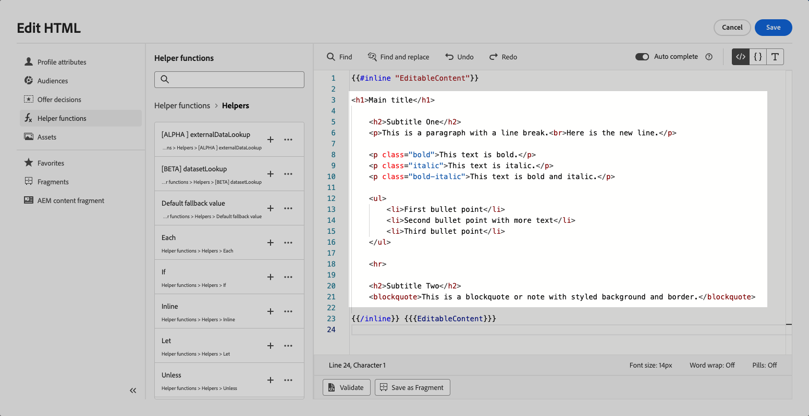

# 可自定义的片段 {#customizable-fragments}

在营销活动或历程操作中使用片段时，它们会因继承而默认被锁定。 这意味着对片段所做的任何更改都会自动传播到使用该片段的所有营销活动和历程。

使用&#x200B;**可自定义的片段**，在将片段添加到营销活动或历程操作时，可以将片段中的特定字段定义为可编辑。 例如，假设您有一个带有横幅、一些文本和按钮的片段。 您可以将某些字段（如图像或按钮目标URL）指定为可编辑的。 这允许用户在将片段整合到其活动或历程中时修改这些元素，提供定制的体验而不影响原始片段。

可自定义的片段无需中断片段继承，这以前阻止将片段级别的集中更改传播到活动和历程。 这种方法允许在使用时调整内容部分，从而灵活地用特定于上下文的详细信息覆盖默认值。

利用可自定义的片段，您可以有效地管理和个性化内容，而无需创建全新的内容块或中断原始片段的继承。 这样可以确保在片段级别所做的更改仍会传播，同时允许在营销活动或历程级别进行必要的自定义。

可视片段和表达式片段均可以标记为可自定义。 有关如何继续处理每种类型片段的详细说明，请参阅以下部分。


## 向可视片段添加可编辑字段 {#visual}

要使可视片段的某些部分可编辑，请执行以下步骤：

>[!NOTE]
>
>可编辑的字段可添加到&#x200B;**图像**、**文本**&#x200B;和&#x200B;**按钮**&#x200B;组件中。 对于&#x200B;**HTML**&#x200B;组件，使用个性化编辑器添加可编辑的字段，类似于表达式片段。 [了解如何在HTML组件和表达式片段中添加可编辑字段](#expression)

1. 打开片段内容版本屏幕。

1. 选择片段中要配置可编辑字段的组件。

1. 组件属性窗格将在右侧打开。 选择&#x200B;**可编辑字段**&#x200B;选项卡，然后切换&#x200B;**启用版本**&#x200B;选项。

1. 窗格中列出了可为选定组件编辑的所有字段。 可供编辑的字段取决于所选的组件类型。

   在以下示例中，我们允许编辑“单击此处”按钮URL。

   

1. 单击&#x200B;**概述**&#x200B;以检查所有可编辑的字段及其默认值。

   在此示例中，按钮URL字段显示在组件中定义的默认值中。 在将片段添加到用户的内容后，用户可以自定义此值。

   

1. 准备就绪后，保存更改以更新片段。

1. 将片段添加到电子邮件后，用户将能够自定义片段中配置的所有可编辑字段。 [了解如何自定义可视化片段中的可编辑字段](../email/use-visual-fragments.md#customize-fields)

## 将可编辑字段添加到HTML组件和表达式片段 {#expression}

要使HTML组件或表达式片段的某些部分可编辑，必须在表达式编辑器中使用特定语法。 这涉及声明一个具有默认值的&#x200B;**变量**，用户在将片段添加到其内容后可以覆盖该变量。

例如，假设您要创建一个片段以添加到您的电子邮件中，并允许用户自定义在不同位置使用的特定颜色，如框架或按钮的背景颜色。 创建片段时，您需要声明一个具有&#x200B;**唯一ID**&#x200B;的变量，例如“color”，并在片段内容中要应用此颜色的所需位置调用它。 将片段添加到其内容时，用户将能够自定义在任何引用变量的位置使用的颜色。

对于HTML组件，只有特定元素才能变为可编辑字段。 展开以下部分以获取更多信息。

+++HTML组件中的可编辑元素：

以下元素可以成为HTML组件中的可编辑字段：

* 文本的一部分
* 链接或图像的完整URL（不适用于URL的一部分）
* 整个CSS属性（不适用于部分属性）

例如，在下面的代码中，每个以红色高亮显示的元素都可以成为属性：

{width="70%"}

+++

要声明变量并在片段中使用它，请执行以下步骤：

1. 打开表达式片段，然后在个性化编辑器中编辑其内容。

   

   对于HTML组件，选择片段中的组件并单击&#x200B;**显示源代码**&#x200B;按钮。

1. 声明用户要编辑的变量。 导航到左侧导航窗格中的&#x200B;**辅助函数**&#x200B;菜单，然后添加&#x200B;**内联**&#x200B;辅助函数。 用于声明和调用变量的语法会自动添加到内容中。

   

1. 将`"name"`替换为唯一ID以标识可编辑字段。

   >[!NOTE]
   >
   >字段ID必须是唯一的，且不能包含空格。 此ID应在您的内容中要显示变量值的任意位置使用。

1. 通过添加下表中详述的参数来调整语法以符合您的需求：

   | 操作 | 参数 | 示例 |
   | ------- | ------- | ------- |
   | 使用&#x200B;**默认值**&#x200B;声明可编辑字段。 将片段添加到内容时，如果您不自定义片段，则将使用此默认值。 | 在内联标记之间添加默认值。 | `{{#inline "editableFieldID"}}default_value{{/inline}}` |
   | 为可编辑字段定义&#x200B;**标签**。 编辑片段的字段时，此标签将显示在电子邮件Designer中。 | `name="title"` | `{{#inline "editableFieldID" name="title"}}default_value{{/inline}}` |
   | 声明包含需要发布的&#x200B;**图像源**&#x200B;的可编辑字段。 | `assetType="image"` | `{{#inline "editableFieldID" assetType="image"}}default_value{{/inline}}` |
   | 声明包含需要跟踪的&#x200B;**URL**&#x200B;的可编辑字段。<br/>请注意，现成的“镜像页面URL”和“取消订阅链接”预定义块不能成为可编辑的字段。 | `assetType="url"` | `{{#inline "editableFieldID" assetType="url"}}default_value{{/inline}}` |

1. 在代码中要显示可编辑字段值的每个位置使用`{{{name}}}`语法。 将`name`替换为之前定义的字段的唯一ID。

   

1. 保存并发布您的片段。

在将片段添加到其电子邮件内容时，用户现在可以使用所选值覆盖变量的默认值：

* 对于表达式片段，使用特定语法覆盖变量值。 [了解如何自定义表达式片段中的可编辑字段](../personalization/use-expression-fragments.md#customize-fields)

* 对于HTML组件，变量显示在电子邮件Designer的可编辑字段列表中。 [了解如何自定义可视化片段中的可编辑字段](../email/use-visual-fragments.md#customize-fields)

### 可编辑的表达式片段示例 {#example}

在以下示例中，我们正在创建一个展示新体育收藏集的表达式片段。 默认情况下，片段显示此内容： *查找更多？ 不要错过我们最新的体育收藏集！*

我们希望允许用户将本内容中的“sports”替换为他们选择的运动。 例如：*查找更多？ 不要错过我们最新的瑜伽系列！*

为实现此操作，请执行以下步骤：

1. 声明“sport”变量，并将ID设置为“sport”。

   默认情况下，如果用户在其内容中添加片段后未更改变量的值，则会显示`{{#inline}}`和`{{/inline}}`标记之间定义的值，即“sports”。

1. 在片段内容中添加``{{{sport}}}``语法，以便在其中显示变量值，即默认为“sports”或用户选择的值。

   

1. 将表达式片段添加到其内容时，用户可以直接从表达式编辑器中使用所做的选择更改变量的值。 [了解如何自定义表达式片段中的可编辑字段](../personalization/use-expression-fragments.md#customize-fields)

   

## 将富文本添加到可自定义的片段 {#rich-text}

可以使用HTML组件将富文本（如换行符、粗体、斜体等）添加到可编辑片段中。 要实现此目的，请执行以下步骤。

➡️ [了解如何在此视频中添加和使用富文本到可编辑片段](#video)

### 创建包含富文本的片段 {#add-rich-text}

1. 创建可视化[片段](create-fragments.md)并开始添加组件。

1. 添加[HTML组件](../email/content-components.md#HTML)并打开HTML编辑器。

1. 导航到左侧导航窗格中的&#x200B;**[!UICONTROL 辅助函数]**&#x200B;菜单，然后添加&#x200B;**内联**&#x200B;辅助函数。

1. 将`"name"`替换为您要用于可编辑内容的ID，例如“EditableContent”。

1. 将`render_content`替换为您所需的默认丰富内容对应的HTML代码。 您可以添加粗体、斜体、换行符、项目符号列表等。

   
<!--
    +++For example:

    ```html

    <h1>Main title</h1>

    <h2>Subtitle One</h2>
    <p>This is a paragraph with a line break.<br>Here is the new line.</p>

    <p class="bold">This text is bold.</p>
    <p class="italic">This text is italic.</p>
    <p class="bold-italic">This text is bold and italic.</p>

    <ul>
        <li>First bullet point</li>
        <li>Second bullet point with more text</li>
        <li>Third bullet point</li>
    </ul>

    <hr>

    <h2>Subtitle Two</h2>
    <blockquote>This is a blockquote or note with styled background and border.</blockquote>

    ```

    +++
-->

1. 在同一HTML组件中，为您的样式元素添加另一个&#x200B;**内联**&#x200B;帮助程序函数。

1. 将`"name"`和`render_content`替换为与所需默认样式相对应的ID和HTML代码。

   

1. 保存您的内容。 所选的可编辑字段显示在右侧。

   

1. 保存并[发布](create-fragments.md#publish)片段。

### 使用富文本可编辑片段 {#use-rich-text}

在将片段添加到其电子邮件内容时，用户现在可以编辑您创建的富文本内容和样式。 要将富文本可编辑片段用作营销人员，请执行以下步骤。

1. [在营销活动或历程中创建电子邮件](../email/create-email.md)，然后添加包含[已创建](#add-rich-text)的RTF内容的片段。

   您可以在右侧看到创建的两个可编辑字段。

   

1. 您可以单击&#x200B;**[!UICONTROL 模拟内容]**&#x200B;以查看可编辑内容和样式呈现方式。 [了解有关预览内容的更多信息](preview-test.md)

1. 选择其中一个可编辑字段旁边的&#x200B;**[!UICONTROL 添加个性化]**&#x200B;图标。

1. 在打开的个性化编辑器中，根据需要通过添加或删除可编辑字段的元素来更新<!--CSS-->样式和/或内容。

   

## 操作说明视频 {#video}

本视频说明如何使片段中的HTML组件可编辑，从而允许对内容和样式进行动态更新。

>[!VIDEO](https://video.tv.adobe.com/v/3464378/?learn=on&#x26;enablevpops&captions=chi_hans)
