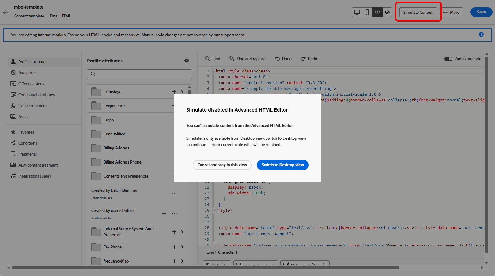

# 使用高级HTML编辑器编辑电子邮件模板 {#email-template-expert-mode}

>[!AVAILABILITY]
>
>此功能为限量发布版。请联系 Adobe 代表获取访问权限。

**高级HTML编辑器**&#x200B;是一种专家模式，允许您直接从[!DNL Journey Optimizer]电子邮件Designer界面查看和编辑电子邮件内容模板的原始源代码。

此功能允许您直接在源中插入高级表达式（如条件）。 切换回可视化（桌面）视图后，内容将重新呈现，这样您就可以检查内容的外观，并在任一视图中继续编辑。

>[!NOTE]
>
>此功能仅在内容模板和电子邮件渠道中可用。

## 护栏 {#guardrails}

使用高级HTML编辑器时，以下护栏可保护内容兼容性并设置预期。

* 高级HTML编辑器&#x200B;**不验证**&#x200B;您的代码。 它不会检查语法错误或布局中断。 在保存之前仔细查看您的内容。

* 将来的系统更新可能会覆盖您对默认标记所做的更改。 **您的更改可能不会保留**。

* [!DNL Adobe]支持团队&#x200B;**无法对自定义代码和手动更改导致的**&#x200B;问题进行故障诊断或解决。 保留内容的备份，以防您需要还原。

* 您无法在高级HTML视图中模拟内容。 切换到桌面视图以预览您的内容。

* 为确保内容兼容性，**您不能在高级HTML视图中保存**。 准备好保存更改后，切换回“桌面”视图。

>[!WARNING]
>
>内容模板中的高级HTML编辑器与电子邮件Designer中的&#x200B;**[!UICONTROL 为自己编码]**&#x200B;模式不同。 在[!UICONTROL 对您自己的]模式进行编码，您无法切换回可视编辑器 — 一旦选择该路径，您将处于仅进行代码编辑的状态。 相比之下，高级HTML编辑器允许您随时在HTML视图和桌面（可视化）视图之间切换。 [详细了解代码编辑器](../email/code-content.md)

## 切换到高级HTML视图 {#switch-to-html-view}

要打开高级HTML编辑器并编辑模板源，请执行以下步骤。

1. 打开或创建[电子邮件模板](../content-management/create-content-templates.md)并打开[电子邮件Designer](../email/get-started-email-design.md)以编辑内容。

1. 单击屏幕右上角的&#x200B;**[!UICONTROL HTML]**&#x200B;按钮。

   

1. 首次打开高级HTML编辑器时，会显示一条警告消息。 请仔细查看并单击&#x200B;**[!UICONTROL 确定]**&#x200B;以继续。 [了解详情](#guardrails)

   {zoomable="yes"}

   >[!NOTE]
   >
   >仅当您首次打开高级HTML编辑器并每月重置时，此警告才会显示。

1. 此时将显示高级HTML编辑器。

   

1. 将所需的更改添加到您的电子邮件内容中。

   >[!WARNING]
   >
   >确保输入正确的HTML和CSS代码，因为没有语法验证过程，[!DNL Adobe]也不提供支持。 [了解详情](#guardrails)

1. 出于兼容性原因，内容模拟和保存在高级HTML视图中不可用。 切换回“桌面”视图以预览内容并保存更改。

   {zoomable="yes"}

   >[!NOTE]
   >
   >切换视图时，将保留所做的编辑。

<!--
    {zoomable="yes"}-->

## 相关主题

* [为自己的电子邮件内容编写代码](../email/code-content.md)
* [创建内容模板](create-content-templates.md)
* [开始使用电子邮件设计器](../email/get-started-email-design.md)

