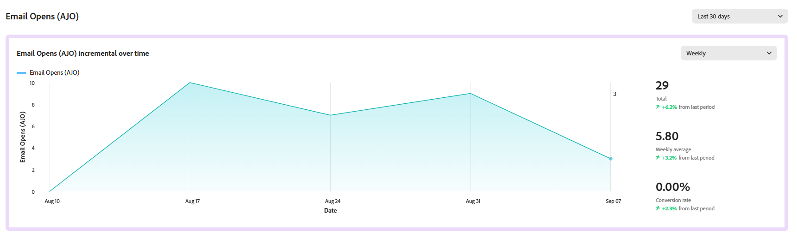

# 量度 {#experiment-accelerator-metrics}

**[!UICONTROL 量度]**&#x200B;页面在一个位置显示Journey Optimizer和Target实验中的成功量度，从而能够进行性能监控、比较和深入分析。

## 功能板 {#dashboard}

在访问&#x200B;**[!UICONTROL 量度]**&#x200B;选项卡时，Journey Optimizer和Adobe Target中的所有可用成功量度都会列在一个合并视图中，以帮助您跟踪跨计划的性能、比较结果并快速识别需要注意的领域。

通过单击访问筛选器，该选项提供了上下文特定的选项，例如，按&#x200B;**[!UICONTROL Source]**&#x200B;或&#x200B;**[!UICONTROL 在活动实验中使用的筛选]**。

或者，通过在搜索栏中输入量度名称来快速查找任何量度。

## 量度详细信息 {#metric-details}

### 随时间递增

**[!UICONTROL 随时间递增]**&#x200B;图表提供了所选量度在选定时间范围内的趋势的可视细分。 使用下拉菜单在每日视图或每周视图之间切换，以调整粒度级别。

以下摘要值可供快速参考：

* **[!UICONTROL 总计]**：选定量度在报告期间的累积值。

* **[!UICONTROL 平均值]**：在所选时间范围内计算的典型量度值。 通过平衡每日或每周的波动，它提供了更清晰的正常性能描述，并可用作比较的基线。

* **[!UICONTROL 转化率]**：查看处理后完成所需操作（例如，购买、注册）的用户档案的百分比。

每个值都包含与上一时段相比的百分比变化，从而很容易看到性能是提升、下降还是保持稳定。

### 试验效果

此部分显示选定时间范围（过去90天、过去30天或过去7天）内的所有活动试验，并突出显示它们对量度的贡献。

可以使用以下量度：

* **[!UICONTROL 提升]**：测量给定处理的转化率相对于基线的提升百分比。

* **[!UICONTROL 置信度]**：表明给定处理与基线处理相同的证据。 [了解详情](../content-management/experiment-calculations.md#understand-confidence)

* **[!UICONTROL 贡献]**：可归因于特定试验或处理的量度总体变化比例，可识别产生最大相对影响的计划。
