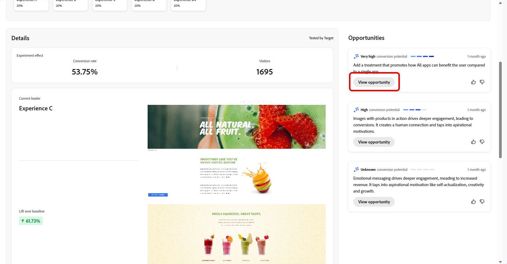

# 跟踪您的试验 {#monitor}

>[!BEGINSHADEBOX]

* [Experimentation Accelerator入门](experiment-accelerator.md)
* [使用Experimentation Accelerator的AI中的数据使用](experiment-accelerator-security.md)
* [Experimentation Accelerator最佳实践](experiment-accelerator-best-practices.md)
* **[监视实验](experiment-accelerator-monitor.md)**
* [试验指标](experiment-accelerator-metrics.md)

>[!ENDSHADEBOX]

**[!UICONTROL 试验]**&#x200B;选项卡集中了来自Adobe Journey Optimizer和Adobe Target的测试的跟踪和分析。 您可以查看所有试验、审查KPI，以及筛选或搜索以定位特定测试。

## 功能板 {#dashboard}

在访问“试验”选项卡时，Journey Optimizer和Adobe Target中所有可用的试验都将列在合并视图中。 这使您能够在一个位置快速查看和比较两个平台中的实验。
“试验”列表包括：

* 在营销活动或历程中创建的Journey Optimizer实验。

* 链接到同一IMS组织的Adobe Target生产默认沙盒中可用的Journey Optimizer试验。

KPI部分提供关键量度，包括已创建试验的总数以及当前正在进行的试验数量，并提供整个试验活动的概览

通过单击访问筛选器，该选项提供了上下文特定的选项，例如按&#x200B;**[!UICONTROL Type]**、**[!UICONTROL Starred]**、**[!UICONTROL Status]**&#x200B;或&#x200B;**[!UICONTROL Source]**&#x200B;进行筛选。 例如，您可以进行筛选，以仅显示Journey Optimizer中的活动试验。

或者，通过在搜索栏中输入试验名称来快速查找试验。

## 监控您的实验 {#monitor-page}

要访问和监视实验，请从&#x200B;**[!UICONTROL 实验]**&#x200B;选项卡的实验列表中选择之前配置的实验，或使用高级菜单&#x200B;**[!UICONTROL 查看详细信息]**&#x200B;或&#x200B;**[!UICONTROL 在源中打开]**。

试验详细信息页面分为以下部分：

* [实验结果](#experiment-outcome)
* [假设验证](#hypothesis)
* [详细信息](#details)
* [机会](#opportunities)
* [结果](#results)
* [试验性见解](#insights)

### 实验结果 {#experiment-outcome}

**[!UICONTROL 试验结果]**&#x200B;为您提供了试验中入选变量的快速视图。

### 设置 {#set-up}

**[!UICONTROL 假设验证]**&#x200B;捕获要测试的计划更改，并记录对主要量度的预期影响。 定义明确的&#x200B;**[!UICONTROL 假设验证]**&#x200B;可确保每个试验都有可衡量的目标，从而更容易评估结果并确定更改是否带来有意义的改进。

请注意，要生成[试验分析](#insights)，您需要确认假设验证和处理详细信息以及要达到的统计意义。

1. 单击&#x200B;**[!UICONTROL 添加]**&#x200B;为您的试验创建一个&#x200B;**[!UICONTROL 假设验证]**。

   

1. 通过详细描述已进行的更改以及这些更改将如何影响主要指标，键入您的&#x200B;**[!UICONTROL 假设验证]**。

   单击&#x200B;**[!UICONTROL 保存]**。

1. 单击&#x200B;**[!UICONTROL 审核]**&#x200B;以添加或替换每个处理的图像。

   

1. 治疗图像是自动生成的，但如果需要，您可以选择&#x200B;**[!UICONTROL 添加图像]**&#x200B;或&#x200B;**[!UICONTROL 替换图像]**&#x200B;以从本地文件上载首选屏幕快照以用于&#x200B;**[!UICONTROL 治疗]**。

   请注意，屏幕快照应该捕获整个页面。

1. 如果需要，单击图标以更新您的&#x200B;**[!UICONTROL 假设验证]**。

配置完&#x200B;**[!UICONTROL 假设验证]**&#x200B;后，您将获得宝贵的[见解](#insights)和[机会](#opportunities)。

### 详细信息 {#details}

**[!UICONTROL 试验效果]**&#x200B;小组件提供了有关您的试验如何影响目标受众区段的详细视图。 它提供可帮助您评估参与和行为的关键绩效指标，包括：

* Journey Optimizer中的&#x200B;**[!UICONTROL 成功量度]**&#x200B;或Adobe Target中的&#x200B;**[!UICONTROL 主要量度]**，具体取决于实验创建期间所配置的内容。

* **[!UICONTROL 访客]**：向试验公开的唯一访客总数。

您还可以通过以下量度查看领先处理执行情况的实时快照：

* **[!UICONTROL 当前领导者]**：标识当前提供最佳性能的处理。

* **[!UICONTROL 提升基线]**：测量主导处理与控制项或基线相比的改进百分比。

* Journey Optimizer中的&#x200B;**[!UICONTROL 成功量度]**&#x200B;或Adobe Target中的&#x200B;**[!UICONTROL 主要量度]**，具体取决于实验创建期间所配置的内容。

在小部件的底部，您可以找到试验配置的简洁摘要，包括：

* Journey Optimizer中的&#x200B;**[!UICONTROL 成功量度]**&#x200B;或Adobe Target中的&#x200B;**[!UICONTROL 主要量度]**，具体取决于实验创建期间所配置的内容。

* **[!UICONTROL 处理数]**：测试的变体总数。

* **[!UICONTROL 受众]**：试验期间定位的已定义用户区段。

### 机会 {#opportunities}

>[!AVAILABILITY]
>
>“机会”功能仅限于使用基于文本的更改进行的试验。

**[!UICONTROL 机会]**&#x200B;面板显示AI生成的推荐，这些推荐旨在提高测试性能并符合更广泛的业务目标和KPI。

请注意，要生成试验机会，您首先需要[确认假设和治疗详细信息](#set-up)。

1. 浏览建议的机会，然后单击&#x200B;**[!UICONTROL 查看机会]**。

   

1. 选择业务机会将打开&#x200B;**业务机会详细信息**&#x200B;窗口，其中概述了Experimentation Accelerator建议的特定处理方式或变体。 此视图包括：

   * **[!UICONTROL 假设验证]**：AI生成的假设验证，它解释了建议处理的预期结果。

   * **[!UICONTROL 理由]**：解释Experimentation Accelerator为何建议此机会。

   * **[!UICONTROL 机会评估]**：对推荐的双重评估，基于：

      * **[!UICONTROL 学习潜力]**：根据与之前测试结果的差异，估计此机会可提供多少新的insight。

      * **[!UICONTROL 转化潜力]**：根据与过去行之有效的策略的相似性，估计机会超过当前治疗的可能性。
   <!--
   * **[!UICONTROL New text treatment example]**: Words or phrases that demonstrate the style the AI recommends using.
   -->

   

1. 然后，您可以通过选择&#x200B;**[!UICONTROL 打开试验]**，将其直接添加到您的试验中。

1. 如果在Adobe Journey Optimizer中创建并管理原始试验，则此操作将在该营销活动中打开&#x200B;**[!UICONTROL 内容试验面板]**。

   对于源自&#x200B;**[!DNL Adobe Target]**&#x200B;的试验，建议的更改将加载到&#x200B;**[!DNL Adobe Target]**&#x200B;的试验工作流中。

   ➡️ [请参阅Adobe Target文档以了解详情](https://experienceleague.adobe.com/en/docs/target/using/activities/abtest/test-ab)

1. 在Experiment视图中，可以访问Experimentation Accelerator显示的相同AI **[!UICONTROL 试验机会]**。

   选择&#x200B;**[!UICONTROL 查看]**&#x200B;以打开机会详细信息。

1. 要应用建议的更改，请选择&#x200B;**[!UICONTROL 修改试验]**&#x200B;以直接编辑现有试验。

### 结果 {#results}

**[!UICONTROL 结果]**&#x200B;表提供了试验中每种处理的详细性能细目。 这些指标有助于评估有效性、用户参与和对关键业务结果的总体影响：

* **[!UICONTROL 位置]**：根据表现对处理的位置进行排名，该表现指示处理与其他处理的比较情况。

* Journey Optimizer中的&#x200B;**[!UICONTROL 成功量度]**&#x200B;或Adobe Target中的&#x200B;**[!UICONTROL 主要量度]**，具体取决于实验创建期间所配置的内容。

* **[!UICONTROL 人员]**：符合消息目标用户档案资格的用户档案数。

* **[!UICONTROL 提升]**：测量给定处理的转化率相对于基线的提升百分比。

* **[!UICONTROL 置信度]**：表明给定处理与基线处理相同的证据。 [了解详情](../content-management/experiment-calculations.md#understand-confidence)

* **[!UICONTROL 转化率]**：查看处理后完成所需操作（例如，购买、注册）的用户档案的百分比。

### 试验洞察 {#insights}

>[!AVAILABILITY]
>
>试验分析功能仅限于基于文本的更改试验。

**[!UICONTROL 试验分析]**&#x200B;是从此试验派生的AI生成的学习。 一旦试验达到统计学意义并提供对促使其成功的因素的情境式理解，这些见解即可使用。 它们突出显示入选处理中存在的关键属性（与控制不同），这些属性可能会影响结果。

请注意，要生成试验见解，您首先需要[确认假设和处理详细信息](#set-up)以及要达到的统计意义。

单击&#x200B;**[!UICONTROL 查看详细信息]**&#x200B;以了解有关每个见解的更多信息。

 

