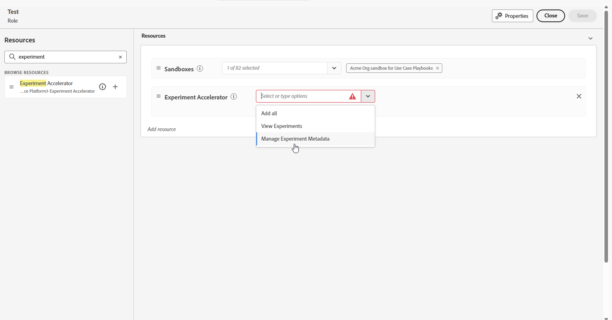

# Journey Optimizer Experimentation Accelerator入门 {#content-experiment}

>[!AVAILABILITY]
>
>**Journey Optimizer Experimentation Accelerator**&#x200B;需要客户的付费许可证，并与Adobe Target或Adobe Journey Optimizer无缝集成。

**Journey Optimizer Experimentation Accelerator**&#x200B;是一个功能强大的工具，旨在简化和增强试验流程。 通过与Adobe Target和Adobe Journey Optimizer集成，它提供了一个用于管理、分析和优化试验的集中平台。 Journey Optimizer Experimentation Accelerator利用AI驱动的洞察和自适应测试，使您能够做出数据驱动型决策、改进营销策略并取得可衡量的结果。

主要优势包括：

* **更快的试验**：使用随时间调整的模型运行自适应、始终开启的测试。

* **Unified Platform**：在一个位置管理Adobe Target和Journey Optimizer的所有试验。

* **AI驱动的分析**：自动显示关键发现、性能驱动因素和新机会。

* **更智能的定位**：使用行为和内容数据优先考虑高影响力的实验。

* **KPI监控**：跨试验跟踪提升度和置信度等量度。

* **无缝Collaboration**：通过实时警报轻松共享结果和管理团队角色。

## 访问Journey Optimizer Experimentation Accelerator

在[创建和配置实验](content-experiment.md)并将营销活动或历程发送到配置文件后，您可以访问&#x200B;**[!UICONTROL Journey Optimizer Experimentation Accelerator]**&#x200B;以深入了解实验的执行情况。

您可以从&#x200B;**[!UICONTROL 试验]**&#x200B;下拉菜单的左侧菜单访问[!UICONTROL Journey Optimizer Experimentation Accelerator]，也可以通过应用程序切换器访问。 请注意，仅具有Target许可证的用户只能通过应用程序切换器访问它。

可用试验取决于您的设置：

* **对于Adobe Journey Optimizer用户**：在您启用的组织的沙盒中设置的试验将自动包含在内。

* **对于具有Journey Optimizer的Adobe Target用户**： Target中的任何A/B活动都会显示在Journey Optimizer的生产沙盒的&#x200B;**[!UICONTROL Journey Optimizer Experimentation Accelerator]**&#x200B;中。

* **对于仅Adobe Target用户**：您的Target组织中的所有A/B活动都包含在Journey Optimizer的生产沙盒中。

要使用&#x200B;**[!UICONTROL Journey Optimizer Experimentation Accelerator]**，您需要访问沙盒和以下相关权限：

* **[!UICONTROL 查看试验]**
* **[!UICONTROL 管理试验元数据]**

+++ 了解如何分配试验相关权限

1. 在&#x200B;**[!DNL Permissions]**&#x200B;产品中，转到&#x200B;**[!UICONTROL 角色]**&#x200B;选项卡并选择所需的&#x200B;**[!UICONTROL 角色]**。

1. 单击&#x200B;**[!UICONTROL 编辑]**，修改权限。

1. 添加&#x200B;**[!UICONTROL 试验加速器]**&#x200B;资源，然后从下拉菜单中选择&#x200B;**[!UICONTROL 查看试验]**&#x200B;和/或&#x200B;**[!UICONTROL 管理试验元数据]**。

   

1. 单击&#x200B;**[!UICONTROL 保存]**&#x200B;以应用更改。

任何已分配此角色的用户的权限都将自动更新。

要将此角色分配给新用户：

1. 导航到“角色”仪表板中的&#x200B;**[!UICONTROL 用户]**&#x200B;选项卡，然后单击&#x200B;**[!UICONTROL 添加用户]**。

1. 输入用户名、电子邮件地址或从列表中选择，然后单击&#x200B;**[!UICONTROL 保存]**。

   如果之前没有创建用户，请参阅[此文档](https://experienceleague.adobe.com/zh-hans/docs/experience-platform/access-control/abac/permissions-ui/users)。

用户将收到一封电子邮件，其中包含访问实例的说明。

+++

<!--table style="table-layout:fixed"><tr style="border: 0;">
<td>

<strong><a href="experiment-accelerator-overview.md">Overview</a></strong>

</td>
<td>

<strong><a href="experiment-accelerator-monitor.md">Experiments</a></strong>

</td>
<td>

<strong><a href="experiment-accelerator-metrics.md">Metrics</a></strong>

</td>
</tr></table-->
