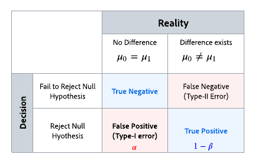

# 了解统计计算 {#experiment-calculations}

本文介绍了在Adobe Journey Optimizer中运行实验时使用的统计计算。

实验使用[高级统计方法](../content-management/assets/confidence_sequence_technical_details.pdf)计算&#x200B;**置信序列**&#x200B;和&#x200B;**置信度**，这允许您根据需要运行实验并持续监视结果。

本文介绍了试验的工作原理，并直观地介绍了Adobe的&#x200B;**随时有效的置信序列**。

对于专家用户，技术详细信息和参考资料在[此页面](../content-management/assets/confidence_sequence_technical_details.pdf)上详述。

## 统计测试和控制错误 {#statistical-testing}

在运行试验时，您试图确定两个群体之间是否存在差异，以及该差异是否由偶然性引起。

通常有两种假设：

* **Null假设验证**&#x200B;意味着对治疗没有影响。
* **替代假设验证**&#x200B;意味着对治疗产生影响。

在统计意义上，目标是尝试评估证据的力量以拒绝零假设。 需要注意的一点是，统计学意义是用来判断治疗方案出现差异的可能性，而不是成功的可能性。 这就是将统计显着性与&#x200B;**提升**&#x200B;结合使用的原因。

有效的试验需要考虑可能导致不正确推断的不同类型的错误。

上表说明了错误的不同类型：

* **误报（Type-I错误）**：是对Null假设的错误拒绝，但实际上为True。 在在线实验的背景下，这意味着我们错误地得出每种处理的结果量度各不相同，尽管它们相同。
   在运行试验之前，我们通常选择一个阈值`\alpha`。 在试验运行之后，计算`p-value`，我们拒绝`null if p < \alpha`。选择`/alpha`是基于获得错误答案的后果，例如，在临床试验中，某人的生命可能会受到影响，您可能决定拥有`\alpha = 0.005`。 在线实验中常用的阈值为`\alpha = 0.05`，这意味着从长远来看，我们预计每100个实验中会有5个误报。

* **False Negatives（Type-II错误）**：表示我们无法拒绝Null假设验证，尽管它为False。 对于实验，这意味着我们不拒绝空假设，但实际上它是不一样的。 为了控制这种类型的错误，我们通常需要在我们的实验中拥有足够的用户来保证一定的Power，定义为`1 - \beta`（即1减去II型错误的概率）。

大多数统计推断技术都需要您根据希望确定的影响大小提前固定样本大小，以及提前确定容错（`\alpha`和`\beta`）。 但是，Adobe Journey Optimizer的方法旨在允许您持续查看结果，无论您的样本量有多大。

## Adobe的统计方法：任何时间有效的置信序列

**置信序列**&#x200B;是&#x200B;**置信区间**&#x200B;的顺序模拟，例如，如果您重复试验一百次，并计算每个进入试验的新用户的平均量度估计值及其相关的95%置信序列。 95%置信度序列将包括您运行的100次实验中的95次实验中量度的真实值。 每个试验只能计算一次95%置信区间，以提供相同的95%覆盖率保证；而不是针对每个新用户。 因此，通过使用置信序列，您可以连续监控实验，而不会增加误报错误率。

单个试验的置信序列和置信区间之间的差异如下面的动画所示：

**置信序列**&#x200B;将实验焦点转移到估计而不是假设检验，即专注于精确估计治疗之间的手段差异，而不是是否拒绝基于统计显着性阈值的空假设。

但是，以与`p-values`或&#x200B;**置信度**&#x200B;与&#x200B;**置信区间**&#x200B;之间的关系类似的方式来看，**置信序列**&#x200B;与任何时间有效的`p-values`或任何时间有效的置信度之间也存在着关系。 考虑到置信度等量的熟悉程度，Adobe在其报表中同时提供&#x200B;**置信序列**&#x200B;和随时有效的置信度。

**置信序列**&#x200B;的理论基础来自对随机变量（称为马丁格勒）序列的研究。 下面是专家阅读的一些主要结果，但实践者的经验很清楚：

>[!NOTE]
>
>置信序列可以解释为置信区间的安全序列类似项。 通过使用置信区间，您只能在达到预先确定的样本大小后解释试验。 但是，通过使用置信序列，您可以随时查看并解释试验中的数据，并安全地停止或继续试验。 相应的Any Time Valid Confidence （任意时间有效置信度）或`p-value`也可以随时安全解释。

需要注意的是，由于置信序列是“任何时间有效的”，因此它们比在相同样本量下使用的固定水平域方法更保守。 置信序列的范围通常比置信区间计算大，而任何时间的有效置信度都将小于固定视域置信度计算。 这种保守主义的好处是，你可以随时安全地解读结果。

## 宣布试验具有结论性

每次查看试验报告时，Adobe都会分析到目前为止在试验中积累的数据，并将在至少一个治疗的随时有效置信度超过95%阈值时宣布某个试验具有“结论性”。

此时，报表屏幕顶部将突出显示执行效果最佳的处理（基于转化率或配置文件标准化量度值），并在表格报表中以星号指示。 在此确定时，只考虑置信度大于95%以及基准值的处理。

当存在两个以上的处理时，使用Bonferroni校正链接对多个比较问题进行校正，并控制基于族的错误率。 在这种情况下，也有可能存在置信度大于95%且置信区间重叠的多个处理。 在这种情况下，Adobe Journey Optimizer将声明转化率（或配置文件规范化的量度值）最高的的那一个是最佳绩效者。
