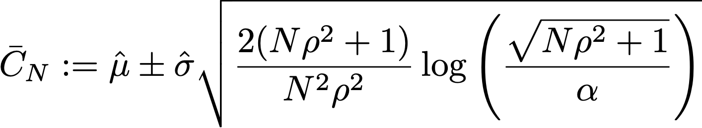

# 了解试验报告中的统计计算 {#experiment-report-calculations}

本页记录了Adobe Journey Optimizer中促销活动的试验报告中使用的详细统计计算。

请注意，本页面向技术用户。

## 转化率

实验中每个处理`ν`的转化率或&#x200B;**平均值**，μν定义为量度总和与分配给该量度的配置文件数量的比率，Nν：

{width="125" align="center"}

此处，Yiν是已分配给给定变体&#x200B;*ν*&#x200B;的每个用户档案`i`的目标量度的值。 当目标量度是“唯一”量度（即，它是执行特定操作的配置文件数量的计数）时，将显示为转化率，并设置百分比格式。 当量度是“计数”或“总值”量度（分别例如，电子邮件打开次数、收入）时，该量度的平均估计值将显示为“每个用户档案计数”或“每个用户档案的值”。

在需要时，使用样本标准差与表达式：

{width="225" align="center"}

## 提升 {#lift}

变量&#x200B;*ν*&#x200B;与控制变量&#x200B;*ν0*&#x200B;之间的提升是转化率的相对“增量”，定义如下，其中各个转化率定义如上。 以百分比显示。

{width="125" align="center"}

 

## 单个处理的随时有效置信区间

历程试验面板显示试验中各个治疗的“随时有效”置信区间（置信序列）。

单个变量`ν`的置信序列是Adobe使用的统计方法的核心。 您可以在[此页面](https://doi.org/10.48550/arXiv.2103.06476)中找到其定义（复制自[Waudby-Smith et al.]）。

如果您有兴趣估计目标参数`ψ`（如试验中变量的转化率），则可以将“固定时间”置信区间(CI)序列与时间均匀置信序列(CS)之间的二分法概括如下：

{width="500" align="center"}

对于常规置信区间，目标参数位于值ċn范围内的概率保证仅在单个固定值`n`下有效（其中`n`是样本数）。 相反，对于置信序列，我们保证在任何时候/所有样本大小`t`的值中，感兴趣参数的“true”值都在范围内。

这隐含着一些对在线测试非常重要的深层含义：

* 当有新数据可用时，可以选择更新CS。
* 可以连续监控、自适应停止或继续试验。
* I类错误会在所有停止时间（包括依赖于数据的时间）进行控制。

Adobe使用渐近置信序列，对于平均估计值为`μ`的单个变量，其形式为：

{width="300" align="center"}

其中：

* `N`是该变体的单位数。
* `σ`是标准偏差的样本估计值（以上定义）。
* `α`是所需的I型错误（或错误覆盖概率）级别。 此值始终设置为0.05。
* ρ2是一个常数，它调整了CS最紧的样本大小。 Adobe选择了通用值ρ2 = 10-2.8，该值适用于在线实验中出现的转化率类型。

## 置信度 {#confidence}

Adobe使用的置信度是一种“随时有效”的置信度，它通过对平均治疗效果的置信序列进行逆运算来获得。

更准确地说，在针对两个变量之间的均值差异的两个样本&#x200B;*t*&#x200B;测试中，此测试的&#x200B;*p* — 值与均值差异的置信区间之间有一个1:1映射。 通过类比，通过对平均处理效果估计器的（随时有效的）置信序列求逆，可以获得随时有效的&#x200B;*p* — 值：

{width="200" align="center"}

在此，*E*&#x200B;是预期。 使用的估计器是反向倾向加权(IPW)估计器。 考虑N = N0 +N1个单位，如果单位被分配给变体`ν`=0,1，则每个标记为Ai=0,1的单位`i`的变体分配。 如果用户被分配了固定概率（倾向）π0， (1-π0)，并且他们的结果度量是Yi，那么平均处理效果的IPW估计器是：

{width="400" align="center"}

注意&#x200B;*f*&#x200B;是影响函数，Waudby-Smith等 表明该估算器的置信序列为：

{width="500" align="center"}

用经验估计值π0 = N0/N代替赋值概率，方差项可以用个别样本的平均估计值μ0,1和标准差估计值σ0,1表示：

{width="500" align="center"}

接下来，请记住，对于测试统计量z = (μA-μ0/σp)的常规假设检验，`p` — 值与置信区间存在对应关系：

{width="500" align="center"}

其中`Φ`是标准常数的累积分布。 对于随时有效的`p`值，给定上面定义的平均处理效果的置信序列，我们可以反转此关系：

{width="600" align="center"}

最后，**随时有效的置信度**&#x200B;为：

{width="200" align="center"}

## 宣布试验具有结论性

对于双臂试验，Journey Optimizer试验面板显示一条消息，说明当随时有效置信度超过95%（即，随时有效`p` — 值低于5%）时，试验具有&#x200B;**结论性**。

当存在两个以上的变量时，应用Bonferonni校正来控制族的错误率。 对于采用`K`处理以及单个基线（对照）处理的试验，有`K-1`个独立的假设检验。 Bonferonni校正意味着，如果随时有效的`p`值（如上所定义）低于阈值`α/(K-1)`，我们拒绝空假设，即控制变量与给定变量具有相等均值。

## 性能最佳的手臂

当一个实验被宣布为具有结论性时，显示表现最好的臂。 这是包含控制项的Set中的具有最佳性能（最高平均或转化率）的臂，以及具有低于Bonferonni阈值的`p`值的所有臂。
